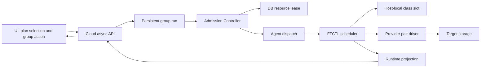

# DR Fleet Admission And Protection Group Design

## 1. Goal

This design increases the safety of tens or hundreds of concurrent DR plans without changing the validated single-plan VMware to ABLESTACK RBD path. It is a provider-neutral orchestration contract for future VMDK to qcow2, qcow2 to qcow2, and other source/target adapters.

## 2. Non-regression boundary

- A plan without protection-group metadata follows the existing API, Cloud adapter, Agent command, FTCTL profile, librbd transfer, materialization, and krbd VM runtime path.
- Cloud UI never calls FTCTL or libvirt directly.
- Cloud owns admission, ordering, durable group history, and worker selection.
- Agent remains an asynchronous command bridge.
- FTCTL owns host-local transfer slots, NBD allocation, transfer throttling, retryable resource wait, and provider driver execution.
- The VMware to RBD adapter is the reference implementation and mandatory regression gate.

## 3. Common architecture

The common contract is expressed by operation class, resource key, retry state, per-plan run state, and transfer metrics. A provider driver implements data-path details only.

## 4. Admission and capacity

### 4.1 Cloud lease

`dr_resource_lease` stores `resource_key`, `operation_class`, `plan_id`, `run_id`, state, and expiry. Capacity defaults are:

| Operation class | Default host capacity | Purpose |
|---|---:|---|
| FULL_SEED | 2 | initial seed and explicit full reseed |
| INCREMENTAL | 4 | periodic CBT or block-delta replication |
| TRANSITION | 1 | test, failover, failback, reprotect, release |

The lease is obtained before dispatch and released in `finally`. Expired active leases are ignored after restart. A capacity miss becomes `DR_RESOURCE_BUSY` and enters retry state without consuming a dispatcher thread.

### 4.2 Host-local slots

FTCTL acquires a flock-backed slot under `/run/ablestack-vm-ftctl/dr-resource-slots/<class>/`. Slot limits may be reduced by plan policy but cannot exceed host configuration. No slot or NBD device is a retryable `WAITING_RESOURCE` state with exit code 97.

### 4.3 Jitter and bandwidth

- Legacy single-plan scheduling defaults to zero jitter.
- Group and fleet profiles explicitly set deterministic jitter; every cycle uses plan and sequence as the hash salt.
- `policy.bandwidthLimitMbps` is passed to the mover and enforced by `dr_extent_patch.py` as an average read-rate ceiling.

### Canonical Cycle convergence

Parallel group execution does not change Cycle identity. Scheduler and
operation Run UUIDs may both observe one engine sequence, but Cloud stores one
canonical `dr_sync_cycle` row keyed by `(plan_id, sequence)`. Group success is
committed only after incomplete aliases through the latest durable sequence are
terminalized in the same transaction. This keeps the existing single-plan
VMware to ABLESTACK RBD path unchanged while making grouped projection
deterministic.

## 5. Protection groups

Each plan may store group UUID, name, order, maximum parallel count, and quiesce requirement. `configureDrProtectionGroup` records ordered membership without changing the plan adapter. `startDrProtectionGroupAction` creates a durable `dr_group_run`, validates every child plan with existing action eligibility before starting any child, and starts child runs in bounded batches only when the whole group passes. This prevents a partially started protection group when a later member is blocked.

- Failover runs in ascending group order.
- Failback runs in reverse order.
- The next batch does not begin before the current batch reaches a terminal state.
- A failed child stops later batches.
- Required quiesce rejects any plan without `quiesce_policy_json`.
- Progress JSON records each plan UUID, order, child run UUID, state, and error.

### 5.1 Group test-failover placement contract

Protection-group execution must preserve each plan's validated target placement.
For `TEST_FAILOVER`, an explicit test network in an individual request has the
highest priority. When a group request has no `networkId`, Cloud resolves the
persisted default target network from that plan's guided mapping
(`mapping_json.target.networks[].networkLocalId`) independently for every child
Run. `NO_NIC` is the only networkless mode. If neither an explicit nor a mapped
network exists, execution is blocked or fails with `DR_TEST_NETWORK_REQUIRED`.

Cloud test VM materialization is a finite child-Run phase. Volume import,
network resolution, VM creation, and boot failures must terminalize both the
test session and child `DrRun` with the same error evidence. The group monitor
then terminates the aggregate Run and releases admission resources. A failed
test session must never coexist indefinitely with a `RUNNING` child Run.

## 6. Worker placement and preflight

Explicit worker bindings remain authoritative. Only when every worker binding is absent may Cloud select the least-assigned Up KVM host in the ABLESTACK site zone. Before execution, plan placement resolution, host existence, storage state, disk mapping, offering, and network checks still run. Future provider adapters add their own capacity evidence without changing the admission state machine.

## 7. API and UI

| API | Function |
|---|---|
| `configureDrProtectionGroup` | Persist ordered plan membership and policy |
| `startDrProtectionGroupAction` | Asynchronously admit an ordered group action |
| `listDrProtectionGroupRuns` | Read group history and aggregate progress |

The plan list uses existing row selection. The protection-group dialog preserves that selection order and sends the same order to the backend; it displays selected plans, action, maximum parallel count, quiesce requirement, and prior group history. The API returns immediately after group-run admission; the UI does not block on child completion.

The dialog uses `DrFormModal` and the shared Cross DR color tokens. Its
information ribbon and both plan/history tables have explicit dark-mode
surface, border, primary-text, secondary-text, and hover states. Light and dark
rendering are build-and-browser verification gates; raw i18n markers, clipped
columns, or light table cells in dark mode block deployment.

## 8. Provider extension contract

For VMDK to qcow2, qcow2 to qcow2, and later paths:

1. Register a source/target provider pair driver.
2. Return the common operation class and retryable resource errors.
3. Publish standard progress fields: bytes total, processed, throughput, ETA, disk index/count, and mode.
4. Preserve Cloud-owned target materialization and authority rules.
5. Add adapter regression tests while retaining the VMware to RBD reference suite.

## 9. Verification gates

| Scale | Gate |
|---:|---|
| 1 VM | Existing VMware to RBD full seed, incremental, test, failover, failback regression |
| 10 VM | Slot limits, jitter distribution, bounded queue, group ordering, no NBD fatal state |
| 30 VM | Bandwidth ceiling, restart lease recovery, mixed full/incremental fairness |
| 100 VM | 24-hour soak, management restart, host failure, backlog drain, RPO distribution |

Deployment is retest-ready after the 1 VM regression and synthetic 10-plan admission smoke pass. The 30 and 100 VM gates require corresponding source VM inventories; they are release qualification, not simulated PASS claims.

## 10. AS-IS / TO-BE

| Area | AS-IS | TO-BE |
|---|---|---|
| Cloud dispatch | Fixed two-thread executor; retry sleeps consume workers | Bounded four-worker queue, separate retry scheduler, durable lease admission |
| FTCTL capacity | NBD exhaustion becomes terminal failure | Host slots and NBD shortage produce retryable wait |
| Scheduling | Plans can align on the same second | Group/fleet deterministic per-cycle jitter |
| Bandwidth | Policy stored but mover does not enforce it | Mover applies `bandwidthLimitMbps` |
| Multi-plan action | Row selection has no execution workflow | Ordered protection group API, history, and aggregate UI |
| Multi-plan dark mode | No group dialog | Shared DR modal tokens for alert, controls, tables, borders, and hover states |
| Worker selection | Missing worker blocks execution | Explicit binding preserved; otherwise least-assigned valid KVM host |
| Application order | Independent plan actions | Quiesce gate and ordered failover/reverse failback |
| Extensibility | Provider-specific flow dominates | Common admission contract with provider pair drivers |

## 11. Implementation and test deployment result

- The DR Maven module compiled and passed 140 tests with no failures or errors.
- The production UI build completed. The active 10.10.32.10 dark-mode group
  dialog was inspected with two selected plans: the visible order matched the
  submitted order, no horizontal overflow was present, table cells used dark
  surfaces and borders, the information alert retained readable contrast, and
  the browser console contained no errors.
- Changed Cloud classes and Spring metadata only were patched into the active
  management JAR on 10.10.32.10 and 10.10.22.10. Static UI assets were copied
  without replacing the webapp root; `WEB-INF` remained present and `/client/`
  returned HTTP 200 on both management servers.
- `dr_resource_lease`, `dr_group_run`, and five nullable protection-group
  columns were applied on both Cloud databases. Active test leases and active
  group runs were zero after deployment.
- FTCTL GitHub Actions run `31710261670` built source commit `5937d9b7e58e`.
  RPM `ablestack_vm_ftctl-0.9.5-1.noarch` was installed on all six compute
  hosts in the 10.10.32 and 10.10.22 clusters. Agent and FTCTL timers were
  active and no new resource-slot holder remained.
- Synthetic 10, 30, and 100-request tests passed for Full Seed and Incremental
  slot pools, including retry, backlog drain, bandwidth throttling, and worker
  crash lock recovery. Real 10, 30, and 100-VM qualification remains a release
  test and is not claimed by the synthetic result.

## 12. DR plan list action UX contract

The DR plan list and detail routes have separate command surfaces. The rounded
primary action in the list toolbar follows the existing `ActionButton` DOM and
spacing contract. With no selection it creates a plan; with one or more selected
rows it opens the protection-group workflow. The detail route never exposes the
create-plan action because creation is a collection-level operation.

Right-click behavior is selection-aware. Zero or one selected plan keeps the
single-plan menu. Two or more selected plans show only multi-selection commands:
open the protection-group workflow or clear the selection. Single-plan edit,
delete, failover, test, and protection-release commands are deliberately absent
from this menu; the group dialog is the sole place where an ordered bulk action,
parallelism, and quiesce policy are confirmed before the asynchronous API call.
Route changes clear list selection and any open context menu so collection state
cannot leak into a detail page. This preserves the existing single-plan VMware
to ABLESTACK RBD execution path.

| UI area | AS-IS | TO-BE |
|---|---|---|
| Primary list action | Group button uses separate icon-slot markup | Group and create buttons share the same wrapper, button, icon, and label alignment contract |
| Detail header | Collection-level create action is also rendered | Only the resource action menu is rendered |
| Multi-select context menu | Right-click exposes one selected row's single-plan commands | Selection count/title and only protection-group or clear-selection commands are shown |
| Dark mode | Single-plan menu styling is reused with misleading disabled actions | Existing tokenized menu surfaces are reused without unrelated disabled actions |

### 12.1 Implementation and verification

- The list toolbar uses the same `row-action-button`, `action-button-item`, icon,
  and label structure for plan creation and protection-group execution. Browser
  geometry checks confirmed identical 32 px button height and vertical centers
  for the button, icon, and label in dark mode.
- The detail route renders only the resource-level action menu. Route changes
  clear selected plan keys and close the list context menu, preventing stale
  collection actions from appearing on a detail page.
- With two selected plans the context menu contains only `Protection group
  action` and `Clear selection`. The clear command was exercised in the browser
  and returned the toolbar to the unselected create-plan state.
- Targeted ESLint and the production UI build passed. The final static artifact
  is `dr-plan-multiselect-ui-20260814.tgz` with SHA-256
  `9405e80038b49efbf91ad4363f40777e7cd36f697a42a7b43eaee643a1ae5859`.
- The static bundle `js/app.f9f8ae4a.js` was deployed to both 10.10.32.10 and
  10.10.22.10 without replacing the webapp root. `WEB-INF` remained present and
  `/client/` returned HTTP 200 on both management servers.

## 13. Protection-group preflight and terminal tracking

Protection-group submission is atomic. Every selected plan must be eligible for
the requested action before Cloud persists a runnable group or dispatches a
child run. The preview and execution paths use the same backend evaluator; UI
state is advisory and cannot replace the server-side recheck.

### 13.1 API contract

`previewDrProtectionGroupAction` accepts the ordered plan IDs, action, maximum
parallelism, and quiesce intent. It returns `ready`, the normalized action, and
ordered per-plan entries containing plan UUID/name/state/admin state,
`eligible`, stable reason code, and non-sensitive reason arguments. The command
is read-only and creates no group, run, lease, Agent command, or FTCTL request.

`startDrProtectionGroupAction` repeats the same evaluation. A blocked request is
persisted as a terminal failed group run so it remains auditable. Ineligible
plans become `BLOCKED`; otherwise eligible plans that were not dispatched due
to the atomic gate become `SKIPPED`. A runnable request returns `QUEUED`, and the
UI polls `listDrProtectionGroupRuns` by group UUID until the returned run UUID
reaches `SUCCEEDED` or `FAILED`.

For a group Full Seed, child API acceptance and target materialization are not
terminal success. Cloud advances the next bounded batch and completes the group
only when every child Run is `SUCCEEDED`, `terminal_authoritative=true`, and its
immutable accepted Cycle sequence/token resolves to a completed persisted Full
Seed Cycle (`FULL_SEED`, with legacy `FULL_RESEED` accepted) with a durable
commit state. A successful child that has not met this
predicate remains `RESULT_FINALIZING`; its admission lease is renewed and Cloud
continues projection reconciliation. The same predicate controls child counts,
batch advancement, lease release, and group completion so the aggregate result
cannot precede the final member's durable checkpoint.

If target materialization completed the child Run before FTCTL published its
terminal journal, the group monitor may promote that already successful Run to
`CYCLE_DURABLE / terminal_authoritative=true` only inside a transaction and
only after the Run's immutable accepted sequence/token identifies a completed,
durably committed Full Seed Cycle. This evidence-based convergence is also the
restart recovery path; it never substitutes the latest unrelated plan Cycle or
requires a manual DB correction.

Management-server restart recovery does not repeat new-request admission for a
persisted `RUNNING` group. The group was already atomically admitted, and its
own child Runs and leases would make a repeated eligibility check self-blocking.
Recovery resumes the persisted ordered batches, reconciles existing children,
and applies the same accepted-Cycle terminal predicate. Only a newly `QUEUED`
group performs execution-time preflight before its first dispatch.

Group terminal reconciliation is DB-first. The monitor first resolves a
successful Full Seed child from its immutable accepted sequence/token and the
matching durable Cycle. Once the child Run is `SUCCEEDED`, it must not block on
a source Mold or FTCTL status request; the independent projection scheduler
publishes later durable evidence into DB and the next monitor pass converges it.
A remote projection refresh remains a bounded aid only while the child Run
itself is non-terminal.

The UI/control request name `FULL_RESEED` and the persisted Cycle mode
`FULL_SEED` represent the same Full Seed operation. Terminal reconciliation
normalizes both values at this boundary; it must not reject an otherwise
matching durable Cycle because the request and persistence vocabularies differ.

### 13.2 UI contract

Opening the protection-group dialog and changing its action performs a fresh
server preview. The confirmation button is disabled while preview is loading or
when any plan is blocked. The plan table shows a dark-mode-safe readiness pill
and the localized backend reason. A disabled/unprotected plan is never silently
enabled by Full Reseed; the operator must explicitly restore protection first.

After submission, the dialog closes without blocking the rest of the UI. A
persistent list-page execution panel displays the group run state, aggregate
counts, and ordered per-plan state/error. Polling is bounded and is canceled on
route leave or component destruction. A Cloud async-job success means only that
the group request was accepted; it is not presented as execution success.

### 13.2.1 Durable cancellation after executor loss

Run cancellation is a durable asynchronous transition, not an in-memory signal.
When the UI requests cancellation for an active Run, Cloud persists
`CANCEL_REQUESTED` and requeues that Run through the DR executor. The executor
accepts both `QUEUED` and `CANCEL_REQUESTED`; the latter closes open steps,
records the terminal cancellation event, sets `completed`, and releases the Run
as an admission blocker. This also applies after a management-server restart,
when the executor context that originally dispatched the Run no longer exists.
A queued Run may still be canceled directly without redispatch.

### 13.3 Layer ownership

| Layer | Responsibility |
|---|---|
| UI | Request preview, block invalid confirmation, poll and render terminal group state |
| API | Expose typed preflight and durable group-run responses |
| Cloud backend | Reuse one evaluator for preview/execution and enforce atomic all-plan admission |
| DB | Persist terminal group history and structured per-plan progress in `dr_group_run` |
| Agent | Receive only eligible child runs through the existing single-plan dispatch path |
| FTCTL | Execute the existing proven VMware-to-RBD command; no bulk-specific engine path |

### 13.4 AS-IS / TO-BE

| Area | AS-IS | TO-BE |
|---|---|---|
| Preflight | Runs after async acceptance in the in-memory group worker | Shared backend preview plus mandatory execution-time recheck |
| Invalid selection | UI accepts disabled/unprotected plans | Confirmation is blocked with per-plan reason |
| Async semantics | `QUEUED` API response is shown as success | Accepted state is tracked to group terminal state |
| Atomic abort | Eligible plans remain `PENDING` after another plan blocks | Blocked plans are `BLOCKED`; undispatched peers are `SKIPPED` |
| Visibility | Failure is visible only by reopening the group modal/DB | Persistent list panel shows aggregate and plan-level result |
| Engine path | Risk of a separate bulk implementation | Existing single-plan Agent/FTCTL path is reused unchanged |

### 13.5 Implementation, deployment, and preflight evidence

- `previewDrProtectionGroupAction` and the execution-time admission gate use
  the same `DrProtectionGroupPreflight` evaluator. Targeted unit tests verify
  that preview is read-only and that an atomic mixed-state rejection persists
  `BLOCKED`/`SKIPPED` terminal plan results without calling `startRun`.
- The disaster-recovery module test suite completed with 142 tests, zero
  failures and zero errors. Maven Checkstyle reported zero violations. Targeted
  UI ESLint and the production UI build also completed successfully.
- Only the ten changed Cloud classes were patched into the active management
  JAR. Static UI assets were updated without replacing the webapp root. On both
  10.10.32.10 and 10.10.22.10, `mold` remained active, `WEB-INF` remained
  present, and `/client/` returned HTTP 200.
- A live dark-mode preflight on 10.10.32.10 selected the disabled Ubuntu plan
  together with the ready Rocky plan. The dialog rendered Ubuntu as `BLOCKED`,
  Rocky as `READY`, and disabled confirmation. Selecting the ready w25 and
  Rocky plans rendered both as `READY` and enabled confirmation.
- The read-only live preflight did not create runtime work: `dr_group_run`
  remained at its existing count of one, and new `dr_run` and
  `dr_resource_lease` rows were both zero. Therefore no Agent command or FTCTL
  engine request was emitted by preview.
- Because the UI is served as hashed static assets plus separately cached
  locale files, operator verification after deployment must use a hard refresh.
  A stale browser tab can display the previous three-column group table even
  though the new bundle is installed; this is a client cache condition, not a
  backend admission failure.

## 14. Steady-state capacity admission and protection visibility (2026-08-14)

### 14.1 Admission contract

For `VMWARE_TO_KVM` group synchronization, preview and execution-time preflight
read `nbd_capacity` from the coordinator host's FTCTL plan-authority status.
All plans must report the reserved range `/dev/nbd16` through `/dev/nbd31` as
configured and at least one device as free. A missing range is
`DR_NBD_CAPACITY_INVALID`; a fully occupied range is retryable
`DR_RESOURCE_BUSY`. The group remains atomic and dispatches no child when any
member fails this gate. Single-plan action routing and the proven VMware to RBD
adapter remain unchanged.

### 14.2 RPO and UI contract

Initial seed completion and continuous protection are separate facts. Group
progress stores `initialSyncState`, `continuousProtectionState`, current/target
RPO, and `resourceWaiting` for every member. The dark-mode-safe group table
renders both states independently. When the durable checkpoint age exceeds the
plan RPO plus the established grace window, runtime projection sets the Plan to
`DEGRADED`; a healthy later checkpoint returns it to `READY`.

| Area | AS-IS | TO-BE |
|---|---|---|
| Group admission | Checks action eligibility only | Also validates host NBD capacity needed by seed and later increments |
| Group success | Child initial run terminal state is the only visible result | Initial sync and continuous protection are displayed separately |
| Resource wait | Hidden behind a successful initial group result | Per-member waiting state and reason are visible |
| RPO breach | Plan can remain READY while actual RPO is overdue | Plan projects DEGRADED until a fresh durable checkpoint restores RPO |
| Dark mode | Generic state column cannot distinguish lifecycle axes | Dedicated state/RPO columns use existing dark-mode surfaces and contrast tokens |

## 15. Planned VMware failover source-isolation barrier (2026-08-21)

### 15.1 Failure cause

The proven VMware-to-ABLESTACK RBD transfer reached `CUTOVER_READY`, but Cloud
powered on the target before it had powered off and verified the VMware source.
FTCTL correctly rejected the commit because its provisional evidence was
`source_fence_state=REQUESTED` and `source_power_state=UNKNOWN`. Cloud then
overwrote its own `COMMIT_VERIFYING` result with `FAILED_OVER`, creating a false
authority projection while the engine still owned SOURCE authority.

### 15.2 Required order and ownership

For a UI-submitted planned `VMWARE_TO_KVM` Failover, Cloud must execute this
strict barrier sequence:

1. Resolve the registered source-site credential from the credential service.
2. Request source VM power-off through the vCenter inventory client and verify
   the returned state is `POWERED_OFF`.
3. Persist `VERIFIED/POWERED_OFF` source-isolation evidence in the cutover
   session and pass the same evidence to FTCTL.
4. Power on and validate the Cloud-owned target VM.
5. Submit the V2 cutover commit envelope.
6. Project `FAILED_OVER/TARGET` only after the FTCTL acknowledgement succeeds.

Disaster mode remains acknowledgement-driven and is not changed by this
planned-failover path. UI never invokes vCenter, Agent, or FTCTL directly; it
submits the asynchronous action and renders Cloud API/DB projection.

### 15.3 AS-IS / TO-BE

| Area | AS-IS | TO-BE |
|---|---|---|
| Source isolation | Target can start while VMware source is still running | Verified source power-off is a mandatory pre-promotion barrier |
| Evidence | FTCTL provisional `REQUESTED/UNKNOWN` is reused | Cloud persists and commits `VERIFIED/POWERED_OFF` |
| Commit failure | `COMMIT_VERIFYING` can be overwritten by `FAILED_OVER` | Authority stays SOURCE and the Run remains retryable |
| Existing success path | Transfer and materialization are reimplemented | Existing VMware mover, RBD target, guest preparation, and target materialization remain unchanged |
| Regression coverage | Successful ACK only | Ordering plus failed-ACK authority preservation are tested |

### 15.4 Canceled failover preparation reconciliation

When a UI-submitted failover Run is canceled after FTCTL reaches `CUTOVER_READY`, Cloud must not leave
the plan projected as `FAILED_OVER/TARGET` unless FTCTL has committed target authority. During the next
UI refresh or scheduled projection, Cloud invokes the existing `dr-failover-abort` path only when all of
the following evidence is present:

- the latest Run is `FAILOVER/CANCELED`;
- FTCTL reports `CUTOVER_READY` or scheduler-resumed `READY`, with `active_side=SOURCE`;
- FTCTL reports `target_power_state=POWERED_OFF`;
- Cloud confirms every managed target VM is stopped.

The abort resumes source protection and atomically restores the plan and replica projection to
`READY/SOURCE`. A running target, target authority, or conflicting runtime evidence blocks automatic
reconciliation. This recovery is initiated by the normal UI refresh path and does not create a separate
backend-only operator workflow.

Because a canceled Run is no longer returned by the active-Run query and a later scheduler Run may be newer,
the projection refresh scans the plan history for the newest Failover Run when the Cloud plan still claims
`FAILED_OVER/TARGET`, `COMMIT_VERIFYING/TARGET`, or the transient `READY/TARGET` state written while a failed
promotion is normalized. Recovery proceeds only when that newest Failover Run is `CANCELED`; an unrelated
active scheduler Run must not hide it. A newer successful or active Failover Run prevents this fallback, so
normal target authority and the proven cutover path remain unchanged. Consequently, a UI cancel followed by
the normal UI refresh can recover the plan without direct API, DB, Agent, or FTCTL operator commands, while a
non-canceled or conflicting Run keeps the existing projection behavior.

### 15.5 RPO warning state and cutover authority

`RPO_DUE_SOON` means that the latest durable checkpoint has entered the final
20 percent of its target RPO window. It is an operator warning, not an RPO
violation. Planned Failover and Test Failover therefore remain available while
the protection runtime is otherwise healthy. `OVERDUE`, an explicit
`rpo_overdue` flag, an unverified incremental checkpoint, or an unhealthy
scheduler continues to block cutover.

| Area | AS-IS | TO-BE |
|---|---|---|
| Freshness gate | Only `WITHIN_RPO` permits cutover | `WITHIN_RPO` and `RPO_DUE_SOON` permit cutover |
| Actual breach | Warning and breach are both rejected | Only `OVERDUE` or `rpo_overdue=true` is rejected |
| UI workflow | Action appears but is disabled near the next deadline | UI remains actionable and continues to show the due-soon warning |
| Existing path | Risk of changing transfer or scheduler behavior | Authority-only change; VMware mover, RBD transfer, and FTCTL control protocol remain unchanged |
