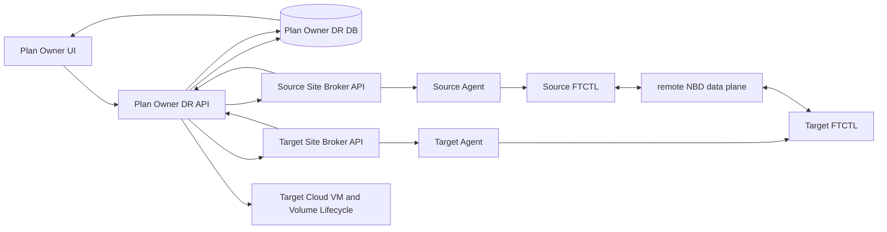

# ABLESTACK RBD Cross-Site DR Plan Authority And UI Lifecycle Design

> 2026-08-27 addendum: test failover Agent acceptance, Cloud test VM
> materialization, boot validation, and UI completion follow
> `621-dr-test-failover-agent-acceptance-and-ui-completion-contract-design-20260827.md`.
> `UEFI/LEGACY` remains the established non-secure UEFI target contract.

Date: 2026-08-24

## 1. Scope

This design completes the single-VM `KVM_TO_KVM` path between the 22 and 32
ABLESTACK clusters. Both source and target storage are RBD. Ceph `rbd-mirror`
is explicitly out of scope.

The already validated `VMWARE_TO_KVM` path is a regression-protected contract.
Provider-specific changes in this design must not alter VMware inventory, VDDK,
CBT, target materialization, failover, or failback behavior.

### 1.1 Plan-owner data-plane correction

The Cloud instance that stores the DR Site and DR Plan is the sole control
authority. For the 22-to-32 validation, the 32 management server owns the Plan
even though the protected VM runs on the 22 site. The source Agent and FTCTL
are data-plane workers; they do not SSH to, provision, or administrate the
target site.

The first remote KVM implementation violated this boundary by placing a
`qemu+ssh` URI and a target-host SSH key in the source FTCTL profile. It also
allowed the source worker to synthesize `/dev/rbd/<pool>/<image>` before the
target Cloud had created its VM and volume records. That path is removed for
remote `KVM_TO_KVM` plans.

Corrected ordering:

1. The Plan Owner resolves target placement and creates the stopped target VM
   and Cloud-owned RBD volume records before dispatching the first Sync.
2. The Plan Owner sends `TARGET_EXPORT_START` to the selected target Agent.
   Target FTCTL validates or creates the Cloud-selected RBD image and exposes
   it with librbd-backed `qemu-nbd` on the reserved DR port range.
3. The Plan Owner receives the typed export manifest and adds only NBD endpoint
   metadata to the source command profile.
4. The Plan Owner sends `SYNC` or `RECOVER_SYNC` to the source Site through the
   registered Mold API and Agent broker.
5. Source FTCTL reads source RBD through librbd. Full Seed writes to the target
   NBD export. Incremental cycles retain only source RBD snapshot baselines,
   calculate changed extents with `rbd diff`, and apply those extents to the
   target NBD export. No target SSH command or target RBD snapshot is used.
6. After a durable checkpoint, the existing materialization completion and
   `TARGET_MATERIALIZED` notification contract marks the replica Ready.
7. Before production target VM power-on, and on Release or Delete, the export
   is stopped and checked before Cloud starts the VM through its normal krbd
   runtime path.

`profile.transport.mode` is `site-agent-nbd`. It contains no SSH user, key, or
libvirt URI. `profile.transport.exports[]` contains `device`, `host`, `port`,
`name`, `uri`, and the canonical target locator. The required FTCTL capability
is `dr-site-agent-rbd-transport-v1`.

This branch is selected only for remote-source `KVM_TO_KVM`. VMware-to-KVM
continues to use the validated VDDK/librbd mover, while local KVM-to-KVM and
existing HA/FT `remote-nbd` profiles retain their contracts.

| Area | AS-IS | TO-BE |
|---|---|---|
| Control authority | Source FTCTL administers target by SSH | Plan Owner controls both Sites through API and Agent |
| Target resources | Synthetic path before Cloud ownership | Stopped target VM and Cloud volume created first |
| Full Seed | Source starts target qemu-nbd through SSH | Target Agent starts export; source connects to NBD |
| Incremental | `rbd export-diff` piped to target SSH | source changed extents applied over target NBD |
| Credentials | target root SSH material reaches source | no target SSH credential in source runtime |
| VM runtime | export can overlap target VM power-on | export stopped before VM starts with krbd |

## 2. Authority Model

The Cloud that owns `dr_site`, `dr_plan`, `dr_run`, and the operator UI is the
**Plan Owner Cloud**. It remains authoritative whether it is located at the
source site, target site, or a third management site.

The Plan Owner Cloud:

- validates the complete plan and records every asynchronous Run;
- owns lifecycle decisions, action eligibility, status projection, and UI;
- asks the Cloud that owns a VM or volume to perform its local lifecycle action;
- never addresses a remote Agent or libvirt daemon directly.

Plan ownership is independent from replication direction. In the concrete
`22 -> 32` qualification, cluster 32 owns the sites, plan, Runs, and operator
UI, so cluster 32 is the Plan Owner while cluster 22 is the remote source. If
the same plan is created on cluster 22, cluster 22 remains the Plan Owner and
must invoke cluster 32 through the same signed site contract. A data-plane
worker never acquires lifecycle authority merely because it executes on the
source or target site.

Each registered ABLESTACK site exposes a signed Mold API execution broker. The
broker resolves local UUIDs, dispatches commands to its local Agent/FTCTL, and
returns an accepted operation reference. Status and cancellation use the Plan
UUID, Run UUID, and operation reference. API secrets are decrypted only for the
outbound request and are never written to an FTCTL profile or event.

The execution broker is an FTCTL site capability, not a DR Plan API. Therefore
it is registered by the always-on `ftctl-service` plugin whenever
`cloud.ftctl.service.enabled=true`; it must not depend on the remote site's
`cloud.dr.service.enabled` value. A site may execute delegated work for a Plan
Owner without exposing DR Site or DR Plan menus locally. The Plan Owner alone
creates Runs and decides lifecycle state; the remote broker only validates and
executes the allow-listed site-local command.

The broker boundary has two independent contracts:

1. `SiteExecutionBroker` resolves a site-local host UUID and submits or polls
   Agent/FTCTL work.
2. `SiteResourceBroker` inventories and creates, starts, stops, retains, or
   deletes site-local Cloud VMs, volumes, networks, and offerings.

The current `22 -> 32` test invokes the execution broker remotely on cluster
22 and uses the resource broker locally on the Plan Owner/target cluster 32.
A source-side Plan Owner must route target materialization through the remote
resource broker; it must never resolve remote UUIDs with the Plan Owner's local
numeric DAOs.

## 3. Storage And Replication Modes

| Mode | UI name | Data path | Durability boundary |
| --- | --- | --- | --- |
| Scheduled | RPO scheduled replication | RBD snapshot/diff or full seed -> remote NBD -> target librbd | target flush, export drain, checkpoint commit |
| Live | Near-real-time replication | running VM krbd -> QEMU mirror -> remote NBD -> target librbd | mirror ready plus periodic durable checkpoint |

VM execution continues to use the Cloud-created krbd attachment. Replication
writes use librbd through the target-side NBD exporter. A target VM is never
started while its writer/export is active.

Live mode is selectable only when all source disks support QEMU live mirror,
both site brokers support the contract version, target NBD capacity is
available, and the network preflight succeeds. Otherwise the UI explains why
only scheduled mode is available. Live mode does not mean synchronous zero-RPO;
the displayed RPO is measured from the latest durable checkpoint.

## 4. Remote Site Broker Contract

### 4.1 Inventory

`listDrSiteWorkloads` returns VM hardware, NICs, and every protected volume:

- VM UUID, instance name, power state, host UUID;
- firmware, secure boot, machine type, CPU, memory, guest OS;
- volume UUID, RBD pool/image, device target, size, type, device ID, offering;
- NIC/network UUID and MAC address.

Target placement inventory is also read from the selected site: zone, KVM host,
RBD pool, compute offering, disk offering, and network. Local numeric IDs are
never sent across sites; UUIDs are used at every broker boundary.

### 4.2 Resource preparation

The target Cloud creates the stopped replica VM and all RBD volumes through the
existing Cloud-managed FTCTL provisioning service. It returns target VM UUID,
host UUID, volume UUIDs, and canonical `rbd:<pool>/<image>` mappings.

### 4.3 Data-plane action

`submitFtctlDrSiteAction` accepts a redacted Plan profile and immutable
`planUuid/runUuid/action/siteRole/sourceVmUuid`. It resolves a local execution
host, submits the Agent command asynchronously, and returns `ACCEPTED` plus an
operation reference. Duplicate requests with the same Plan/Run/Action are
idempotent.

`getFtctlDrSiteActionStatus` and `cancelFtctlDrSiteAction` use the same identity.
The Plan Owner projects source and target evidence into one canonical Run.

The concrete signed API command is `executeFtctlDrSiteAgentCommand`. Its
required parameters are limited to `commandtype` and `commandjson`.
`workerhostuuid` is an optional deprecated compatibility hint and never binds
the operation to a host. The site-local broker discovers all `Up` KVM Agents in
enabled Zones for every request, prefers the source VM's current host for a
source action when that live placement is available, and otherwise selects an
eligible worker deterministically. Read-only capability, status, and cancel
requests may try the next eligible Agent when the first answer is unavailable
or non-authoritative. Mutating actions are dispatched once to preserve
idempotency. The local FTCTL service accepts only `ACTION`, `STATUS`,
`CAPABILITIES`, `CANCEL`, and `REVERSE_PREFLIGHT` and returns the selected
worker UUID with the typed Agent answer. The legacy DR-plugin-owned API name is
kept only for compatibility and delegates to this canonical broker. It must
not own another worker-discovery or dispatch implementation. Cross-site Cloud
clients use the FTCTL API because a worker site is not required to enable the
DR Plan service.

Cloud API serialization may expose the broker fields either directly below
`executeftctldrsiteagentcommandresponse` or below its
`ftctldrsiteagentcommand` object. The Plan Owner client unwraps both forms and
requires `answerclass` plus `answerjson` before accepting the remote execution.
This wire-compatibility rule is covered by regression tests so a valid
site-local Agent answer cannot be misclassified as a remote engine outage.

## 5. UI Lifecycle

All mutations are UI initiated and immediately return an accepted Run. The UI
polls cached Plan projection and does not block on Agent or FTCTL work.

| UI action | Expected authority and result |
| --- | --- |
| Create plan | Plan Owner validates both site inventories and stores UUID mappings |
| Full resync | target Cloud resources -> source broker seed -> durable target checkpoint |
| Pause / Resume | Plan Owner sends scheduler control to the currently active source site |
| Test failover | target Cloud creates isolated test VM from the latest durable target artifact |
| Test cleanup | target Cloud removes test-only VM/artifacts and resumes protection |
| Failover | source isolation/final sync when available, writer drain, target Cloud starts replica |
| Failback | reverse broker path replicates target changes into Cloud-owned source RBD, then source Cloud starts VM |
| Reprotect | active-site broker becomes source and the opposite site becomes target |
| Release | stops protection; target retention or deletion follows the explicit operator choice |
| Delete plan | removes Plan metadata only after the selected resource disposition completes |

## 6. State And Failure Rules

- Broker unavailability is `WAITING_SITE`, retryable, and never a false terminal
  failure.
- Target resource or NBD shortage is `WAITING_RESOURCE` with bounded backoff.
- A successful Run requires both data-plane durability and Cloud VM/volume
  lifecycle convergence.
- A late status reply cannot overwrite a newer terminal Run.
- Failover/failback authority transitions and durable checkpoint commit are
  transactional in the Plan Owner DB.
- UI action eligibility is derived from the canonical Plan state, not from the
  latest event text.

## 7. Preflight And Regression Gates

Preflight must verify signed API calls in both directions, source VM inventory,
target placement UUIDs, RBD feature compatibility, NBD device/port capacity,
QEMU mirror capability, Agent-controlled NBD reachability, available capacity,
and stopped target VM state. Source FTCTL never receives target SSH credentials
and never starts a process on the target host directly.

The target Agent allocates an export port from the configured reserved range.
It starts every disk export as one operation and records a Plan-scoped manifest.
If any disk, RBD image, port, or `qemu-nbd` start fails, all exports opened by
that attempt are stopped and the incomplete manifest is removed. A collision on
the deterministic first port searches the remaining reserved range before the
operation becomes `WAITING_RESOURCE`.

### 7.1 Verified 22 -> 32 data-plane preflight

The implementation preflight on 2026-08-24 used a temporary 64 MiB image in
the 32-cluster RBD pool. The 32.2 target Agent host exported it with
`qemu-nbd` on the configured `11809-11872/tcp` range. The 22.1 source host read
the export metadata, wrote a 4 KiB `0x5a` pattern, and read the same pattern
back successfully. The exporter and temporary RBD image were then removed.
This proves the Plan Owner selected data path without touching a protected VM
disk. The current 32.2 host has duplicate historical port declarations and the
last value, `11809`, is effective. This feature reads that effective value and
does not rewrite the existing remote-NBD setting during deployment, because
the validated VMware path shares the setting. Configuration hygiene is handled
separately after both paths are idle and revalidated.

Deployment preflight must also call `listApis` or issue a signed broker probe on
every ABLESTACK site and verify `executeFtctlDrSiteAgentCommand` is present
before a Plan Run is accepted. Missing API registration is a deployment error,
not a credential error and not a terminal Plan failure.

Before deployment, run the FTCTL baseline contract suite for sync,
pause/resume, release/tombstone, test failover/cleanup, failover, failback, and
reprotect. Run the existing VMware-to-ABLESTACK tests unchanged. The release is
blocked if either contract regresses.

### 7.2 Test deployment baseline

The paired test deployment on 2026-08-24 used Cloud commit `dc8757a8a9` and
FTCTL commit `5597e72`. FTCTL GitHub Actions run `32711444688` produced
`ablestack_vm_ftctl-0.9.5-1.noarch.rpm` with SHA-256
`53248c7a34b154616ba10dfe1b785290f63ed71c0f0b8b8a5426ad93e39947eb`.
The package was installed on all six compute hosts. Changed Cloud management
and Agent classes were injected into the package-owned runtime JARs on both
test clusters, and every affected service was restarted.

Post-deployment verification requires all of the following before UI testing:

- both `mold` services are active and `/client/` returns HTTP 200;
- the active webapp retains `WEB-INF`;
- both management runtimes contain `TARGET_EXPORT_START`, `site-agent-nbd`,
  and `prepareSyncTarget` markers;
- all six `mold-agent` services are active and contain the new Agent command;
- all six installed FTCTL runtimes contain the target export command, transport
  schema marker, and `rbd_extent_copy.py`;
- both Cloud DBs report all three routing hosts as `Up / Enabled`;
- recent management logs contain no class or method linkage errors.

This deployment met every gate. UI lifecycle verification is therefore allowed
to proceed without a direct DB state repair or backend-only action.

### 7.3 Durable target finalization and incremental-cycle contract

The first live 22 -> 32 UI run exposed two state-boundary defects that are now
part of the regression contract:

- the Plan Owner may create the stopped target VM and RBD volumes before the
  first durable checkpoint exists. Target finalization must therefore depend on
  the durable checkpoint plus the replica materialization digest, not on a
  missing target VM reference;
- scheduler cycle names are wire values and are case-insensitive. `incremental`,
  `CBT_INCREMENTAL`, and equivalent normalized values must select the RBD diff
  writer when a committed source baseline exists. They must never silently
  select `qemu-img convert` because of letter case.

After any durable ABLESTACK-to-ABLESTACK cycle, Cloud reconciles an existing
`SKELETON_READY` replica to `READY`, validates and claims the existing target
VM and volumes, sends `TARGET_MATERIALIZED`, stores the immutable SHA-256
materialization digest, and updates target readiness. This reconciliation is
idempotent and is allowed to use the completed initiating Run as correlation
evidence; it does not rewrite that Run's terminal result.

FTCTL normalizes the scheduler cycle mode before dispatch. A committed baseline
selects the site-agent RBD diff path, keeps the previous source snapshot until
the new target write is durable, and only then advances the baseline. A missing
baseline may perform one explicit full-seed fallback and must record the reseed
reason. Tests cover lowercase scheduler input, committed-baseline incremental
selection, and the pre-created-target/durable-finalization race.

### 7.4 Cross-site scheduler recovery and semantic acceptance contract

An owner-side `RECOVER_SYNC` request is a two-site ordered operation for
`KVM_TO_KVM`:

1. the Plan Owner starts or validates every target RBD export on the target
   worker;
2. only after the export contract is durable, it sends `RECOVER_SYNC` through
   the source site's signed Agent broker;
3. the source FTCTL drains any Plan-owned quarantined NBD clients, restores the
   scheduler launch journal, and starts the Plan-scoped systemd unit;
4. Cloud accepts the Run only when the source answer is semantically accepted.

Transport success and operation success are separate. `dr-status` may return
`result=ok` because the status query itself succeeded while the requested Run
has `state=ERROR`, `accepted=false`, or a non-empty `error_code`. Such a payload
is a failed operation and must never be converted to a successful Agent answer
or terminal Cloud Run. The KVM Agent wrapper and the Plan Owner adapter both
enforce this rule so a stale or mixed-version Agent cannot create a false
success.

NBD quarantine recovery resolves the installed FTCTL recovery executable by
an explicit, validated path. It must not call an optional or undefined
provider helper. A recovery failure records `recovery_stage`, the original
return code, and a typed error code before returning to Cloud. The scheduler is
started only after NBD cleanup succeeds. These changes are shared runtime
safety fixes, so the VMware-to-ABLESTACK action contract suite remains a
release gate and no VMware data-plane behavior is changed.

### 7.5 Target export durability and Plan Owner recovery ordering

For a remote `KVM_TO_KVM` Plan, the target RBD image is Cloud-owned but the
`qemu-nbd` endpoint is an Agent-managed lease. The Plan Owner must regard the
lease as a recoverable prerequisite, not as an incidental process created only
by the first Sync Run.

Before `SYNC` or `RECOVER_SYNC` is dispatched to the remote source, Cloud sends
the idempotent `TARGET_EXPORT_START` command to the selected target Agent and
requires a semantically successful answer containing all expected disk
exports. The target FTCTL persists a redacted desired-state contract and its
timer restores missing exporters after package replacement, Agent restart, or
host reboot. Cloud does not store target credentials in the FTCTL contract and
does not ask the source site to control the target host.

Runtime projection maps `DR_TARGET_EXPORT_UNAVAILABLE` to a retryable
`WAITING_RESOURCE` state. The UI shows that protection is waiting for the
target data path and keeps actions asynchronous; it must not present the Plan
as terminally failed or claim that a new Full Seed is running. Automatic
recovery and an operator Full Resync both create a tracked Cloud Run. The Run
is accepted only after target export preflight succeeds and the remote source
Agent accepts the command.

This ordering applies only to the Plan Owner controlled
`KVM_TO_KVM/site-agent-nbd` provider pair. The validated
VMware-to-ABLESTACK path does not enter this branch.

### 7.6 Full-seed mode normalization and terminal Run convergence

The UI and Cloud action contract use `FULL_RESEED`, while the canonical FTCTL
Cycle persists the engine mode as `FULL_SEED`. These are equivalent full-seed
values. Cloud must normalize both spellings, including their hyphenated wire
forms, before binding an accepted Cycle or deciding whether a durable Cycle
satisfies a Full Resync Run.

A Full Resync Run may reach the following valid recovery state after a service
restart or a later scheduler Cycle:

- the Run request is `FULL_RESEED` and remains `ACCEPTED`;
- its immutable `accepted_cycle_sequence` and `accepted_cycle_token` identify
  the initiating Cycle;
- that Cycle is owned by the Run, is `READY`, is `LOCAL_DURABLE`, and is stored
  with `requested_mode=FULL_SEED`;
- the target VM, storage, network, and restore point are present;
- the current scheduler has already advanced to a later incremental Cycle.

This state must converge to `SUCCEEDED` without rewriting the Cycle, starting
a new transfer, or repairing the database manually. A stale `completed` value
on a non-terminal Run is cleared first, then the same projection pass evaluates
the normalized canonical Cycle and target readiness. The regression test must
use the production combination `Run=FULL_RESEED`, `Cycle=FULL_SEED`, and a
non-authoritative operation status so the test cannot pass only because both
fixtures use the same spelling.

## 8. AS-IS / TO-BE

| Area | AS-IS | TO-BE |
| --- | --- | --- |
| Controller | worker binding assumes local source/target hosts | Plan Owner Cloud controls either remote site through broker APIs |
| Authority placement | target-side ownership is implicit in the tested path | whichever Cloud stores the plan remains authoritative; source/target location does not transfer control |
| Remote execution API | broker registration depends on the remote DR Plan plugin being enabled | FTCTL service always exposes the narrow site-local broker while the Plan Owner retains lifecycle authority |
| Broker response contract | nested Cloud API object is mistaken for a missing typed answer | Plan Owner accepts the flat and standard object-wrapped response forms and validates the typed Agent payload |
| KVM inventory | VM summary only; disks and hardware absent | complete VM, RBD disk, NIC, and hardware inventory by UUID |
| Target placement | Plan Owner local DAOs used for every KVM target | selected target site's Mold inventory and lifecycle APIs |
| KVM replication | lowercase scheduled `incremental` can fall through to repeated `qemu-img convert` full seed | normalized cycle mode selects remote-NBD RBD diff when the baseline is committed |
| Full-seed terminal projection | Run uses `FULL_RESEED` while its durable canonical Cycle uses `FULL_SEED`, leaving the Run `ACCEPTED` | normalize both values before Cycle binding and terminal satisfaction; durable target evidence converges the Run to `SUCCEEDED` |
| Target readiness | pre-created VM makes the missing-reference trigger false, leaving `SKELETON_READY` after durable data | durable reconciliation stores the materialization digest and converges the existing replica to `READY` without rewriting terminal Run history |
| Recovery result | `result=ok` from a status query can hide `state=ERROR` and terminate `RECOVER_SYNC` as successful | Agent and Plan Owner require accepted state, no error code, and a non-error operation state |
| NBD recovery | scheduler calls an undefined mover resolver and returns an untyped recovery failure | installed recovery tool is resolved explicitly; stage and original RC are preserved |
| Target export failure | a partial multi-disk start can leave an exporter running | Plan-scoped manifest, reserved-range fallback, and all-or-nothing rollback |
| Target export restart | package/host restart can remove the exporter while source scheduling continues | target desired-state is durable; Agent reconcile restores the fixed endpoints before source retry |
| Export outage projection | repeated failed Cycles may appear as terminal replication errors | one pending Cycle waits with a typed resource error and bounded backoff |
| VM lifecycle | local target materializer assumptions | Cloud owning each VM performs create/start/stop/delete |
| UI | KVM_TO_KVM appears selectable before end-to-end readiness | capability-gated mode and complete asynchronous lifecycle |

## 9. Target-Side Transition Checkpoint Contract

The Plan Owner remains authoritative when the source and target belong to
different ABLESTACK sites. A `KVM_TO_KVM` scheduler and the production
`FAILOVER` final-delta operation are dispatched to the remote source worker.
`TEST_PREPARE` remains a target-worker artifact operation. Cloud owns target VM
lifecycle, but that ownership does not move the RBD reader: only the source
worker can read the source RBD and its local `restore-points.jsonl`.

Before either action is dispatched, Cloud selects the latest active
`dr_restore_point` in `READY` state and writes an immutable controller
checkpoint envelope into the redacted request/profile:

- `checkpointContractVersion=1`;
- `checkpointPlanUuid`, `checkpointRef`, and positive `checkpointSequence`;
- `checkpointState=READY`, cycle type/token, and effective mode;
- source-created and target-ready epoch timestamps plus target RPO evidence.

For test failover, `buildTestArtifactSpec()` repeats the checkpoint reference
and sequence. FTCTL may reconstruct target-side transition metadata only when
the envelope and artifact contract match exactly. Cloud does not copy source
credentials, source host files, or checkpoint payloads to the target. Failed
test preparation must also project its `dr_test_session` from `REQUESTED` to
`FAILED`, preventing a stale session from blocking a retry.

The contract is used only when `direction=KVM_TO_KVM` and the source site is
remote. The existing VMware-to-ABLESTACK execution and restore-point lookup
remain unchanged regression gates.

For that same remote-source condition Cloud writes
`schedulerTransitionScope=REMOTE_SOURCE`. Test failover and cleanup are target
artifact operations and must not pause, resume, or recreate a scheduler on the
target coordinator. Production failover is not allowed to reuse this shortcut.
The Plan Owner keeps the target export running while remote source FTCTL writes
the final delta. After source FTCTL reports durable `CUTOVER_READY`, Cloud
quiesces the remote scheduler and source VM, drains the target export, and
starts the target VM.

### 9.1 AS-IS / TO-BE

| Area | AS-IS | TO-BE |
| --- | --- | --- |
| Plan Owner evidence | Sends only a textual restore-point reference | Sends a versioned, DB-backed durable checkpoint envelope |
| Target Agent lookup | Searches a source-worker-local journal | Validates the controller envelope and target artifact contract |
| Test session failure | Run fails while session can remain `REQUESTED` | Runtime failure atomically projects the session to `FAILED` |
| Actual failover | Target FTCTL attempts to read a remote source RBD after its target export was stopped | Remote source FTCTL writes the final delta through the live target export and owns the cutover engine session |
| VMware regression | Shared fallback could alter a validated path | No fallback outside remote `KVM_TO_KVM` |
| Scheduler authority | Target test action may resume a duplicate scheduler | Test action leaves the remote source scheduler authoritative |

## 10. Plan-Owner Production Failover Transaction

For a remote `KVM_TO_KVM` source, the Cloud that stores the Plan owns the
production cutover transaction even when it is the target site. The source
site remains a credentialed execution endpoint; it does not become a second
Plan authority.

The Plan Owner executes the following ordered barrier for planned failover:

1. start or reconcile the target Plan-owned RBD export and inject its typed NBD
   endpoints into the source profile;
2. dispatch `FAILOVER` to the remote source Agent and poll that same Agent until
   it reports a durable `CUTOVER_READY` checkpoint and manifest;
3. send a typed `PAUSE_SYNC` command through the source site's narrow Agent
   broker and require a semantically successful answer;
4. stop the source VM through the registered source Mold API and poll until it
   is `POWERED_OFF`;
5. persist `sourceFenceState=VERIFIED` and
   `sourcePowerState=POWERED_OFF` in the cutover session;
6. stop the Plan-owned target export, then start the existing target replica
   through local Cloud VM lifecycle APIs and
   validate its configured boot policy;
7. submit `DR_CUTOVER_COMMIT_V2` to the same remote source FTCTL session with the exact checkpoint,
   manifest, target identity, fence, power, and boot evidence;
8. switch `dr_plan.active_side` to `TARGET` only after the engine acknowledges
   the same envelope.

If preparation fails before promotion, target power-on is forbidden. The Plan
Owner sends `FAILOVER_ABORT` to remote source FTCTL, restores the target export
from its persisted profile, and resumes the source scheduler. The Plan remains
source-authoritative. Disaster mode does not call an unreachable source; it uses
the existing explicit isolation acknowledgement and reason, while preserving
the same target-power and engine-commit gates.

This transaction is not used by test failover. It is also excluded from the
validated `VMWARE_TO_KVM` branch, which keeps its vCenter isolation logic.

### 10.1 API, Backend, Agent, FTCTL, DB, UI contract

| Layer | Contract |
| --- | --- |
| UI/API | Planned/disaster intent is asynchronous; UI never talks to either host directly |
| Backend | Plan Owner coordinates target export, remote final delta, source quiesce, VM power, and commit in order |
| Remote Agent | Owns `FAILOVER`, status, pause/resume, abort, and cutover commit for the selected source worker |
| FTCTL | Source publishes `CUTOVER_READY`; target export is drained before VM power-on; final authority requires the V2 commit envelope |
| DB | Cutover session stores fence/power/manifest/target identity before authority changes |
| UI projection | Shows preparing/commit-verifying until DB and FTCTL both agree on `FAILED_OVER/TARGET` |

### 10.2 AS-IS / TO-BE

| Area | AS-IS | TO-BE |
| --- | --- | --- |
| Remote source isolation | Only VMware planned failover is actively powered off | Remote KVM scheduler is paused and source VM is stopped through source Mold |
| Target activation | KVM engine may claim promotion while Cloud VM is off | Cloud starts and validates the existing replica before commit |
| Failure handling | Failed local final sync can leave export and scheduler intent inconsistent | Remote abort, target export restore, and source scheduler resume converge before retry |
| Authority evidence | Runtime state alone can move active side | Cutover session and typed FTCTL commit must match atomically |
| Existing success path | Shared projection code risks VMware regression | New branch requires remote `KVM_TO_KVM`; VMware behavior is unchanged |

## 11. 2026-08-25 Remote Final-Delta Defect And Regression Gate

Live plan `8bce9b04-386c-497d-a40e-bbeb50f6762f` exposed an ordering defect:
Cloud stopped the target export before final synchronization and dispatched
`FAILOVER` to the target coordinator. The target host could neither read the
remote source RBD nor reach the export it had just stopped, so FTCTL returned
`DR_TARGET_EXPORT_UNAVAILABLE`. Source power stayed on and target power stayed
off, preserving data safety.

The release gate for remote `KVM_TO_KVM` requires all of the following:

- `TARGET_EXPORT_START` precedes remote `FAILOVER` dispatch;
- status polling, `FAILOVER_ABORT`, and `CUTOVER_COMMIT` use the same remote
  source worker and engine run UUID;
- target export stop occurs only after durable `CUTOVER_READY` and source VM
  power-off, and before target VM power-on;
- abort restores the target export from its persisted profile and resumes the
  remote source scheduler;
- local and VMware plans retain their existing dispatch and commit paths;
- tests assert the full order and abort/retry convergence path.

### 11.1 AS-IS / TO-BE

| Area | AS-IS | TO-BE |
| --- | --- | --- |
| Final-delta owner | Target coordinator | Remote source FTCTL |
| Target export | Stopped before final delta | Running through `CUTOVER_READY`, drained before target boot |
| Status and commit | Local coordinator | Same remote source engine session |
| Abort | Local abort only | Remote abort, target export restore, remote scheduler resume |
| Safety | Failure happened before VM power change | Explicit ordering test preserves this invariant |

## 12. Committed Target Authority Projection

After a production cutover session is committed as
`FAILED_OVER / TARGET / ACKNOWLEDGED`, that session is the Plan authority until
a finite Failback or Reprotect operation explicitly changes it. An idle target
worker may still contain a pre-cutover scheduler status because its role was a
Plan-owned RBD export endpoint. That local status is diagnostic evidence only;
it must not replace the committed Cloud cutover authority.

Projection therefore follows these rules:

1. when no finite operation is active and a committed target-authority session
   exists, project `FAILED_OVER`, `TARGET`, target power, and cleared errors
   directly from the session;
2. do not poll or apply an idle target-side replication scheduler as Plan
   authority in that state;
3. when Failback or Reprotect starts, poll the operation owner selected by the
   existing action contract and allow only its correlated run to change
   authority;
4. retain the last durable Cycle for RPO/history display without converting a
   stopped source scheduler into a replication failure;
5. keep remote VMware and source-authoritative KVM projection behavior
   unchanged.

### 12.1 AS-IS / TO-BE

| Area | AS-IS | TO-BE |
| --- | --- | --- |
| Idle post-cutover refresh | Polls the target export host and reads stale `ERROR` | Uses the committed cutover session as authority |
| Plan state | Successful Run can become `DEGRADED` | Remains `FAILED_OVER / TARGET` with cleared errors |
| Active operation | Authority source is implicit | Finite Failback/Reprotect run owns its correlated projection |
| VMware regression | Shared refresh change could alter VMware | Fast path requires remote `KVM_TO_KVM` plus committed target authority |

## 13. Plan-Owner Dual Runtime Commit

The Cloud that stores the DR Site and Plan remains the sole controller. Remote
source credentials provide a narrow execution channel; they do not transfer
Plan ownership to the source Cloud. For remote `KVM_TO_KVM`, however, a
successful production cutover must converge both FTCTL projections because the
target projection becomes the execution point for Failback.

The Plan Owner transaction is:

1. receive source FTCTL `CUTOVER_READY` with durable checkpoint and manifest;
2. pause and power off the registered remote source VM;
3. send `TARGET_EXPORT_STOP` to the target Agent with the accepted checkpoint;
4. require target FTCTL to prepare the reverse RBD baseline before target VM
   power-on;
5. power on and validate the existing Cloud-managed target VM;
6. send one immutable `DR_CUTOVER_COMMIT_V2` envelope to the remote source
   worker as role `coordinator`;
7. send the same envelope to the local target worker as role `target`;
8. commit `dr_cutover_session`, `dr_plan.active_side=TARGET`, and the target
   runtime projection only after both Agents acknowledge it.

The Agent must forward the command role unchanged. FTCTL records that role in
a Plan-scoped local journal so identical profiles on the source and target do
not cause profile-only scheduler decisions. `source` continues forward
replication; only `target` is eligible for duplicate-forward-scheduler
suppression.

If either acknowledgement is absent, the Plan stays `COMMIT_VERIFYING` and the
same envelope is retried. A committed session is also an idempotent repair
source: idle projection first probes the target transition authority and
replays only the target acknowledgement when an older deployment left it
missing. This repair never edits FTCTL state through SQL.

UI actions remain asynchronous. Failback becomes eligible only after the
target-side preflight confirms the committed generation. The UI shows the
single Plan authority result rather than exposing two engine acknowledgements.

### 13.1 AS-IS / TO-BE

| Layer | AS-IS | TO-BE |
| --- | --- | --- |
| UI/API | Failover can appear complete while Failback is blocked | Completion implies both runtime authorities are ready |
| Backend | Source Agent ACK is the only engine commit | Source ACK plus target ACK are required |
| Agent | Target handles export only | Target prepares reverse baseline and accepts target authority |
| FTCTL | Target local status can remain `ERROR` or empty authority | Target is `FAILED_OVER / TARGET`, scheduler suppressed |
| DB | Cloud session can be ahead of target runtime | Committed session repairs target projection idempotently |
| Regression scope | Shared cutover path risks VMware | Logic is gated by remote `KVM_TO_KVM` only |

## 14. Plan-Owner Failback Transport Transaction

The Cloud that stores the DR Site and Plan owns Failback even when the original
VM belongs to a remote ABLESTACK site. The original site is an execution
endpoint reached through its registered Mold Agent; it is not a second Plan
controller. Site credentials remain in the Cloud credential service and are
never copied into FTCTL profiles.

For `remote KVM_TO_KVM + activeSide=TARGET + FAILBACK`, the backend performs:

1. build the normal redacted Plan profile;
2. send `TARGET_EXPORT_START` with `reverseTargetExport=true` to the original
   source worker via `DrRemoteAgentClient`;
3. require a typed non-empty export list and inject it into the local Failback
   command as `site-agent-nbd` transport;
4. submit Failback asynchronously to the active target coordinator;
5. after durable reverse data evidence, stop the active target VM;
6. stop the original-site reverse export through the same remote Agent and
   require success;
7. start and validate the original VM, then run the existing authority commit.

The UI remains asynchronous and displays the aggregate operation state. It
does not request source-site credentials and does not expose the internal NBD
endpoints. A transport preparation failure is retryable and cannot change VM
power or Plan authority.

### 14.1 AS-IS / TO-BE

| Layer | AS-IS | TO-BE |
| --- | --- | --- |
| UI/API | Failback can be submitted without a usable reverse writer | Accepted only after Plan-owned transport preparation succeeds |
| Backend | Forward target export exists, Failback export is omitted | Direction-aware remote export prepare/drain transaction |
| Agent | Original site receives no reverse transport action | Original Agent owns temporary writer lifecycle |
| FTCTL | Local mover sees a malformed source and no destination export | Canonical RBD source plus typed site-agent exports |
| DB | Run fails safely but only records a generic mover error | Run evidence identifies the RBD transport component and remains target-authoritative on failure |
| VMware regression | Shared preparation could alter the validated route | New branch requires remote `KVM_TO_KVM`, `TARGET`, and `FAILBACK` |

## 15. Source Firmware Authority And Target Boot Contract

ABLESTACK stores KVM UEFI configuration as a VM detail whose key is `UEFI`
and whose value is the boot mode (`LEGACY` or `SECURE`). The value `LEGACY`
therefore means **UEFI without Secure Boot**; it never means BIOS. Remote Mold
inventory and local Plan-owner inventory must preserve this two-dimensional
contract as `bootType=UEFI` and `bootMode=LEGACY`.

For `KVM_TO_KVM`, source hardware inventory follows these rules:

1. a present `details.UEFI` key is authoritative for `bootType=UEFI`;
2. its value is authoritative for `bootMode` and Secure Boot;
3. explicit `boottype=BIOS` is accepted only when no `UEFI` detail exists;
4. missing or unrecognized remote boot evidence blocks Plan readiness instead
   of defaulting to BIOS;
5. local and remote Plan owners use the same normalization rule;
6. the resolved source hardware fingerprint and target boot fields are stored
   before target materialization;
7. the target VM is created stopped with the resolved UEFI/BIOS details, and
   hardware verification must pass before its first production power-on.

This rule is provider-scoped. VMware inventory continues to use the existing
vCenter/govc firmware and Secure Boot evidence and is not routed through the
ABLESTACK VM-detail normalizer.

The 22-to-32 qualification VM demonstrated the regression signature: source
Cloud detail `UEFI=LEGACY`, a persistent libvirt NVRAM file, and a GPT EFI
System Partition were present, while the persisted DR mapping incorrectly
contained `source.hardware.firmware=LEGACY` and the target was created with
`bootType=BIOS`. The corrected interpretation is `UEFI / LEGACY`.

### 15.1 AS-IS / TO-BE

| Layer | AS-IS | TO-BE |
| --- | --- | --- |
| Inventory | `UEFI=LEGACY` is copied into the firmware field | UEFI key selects boot type; value selects boot mode |
| Readiness | Unknown boot data silently defaults to BIOS | Unknown or conflicting evidence blocks materialization |
| Target VM | EFI system disk may be attached to a BIOS VM | Target boot type and mode match the source contract |
| Existing plan | Stale mapping can continue to create BIOS targets | Plan update/recreation refreshes the source fingerprint before rematerialization |
| Regression | KVM fix can leak into VMware resolver behavior | KVM-only tests plus unchanged VMware contract suite |

## 16. Remote KVM Initial Target Preparation Order

For an `ABLESTACK -> ABLESTACK` Plan controlled by the target site, the source
VM is represented by `source_external_ref` and the target Cloud owns creation
of the replica VM and volumes. Initial synchronization uses this order:

1. persist the Plan-owned `dr_replica` skeleton and one `dr_replica_disk`
   ownership row per guided disk mapping;
2. resolve target placement and materialize the Cloud-managed target volumes
   and stopped VM from those ownership rows;
3. persist generated target VM and volume references back to the Plan mapping
   and replica rows;
4. dispatch the FTCTL profile and synchronization command only after those
   Cloud target references are durable.

`DrTargetMaterializationService` must not run before
`DrProtectionOrchestrator.prepareSyncRun()` for a remote KVM source. The
materializer intentionally requires an existing replica ownership row;
bypassing this boundary fails with `DR target materialization requires a
prepared replica row` and must never be repaired by creating unowned resources.

This ordering is scoped to target-controlled remote `KVM_TO_KVM` Plans.
Existing VMware-to-KVM and local KVM paths remain unchanged. Regression tests
verify the call order and that the refreshed post-materialization Plan reaches
the FTCTL adapter.

## 17. Final Checkpoint Commit Identity

Cloud treats the FTCTL checkpoint returned after planned final synchronization
as the immutable cutover identity. The checkpoint sequence and manifest placed
in `dr_cutover_session` and `DR_CUTOVER_COMMIT_V2` must describe the same final
durable record that FTCTL used for guest preparation and target activation.

Cloud must not repair a mismatch by selecting an older restore point or by
editing the session in DB. It keeps the Plan in `COMMIT_VERIFYING`, retries the
same envelope, and relies on FTCTL to publish the canonical final checkpoint.
After both source and target acknowledgements match, the existing transaction
commits the Plan authority and clears transient cutover errors.

During a rolling upgrade, a remote `KVM_TO_KVM` source runtime may already
contain the durable final checkpoint while its failover-session selector still
names the preceding checkpoint. Commit retry is allowed to self-heal only when
FTCTL proves an exact same-Plan, same-Run `failover-final` record with durable
writes and drained endpoints. Cloud sends the same envelope again and does not
change DB checkpoint identity.

| Layer | AS-IS | TO-BE |
| --- | --- | --- |
| FTCTL evidence | Final sequence can differ from selected restore-point sequence | One final reference is used by all post-sync stages |
| Backend session | Correct final sequence is rejected by stale engine state | Session and engine validate the same immutable sequence |
| UI | Target VM can be running while operation remains `COMMIT_VERIFYING` | Operation terminalizes only after matching commit evidence |
| DB recovery | Manual state repair may appear tempting | Retry is idempotent; no direct DB repair is permitted |
| Existing routes | Commit workaround could alter disaster or VMware behavior | Cloud contract is unchanged; FTCTL fix is final-sync scoped |

## 18. Final Checkpoint Runtime Path Resolution

The Plan-owner Cloud keeps the immutable sequence and commit envelope described
in section 17. FTCTL is responsible for resolving the matching Plan-scoped
restore-point journal even when source quiesce temporarily projects a status
file without `restore_points_path`.

FTCTL resolves that journal from the explicit status field, the scheduler
helper when loaded, and finally the canonical Plan runtime directory. The
fallback does not weaken evidence validation: repair still requires an exact
same-Plan, same-Run, same-sequence `failover-final` checkpoint that is
`TARGET_READY`, `LOCAL_DURABLE`, write-verified, and NBD-drained.
An immediately durable checkpoint may report an RPO of zero seconds; this is a
valid value and must not be normalized to a missing evidence field.

| Area | AS-IS | TO-BE |
| --- | --- | --- |
| Source quiesce status | May omit the restore-point journal path | Canonical Plan path remains discoverable |
| Final RPO | Zero seconds can be lost as an empty trailing field | Zero remains explicit evidence |
| Cloud retry | Same sequence 5 envelope repeatedly receives mismatch | Idempotent retry converges without DB repair |
| UI terminal state | Healthy UEFI VM can coexist with `COMMIT_VERIFYING` | Plan reaches failed-over terminal state after dual ACK |
| Existing routes | Broad fallback could hide invalid evidence | Fallback locates files only; strict identity checks remain |

## 19. Target Materialization Run Ownership

Durable target reconciliation is a protection-data maintenance task. It may
update a pre-created target VM, volume ownership, and materialization digest,
but it does not own lifecycle transition Runs. In particular, `FAILOVER`,
`FAILBACK`, test, reprotect, pause/resume, release, and delete Runs remain owned
by their dedicated lifecycle services until those services persist terminal
evidence.

The runtime projection adapter therefore correlates durable target
reconciliation only with the latest protection producer Run. The producer must
be a `SYNC` or `RECOVER_SYNC` Run, the Plan authority must still be `SOURCE`,
and the Plan must not be in a failed-over transition. The materialization
service repeats the same Run-type and authority checks before changing any
Plan, Run, replica, or VM state. A rejected correlation is a no-op; it must not
mark the caller Run successful or reset Plan authority.

Completed protection producer Runs remain valid reconciliation owners. When
their target metadata needs repair, materialization may update the target and
emit reconciliation evidence, but it preserves the already terminal Run. A
concurrent lifecycle Run is never substituted merely because it is the latest
or the Plan's `last_run_id`.

Regression coverage must include a completed protection producer followed by
an active `FAILBACK` Run while a replica digest is missing. Projection must
enqueue the completed producer, leave the `FAILBACK` Run and failback session
untouched, and allow the failback lifecycle worker to perform engine dispatch
and terminalization.

| Layer | AS-IS | TO-BE |
| --- | --- | --- |
| Runtime projection | Uses the active/latest lifecycle Run as reconciliation correlation | Uses only the latest `SYNC`/`RECOVER_SYNC` producer Run |
| Materializer | Any correlated Run can receive target-materialization steps and terminal success | Non-protection Run types and target authority are rejected without mutation |
| Failback | Session remains `REQUESTED` while its Run is falsely `SUCCEEDED` | Session owns dispatch, commit, boot validation, and Run terminalization |
| Plan state | Reconciliation can reset a failed-over Plan to `READY/SOURCE` | Authority remains unchanged during lifecycle transitions |
| Regression safety | KVM firmware reconciliation can affect shared lifecycle Runs | KVM reconciliation is isolated; VMware and established action contracts remain unchanged |

## 20. Agent FTCTL Process Output Contract

Cloud Agent executes FTCTL with merged stdout and stderr and drains that stream
asynchronously. A non-zero process exit must be interpreted from the already
drained output. Opening a second reader before the drain task has completed can
race with that task, return `Stream closed`, and hide the engine's structured
JSON error. The hidden error is then incorrectly classified as an Agent accept
timeout and causes blind lifecycle retries.

All FTCTL Agent wrappers use one FTCTL-specific parser. It waits for the drain
completion barrier, returns the captured merged output for both zero and
non-zero exits, and never reads the process stream a second time. The parser
retains strict JSON validation in the status wrapper and semantic error parsing
in the action wrapper; it changes only process-output ownership.

Regression tests cover a non-zero process with structured JSON output, a large
status payload, and the absence of a second stream read. Remote failback
transport preparation must expose the real FTCTL result and may retry only
errors explicitly marked retryable by that result.

| Layer | AS-IS | TO-BE |
| --- | --- | --- |
| Agent process output | Drain task and failure reader compete for one stream | One parser owns the stream and publishes output after a drain barrier |
| Error contract | `Stream closed` masks FTCTL JSON and becomes accept timeout | Original exit code, error code, message, and retryability are preserved |
| DR status | Successful CLI output can be lost during wrapper races | Strict JSON receives the complete captured payload |
| Lifecycle retry | Failback retries an unknown transport error until timeout | Retry follows the engine's explicit error contract |
| Existing routes | A global `Script` change could affect unrelated commands | The change is scoped to FTCTL Action and Status wrappers |
## 21. Site-local reverse export transport ownership

The KVM-to-KVM Failback path prepares an RBD NBD export on the original site.
The Plan-authority Cloud selects the remote worker by UUID, but it must not
reuse the forward transport address when the operation is dispatched through
the original site's signed Agent broker. The site-local broker is the only
component that resolves both the selected Host UUID and its current private IP
without duplicating remote host inventory in the controlling Cloud.

Before dispatching `TARGET_EXPORT_START`,
`FtctlDrSiteAgentBrokerServiceImpl` therefore replaces
`transport.targetHostUuid`, `transport.targetHostAddress`, and
`transport.remoteNbdExportAddress` with the resolved site-local Host values and
removes stale forward `transport.exports`. FTCTL then reverses only the disk
mapping and binds qemu-nbd to the address owned by the host that received the
command. This enrichment is restricted to the site Agent broker and the target
export action, so the validated VMware-to-ABLESTACK and forward KVM-to-KVM
paths retain their existing command and data contracts.

| Layer | AS-IS | TO-BE |
| --- | --- | --- |
| Authority Cloud | Marks the request as `reverseTargetExport` but leaves the forward target IP in the profile | Continues to own the Plan and selects the remote worker UUID |
| Remote site broker | Resolves the worker but forwards the stale `10.10.32.x` transport to a `10.10.22.x` host | Rebinds target-export transport to the resolved site's Host UUID and private IP |
| FTCTL | Attempts qemu-nbd bind against a non-local address and exits before export publication | Receives a site-correct profile and publishes a reachable reverse export |
| Regression scope | Reverse transport failure can block Failback | VMware and forward replication contracts remain unchanged; a focused broker test guards the rewrite |

## 22. Reverse export action role contract

Cloud dispatches the original-site export with action role `reverse-target` to
make its temporary Failback purpose explicit. This value is not a durable
worker authority. The original-site worker remains the Plan's structural
`source`, while the action temporarily provides an NBD writer endpoint for the
original RBD image.

FTCTL target-export start and stop must therefore accept `reverse-target`
without rewriting the Plan-scoped worker role. Normal forward target-export
requests continue to persist `target`, and unknown roles remain rejected. The
Cloud broker does not translate `reverse-target` into `target`, because doing
so would suppress the original site's scheduler after Failback and could make
authority recovery depend on a later corrective write.

The contract is verified at both boundaries: Cloud keeps the action role and
site-local transport identity, while FTCTL proves that the structural source
role survives reverse export start/stop. VMware-to-ABLESTACK and normal
KVM-to-KVM forward synchronization retain their existing role contracts.

| Layer | AS-IS | TO-BE |
| --- | --- | --- |
| Cloud command | Sends the documented `reverse-target` action role | Unchanged; Plan authority remains explicit |
| FTCTL validation | Treats every role as structural and rejects `reverse-target` | Export-specific validation accepts the auxiliary role |
| Persistent authority | A workaround could record `target` on the original site | Original worker remains durable `source` |
| Failure result | Agent returns exit code 2 and Failback retries as engine unavailable | Reverse export reaches qemu-nbd preparation or returns its real typed result |

## 23. Complete RBD Failback durability tuple

The Failback data gate intentionally requires a complete, same-Run durability
tuple before it stops the active target VM or starts the original VM. For an
ABLESTACK RBD Cycle this includes `baseline_generation`,
`baseline_state=LOCAL_DURABLE`, `tracker_state=LOCAL_DURABLE`,
`writer_state=DURABLE`, `target_written=true`, and `write_verified=true`.

Cloud must not synthesize a missing baseline state from the other fields. The
FTCTL ABLESTACK checkpoint producer publishes the missing field atomically,
and operation-scoped status transports it without inference. The existing
evidence publication grace handles a short projection delay; it does not turn
an incomplete checkpoint into a valid one.

| Layer | AS-IS | TO-BE |
| --- | --- | --- |
| FTCTL checkpoint | Omits `baselineState` after a successful full reverse seed | Publishes the complete durable tuple |
| Cloud session | Remains incomplete until grace expiry and invokes safe rollback | Advances from `DATA_READY` to commit using explicit evidence |
| UI | Shows a completed transfer followed by a lifecycle failure | Shows transfer, commit, source boot validation, and terminal success |
| Regression safety | Weakening the gate could affect VMware Failback | Gate is unchanged; only the ABLESTACK evidence producer is corrected |

## 24. Recoverable rollback cleanup is not terminal

`ROLLBACK_FAILED` means that Cloud preserved TARGET authority but could not yet
obtain the FTCTL abort acknowledgement needed to close the failed Failback
attempt. It is a recoverable cleanup state, not an operation terminal. The
periodic failback lifecycle reconciler must retry the same session and Run
until the engine cleanup converges. Only then does Cloud atomically publish
`session=FAILED`, `rollbackState=COMPLETED`, and `run=FAILED` while retaining
the failed-over TARGET authority.

The lifecycle terminal predicate therefore contains only `COMPLETED`,
`FAILED`, and `ABORTED`. `ROLLBACK_FAILED` remains in the DAO reconciliation
candidate set and follows the existing `ABORTING/ROLLBACK_FAILED` retry branch.
This also allows a package deployment that fixes the underlying FTCTL abort
contract to recover an existing session without direct DB modification.

An FTCTL status that reports `failback_commit_outcome=ROLLED_BACK` is not
allowed to update only the Session to `ABORTED`. Cloud invokes the same atomic
failure convergence transaction immediately so the Session, Run, Plan,
Replica, failed Step, and protection-view cache agree. For rolling-upgrade
recovery, an existing `ABORTED` Session paired with a nonterminal Run is
recognized on the next runtime projection and passed through that transaction.

| Layer | AS-IS | TO-BE |
| --- | --- | --- |
| Cloud session | `ROLLBACK_FAILED` is both a retry candidate and terminal | It is exclusively a retryable cleanup state |
| Reconciler | Selects the row, then exits before retrying cleanup | Reissues abort prepare/commit and converges the same session |
| Run/UI | Failed attempt remains `RUNNING`, blocking a new Failback | Run becomes authoritative `FAILED`; Failback can be submitted again |
| Rolled-back status | Marks only the Session `ABORTED` | Atomically terminalizes Session, Run, Plan, Replica, Step, and cache |
| Authority | Manual DB repair risks changing the serving side | TARGET authority is preserved throughout automated cleanup |
| Regression scope | A broad terminal change could alter successful routes | Data gate, successful commit, VMware, and forward sync contracts are unchanged |

## 25. Route-specific Failback guest compatibility gate

The Failback data gate validates the reverse destination, so its accepted
guest compatibility state must be selected from the Plan's expected reverse
provider pair. `ABLESTACK_TO_ABLESTACK` returns to the original native KVM
environment and requires `NATIVE_COMPATIBILITY_PRESERVED`. It must not be
blocked by the VMware-specific prepared-guest check.

`ABLESTACK_TO_VMWARE` retains the previously validated contract and accepts
only `ORIGINAL_VMWARE_COMPATIBILITY_PRESERVED` or the legacy `READY` value.
The native KVM value is not accepted for a VMware destination. Unknown or
`VALIDATION_REQUIRED` states remain blocking on every route. Route and durable
write validation still run before compatibility validation.

| Layer | AS-IS | TO-BE |
| --- | --- | --- |
| FTCTL evidence | Native KVM reverse path emits `VALIDATION_REQUIRED` | Emits `NATIVE_COMPATIBILITY_PRESERVED` |
| Cloud data gate | Uses VMware accepted values and wording globally | Selects accepted values and error text by expected provider pair |
| KVM-to-KVM Failback | Durable transfer rolls back before source boot | Proceeds to Cloud-owned power and authority lifecycle |
| VMware regression | A global allow-list expansion could weaken validation | VMware allow-list remains unchanged |

## 26. Failback Run ownership and rollback isolation

A failed Failback cleanup and a later Failback attempt must never project into
the same operation. Runtime evidence belongs to a Cloud Run only when its
`run_uuid`, `control_request_run_uuid`, or typed Failback session identity
matches that Run. Plan-authority status from an older rollback is valid for the
serving-side view, but it is not valid operation evidence for a newer Run.

The Cloud lifecycle therefore ignores mismatched runtime payloads before they
can replace `engine_session_id`, copy terminal fields, or trigger an early
failure. A terminal Failback Session paired with a nonterminal Run, and a
terminal Run paired with an unfinished rollback Session, are converged through
the existing atomic failure transaction. New Failback admission is blocked
while an older Session is still in a reconciliation state.

FTCTL must also preserve this boundary. An abort for an older Run cannot
publish its state over a newer live Run's plan status. Abort prepare/commit is
idempotent after `rollback_state=COMPLETED`; a delayed prepare cannot regress a
completed rollback to `FENCED`.

| Layer | AS-IS | TO-BE |
| --- | --- | --- |
| Cloud lifecycle | Older plan status overwrites the newer Session identity | Mismatched operation ownership is ignored |
| Cloud terminal state | Session and Run can remain terminal/nonterminal opposites | Existing atomic transaction converges both sides |
| Admission | A new Failback can start while old rollback cleanup retries | Blocking Session prevents overlapping destructive transitions |
| FTCTL status | Old abort prepare overwrites the newer Run's plan status | Newer live Run retains status ownership |
| FTCTL abort | Repeated prepare regresses completed cleanup to `FENCED` | Completed abort is an idempotent terminal acknowledgement |
| Validated routes | Shared lifecycle fix risks changing data transfer | VMware and native KVM data-plane contracts remain unchanged |

## 27. Failback startup ownership intersection

ABLESTACK RBD 역방향 전송이 수락된 직후 Cloud의 OPERATION 조회가 FTCTL Run
파일 생성보다 앞설 수 있다. `run_not_found` 응답이 요청 Run UUID와 과거 Plan
소유자의 control/session 식별자를 동시에 포함하더라도 새 Failback 증거로 보지
않는다.

Cloud lifecycle과 runtime projection은 동일한 판정 함수를 사용한다. 비어 있지
않은 `run_uuid`, `control_request_run_uuid`, Run UUID를 포함한 typed
`failback_session_id`가 모두 현재 Cloud Run을 가리켜야 하며 하나라도 충돌하면
재조회 대상으로 격리한다. 불투명 레거시 Session ID는 호환을 유지한다.
`run_not_found` 생성 유예는 rollback/lifecycle 수렴보다 우선한다. 이 규칙은
상태 소유권에만 적용되므로 이미 검증된 정방향 RBD 전송, VMware 경로, 대상 VM
생성 및 전원 lifecycle을 변경하지 않는다.

| Layer | AS-IS | TO-BE |
| --- | --- | --- |
| FTCTL response | 요청 Run과 과거 Plan 상태가 한 payload에 공존 가능 | 응답은 유지하되 Cloud가 혼합 소유권을 격리 |
| Cloud projection | 일치하는 식별자 하나로 전체 payload를 수용 | 모든 명시적 식별자의 일치를 요구 |
| Startup race | 과거 rollback이 새 Session을 즉시 실패 처리 | Run 생성 유예 후 새 OPERATION 상태로 수렴 |
| Existing success | 공통 데이터 경로 수정 위험 | 상태 투영 경계만 변경하고 데이터 경로 불변 |

## 29. Failback forward transport restoration barrier

ABLESTACK RBD 간 Failback에서 역방향 증분 전송이 완료되면 원본 RBD가 최신
데이터를 갖지만, 보호 관계는 아직 복구되지 않았다. Failover 시 대상 VM을
기동하기 위해 중지한 32 사이트의 Plan-owned target export를 다시 준비하지
않고 정방향 scheduler를 재개하면 첫 22 -> 32 증분 주기가
`DR_TARGET_EXPORT_UNAVAILABLE`로 실패한다. 이 상태에서 SOURCE authority만
커밋하면 VM 전환은 성공했어도 Failback Run과 Session은
`PROTECTION_RESUMING`에서 종결할 수 없다.

Cloud가 Plan-owned transport lifecycle의 단일 소유자가 된다. Action Adapter와
Failback Lifecycle은 동일한 `DrPlanOwnedTransportService`를 사용하고, export
start/stop의 site, worker, role, persisted profile 및 reachability 계약을 서로
다르게 재구성하지 않는다. 이 서비스는 `KVM_TO_KVM`이며 원격 ABLESTACK
source를 사용하는 Plan에서만 활성화된다. VMware 경로와 로컬 KVM 경로에는
아무 동작도 추가하지 않는다.

Failback commit 순서는 다음 barrier를 따른다.

1. reverse durable evidence 확인
2. serving target VM 정지
3. original-site reverse export 정지
4. replica-site forward target export 시작 및 Agent reachability 확인
5. original source VM 시작 및 boot validation
6. SOURCE authority commit
7. scheduler resume
8. required sequence 이상의 첫 forward durable checkpoint 확인
9. Run, Session, Plan, Replica를 terminal success로 원자 종결

4단계가 실패하면 6단계 전에 중단한다. rollback은 target VM을 다시 켜기 전에
forward export를 반드시 중지하고, source VM을 끈 뒤 TARGET authority를
복구한다. 이렇게 하면 qemu-nbd+librbd 전송 소유권과 Cloud/KVM의 KRBD VM
실행 소유권이 동시에 같은 RBD image를 잡지 않는다.

| Layer | AS-IS | TO-BE |
| --- | --- | --- |
| Cloud action | Initial sync/failover만 forward export를 준비 | Action과 lifecycle이 공통 transport service 사용 |
| Failback lifecycle | Reverse export 중지 후 source VM부터 시작 | Forward export 준비를 authority commit 전 barrier로 실행 |
| Failure rollback | Target VM 복구 시 export 상태를 명시하지 않음 | Forward export 중지 후 target VM을 복구 |
| FTCTL scheduler | Export 없이 재개되어 exit 100 | Agent가 export ready를 확인한 뒤에만 재개 |
| VM/storage ownership | 상태 전환 중 KRBD와 qemu-nbd 충돌 위험 | Export와 VM power를 상호 배타적으로 유지 |
| VMware regression | 공유 Failback 변경 가능성 | Remote `KVM_TO_KVM` RBD Plan으로 범위 제한 |

완료 판정은 source VM `POWERED_ON`, target VM `POWERED_OFF`, target export
`RUNNING`, scheduler `HEALTHY`, required checkpoint durable을 모두 요구한다.
VM 전원 전환만 성공한 상태는 Failback 성공으로 표시하지 않는다.

## 28. Provider-pair별 Windows Failback commit 검증

ABLESTACK RBD 역방향 전송이 완료된 뒤 Cloud가 원본 KVM VM을 기동해도,
FTCTL의 공통 Windows 게이트가 vCenter guest heartbeat를 요구하면
`ABLESTACK_TO_ABLESTACK` Run은 commit journal을 만들지 못하고
`COMMIT_VERIFYING`에 머문다. 이 검증은 guest family만이 아니라 역방향 대상
provider와 함께 판정해야 한다.

Cloud는 대상 VM 정지와 원본 VM 기동을 수행하고, ABLESTACK 원본에서는 KVM
Agent/QGA 계열 검증 결과를 commit envelope의 boot evidence로 전달한다. FTCTL은
`ABLESTACK_TO_ABLESTACK`에서 `POWER_STATE_VALIDATED` 또는
`GUEST_HEARTBEAT_VALIDATED`를 허용한다. 역방향 대상이 VMware인 검증된
`ABLESTACK_TO_VMWARE` 경로는 기존과 동일하게
`GUEST_HEARTBEAT_VALIDATED`를 필수로 유지한다. provider pair가 없거나 알 수
없으면 보수적으로 VMware heartbeat 계약을 적용한다.

| Layer | AS-IS | TO-BE |
| --- | --- | --- |
| Cloud lifecycle | 원본 KVM VM은 정상 기동하지만 commit은 대기 | provider pair에 맞는 boot evidence를 전달 |
| FTCTL commit | 모든 Windows Failback에 vCenter heartbeat 요구 | ABLESTACK 대상과 VMware 대상을 분리 |
| RBD-to-RBD | 데이터 전송 후 `COMMIT_VERIFYING` 정체 | commit ACK 후 SOURCE authority와 보호 재개 |
| VMware regression | 공통 완화가 기존 안전 게이트를 약화 | `*_TO_VMWARE` heartbeat 필수 계약 유지 |
## Canceled Failback ownership contract

For the ABLESTACK RBD to ABLESTACK RBD route, the cluster owning the DR Plan
also owns cancellation compensation. A user cancellation submitted from the UI
must not stop at FTCTL process cancellation. Cloud restores the pre-Failback
serving topology through the registered sites: source VM stopped, target VM
running, target authority retained. The same rule applies regardless of which
management cluster hosts the source VM.

The UI continues to use `cancelDrRun`; no host credentials or manual recovery
controls are exposed. Backend terminalization is withheld until the Failback
session, plan authority, replica state, VM power states, and FTCTL abort outcome
agree.

The KVM Agent accepts `CANCELED` only as the retained operation state of a
successful `FAILBACK_ABORT` prepare response when `result=ok`, no error code is
present, and rollback state is `FENCED`. This does not relax generic canceled
action handling and does not apply to the abort commit phase.
## Failback cancellation terminal contract

For ABLESTACK RBD to ABLESTACK RBD, canceling Failback restores the serving target before Cloud closes the canceled Run. FTCTL's commit response is authoritative even when `accepted=false`, because the request is no longer being admitted: the rollback has already completed. Cloud Agent recognizes that response only with the exact `FAILED_OVER / ABORTED / ROLLED_BACK / COMPLETED / TARGET` contract and matching source-off/target-on power evidence. This prevents a successful rollback from remaining `COMMIT_VERIFYING` while preserving rejection of partial or ambiguous terminal states.

## Canceled Failback orphan projection recovery

The Plan owner must continue reconciliation after a canceled Failback Run leaves
the active-Run query but before its compensation Session becomes terminal. The
lifecycle service owns this predicate; Runtime Projection may fall back to the
latest Run only when it is a canceled Failback with a non-terminal compensation
Session. This exception precedes the committed-target no-transition return and
reuses the existing Cloud-owned rollback transaction.

| Layer | AS-IS | TO-BE |
| --- | --- | --- |
| Cloud projection | Active Run absence hides pending compensation | Lifecycle-confirmed canceled Failback remains visible to projection |
| Cloud lifecycle | Periodic reconciliation is the only recovery opportunity | Periodic and UI/status refresh paths converge the same Session |
| UI | Correct target power may coexist with stale rollback failure | Plan returns to stable failed-over target authority after convergence |
| FTCTL/data plane | No change required | Existing terminal abort ACK and RBD transfer contracts are reused |

## Completed abort acknowledgement during compensation retry

When ABLESTACK-to-ABLESTACK cancellation compensation retries after FTCTL has
already committed the rollback, the repeated prepare call returns the completed
target-authority tuple instead of the intermediate fence tuple. The KVM Agent
accepts this response for prepare and commit only when rollback is `COMPLETED`,
Cloud lifecycle is `ABORTED`, commit outcome is `ROLLED_BACK`, active side is
`TARGET`, source is `POWERED_OFF`, target is `POWERED_ON`, and no error code is
present. Incomplete or ambiguous responses remain failures.

This allows the Plan-owning Cloud transaction to terminate the canceled
Failback Session without changing the proven RBD replication path or the
VMware-to-ABLESTACK provider contract.

## Remote-source protection resume ownership

An ABLESTACK RBD-to-RBD Plan controlled by the replica-site Cloud has two
different execution owners during Failback. The replica-site target worker
owns reverse transfer and the immutable authority commit journal. After that
commit is acknowledged, the original-site source worker owns every forward
replication cycle. Reusing the coordinator host for both phases leaves the
target scheduler suppressed while the source scheduler remains paused.

The `PROTECTION_RESUMING` lifecycle therefore applies this ordered contract:

1. the Plan owner starts and probes the replica-site forward target export;
2. the Plan owner sends an idempotent `RESUME_SYNC` through the registered
   original-site Mold Agent broker to the persisted source worker UUID;
3. authority status is queried through that same remote source worker, not the
   local coordinator;
4. the lifecycle waits for a source-produced durable Cycle whose sequence is
   at least `required_post_failback_checkpoint_sequence`;
5. only then are the Session and Run completed and the Plan returned to READY.

Remote scheduler transition commands use a deterministic UUID derived from
`(plan_uuid, parent_run_uuid, action)`. The value remains a standard 36-character
UUID so it fits the existing `control_request_run_uuid varchar(40)` contract;
string suffixes such as `-source-resume` are forbidden. The derived UUID keeps
pause and resume distinct while preserving retry idempotency.
For rolling-upgrade compatibility, an overlength legacy value may remain in
the FTCTL status JSON until that scheduler restarts. Cloud preserves the raw
evidence but projects `NULL` into the bounded relational column so one stale
runtime cannot roll back the complete Plan projection transaction.

The target-side scheduler remains suppressed by its persisted `target` worker
role. A missing target export or unavailable original-site Agent is retryable
and keeps the Session in `PROTECTION_RESUMING`; it must not roll authority back
after the commit was acknowledged. VMware-to-ABLESTACK and local KVM Plans do
not use this remote scheduler transition.

| Area | AS-IS | TO-BE |
| --- | --- | --- |
| Scheduler resume | Commit executes on the target coordinator only | Original-site source worker receives idempotent `RESUME_SYNC` |
| Authority status | Local coordinator status is treated as forward authority | Remote source `PLAN_AUTHORITY` status is authoritative |
| Target worker | Can briefly run a duplicate scheduler, then becomes suppressed | Remains export-only and scheduler-suppressed |
| Terminal gate | VM power transition can coexist with a stuck Failback Run | Source durable Cycle is required before terminal success |
| Regression scope | Shared lifecycle behavior may affect VMware | Remote path is gated by `KVM_TO_KVM` plus remote Mold source |

## Legacy remote scheduler identity and SOURCE authority convergence

A remote source scheduler can survive a rolling Cloud deployment with a legacy
worker identity such as `<cloud-run-uuid>-source-resume`. The FTCTL status JSON
must retain that raw identity for operator evidence, but Cloud relational
columns such as `dr_plan_runtime.engine_run_uuid`,
`dr_plan_runtime.active_worker_run_uuid`, and
`dr_sync_cycle.engine_run_uuid` are bounded to 40 characters. Writing the raw
legacy value rolls back the whole authority projection and prevents an
otherwise healthy post-Failback incremental cycle from closing the Failback
Session.

Cloud applies a storage-boundary compatibility rule. Values of 40 characters
or fewer are preserved. Longer runtime producer/worker identities are mapped
to a deterministic namespaced UUID before they are stored in bounded
relational fields. The original value remains unchanged in `status_json`.
The mapping is stable across projection retries and management-server
restarts, so one FTCTL cycle cannot create multiple Cloud cycle aliases.
`control_request_run_uuid` keeps its stricter request-ownership contract:
new commands always use a standard UUID and an overlength legacy request value
is not treated as a Cloud Run identifier.

The remote source authority response has a second compatibility difference.
The source worker can emit an empty `active_side` because it owns the forward
scheduler rather than the cutover journal. In `PROTECTION_RESUMING`, Cloud may
accept an empty runtime side only when all of the following are true:

1. the Plan authority is already `SOURCE`;
2. the Plan is `KVM_TO_KVM` with a registered remote KVM source;
3. the status was fetched through that source site's Agent broker;
4. scheduler state and health are good;
5. Failback ACK, source/target power states, and the required post-Failback
   durable sequence all match.

An explicit non-SOURCE runtime side remains blocking. VMware and local KVM
Plans still require the existing explicit SOURCE evidence. This is a terminal
projection compatibility patch only; it does not change librbd transfer,
qemu-nbd export, KRBD VM attachment, VM power sequencing, or the validated
VMware-to-ABLESTACK path.

| Area | AS-IS | TO-BE |
| --- | --- | --- |
| Runtime ID storage | Raw legacy suffix exceeds `varchar(40)` and rolls back projection | Deterministic 36-character storage identity; raw JSON preserved |
| Cycle identity | Projection cannot persist the remote source Cycle | Stable normalized producer identity with unchanged cycle token/sequence |
| Remote SOURCE gate | Empty source-worker `active_side` blocks terminal success | Registered remote-source routing substitutes only for an empty side |
| Explicit conflict | Any missing side is treated the same as TARGET | Explicit TARGET/other side remains blocking |
| Existing success paths | Shared relaxation could alter VMware behavior | VMware and local KVM gates remain unchanged |

## REPROTECT reverse export and terminal Run closure

Remote `KVM_TO_KVM` Reprotect is a finite reverse data operation owned by one
Cloud Run. It uses the same Plan-owned reverse target export contract as
Failback. The active TARGET VM remains the source of the reverse copy, while
the original SOURCE site exposes the destination RBD image through its Mold
Agent. FTCTL must never infer or reconstruct those Cloud-owned endpoints.

Before dispatching `dr-reprotect`, Cloud performs this order:

1. verify committed TARGET authority and the serving target VM;
2. call `startReverseTargetExport()` on the original site;
3. inject the returned typed endpoints into `transport.exports`;
4. dispatch the immutable profile to the TARGET worker;
5. project the accepted Reprotect Run until one authoritative terminal state;
6. on failure, terminate only the Run and preserve committed TARGET authority;
7. on success, promote the durable reverse checkpoint and reverse schedule.

`REPROTECT` is therefore a finite operation for Runtime Projection. A terminal
`ERROR` cannot be consumed only by the Plan-authority preservation branch.
Runtime Projection first commits the Run as `FAILED` or `SUCCEEDED`, then
applies the existing authority rule. This prevents a failed reverse seed from
leaving a Cloud Run permanently `RUNNING` while the target VM continues to
serve correctly.

| Area | AS-IS | TO-BE |
| --- | --- | --- |
| Reverse export | Prepared for Failback only | Failback and Reprotect reuse the same reverse export service |
| Command profile | `site-agent-nbd` can have no `transport.exports` | Dispatch is blocked unless every disk has a typed export |
| Run closure | Reprotect bypasses finite-operation reconciliation | Authoritative terminal evidence always closes the Reprotect Run |
| Failure authority | TARGET is preserved but Run remains `RUNNING` | Run becomes `FAILED`; TARGET authority and serving VM remain intact |
| Regression boundary | Shared transport edits can affect proven routes | VMware and forward RBD action contracts remain unchanged |

## Failback forward-profile rehydration barrier

`KVM_TO_KVM` Failback changes the serving authority back to the original site,
but the original-site worker cannot resume forward replication from a bare
`RESUME_SYNC` command. Failover and reverse operations can leave that worker
without a persisted forward `profile.json`. In that state, starting the
scheduler without the current target export contract terminates with
`DR_SCHEDULER_NOT_RUNNING`, while VM power and authority have already moved to
SOURCE.

The Plan owner must reuse the proven initial-sync admission path as one ordered
barrier during `PROTECTION_RESUMING`:

1. build a fresh immutable FTCTL profile from the current Plan, mapping, workers,
   policy, and schedule;
2. start or reconcile the forward target RBD export on the replica site;
3. inject the typed export endpoints returned by the target Agent into
   `transport.exports` of that profile;
4. submit the complete profile with the idempotent remote-source `RESUME_SYNC`;
5. query authority from the remote source worker and wait for the required
   post-Failback durable checkpoint;
6. only then close Session, Run, Plan, and Replica as successful.

The profile and export preparation belong to the FTCTL Cloud adapter so the
lifecycle service does not reconstruct transport JSON. Re-entry uses the same
Failback parent Run identity and can safely repeat export reconciliation and
scheduler resume. A missing profile, empty export list, Agent rejection, or
non-live scheduler keeps the lifecycle retryable in `PROTECTION_RESUMING`.

| Area | AS-IS | TO-BE |
| --- | --- | --- |
| Source resume request | Bare `RESUME_SYNC`; no profile or exports | Full current profile with typed target exports |
| Source runtime | Missing `profile.json` causes scheduler recovery failure | Profile is rehydrated before scheduler admission |
| Ordering | Export start and scheduler transition are separate calls | Adapter-owned ordered rehydration barrier |
| Terminal gate | SOURCE VM can run while Run remains pending forever | Required durable forward Cycle closes the Run |
| Regression boundary | Shared lifecycle edits can touch proven paths | Gated to remote `KVM_TO_KVM`; VMware behavior unchanged |

### Failback checkpoint-sequence continuity barrier

Profile rehydration alone is not sufficient when the original-site scheduler
has lost its local sequence state. The Failback Session already owns the
durable reverse baseline and the first forward checkpoint required to prove
protection recovery. Those values must cross the same remote Agent boundary as
the rehydrated profile.

During `PROTECTION_RESUMING`, Cloud therefore passes
`resumeBaselineCheckpointSequence` and
`minimumCompletedCheckpointSequence` through the existing
`FtctlDrActionCommand` contract. FTCTL seeds the restored source scheduler at
the recorded baseline before its immediate Cycle. Cloud accepts protection
resume only after the scheduler has durably completed at least the required
post-Failback sequence.

This is an idempotent continuity rule:

1. read both sequence values from the active Failback Session;
2. include them in the immutable profile request and the Agent command;
3. reconcile the forward target exports before dispatch;
4. seed the source scheduler to the baseline only when its persisted sequence
   is behind;
5. complete Failback only after the minimum sequence is durable;
6. preserve a newer source sequence on retries instead of rewinding it.

| Area | AS-IS | TO-BE |
| --- | --- | --- |
| Rehydrated source sequence | New scheduler can restart at sequence `1` | Scheduler resumes from the Failback Session baseline |
| Completion gate | Cloud waits for an old absolute sequence without seeding it | Required sequence is both seeded and verified through one command contract |
| Retry behavior | Re-entry can repeat low-numbered Cycles | Re-entry is monotonic and never rewinds a newer scheduler |
| Scope | Sequence recovery can be reimplemented per action | Existing FTCTL resume/minimum sequence fields are reused for remote `KVM_TO_KVM` only |

### Failback authority-tuple handoff

`scheduler_lease_epoch` and `authority_sequence` are monotonic only inside one
FTCTL authority owner. They are not globally comparable across a site handoff.
After remote `KVM_TO_KVM` Failback, the original SOURCE scheduler can therefore
legitimately report a lower lease epoch and authority sequence than the stopped
TARGET runtime that Cloud last cached.

Cloud accepts that lower tuple exactly once when all of these conditions hold:

1. the Plan authority is already committed to `SOURCE`;
2. the latest Failback Session is `COMPLETED` and engine-acknowledged;
3. the Session's post-Failback checkpoint meets its required sequence;
4. the cached runtime still represents a suppressed or
   `FAILED_OVER_UNPROTECTED` TARGET authority;
5. the remote SOURCE scheduler reports the Plan UUID, `RUNNING`, `HEALTHY`, a
   live PID, matched ownership, and a durable sequence at or above the Session
   requirement.

The accepted SOURCE tuple replaces the cached TARGET tuple. Subsequent samples
again use the normal lease/sequence monotonic guard, so an old or replayed
SOURCE response cannot overwrite newer SOURCE authority. VMware and same-site
KVM paths never enter this compatibility gate.

| Area | AS-IS | TO-BE |
| --- | --- | --- |
| Tuple comparison | TARGET and SOURCE lease/sequence values share one monotonic domain | Monotonic comparison is scoped to the current authority owner |
| Post-Failback projection | Healthy SOURCE status with a lower tuple is discarded forever | One verified authority handoff accepts and persists the SOURCE tuple |
| Safety gate | A low tuple alone can appear stale or valid | Completed Session, checkpoint continuity, and healthy scheduler evidence are all required |
| Replay handling | Stale cached TARGET state keeps UI actions disabled | After the handoff, ordinary SOURCE monotonic checks resume |
| Regression boundary | A broad tuple reset could affect proven VMware behavior | Gate is limited to remote `KVM_TO_KVM` Failback recovery |

### Ordinary pause and resume target-export admission

The UI `resumeDrSync` action is an independent entry point from Failback
recovery, but both resume the same remote SOURCE scheduler. They therefore
share one mandatory admission sequence for remote `KVM_TO_KVM` RBD Plans:

1. build the current immutable profile from Plan and mapping state;
2. call the target Agent's idempotent `TARGET_EXPORT_START`;
3. require one typed endpoint for every mapped disk;
4. inject those endpoints into `transport.exports`;
5. dispatch `RESUME_SYNC` to the original-site Agent;
6. project the first incremental Cycle and its resource-wait state.

Cloud does not mark export preparation as optional and does not reconstruct an
NBD URI from stale runtime text. A missing target export blocks scheduler
admission or becomes the explicit retryable
`DR_TARGET_EXPORT_UNAVAILABLE` state. It is never presented as local NBD
cleanup failure. The existing Failback rehydration helper and the ordinary UI
adapter must remain covered by separate tests so one path cannot regress while
the other still passes.

| Area | AS-IS | TO-BE |
| --- | --- | --- |
| Resume entry points | Failback resume rehydrates exports; UI resume can skip it | Both entry points use the same export-first contract |
| Agent dispatch | Empty `transport.exports` reaches source | Dispatch occurs only after typed exports are injected |
| Operator state | UI shows misleading NBD recovery required | UI/API expose target export resource wait |
| Validation | Dedicated Failback helper test only | Direct UI `RESUME_SYNC` adapter test plus FTCTL smoke |
| Existing routes | Broad adapter changes could affect VMware | Predicate remains remote `KVM_TO_KVM` only |

### Failover terminal runtime ownership convergence

After Cloud and FTCTL commit `active_side=TARGET`, the original-site
replication scheduler and transfer worker no longer own execution authority.
The committed authority is therefore stronger evidence than a pre-terminal
runtime sample that still reports one owned process.

For committed TARGET authority, Cloud projection must converge the runtime to
`owned_process_count=0`, `worker_liveness_state=STOPPED`, transfer activity
`IDLE`, and reconciliation state `NONE`. A stale
`owned_process_count=1/LIVE` sample must not keep Reprotect and Failback
disabled after the Failover Run is terminal. NBD quarantine remains a separate
safety gate and is not cleared by this rule. Target export endpoint state is
preserved because it can be reused by Reprotect and Failback.

The regression test intentionally combines a committed TARGET cutover with a
stale live-worker sample and verifies that runtime ownership converges without
changing the RBD transport, checkpoint, VMware, or existing Failover contract.

| Area | AS-IS | TO-BE |
| --- | --- | --- |
| Terminal worker sample | Pre-terminal `1/LIVE` can remain in `dr_plan_runtime` | Committed TARGET authority converges to `0/NONE` |
| Runtime endpoints | May remain available for reverse data flow | Preserved; not used as a completed-worker ownership signal |
| Next UI action | Successful Failover can leave Reprotect disabled | Reprotect is available when no active Run or NBD quarantine exists |
| Existing success paths | Shared runtime changes may affect VMware | Change is an authority-terminal projection invariant only |

### Global authority sequence floor across site handoff

The cutover Session generation identifies a control-plane transition, while
the scheduler authority sequence is the globally accepted ordering of runtime
projections. They can have different values. For example, a target Reprotect
may have cutover generation `61` after Cloud has already accepted source Cycle
authority sequence `153`. Sending only `61` lets the target scheduler publish a
valid local status that is globally stale.

For every FTCTL action Cloud derives an immutable floor from the maximum of:

1. the current `dr_plan_runtime.authority_sequence`;
2. the latest completed `dr_sync_cycle.authority_sequence`;
3. the committed cutover generation when the action is Reprotect.

The value is sent as `authoritySequenceFloor` in the Agent command and in the
Reprotect authority specification. The KVM wrapper maps it to
`--authority-sequence-floor`. FTCTL owns the atomic scheduler update. Cloud
does not lower its runtime projection for committed TARGET authority: it also
compares the incoming status with the existing runtime and latest completed
Cycle before persisting.

The existing verified SOURCE handoff after Failback remains a distinct rule.
It may accept a lower site-local tuple once only after the completed Failback
Session and required durable checkpoint prove ownership transfer. This patch
does not broaden that exception and does not change VMware-to-ABLESTACK data
movement or lifecycle behavior.

| Area | AS-IS | TO-BE |
| --- | --- | --- |
| Reprotect command | Sends only cutover generation | Sends generation plus global authority sequence floor |
| Runtime projection | Committed TARGET status can overwrite `153` with `61` | Persists `max(status, runtime, latest completed Cycle)` |
| Agent/FTCTL | No separate global floor contract | Wrapper and CLI transport `authoritySequenceFloor` explicitly |
| Recovery | View cache remains `DEGRADED` until manual repair | `dr-status` repairs a stale local scheduler without DB edits |
| Failback compatibility | Risk of conflating the SOURCE handoff exception | Existing verified one-time SOURCE handoff remains unchanged |
| Regression safety | Shared status relaxation could affect VMware | Strict monotonic guards remain; only the producer floor is corrected |
## Remote-source Failback commit handoff (2026-08-26)

### Failure analysis

The target controller correctly sent `authoritySequenceFloor` and completed
the reverse RBD transfer. Failback then stalled because the target Agent tried
to start the forward scheduler while the FTCTL remote-source ownership rule
correctly suppressed target-side scheduling. Cloud deferred the source Agent
resume until the target commit reported a post-Failback Cycle, creating a
circular wait.

### Cloud ownership sequence

For a remote `KVM_TO_KVM` source:

1. The target Agent acknowledges the durable source-authority commit without
   producing a forward Cycle.
2. Cloud records `PROTECTION_RESUMING` and preserves `SOURCE` authority.
3. Cloud starts the target export and sends `RESUME_SYNC` to the remote source
   Agent with:
   - `resumeBaselineCheckpointSequence`
   - `minimumCompletedCheckpointSequence`
   - `authoritySequenceFloor`
4. Cloud reads `PLAN_AUTHORITY` from the remote source Agent.
5. The session and Run become `SUCCEEDED` only when the source scheduler is
   healthy and its latest durable Cycle reaches the required minimum.

This sequence is limited to the cross-site ABLESTACK path. The validated
VMware-to-ABLESTACK path continues to use its existing coordinator scheduler
contract.

### Compatibility gate

The target FTCTL capability response must include
`dr-remote-source-failback-commit-v1`. Cloud rejects Failback before mutation
when this capability is missing, preventing a mixed Cloud/Agent deployment
from reintroducing the circular wait.

### AS-IS / TO-BE

| Layer | AS-IS | TO-BE |
| --- | --- | --- |
| Cloud lifecycle | Waits for a target-side post-Cycle commit ACK | Accepts durable authority ACK, then resumes the source scheduler |
| Remote Agent command | Omits the global sequence floor | Carries the same global floor used by the controller command |
| Completion | Cannot reach the first forward durable Cycle | Requires source-side durable Cycle `>= minimum` |
| Deployment safety | Old target FTCTL can accept the action | Capability gate blocks mixed versions |

## Remote run cancellation ownership and late-terminal convergence (2026-08-26)

The signed site command API is registered by the always-on FTCTL service, so
`plugins/integrations/ftctl-service/.../FtctlDrSiteAgentBrokerServiceImpl`
is the authoritative remote command allow-list. The similarly named DR plugin
broker is not sufficient for cross-site delivery. Both sides of the contract
must accept `CANCEL`, and the FTCTL service test must prove that the JSON is
deserialized as `FtctlDrCancelCommand` and sent to the resolved KVM worker.

### Failure observed through the UI

A remote `KVM_TO_KVM` Full Seed completed on the original-site Agent while the
operator submitted **Cancel current operation** from the controller UI. Cloud
sent `FtctlDrCancelCommand` to the local coordinator instead of the Agent that
owned the forward scheduler. The API job completed, but the Cloud Run remained
`CANCEL_REQUESTED` even though the source FTCTL Run was already authoritative,
durable, and `100%` complete.

Two independent contracts were missing:

1. cancellation must follow the same execution-owner routing as the action;
2. a late cancellation must not replace an existing successful terminal result.

### Ownership routing

Cloud derives the cancellation owner from the Plan authority and Run type. For
a remote `KVM_TO_KVM` Plan whose active side is `SOURCE`, forward `SYNC`,
`RECOVER_SYNC`, `PAUSE_SYNC`, `RESUME_SYNC`, `FAILOVER`, and `RELEASE` Runs are
sent through `DrRemoteAgentClient` to the source worker UUID. Target-owned
operations, including reverse Failback execution, continue to use the local
coordinator Agent. VMware and same-site KVM routing are unchanged.

### Three-state cancellation result

The Agent result is interpreted as one of these outcomes:

- `CANCELED`: FTCTL drained the owned endpoints and produced authoritative
  `CANCELED` terminal evidence. Cloud closes the Run as canceled.
- `ALREADY_TERMINAL`: FTCTL found authoritative terminal evidence before the
  cancellation request. Cloud restores the Run to projectable state and
  refreshes runtime projection so the original `SUCCEEDED` or `FAILED` result
  wins.
- `PENDING`: ownership, endpoint drain, or typed Agent evidence is not yet
  complete. Cloud keeps a retryable cancellation request and does not fabricate
  a terminal result.

Run terminalization, step closure, protection-group child accounting, and lease
release remain idempotent. A stale or delayed cancel response can therefore not
turn a completed Full Seed into an active blocker or erase durable Cycle
evidence.

When `ALREADY_TERMINAL` is returned after the scheduler has already advanced to
the next incremental producer, the operation status can no longer carry a live
`transfer_cycle_sequence`. Cloud may bind the accepted Full Seed from the
terminal `checkpoint_sequence` only when all of the following are true:

1. `control_request_run_uuid` equals the Cloud Run UUID;
2. terminal evidence is authoritative, or the owned worker published success
   with exit code `0`;
3. state and step are exactly `READY / full-resync-completed`;
4. both manifest and checkpoint paths contain the Cloud Run UUID and terminal
   checkpoint sequence;
5. the canonical Cycle for that Plan and sequence is a completed, durable Full
   Seed with the expected cycle token.

The producer UUID remains transfer provenance only. It must not prevent the
control Run that owns the accepted terminal artifacts from reaching
`SUCCEEDED`. Missing or mismatched artifact identity keeps the Run projectable
and cannot borrow an unrelated historical Full Seed.

### AS-IS / TO-BE

| Area | AS-IS | TO-BE |
| --- | --- | --- |
| Remote Full Seed cancel | Always dispatched to local coordinator | Dispatched to the source Agent that owns the scheduler |
| Late cancel | Run remains `CANCEL_REQUESTED` after data is durable | Original authoritative terminal result is projected |
| Scheduler already advanced | Operation status has no live transfer sequence and Cloud cannot bind the accepted Cycle | Bind the terminal checkpoint only with matching control Run, artifacts, durable canonical Cycle, and cycle token |
| Agent result | Boolean accepted/rejected | `CANCELED`, `ALREADY_TERMINAL`, or retryable `PENDING` |
| Terminal history | Cancel can overwrite successful engine evidence | Terminal evidence is immutable and wins the race |
| Regression boundary | Shared cancel edits can alter proven VMware behavior | Remote routing is gated to remote `KVM_TO_KVM`; existing routes remain unchanged |
| Tests | Normal local cancel only | Remote routing, late-terminal race, and existing local cancel regression |

## Operation-scoped cancel and automatic protection recovery (2026-08-26)

The UI action **Cancel current operation** is scoped to the selected Run. It is
not equivalent to **Pause synchronization** and must not leave an enabled Plan
with a stopped scheduler. This distinction is especially important for a
remote `KVM_TO_KVM` Full Seed because the controller can cancel the source-site
mover while continuous protection is still administratively enabled.

For remote `KVM_TO_KVM` with `site-agent-nbd`, the source FTCTL performs this
ordered barrier:

1. write `CANCEL_REQUESTED` for the Cloud-owned Run;
2. stop the scheduler cgroup and prove all transfer endpoints are drained;
3. publish immutable authoritative `CANCELED` terminal evidence for that Run;
4. invalidate the partially written baseline and retain the interrupted
   sequence as an unbound Full Reseed;
5. create a distinct internal recovery Run and switch scheduler control back to
   `run`;
6. let local reconciliation restart the scheduler and durably complete the
   reseed before normal incrementals continue.

The distinct recovery UUID has no pre-existing state file. FTCTL must create
that file with its canonical Run-state writer before adding scheduler metadata.
The path-update helper remains update-only and must fail for a missing file;
tests must preserve that contract so an in-memory mock cannot hide a deployment
failure. Sequence and control state are updated only after the recovery Run
file is durable.

The internal recovery Run is not a Cloud operation child and cannot overwrite
the canceled Run. Cloud closes the requested Run as `CANCELED`, releases its
admission lease, and projects Plan health independently. The expected steady
state is `READY / ENABLED / SOURCE`, scheduler `RUNNING`, followed by a durable
Full Reseed and then incremental cycles. If automatic scheduler launch fails,
the Plan becomes degraded and the existing **Recover synchronization** action
remains available.

This automatic recovery is gated to remote KVM `site-agent-nbd`. The validated
VMware/VDDK path, local RBD path, Pause/Resume semantics, Failover, Failback,
and Release contracts are unchanged.

| Area | AS-IS | TO-BE |
| --- | --- | --- |
| Cancel scope | Stops both the Run and continuous protection | Terminates only the Run; protection recovery is queued |
| Recovery owner | Reuses or depends on the canceled Run | Uses a distinct internal recovery UUID |
| Recovery state creation | Update-only helper is called for a missing file | Canonical writer creates the Run, then scheduler fields are applied |
| Partial Full Seed | Scheduler remains stopped with invalid baseline | Same sequence is replayed as unbound Full Reseed |
| Cloud result | Run can close while Plan remains stopped | Run is `CANCELED`; Plan returns to enabled scheduling |
| Operator action | Manual recovery is always required | Manual recovery is fallback only |
| Regression boundary | Shared cancellation risks VMware behavior | Auto recovery is remote KVM `site-agent-nbd` only |

### Manual recovery after automatic queue failure

If an older FTCTL package or a transient runtime-file failure leaves the Plan in
`scheduler_recovery_state=FAILED`, the UI action `복제 서비스 복구` remains the
operator fallback. FTCTL may accept the stopped scheduler only when
`reseed_reason=OPERATOR_CANCELED_TRANSFER` is still present and the recovery
state is `REQUIRED` or `FAILED`. Cloud submits and tracks a normal
`RECOVER_SYNC` Run; it does not repair the Plan or Run directly in the database.

An ordinary pause, explicit service stop, protection release, or released Plan
does not carry this canceled-transfer evidence and remains ineligible. This
keeps the fallback narrowly scoped to an interrupted transfer whose durable
baseline must be rebuilt, without weakening existing lifecycle gates.

## Shared Terminal Projection Regression Boundary (2026-08-27)

The cross-site RBD path and the VMware source path share Cloud's terminal and
Cycle projection code. Scheduler lease changes must therefore follow
`620-dr-terminal-cycle-lease-collision-reprojection-design-20260827.md`.
Lease-aware Cycle identity and strict terminal replay are compatibility guards;
they must not alter the RBD copy transport, target ownership, release, failover,
or failback contracts defined in this document.

## Authoritative action availability after runtime transitions (2026-08-30)

The versioned protection snapshot is the authoritative UI projection after a
runtime transition. Its `planProjection.actionAvailability` and
`actionEligibility` must not be overwritten by an older detail response that
was read before the transition reached terminal state.

This matters for mutually exclusive controls such as Pause and Resume. After a
successful Pause, the snapshot may already contain `state=PAUSED`,
`pauseSync.applicable=false`, and `resumeSync.applicable=true` while the initial
detail response still describes the preceding READY state. Merging the stale
detail action maps back into the snapshot leaves the Plan visibly PAUSED but
offers only Pause, making Resume impossible through the UI.

The UI reconciliation contract is therefore:

1. a non-authoritative cached projection may retain live detail action maps;
2. a versioned authoritative protection snapshot owns action availability and
   eligibility;
3. live operation history may still supersede cached `lastRun` data;
4. Pause and Resume must be tested as one UI state transition, including menu
   replacement and a new durable incremental Cycle after Resume.

| Area | AS-IS | TO-BE |
| --- | --- | --- |
| Snapshot merge | Old detail action maps overwrite the snapshot | Authoritative snapshot action maps are preserved |
| Paused menu | Pause remains visible; Resume is absent | Resume replaces Pause when state is PAUSED |
| Resume proof | API acceptance only | UI RUNNING state plus a new durable incremental Cycle |
| Regression boundary | General plan/runtime behavior may change | Only authoritative action-map precedence changes |

## Reprotect checkpoint namespace separation (2026-08-30)

Remote `KVM_TO_KVM` cutover has two related but distinct sequence namespaces.
FTCTL writes the immutable cutover artifact with its engine checkpoint
sequence, while Cloud projects the same durable data into a canonical Plan
Cycle sequence. Reprotect must not compare these two numbers directly.

The cutover session therefore preserves both identities without rewriting
historical data:

1. `dr_cutover_session.checkpoint_sequence` remains the FTCTL engine
   checkpoint used by the Reprotect authority contract.
2. The immutable cutover status in `details_json.plan_cycle_sequence` identifies
   the Cloud canonical Cycle that was durable when authority moved to TARGET.
3. Reprotect preflight compares the latest target-ready restore point with the
   canonical Plan Cycle sequence.
4. If an older cutover status has no canonical Plan Cycle field, preflight
   falls back to the historical engine sequence contract.
5. A mismatch within the same namespace remains a hard
   `DR_REPROTECT_CHECKPOINT_MISMATCH`; target power and committed authority
   checks are unchanged.

The canonical cutover sequence is an immutable lower bound, not a permanently
exact current value. After a reverse seed has become durable, the reverse
scheduler may complete later incremental Cycles before Cloud retries a partially
projected Reprotect Run. A latest target-ready sequence greater than the
canonical cutover sequence is therefore valid for the same Plan. A lower
sequence remains stale and is rejected. `DrRestorePointDao` performs the lookup
within the same Plan, so a checkpoint from another Plan cannot satisfy this
floor.

| Area | AS-IS | TO-BE |
| --- | --- | --- |
| Durable identity | Engine checkpoint and Cloud Cycle treated as one counter | Engine and canonical Cloud sequences retained separately |
| Remote KVM example | FTCTL `112` compared directly with Cloud `179` and rejected | Cloud `179` validates durability; FTCTL `112` remains in authority spec |
| Legacy paths | Direct sequence equality | The resolved engine sequence is also treated as a minimum floor when no canonical Cycle is recorded |
| Regression scope | Reprotect can fail after a valid Failover | Cloud preflight-only correction; mover and scheduler are unchanged |

### Idempotent Reprotect retry after reverse protection is already live

An FTCTL Reprotect retry must not transfer the full disk again when the prior
attempt already produced a durable reverse baseline and a healthy continuous
reverse scheduler, but Cloud missed or rejected the terminal projection.
Idempotent adoption is restricted to `ABLESTACK_TO_ABLESTACK` and requires all
of the following evidence from the same Plan:

1. the active Reprotect session is `READY`, owns `TARGET`, and references an
   existing reverse profile;
2. the installed Plan profile is `KVM_TO_KVM`, `activeSide=TARGET`, and names
   the same Plan;
3. the canonical scheduler worker is live, the control ACK is `RUNNING` with
   `owner_matched=true`, and the ACK owner matches the active worker lease;
4. the latest completed sequence is not below the Reprotect baseline and its
   manifest and checkpoint files both exist.

When these conditions hold, FTCTL hydrates the new Run from the latest durable
Cycle, rotates scheduler ownership through the normal activation barrier, and
publishes a new authoritative `SUCCEEDED` terminal. It records
`reprotect_idempotent_adopted=true` for audit. Any missing or inconsistent
evidence falls back to the established reverse full-seed path; VMware-to-RBD and
initial Reprotect behavior are unchanged.

## Post-Reprotect target authority convergence (2026-08-31)

A committed TARGET cutover is the authority prerequisite for Reprotect, but it
must not permanently force the protection projection to
`FAILED_OVER_UNPROTECTED`. Once FTCTL publishes an error-free durable Reprotect
terminal, the same TARGET authority becomes protected and Failback-ready.

The authoritative terminal evidence is:

1. `action=dr-reprotect`, `state=READY`, `step=reprotect-ready`, and
   `protection_state=READY`;
2. `active_side=TARGET` with a non-empty Reprotect session and restore-point
   reference;
3. a positive checkpoint sequence and a durable baseline state;
4. no FTCTL error code.

Cloud applies this evidence before the generic committed-target preservation
rule. The Plan converges to `READY/TARGET`, the replica remains the running
TARGET, and the UI removes the Reprotect-required guidance while retaining
Failback eligibility. A later Plan-level status refresh with no active Run must
preserve the same result. Failed or incomplete Reprotect attempts continue to
preserve `FAILED_OVER_UNPROTECTED/TARGET` and the serving replica.

| Area | AS-IS | TO-BE |
| --- | --- | --- |
| Runtime precedence | Any committed TARGET cutover forces unprotected state | Durable Reprotect terminal takes precedence |
| Post-terminal refresh | No active Run regresses UI to Reprotect required | `READY/TARGET` remains stable |
| Failure behavior | Serving TARGET preserved | Unchanged |
| Data plane | No change | No change to RBD/qcow2 transfer or scheduler drivers |

### Continuous reverse protection completion barrier

`READY/TARGET` is not granted by the reverse seed alone. FTCTL must promote the
reverse profile, start a distinct scheduler owner, and publish a healthy owned
`RUNNING` scheduler with a durable checkpoint before the Reprotect Run may
finish successfully. Cloud projects this condition as `TARGET_PROTECTED`, keeps
RPO evaluation in `REVERSE_LIVE`, and retains Failback eligibility. A stopped,
unowned, or unhealthy reverse scheduler remains `FAILED_OVER_UNPROTECTED` even
when the one-time reverse seed itself was durable.

### Reprotect menu convergence after a partial terminal projection

Action availability must use the current authority projection, not only the raw
`dr_plan.state`. A completed one-shot Reprotect can leave `dr_plan.state=READY`
and `active_side=TARGET` while the reverse scheduler is stopped. In that case
the authoritative phase remains `FAILED_OVER_UNPROTECTED`; the UI must continue
to expose and enable Reprotect so the operator can converge the plan without a
database repair. Reprotect is hidden again only after the authority resolver
publishes `TARGET_PROTECTED`, which requires a healthy, owned reverse scheduler.
The Reprotect preflight consumes the same authority projection and must not
reintroduce a raw `dr_plan.state=FAILED_OVER` requirement after the menu admits
the operation.

### Canonical checkpoint identity across scheduler directions

FTCTL engine checkpoint sequences, Cloud Plan Cycle sequences, and reverse
scheduler checkpoint sequences are independent sequence domains. Reprotect
must never compare their numeric values. For `ABLESTACK_TO_ABLESTACK`, the
committed cutover's `plan_cycle_sequence` identifies the canonical
`dr_sync_cycle`; preflight requires that exact Cycle token to be `READY`,
`LOCAL_DURABLE`, and have `target_durable_at`. A later reverse checkpoint may
use a numerically smaller sequence and remains valid. VMware-to-KVM keeps its
existing engine checkpoint equality contract.

| Area | AS-IS | TO-BE |
| --- | --- | --- |
| KVM cutover verification | Compare forward Cloud sequence with reverse engine sequence | Resolve the exact canonical Cloud Cycle and verify its durability |
| Reprotect retry | A healthy reverse scheduler can be rejected after its sequence restarts | Independent reverse sequence is accepted when the cutover Cycle is durable |
| VMware path | Engine checkpoint equality | Unchanged |

## Disaster failover source-independence and immutable Plan mapping (2026-09-02)

Cloud resolves Failover mode before capability checks, command construction,
dispatch, polling, commit, and compensation. Every stage consumes the same
execution policy.

| Direction | Planned | Disaster |
| --- | --- | --- |
| VMware to KVM | target coordinator, final VDDK delta, source required | target coordinator, latest durable checkpoint, no source call |
| KVM to KVM, RBD | remote source Agent, final delta, source required | target Agent, latest durable checkpoint, no source call |
| KVM to KVM, SharedMountPoint qcow2 | remote source Agent, QMP quiesce and final delta | target Agent, sealed durable file checkpoint, no source call |

The disaster request remains subject to explicit source-isolation
acknowledgement. It does not require source reachability, source host UUID,
fresh source inventory, source power control, or source scheduler status.
Cloud stops the Plan-owned target export at the selected checkpoint and sends a
`TARGET_DISASTER` command to the target Agent. Promotion is committed only
after FTCTL checkpoint/manifest validation and Cloud target boot validation.

`dr_plan.mapping_json` is immutable after Plan creation. Source hardware
inventory used by Sync, Test Failover, and planned Failover is validation-only;
it must not be persisted back into the Plan during action execution. Any source
topology change is handled by protection release and Plan recreation/full seed,
not by merging fresh VM details into an existing protected replica contract.

| Area | AS-IS | TO-BE |
| --- | --- | --- |
| Mode routing | All KVM Failover Runs used remote source | Planned and disaster use distinct immutable policies |
| Disaster preflight | Source host and inventory could block recovery | Target and durable checkpoint are the only infrastructure gates |
| Runtime status | Disaster Run polled the failed source | Target Agent owns status through commit/abort |
| Mapping lifecycle | Action refresh rewrote hardware JSON | Action cannot mutate mapping or VM details |
| UI | Source-fence bypass remained visible in disaster mode | Disaster shows isolation acknowledgement only |
| Regression | Shared predicates could change proven paths | Matrix tests cover VMware to RBD, RBD to RBD, and qcow2 to qcow2 |
