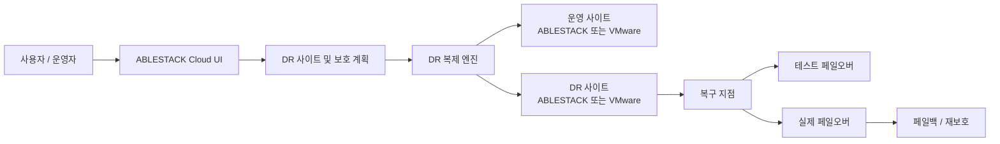
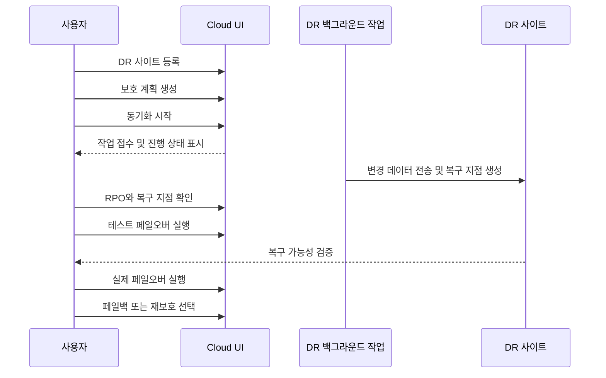
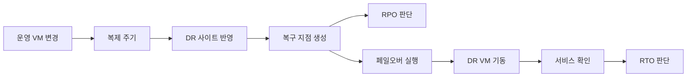
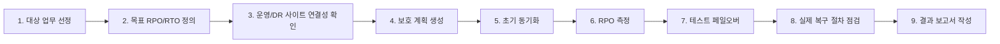

# ABLESTACK Cross Hypervisor DR 고객 안내서

문서 기준일: 2026-07-01  
문서 대상: DR 인프라 도입을 검토하는 고객, 일반 사용자, 영업/프리세일즈 설명 자료 작성자  
기술 근거: `docs/ftctl/cross-hypervisor-dr-operator-guide-20260701`

## 1. 문서 목적

이 문서는 ABLESTACK Cross Hypervisor DR 기능을 고객 관점에서 설명하기 위한 안내서이다. 기존 기술 문서는 API, 백엔드, 에이전트, 복제 엔진의 내부 흐름을 다루지만, 고객 설명에서는 다음 질문에 답하는 것이 더 중요하다.

- 왜 이 기능이 필요한가?
- 어떤 운영 환경을 보호할 수 있는가?
- 사용자는 UI에서 어떤 순서로 DR을 설정하고 확인하는가?
- RPO와 RTO는 무엇에 의해 결정되는가?
- 도입 전에 어떤 인프라 조건을 확인해야 하는가?

## 2. 한눈에 보는 요약

ABLESTACK Cross Hypervisor DR은 ABLESTACK 기반 가상머신과 VMware 기반 가상머신을 하나의 DR 운영 흐름으로 보호하기 위한 기능이다. 운영자는 Cloud UI에서 DR 사이트를 등록하고, 보호 계획을 만들고, 복제 상태와 복구 지점을 확인하며, 테스트 페일오버와 실제 페일오버를 수행할 수 있다.

| 고객 관점 | 설명 |
| --- | --- |
| 하나의 DR 화면 | ABLESTACK와 VMware 조합을 동일한 UI 흐름으로 관리한다. |
| 다양한 DR 방향 | ABLESTACK -> VMware, VMware -> VMware, ABLESTACK -> ABLESTACK, VMware -> ABLESTACK 시나리오를 고려한다. |
| 지속 복제 기반 | 운영 VM의 변경 데이터를 DR 사이트로 지속적으로 전달해 복구 지점을 만든다. |
| 업무 중단 최소화 | 장기 작업은 백그라운드로 수행되어 사용자는 UI에서 다른 작업을 계속할 수 있다. |
| 검증 가능한 복구 | 실제 재해 전에도 테스트 페일오버로 복구 절차를 검증할 수 있다. |
| RPO/RTO 가시화 | 최신 복구 지점과 목표 RPO/RTO를 기준으로 복구 준비 상태를 확인한다. |

## 3. 왜 필요한가

기업 인프라는 단일 가상화 플랫폼만으로 구성되지 않는 경우가 많다. 일부 업무는 ABLESTACK 기반 사설 클라우드에서 운영되고, 일부 업무는 VMware 환경에 남아 있을 수 있다. 또한 DR 센터의 표준 플랫폼이 운영 센터와 다를 수도 있다.

이런 환경에서 DR을 플랫폼별로 따로 운영하면 다음 문제가 생긴다.

- 운영자는 플랫폼마다 다른 DR 도구와 절차를 익혀야 한다.
- 페일오버, 페일백, 복구 지점 확인 절차가 표준화되기 어렵다.
- 장애 상황에서 어느 시스템이 최신 상태인지 판단하기 어렵다.
- DR 테스트가 복잡해져 실제 재해 대응 훈련이 줄어든다.

Cross Hypervisor DR은 이 문제를 줄이기 위해 DR 사이트, 보호 계획, 복구 지점, 실행 이력을 하나의 운영 모델로 묶는다.

## 4. 전체 구성 개념

구성 요소를 고객 관점으로 설명하면 다음과 같다.

| 구성 요소 | 고객이 이해해야 할 역할 |
| --- | --- |
| DR 사이트 | 운영 센터와 DR 센터를 의미한다. 각 사이트는 ABLESTACK 또는 VMware 유형을 가진다. |
| 보호 계획 | 어떤 VM을 어느 DR 사이트로 보호할지 정의하는 단위이다. |
| 복제 엔진 | 운영 VM의 디스크 변경 내용을 DR 사이트로 전달하는 실행 계층이다. |
| 복구 지점 | 장애 시 복구에 사용할 수 있는 시점이다. 최신 복구 지점일수록 데이터 손실이 적다. |
| 테스트 페일오버 | 실제 서비스 전환 없이 DR 복구 절차를 검증하는 기능이다. |
| 페일오버 | 재해 또는 계획 작업 시 DR 사이트에서 서비스를 기동하는 절차이다. |
| 페일백 | 원 운영 사이트가 복구된 뒤 서비스를 원래 방향으로 되돌리는 절차이다. |

## 5. 지원을 고려하는 4가지 DR 시나리오

| 시나리오 | 적합한 고객 상황 | 핵심 설명 |
| --- | --- | --- |
| ABLESTACK 운영 -> VMware DR | 운영은 ABLESTACK, DR 센터는 기존 VMware 자산을 활용하려는 경우 | ABLESTACK VM 데이터를 VMware DR 사이트의 VMDK와 VM 구성으로 복구할 수 있도록 준비한다. |
| VMware 운영 -> VMware DR | 기존 VMware 운영 환경에 별도 VMware DR 센터를 구성하는 경우 | VMware 변경 추적 기반 복제를 활용해 동일 플랫폼 DR을 구성한다. |
| ABLESTACK 운영 -> ABLESTACK DR | ABLESTACK 기반 사설 클라우드를 이중화하려는 경우 | 운영 ABLESTACK와 DR ABLESTACK 간에 표준화된 복구 지점을 만든다. |
| VMware 운영 -> ABLESTACK DR | VMware 의존도를 낮추거나 ABLESTACK DR 센터를 활용하려는 경우 | VMware 운영 VM의 데이터를 ABLESTACK 대상 디스크와 VM 구성으로 복구할 수 있도록 준비한다. |

## 6. 사용자 관점 운영 흐름

실제 사용 흐름은 다음과 같다.

1. 운영 사이트와 DR 사이트를 등록한다.
2. 보호할 VM과 대상 사이트를 선택해 보호 계획을 만든다.
3. 복제 주기, RPO/RTO 목표, 디스크와 네트워크 매핑을 설정한다.
4. 동기화를 시작한다.
5. UI에서 복제 상태, 최신 복구 지점, 목표 RPO 충족 여부를 확인한다.
6. 정기적으로 테스트 페일오버를 수행해 복구 절차를 검증한다.
7. 재해 또는 계획 점검 시 실제 페일오버를 수행한다.
8. 원 사이트가 복구되면 페일백 또는 DR 사이트 기준 재보호를 선택한다.

## 7. RPO와 RTO를 어떻게 이해해야 하는가

RPO와 RTO는 DR 도입 검토에서 가장 중요한 지표이다.

| 지표 | 의미 | 고객이 확인할 내용 |
| --- | --- | --- |
| RPO | 장애가 발생했을 때 허용 가능한 데이터 손실 시간 | 복제 주기, 변경 데이터량, 네트워크 대역폭, 스토리지 성능 |
| RTO | 장애 후 서비스를 다시 사용할 수 있을 때까지 걸리는 시간 | VM 기동 자동화, 네트워크 전환, DNS/LB 변경, 운영 승인 절차 |

RPO와 RTO는 제품 기능만으로 결정되지 않는다. 다음 요소를 함께 설계해야 한다.

| 영향 요소 | RPO 영향 | RTO 영향 |
| --- | --- | --- |
| 디스크 크기와 변경량 | 변경량이 많으면 복제 완료 시간이 늘어난다. | 복구 지점 선택 시간이 길어질 수 있다. |
| 센터 간 네트워크 | 대역폭과 지연 시간이 복제 속도를 좌우한다. | 재해 시 운영자 접속과 서비스 전환 시간에 영향을 준다. |
| 대상 스토리지 성능 | DR 사이트에 데이터를 기록하는 시간이 늘어날 수 있다. | VM 부팅과 초기 I/O 성능에 영향을 준다. |
| VM 자동 생성/기동 | 직접 영향은 작다. | 자동화 수준이 낮으면 복구 시간이 길어진다. |
| 운영 절차 | 복제 자체에는 직접 영향이 작다. | 승인, 네트워크 전환, 애플리케이션 확인 절차가 RTO에 포함된다. |

## 8. 도입 전 확인해야 할 사항

고객 환경에 적용하기 전에 다음 항목을 확인해야 한다.

| 영역 | 확인 항목 |
| --- | --- |
| 보호 대상 | 어떤 업무 VM을 보호할지, 우선순위와 중요도를 정한다. |
| 목표 지표 | 업무별 목표 RPO와 목표 RTO를 정한다. |
| 사이트 구성 | 운영 사이트와 DR 사이트의 플랫폼, 네트워크, 스토리지 용량을 확인한다. |
| 접속 정보 | ABLESTACK, VMware, 스토리지, 네트워크 장비 접근 권한과 보안 정책을 확인한다. |
| 데이터 전송 | 센터 간 전용망, 방화벽, 포트, 대역폭, 암호화 요구사항을 확인한다. |
| 디스크 매핑 | 운영 VM 디스크가 DR 사이트의 어떤 디스크 또는 데이터스토어에 대응되는지 정의한다. |
| 네트워크 매핑 | DR 전환 시 IP, VLAN, 보안그룹, 방화벽, DNS/LB 전환 방식을 정한다. |
| 복구 검증 | 테스트 페일오버 주기와 검증 담당자를 정한다. |
| 운영 절차 | 페일오버 승인, 페일백 승인, 비상 연락망, 점검 체크리스트를 준비한다. |

## 9. 시나리오별 고객 설명 포인트

### 9.1 ABLESTACK 운영 -> VMware DR

이 시나리오는 ABLESTACK에서 운영 중인 업무를 기존 VMware DR 센터로 보호하려는 고객에게 적합하다. 기존 VMware 자산을 활용하면서 ABLESTACK 운영 환경의 DR 체계를 만들 수 있다는 점이 장점이다.

고객에게는 다음을 설명한다.

- 운영 VM은 ABLESTACK에 남아 있고, DR 사이트는 VMware 자산을 활용한다.
- DR 사이트에는 대상 데이터스토어, 네트워크, VM 배치 정책이 준비되어야 한다.
- 장애 시 VMware 쪽에서 서비스를 기동할 수 있도록 VM 구성 자동화와 네트워크 전환 절차가 필요하다.

### 9.2 VMware 운영 -> VMware DR

이 시나리오는 기존 VMware 운영 고객이 동일한 VMware 기반 DR을 구성하는 경우에 적합하다. 플랫폼이 같기 때문에 운영팀이 이해하기 쉽고, 기존 vCenter 운영 경험을 활용할 수 있다.

고객에게는 다음을 설명한다.

- VMware 운영 VM의 변경 데이터를 다른 VMware 사이트로 전달한다.
- vCenter, 데이터스토어, 네트워크 매핑이 중요하다.
- 정기 테스트 페일오버로 DR 사이트에서 VM이 정상 기동되는지 확인해야 한다.

### 9.3 ABLESTACK 운영 -> ABLESTACK DR

이 시나리오는 ABLESTACK 기반 사설 클라우드를 센터 단위로 이중화하려는 고객에게 적합하다. 운영과 DR 모두 ABLESTACK이므로 운영 표준을 통일하기 쉽다.

고객에게는 다음을 설명한다.

- 운영/DR 모두 ABLESTACK 표준으로 관리할 수 있다.
- 대상 스토리지 용량과 디스크 매핑이 중요하다.
- 목표 RPO가 낮을수록 네트워크와 스토리지 성능 검증이 필요하다.

### 9.4 VMware 운영 -> ABLESTACK DR

이 시나리오는 VMware 운영 환경을 유지하면서 DR 센터는 ABLESTACK으로 구성하려는 고객에게 적합하다. VMware 의존도를 낮추거나 ABLESTACK 기반 DR 센터를 전략적으로 활용하려는 경우에 유용하다.

고객에게는 다음을 설명한다.

- 운영은 VMware에 두고, 재해 시 ABLESTACK에서 서비스를 복구하는 구조이다.
- 대상 ABLESTACK의 VM 스펙, 스토리지, 네트워크 매핑이 사전에 준비되어야 한다.
- 단순 이관 도구가 아니라 지속 복제와 복구 지점 관리가 가능한 DR 흐름이 필요하다.

## 10. 기대효과

| 기대효과 | 고객 가치 |
| --- | --- |
| 이기종 환경 DR 표준화 | ABLESTACK와 VMware가 섞인 환경에서도 하나의 DR 운영 절차를 만들 수 있다. |
| 운영 복잡도 감소 | 사이트, 보호 계획, 복구 지점, 실행 이력을 UI에서 일관되게 확인한다. |
| 재해 대응 신뢰도 향상 | 테스트 페일오버로 실제 장애 전 복구 가능성을 검증한다. |
| 인프라 선택권 확대 | 운영/DR 사이트를 같은 플랫폼으로만 맞출 필요가 줄어든다. |
| 전환 전략 유연성 | VMware 유지, ABLESTACK 확장, 하이브리드 DR 등 다양한 전략을 지원할 수 있다. |
| 감사와 보고 용이성 | 실행 이력과 복구 지점 정보가 남아 DR 훈련 결과를 설명하기 쉽다. |

## 11. 고객 PoC 권장 절차

PoC에서는 처음부터 모든 업무를 대상으로 삼기보다 대표 VM 1-3대를 선택하는 것이 좋다. 테스트에서는 다음 결과를 확인한다.

- 초기 복제에 걸린 시간
- 변경 데이터 복제 후 최신 복구 지점 생성 시간
- 테스트 페일오버 성공 여부
- DR 사이트 VM 기동 및 애플리케이션 확인 시간
- 목표 RPO/RTO 대비 차이
- 운영자가 실제 장애 상황에서 수행해야 할 수동 절차

## 12. 고객에게 설명할 때의 핵심 메시지

1. Cross Hypervisor DR은 이기종 가상화 환경의 DR 운영을 하나의 절차로 묶기 위한 기능이다.
2. UI에서 보호 계획과 복구 지점을 확인하므로 DR 상태를 이해하기 쉽다.
3. 장기 작업은 백그라운드로 진행되어 UI 사용성을 해치지 않는다.
4. RPO/RTO는 제품 기능뿐 아니라 네트워크, 스토리지, 자동화, 운영 절차까지 포함해 설계해야 한다.
5. 도입 전 PoC를 통해 실제 업무 VM 기준의 복제 시간과 복구 시간을 측정하는 것이 중요하다.

## 13. 용어 정리

| 용어 | 설명 |
| --- | --- |
| DR | Disaster Recovery. 재해 상황에서 서비스를 복구하기 위한 체계이다. |
| 운영 사이트 | 평상시 서비스가 실행되는 사이트이다. |
| DR 사이트 | 장애 또는 계획 전환 시 서비스를 복구하는 사이트이다. |
| RPO | 허용 가능한 데이터 손실 시간이다. 예를 들어 RPO 5분은 장애 시 최대 5분 이내의 데이터 손실을 목표로 한다는 뜻이다. |
| RTO | 서비스 복구까지 허용 가능한 시간이다. |
| 복구 지점 | DR 사이트에 반영되어 복구에 사용할 수 있는 데이터 시점이다. |
| 테스트 페일오버 | 실제 운영 서비스를 중단하지 않고 DR 복구 가능성을 검증하는 절차이다. |
| 페일오버 | 운영 사이트 장애 또는 계획 작업 시 DR 사이트로 서비스를 전환하는 절차이다. |
| 페일백 | 원 운영 사이트가 복구된 뒤 서비스를 다시 원래 사이트로 되돌리는 절차이다. |
| 재보호 | 페일오버 이후 새로운 운영 방향을 기준으로 다시 DR 보호를 구성하는 절차이다. |

## 14. 도입 상담 시 확인 질문

| 질문 | 목적 |
| --- | --- |
| 보호해야 할 업무 VM은 몇 대이며, 중요도는 어떻게 나뉘는가? | 보호 범위와 우선순위 산정 |
| 목표 RPO/RTO는 업무별로 얼마인가? | 복제 주기와 인프라 성능 설계 |
| 운영 사이트와 DR 사이트의 가상화 플랫폼은 무엇인가? | 4개 DR 시나리오 중 적용 방향 결정 |
| 센터 간 네트워크 대역폭과 지연 시간은 어느 정도인가? | 복제 성능 검토 |
| DR 사이트의 스토리지 용량과 성능은 충분한가? | 복구 지점 보관과 VM 기동 성능 검토 |
| 장애 시 IP, DNS, 방화벽, LB 전환은 누가 수행하는가? | 실제 RTO 산정 |
| 정기 DR 훈련 주기는 어떻게 운영할 것인가? | 테스트 페일오버 운영 계획 |
| 페일백까지 자동화가 필요한가? | 복구 이후 운영 정상화 범위 결정 |

## 15. 결론

ABLESTACK Cross Hypervisor DR은 ABLESTACK와 VMware가 함께 존재하는 현실적인 고객 환경에서 DR 운영을 단순화하고 표준화하기 위한 접근이다. 핵심은 특정 플랫폼 하나에 종속된 DR이 아니라, 운영 사이트와 DR 사이트의 조합을 유연하게 선택하면서도 사용자는 동일한 UI와 동일한 운영 절차로 복구 상태를 확인할 수 있다는 점이다.

고객 도입 시에는 기능 자체의 제공 여부뿐 아니라 목표 RPO/RTO, 네트워크, 스토리지, VM 기동 자동화, 운영 승인 절차를 함께 검토해야 한다. 이 문서는 그 검토를 시작하기 위한 고객 설명 자료로 사용할 수 있다.
