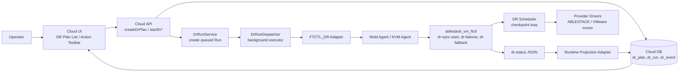
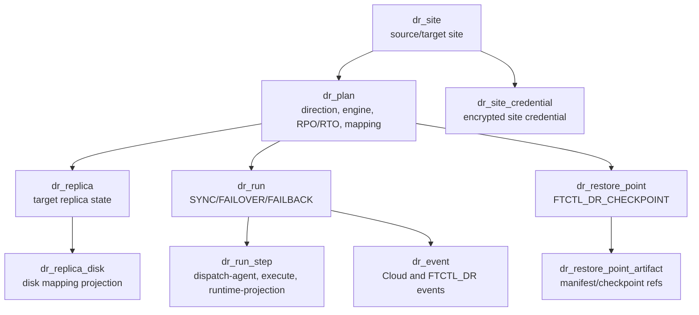
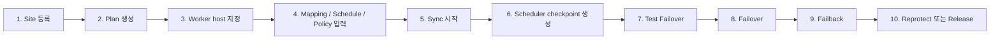

# Cross Hypervisor DR 기능 개요, 목표, 구성, 사전 조건 및 설정 절차

문서 기준일: 2026-07-01  
검토 기준 소스: Cloud `bb8857cbc3`, ftctl/qemu-exec-tools `a25443d`

## 1. 기능 개요

Cross Hypervisor DR은 ABLESTACK KVM 워크로드와 VMware 워크로드를 하나의 DR 제어 모델로 보호하기 위한 기능이다. 운영자는 Cloud UI에서 사이트, 보호 계획, 복제 상태, 복구 지점, Run 이력을 확인하고 액션을 요청한다. Cloud API와 백엔드는 요청을 장기 동기 작업으로 처리하지 않고 `dr_run`으로 기록한 뒤 Agent를 통해 각 호스트의 ftctl DR runtime에 전달한다.

핵심 원칙은 다음과 같다.

| 원칙 | 설명 |
| --- | --- |
| UI는 API만 호출 | UI는 libvirt, vCenter, ftctl을 직접 호출하지 않는다. |
| API는 비동기 Run 생성 | API는 `dr_run`, `dr_run_step`, `dr_event`를 기록하고 즉시 응답한다. |
| 백엔드는 Agent에 위임 | `DrRunDispatcher`가 Agent Command를 전달하고 장기 작업은 ftctl이 수행한다. |
| 상태는 projection으로 회수 | Cloud는 `FtctlDrStatusCommand`로 ftctl runtime 상태를 읽어 Plan, Run, Restore Point, Replica projection을 갱신한다. |
| 데이터 경로는 엔진 책임 | ABLESTACK 경로는 ftctl ABLESTACK driver가, VMware 포함 경로는 VDDK/CBT 기반 mover가 수행해야 한다. |

## 2. 목표

| 목표 | 구현/운영 기준 |
| --- | --- |
| 4개 방향 동일 UI/백엔드 모델 | `KVM_TO_VMWARE`, `VMWARE_TO_VMWARE`, `KVM_TO_KVM`, `VMWARE_TO_KVM` 모두 `FTCTL_DR` 엔진 계약으로 표현한다. |
| 비동기 작업 처리 | UI/API는 장기 복제, failover, failback을 동기 대기하지 않는다. |
| 지속 복제 기반 RPO 관리 | ftctl scheduler가 checkpoint를 생성하고 Cloud가 `targetReadyRpoSeconds`를 표시한다. |
| 복구 액션 일관화 | Test Failover, Failover, Failback, Reprotect, Release를 동일 Run/Projection 모델로 관리한다. |
| 운영자가 추적 가능한 상태 | Run, Step, Event, Restore Point, Replica projection을 UI에서 조회할 수 있다. |

## 3. 전체 구성 요소

| 계층 | 주요 소스/명령 | 역할 |
| --- | --- | --- |
| UI | `DrPlanList.vue`, `DrActionToolbar.vue` | 계획 생성, 상태 조회, 액션 버튼, polling |
| UI API wrapper | `ui/src/api/dr.js` | `createDrPlan`, `startDrSync`, `startDrFailover`, `startDrFailback` 등 API 호출 |
| Cloud API | `command/admin/dr/*Cmd.java` | 요청 파라미터 검증, action eligibility 확인, Run 응답 |
| Cloud DB | `dr_site`, `dr_site_credential`, `dr_plan`, `dr_replica`, `dr_restore_point`, `dr_run`, `dr_run_step`, `dr_event` | 사이트 인증정보, 계획, 실행, 이벤트, 복구 지점, replica 상태 저장 |
| Orchestrator | `DrRunServiceImpl`, `DrOrchestratorImpl`, `DrRunExecutorImpl` | Run 생성, 비동기 dispatch, adapter 실행, projection refresh |
| Adapter | `FtctlDrUnifiedActionAdapter`, `FtctlDrRuntimeProjectionAdapter` | FTCTL_DR profile 생성, Agent action/status command 전송 |
| Agent wrapper | `LibvirtFtctlDrActionCommandWrapper`, `LibvirtFtctlDrStatusCommandWrapper` | `ablestack_vm_ftctl` CLI 실행과 JSON answer 변환 |
| ftctl runtime | `ablestack_vm_ftctl.sh`, `dr_runtime.sh`, `dr_scheduler.sh` | DR action 수락, scheduler loop, status 출력, failover/failback 상태 관리 |
| ftctl drivers | `dr_ablestack.sh`, `dr_vmware.sh` | ABLESTACK disk copy, VMware VDDK/CBT mover 계약 |

## 4. 상태 및 데이터 모델

Plan의 핵심 필드는 다음과 같다.

| 필드 | 의미 |
| --- | --- |
| `direction` | `KVM_TO_VMWARE`, `VMWARE_TO_VMWARE`, `KVM_TO_KVM`, `VMWARE_TO_KVM` 중 하나 |
| `engineType`, `engineBindingType` | 완전 DR 경로는 `FTCTL_DR` 사용 |
| `sourceWorkerHostId`, `targetWorkerHostId`, `coordinatorWorkerHostId` | Agent command를 받을 작업 호스트 |
| `mappingJson` | disk, datastore, network, VM reference 등 데이터 경로 계약 |
| `scheduleJson` | scheduler interval, cycle 정책 |
| `lastSourceCheckpointAt`, `lastTargetDurableAt`, `targetReadyRpoSeconds` | RPO projection |
| `activeSide` | `SOURCE` 또는 `TARGET` |

## 5. 사용 사전 조건

### 공통 조건

| 항목 | 조건 |
| --- | --- |
| Cloud DR plugin | DR API, DAO, Spring component, DB upgrade가 배포되어 있어야 한다. |
| Cloud UI | 활성 UI bundle에 `cross-dr`, `createDrPlan`, `startDrFailover`, `pollRuns` marker가 있어야 한다. |
| Mold Agent | KVM Agent에 `FtctlDrActionCommand`, `FtctlDrStatusCommand` wrapper가 포함되어야 한다. |
| ftctl package | 대상 호스트에 `ablestack_vm_ftctl` DR runtime, scheduler, drivers가 설치되어야 한다. |
| 작업 호스트 | Plan에 coordinator 또는 source/target worker host 중 하나 이상이 지정되어야 한다. |
| 사이트 인증정보 | UI에서 Mold/vCenter 접속 정보를 입력하고 Cloud backend가 암호화 저장해야 한다. UI는 credential reference를 요구하지 않는다. |
| Disk mapping | 각 disk의 source/target reference, format, size, target type이 `mappingJson`으로 제공되어야 한다. |

### ABLESTACK 포함 조건

| 항목 | 조건 |
| --- | --- |
| Source disk 접근 | KVM host에서 source RBD, block device, qcow2 path를 읽을 수 있어야 한다. |
| Target disk 준비 | target RBD pool, block device, qcow2 directory가 준비되어야 한다. |
| qemu-img | full seed 및 file/block/rbd copy에 필요한 `qemu-img`가 있어야 한다. |

### VMware 포함 조건

| 항목 | 조건 |
| --- | --- |
| vCenter 정보 | source/target VM ref, datastore, folder, resource pool, network mapping이 필요하다. |
| vCenter 인증정보 | vCenter URL, username, password가 DR Site에 등록되어야 한다. 응답과 화면에는 secret 원문을 표시하지 않는다. |
| VDDK/CBT capability | `nbdkit vddk` 또는 `vmware-vdiskmanager` 등 VDDK 계열 도구가 필요하다. |
| VMware mover | `FTCTL_DR_VMWARE_MOVER`로 지정되는 실제 데이터 전송 엔진이 필요하다. 없으면 `DR_VMWARE_MOVER_UNAVAILABLE`로 중단된다. |
| Lifecycle hook | VMware/ABLESTACK VM materialize, register, power-on은 현재 ftctl runtime에서 `POWER_ON_DELEGATED`로 기록되므로 mover 또는 provider hook이 실제 수행해야 한다. |

## 6. 설정 절차

1. DR Site를 등록한다. Source와 Target site의 hypervisor type은 방향과 일치해야 하며, 사이트 유형에 맞는 Mold/vCenter 인증정보를 입력한다. Cloud backend는 이를 암호화 저장한다.
2. DR Plan을 생성한다. 완전 DR 경로는 `engineType=FTCTL_DR`, `engineBindingType=FTCTL_DR`를 사용한다.
3. Worker host를 지정한다. 최소 coordinator host가 필요하며 ABLESTACK 방향에서는 source/target worker도 지정하는 것이 안전하다.
4. Disk mapping과 target mapping을 입력한다.
5. `startDrSync`를 실행한다. Cloud는 Run을 생성하고 Agent에 `dr-sync-start --wait=false --json`을 전달한다.
6. ftctl scheduler가 checkpoint를 생성하고 Cloud projection이 `dr_restore_point`와 RPO 상태를 갱신한다.
7. Target ready 상태에서 `startDrTestFailover`를 실행해 복구 지점 기반 테스트 세션을 만든다.
8. Planned 또는 Disaster 모드로 `startDrFailover`를 실행한다. Planned 모드는 final checkpoint를 시도한다.
9. Source 복구 후 `startDrFailback`을 실행한다.
10. Target 기준 보호를 유지하려면 `startDrReprotect`, 보호를 종료하려면 `releaseDrProtection`을 실행한다.

## 7. 소스 검토로 확인한 연결 상태와 단절 후보

| 구분 | 판정 | 근거/주의점 |
| --- | --- | --- |
| UI -> API | 연결됨 | `DrPlanList.vue`, `DrActionToolbar.vue`, `dr.js`가 계획/액션 API를 호출한다. |
| API -> Run DB | 연결됨 | `AbstractDrPlanActionCmd`가 eligibility 확인 후 `DrRunService.startRun`을 호출한다. |
| Run -> Agent | 연결됨 | `DrRunExecutorImpl`이 background executor에서 `FtctlDrUnifiedActionAdapter`를 실행한다. |
| Agent -> ftctl | 연결됨 | Agent wrapper가 `ablestack_vm_ftctl dr-* --wait=false --json`을 실행한다. |
| ftctl -> Cloud 상태 회수 | 연결됨 | `FtctlDrRuntimeProjectionAdapter`가 `dr-status`를 읽어 plan/run/restore point/replica를 갱신한다. |
| ABLESTACK disk copy | 부분 구현 | 현재 scheduler cycle은 `qemu-img convert` full seed를 반복한다. 진짜 block delta 기반 지속 복제는 추가 개선 대상이다. |
| VMware data plane | 외부 엔진 필요 | `FTCTL_DR_VMWARE_MOVER` 없이는 `DR_VMWARE_MOVER_UNAVAILABLE`이다. V2K는 사용하지 않는다. |
| 실제 VM power-on/promotion | provider hook 필요 | ftctl runtime은 `POWER_ON_DELEGATED`로 기록한다. 실제 VM materialize와 power-on hook이 운영 배포에 포함되어야 한다. |
| `confirmDrFenceClear` for FTCTL_DR | 단절 후보 | UI/API eligibility는 열릴 수 있으나 `FENCE_CONFIRM`은 fencing adapter로 라우팅되고 현재 확인된 adapter는 legacy `FTCTL` 경로다. |
| `adoptDrReplica` for FTCTL_DR | 닫힌 흐름 | eligibility가 legacy `FTCTL`로 제한되어 있어 FTCTL_DR 일반 액션에는 포함되지 않는다. |
