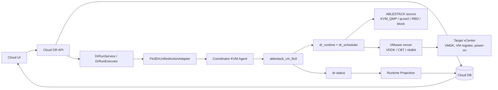
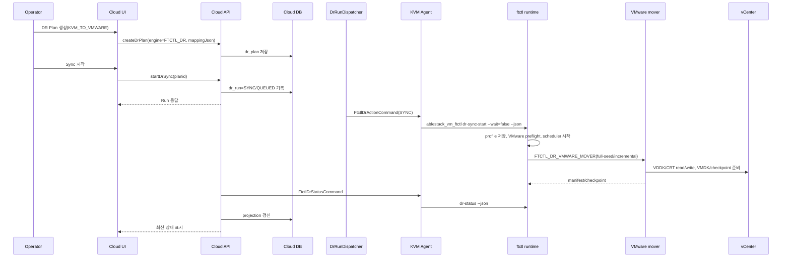

# ABLESTACK -> VMware DR 아키텍처, 시퀀스, 기능 및 단계별 태스크

문서 기준일: 2026-07-01  
방향: `KVM_TO_VMWARE`  
권장 엔진: `FTCTL_DR`

## 1. 아키텍처

ABLESTACK 운영 VM을 VMware DR site로 보호하는 방향이다. Cloud는 ABLESTACK VM과 disk 정보를 source로 관리하고, target vCenter 정보와 VMDK/datastore/network mapping을 Plan에 저장한다. 실제 VMware 데이터 이동과 target VM lifecycle은 VDDK/CBT 기반 VMware mover가 수행해야 한다.

## 2. 기능 범위

| 기능 | 현재 흐름 |
| --- | --- |
| 보호 설정 | UI create plan -> Cloud DB `dr_plan` -> worker binding -> mapping 저장 |
| Sync 시작 | `startDrSync` -> Run 생성 -> Agent `dr-sync-start` -> ftctl scheduler 시작 |
| 지속 복제 | VMware 포함 방향이므로 scheduler cycle은 `ftctl_dr_vmware_replication_cycle`을 호출한다. |
| Restore Point | mover가 checkpoint/manifest를 만들고 ftctl이 restore-points JSONL과 Cloud projection으로 반영한다. |
| Test Failover | target-ready restore point를 선택해 test session과 artifact 상태를 생성한다. 실제 VMware test VM 생성은 mover/lifecycle hook 책임이다. |
| Failover | planned mode는 final checkpoint를 시도하고 target active 상태를 기록한다. target power-on은 `POWER_ON_DELEGATED`로 기록된다. |
| Failback | reverse profile을 만들어 VMware -> ABLESTACK 방향 reverse checkpoint를 수행한다. |
| Reprotect | target을 active side로 둔 reverse protection checkpoint를 시작한다. |

## 3. 시퀀스

## 4. 단계별 태스크

| 단계 | Operator/UI 태스크 | Backend/Agent/ftctl 태스크 |
| --- | --- | --- |
| 1. Site 등록 | Source ABLESTACK site, Target VMware site 등록. UI에서 Mold/vCenter 인증정보 입력 | `dr_site`와 암호화된 `dr_site_credential` 저장 |
| 2. Plan 작성 | 방향 `KVM_TO_VMWARE`, 엔진 `FTCTL_DR`, RPO/RTO, mapping 입력 | `DrPlanServiceImpl`이 topology와 engine을 검증 |
| 3. Worker 지정 | coordinator/source worker host 선택 | Adapter가 coordinator host id를 Agent command 대상으로 사용 |
| 4. Mapping 입력 | source disk, target datastore/VMDK/network/resource pool 지정 | `mappingJson`이 ftctl profile의 `mapping`으로 전달 |
| 5. Sync 시작 | `Start Sync` 클릭 | Cloud Run 생성, Agent `dr-sync-start`, ftctl VMware preflight |
| 6. 지속 복제 | UI에서 RPO와 checkpoint 확인 | scheduler가 mover를 반복 호출하고 restore point 생성 |
| 7. Test Failover | restore point 선택 후 test failover | ftctl test session 생성, provider hook이 test VM 생성 수행 필요 |
| 8. Failover | planned/disaster 선택 | planned는 final checkpoint, target active 상태 projection |
| 9. Failback | source 복구 후 failback | reverse profile로 VMware -> ABLESTACK checkpoint 수행 |
| 10. Reprotect/Release | target 기준 재보호 또는 보호 해제 | `dr-reprotect` 또는 `dr-release` 실행 |

## 5. RPO/RTO 분석

| 항목 | 분석 |
| --- | --- |
| RPO | scheduler interval, VDDK/CBT delta 추출 시간, target VMDK commit 시간이 합쳐진다. Cloud는 `targetReadyRpoSeconds`를 기준으로 표시한다. |
| RTO | restore point 선택, final checkpoint 여부, VMware target VM materialize/register/power-on 시간이 지배한다. |
| planned failover | final checkpoint가 성공해야 RPO가 가장 낮다. mover 미배치 시 `DR_VMWARE_MOVER_UNAVAILABLE`로 실패한다. |
| disaster failover | source final checkpoint를 건너뛰고 최신 target-ready restore point로 전환한다. |

## 6. 소스 검토 결과와 운영 전 확인 사항

| 항목 | 판정 |
| --- | --- |
| UI/API/Run/Agent/ftctl 제어 경로 | 연결됨 |
| VMware 데이터 전송 | `FTCTL_DR_VMWARE_MOVER` 외부 엔진 필요 |
| V2K 사용 | 사용하지 않는 것이 맞다. V2K는 migration 도구이며 이 DR 경로의 지속 복제 엔진으로 쓰지 않는다. |
| 실제 VMware VM power-on | 현재 runtime은 `POWER_ON_DELEGATED`를 기록한다. mover 또는 provider lifecycle hook으로 구현/배포되어야 한다. |
| 흐름 단절 위험 | mover/hook 미배치 시 UI와 Cloud Run은 생성되지만 데이터 복제와 target VM 활성화는 완료되지 않는다. |
