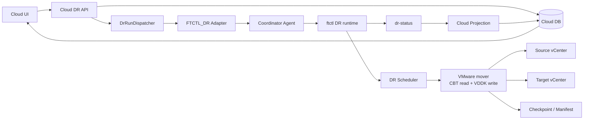
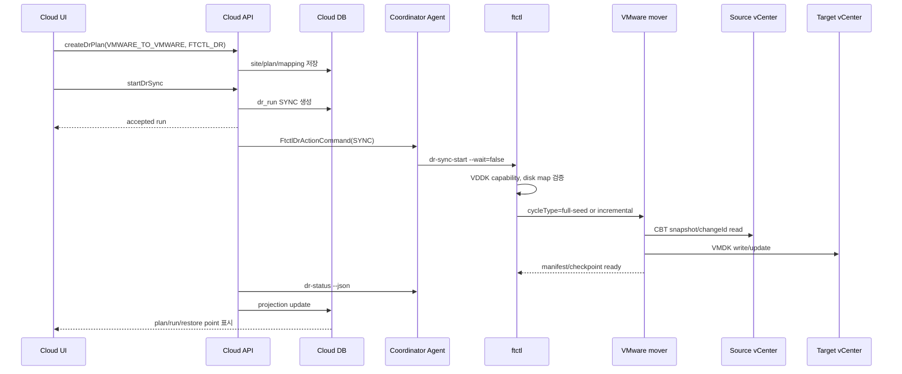

# VMware -> VMware DR 아키텍처, 시퀀스, 기능 및 단계별 태스크

문서 기준일: 2026-07-01  
방향: `VMWARE_TO_VMWARE`  
권장 엔진: `FTCTL_DR`

## 1. 아키텍처

VMware 운영 VM을 다른 VMware DR site로 보호하는 방향이다. ABLESTACK Cloud는 orchestration controller로 동작하고, 데이터 전송은 vCenter/VDDK/CBT를 다루는 VMware mover가 수행한다. KVM Agent는 ftctl coordinator 역할을 하며 실제 VMware API와 VMDK 처리는 mover 계약에 위임된다.

## 2. 기능 범위

| 기능 | 현재 흐름 |
| --- | --- |
| 보호 설정 | VMware source/target site와 VM/VMDK/datastore mapping을 `dr_plan.mappingJson`에 저장 |
| Sync 시작 | `dr-sync-start`가 VMware preflight 후 scheduler를 시작 |
| 지속 복제 | `ftctl_dr_vmware_replication_cycle`이 mover를 호출해 full-seed 또는 incremental checkpoint 생성 |
| Restore Point | mover output을 manifest/checkpoint로 저장하고 Cloud projection이 `dr_restore_point`를 생성 |
| Test Failover | restore point를 기준으로 test session을 만든다. target test VM 생성은 mover/lifecycle hook 책임 |
| Failover | planned final checkpoint 후 target active projection. 실제 vCenter power-on은 delegated |
| Failback | reverse direction도 VMware -> VMware이며 reverse checkpoint를 수행 |
| Reprotect | target side를 기준으로 지속 복제를 재개 |

## 3. 시퀀스

## 4. 단계별 태스크

| 단계 | Operator/UI 태스크 | Backend/Agent/ftctl 태스크 |
| --- | --- | --- |
| 1. VMware sites 등록 | source vCenter, target vCenter site 등록. UI에서 각 vCenter URL/username/password 입력 | `dr_site.hypervisorType=VMWARE`, `dr_site_credential.credential_type=VCENTER` |
| 2. Plan 생성 | `VMWARE_TO_VMWARE`, `FTCTL_DR`, sourceExternalRef, mapping 입력 | 방향과 site hypervisor 검증 |
| 3. Hook/mapping 준비 | datastore, network, resource pool 지정 | 저장 credential은 backend에서 resolve하고 host에는 `/run` credential file로만 전달. profile/log에는 평문 잔류 금지 |
| 4. Sync 시작 | Start Sync | Agent가 ftctl `dr-sync-start` 실행 |
| 5. Preflight | UI에서 오류 여부 확인 | ftctl이 VDDK capability와 disk map을 검증 |
| 6. 지속 checkpoint | RPO, restore point 확인 | mover가 CBT delta를 target VMDK에 적용 |
| 7. Test Failover | test failover 실행 | target test VM 생성은 mover/lifecycle hook에서 수행 |
| 8. Failover | planned 또는 disaster failover | final checkpoint 후 active side를 TARGET으로 projection |
| 9. Failback | 원 site 복구 후 failback | reverse checkpoint와 source promotion 상태 기록 |
| 10. Reprotect | target 운영 기준 재보호 | reverse profile 기반 scheduler 재시작 |

## 5. RPO/RTO 분석

| 항목 | 분석 |
| --- | --- |
| RPO | VMware CBT snapshot 주기, mover 실행 시간, target datastore write latency에 좌우된다. |
| RTO | target VM register/reconfigure/power-on 시간과 네트워크 전환 절차가 지배한다. |
| 장점 | source와 target 모두 VMware이므로 CBT 기반 incremental 설계가 가장 자연스럽다. |
| 위험 | mover가 없으면 Cloud/ftctl 제어 루프만 동작하고 실제 데이터 경로는 실행되지 않는다. |

## 6. 소스 검토 결과와 운영 전 확인 사항

| 항목 | 판정 |
| --- | --- |
| UI/API/Run/Agent/ftctl 제어 경로 | 연결됨 |
| VMware preflight | VDDK 도구 부재 시 `DR_MISSING_VDDK`로 fail-fast |
| VMware mover | 필수. 없으면 scheduler cycle이 `DR_VMWARE_MOVER_UNAVAILABLE` 반환 |
| 실제 VM lifecycle | `POWER_ON_DELEGATED`로 기록되므로 target vCenter VM 생성/전원 제어 hook 필요 |
| Failback/Reprotect | reverse profile 생성 로직은 존재하지만 reverse VMware copy도 동일 mover가 책임져야 한다. |
