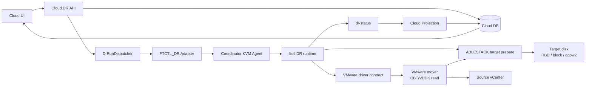
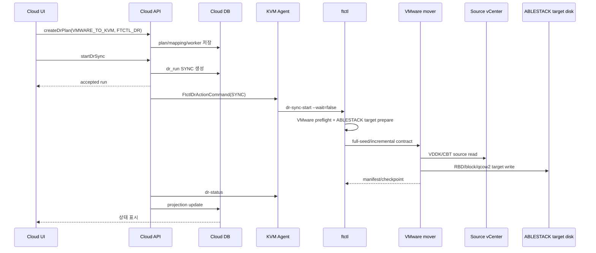

# VMware -> ABLESTACK DR 아키텍처, 시퀀스, 기능 및 단계별 태스크

> 2026-08-10 CBT 보완: 실행 중인 원본 VM의 CBT 설정이 아직 활성화되지
> 않았으면 시스템이 설정을 저장하고 정상적인 최초 복제 스냅샷을 이용해
> 선택한 디스크별 CBT를 활성화·검증한다. 원본 VM을 자동으로 종료하지
> 않으며, 비동기 검증 중에는 준비 상태를 표시한다. 지원 불가 또는 복구
> 불가능으로 판정된 경우에만 운영자 조치를 안내한다.

문서 기준일: 2026-07-01  
방향: `VMWARE_TO_KVM`  
권장 엔진: `FTCTL_DR`

> 2026-07-31 운영 보정: VMware 원본 격리 해제는 독립 메뉴가 아니다.
> Failback은 ABLESTACK 대상 VM 정지 확인 뒤 VMware 원본을 시작하고,
> Reprotect는 VMware 원본을 격리된 reverse target으로 유지한다.
> vCenter/Agent/FTCTL preflight 계약은 문서 587을 따른다.

> Failover 운영 보완 (2026-07-27): target VM은 완료 복제 checkpoint의 identity,
> CBT 결과, NBD 정리 증거가 모두 확인된 뒤에만 Cloud가 시작한다. 증거 조회가
> 일시적으로 불완전하면 시스템이 제한 재시도하며, target 시작 전 준비 실패는
> source를 자동으로 켜지 않은 채 안전하게 정리한다. target가 이미 시작된
> 상태에서는 자동 rollback하지 않고 운영자 복구가 필요한 상태로 표시한다.

## 1. 아키텍처

VMware 운영 VM을 ABLESTACK DR site로 보호하는 방향이다. source VMware VMDK/CBT를 읽고 target ABLESTACK disk(RBD, block, qcow2)에 반영해야 하므로 VMware mover와 ABLESTACK target 준비 로직이 함께 필요하다. V2K는 이관용 도구이므로 이 DR 지속 복제 경로에서는 사용하지 않는다.

## 2. 기능 범위

| 기능 | 현재 흐름 |
| --- | --- |
| 보호 설정 | VMware source VM ref와 ABLESTACK target disk mapping을 Plan에 저장 |
| Sync 시작 | VMware preflight와 ABLESTACK disk map 준비 후 scheduler 시작 |
| 지속 복제 | VMware mover가 CBT/VDDK delta를 읽어 ABLESTACK target disk에 반영해야 한다. |
| Restore Point | mover와 ftctl scheduler가 manifest/checkpoint/RPO를 생성 |
| Test Failover | ABLESTACK target restore point 기반 test session 생성 |
| Failover | target ABLESTACK active projection. 실제 VM 생성/전원 제어는 provider lifecycle hook 필요 |
| Failback | reverse profile로 ABLESTACK -> VMware checkpoint 수행 |
| Reprotect | target ABLESTACK 운영 기준으로 reverse protection 시작 |

## 3. 시퀀스

## 4. 단계별 태스크

| 단계 | Operator/UI 태스크 | Backend/Agent/ftctl 태스크 |
| --- | --- | --- |
| 1. Site 등록 | Source VMware site, Target ABLESTACK site 등록. UI에서 vCenter 인증정보와 Mold API 인증정보 입력 | source hypervisor VMWARE, target hypervisor KVM 검증, `dr_site_credential` 암호화 저장 |
| 2. Plan 생성 | `VMWARE_TO_KVM`, `FTCTL_DR`, sourceExternalRef, target mapping 입력 | `DrPlanServiceImpl`이 engine/direction topology 검증 |
| 3. VMware 설정 | VM/VMDK ref, CBT/VDDK 조건 준비 | 저장된 vCenter credential로 ftctl VMware preflight 수행 |
| 4. ABLESTACK target 설정 | target RBD/qcow2/block path와 size 지정 | target disk create/check 수행 |
| 5. Sync 시작 | Start Sync | Agent `dr-sync-start`, scheduler 시작 |
| 6. Checkpoint 확인 | RPO와 restore point 확인 | mover가 checkpoint 생성, projection 반영 |
| 7. Test Failover | target restore point로 test failover | ABLESTACK test VM lifecycle hook 필요 |
| 8. Failover | planned/disaster failover | target active projection, final checkpoint 선택 |
| 9. Failback | source VMware 복구 후 failback | reverse ABLESTACK -> VMware mover 필요 |
| 10. Reprotect | ABLESTACK 운영 기준 재보호 | reverse profile 기반 scheduler 시작 |

## 5. RPO/RTO 분석

| 항목 | 분석 |
| --- | --- |
| RPO | source VMware CBT delta 추출 시간과 ABLESTACK target write 시간이 합쳐진다. |
| RTO | ABLESTACK target VM 생성, disk attach, network mapping, power-on 시간이 지배한다. |
| V2K 판단 | V2K는 one-shot migration/convert 도구 성격이라 지속 checkpoint, failback, reprotect 요구를 만족하지 못한다. |
| 필수 엔진 | VMware mover가 source CBT read와 target ABLESTACK write를 모두 수행해야 한다. |

## 6. 소스 검토 결과와 운영 전 확인 사항

| 항목 | 판정 |
| --- | --- |
| UI/API/Run/Agent/ftctl 제어 경로 | 연결됨 |
| V2K 사용 여부 | Cloud UI에서 migration-only로 분리되어 있고 본 DR 경로에는 사용하지 않는 것이 맞다. |
| VMware source data plane | `FTCTL_DR_VMWARE_MOVER` 필수 |
| ABLESTACK target 준비 | target disk 준비 로직은 있으나 VMware mover가 target write까지 완결해야 한다. |
| 실제 VM lifecycle | ABLESTACK target VM materialize/power-on hook 필요 |
| 흐름 단절 위험 | mover/hook 미배치 시 Run은 accepted 후 status projection에서 오류 또는 delegated 상태로 남을 수 있다. |

## 2026-07-19 Test Failover 운영 모델 보정

영구 DR 대상 VM은 실제 Failover용으로 `Stopped` 상태를 유지한다. Test
Failover에서는 최신 정상 체크포인트로부터 별도의 테스트 디스크를
준비하고, Cloud가 해당 디스크를 임시 볼륨으로 등록한 뒤 임시 테스트
VM을 생성·기동·정리한다. FTCTL은 체크포인트 lease, 테스트 디스크,
VirtIO 준비만 담당하며 고객 테스트 VM을 직접 `virsh`로 관리하지 않는다.

테스트 네트워크는 Cloud 네트워크를 명시적으로 선택한다. 네트워크가
없는 테스트는 `NO_NIC`로 구분하며 격리 네트워크로 표시하지 않는다.
스토리지 식별자는 Cloud가 볼륨과 스토리지 풀에서 구조화하여 만들고,
Agent가 대상 호스트에서 검증한 뒤 FTCTL에 전달한다. FTCTL은 디스크 표시
이름으로 RBD/파일 경로를 추론하지 않는다. 테스트 작업 실패는 작업 이력과
테스트 세션에 표시하되 정상 동작 중인 지속 복제 상태를 오류로 바꾸지 않는다.

기본 수명주기 설계는
`../561-cross-hypervisor-dr-cloud-managed-test-failover-lifecycle-design-20260719.md`,
canonical artifact와 상태 투영 보정은
`../562-cross-hypervisor-dr-test-artifact-contract-and-projection-isolation-design-20260719.md`를 따른다.

## 2026-07-20 테스트 페일오버 완료 상태 보정

테스트 페일오버가 성공하면 실행 이력과 테스트 환경은 서로 다른 상태를
가진다. 유한 작업인 `TEST_FAILOVER` Run은 테스트 VM 부팅 검증 직후
`SUCCEEDED`로 완료되고, 테스트 환경을 나타내는 Test Session은 운영자가
`테스트 페일오버 중지`를 실행할 때까지 `ACTIVE`를 유지한다.

FTCTL의 `TEST_ARTIFACTS_READY`는 테스트 디스크와 체크포인트 lease가
유지되고 있다는 엔진 상태이므로 정상이다. 이 상태가 Cloud Test Session의
`ACTIVE`를 덮어쓰거나 Run 완료를 막아서는 안 된다. UI는 보호 상태,
완료된 테스트 실행 이력, 활성 테스트 환경을 구분하여 표시한다.

세부 상태 전이, 완료 판정, 요청 필드명, 재시작 복구 및 검증 기준은
`../563-cross-hypervisor-dr-test-failover-terminal-convergence-design-20260720.md`를
따른다.

## 2026-07-20 보호 상태와 복제 활동 표시

첫 번째 복구 가능한 복제본이 준비된 뒤에는 주기적인 증분 전송이 실행 중이어도
Plan의 보호 상태는 `정상(READY)`으로 표시한다. 전송 여부는 별도 `복제 활동`
항목에서 `대기` 또는 `복제 중`으로 표시한다.

대상 복제본은 존재하지만 Scheduler가 종료됐거나 소유권이 일치하지 않으면
`동기화 중`이 아니라 `보호 저하(DEGRADED)`로 표시한다. 이 경우 마지막 정상
복제 시각은 유지되지만 Test Failover와 일반 Failover는 Scheduler 복구 전까지
차단된다.

pause/resume 실행 이력은 짧은 작업 결과이며 지속 Scheduler 자체가 아니다.
운영자는 보호 상태, 복제 활동, Scheduler 상태, 마지막 완료 복제 시각을 함께
확인한다. 세부 계약은
`../564-cross-hypervisor-dr-plan-scheduler-singleton-authority-design-20260720.md`를
따른다.

## 2026-07-21 테스트 정리 이후 화면 해석

테스트 정리가 성공하면 해당 `TEST_CLEANUP` 작업은 이력 탭에 완료 작업으로
남는다. 보호 정보 화면의 현재 동작은 완료된 정리 작업이 아니라 현재
Scheduler와 복제 Cycle을 기준으로 표시한다.

- 활성 작업이 있으면 해당 작업 진행 상태를 표시한다.
- 활성 복제 Cycle이 있으면 복제 진행 상태를 표시한다.
- 둘 다 없으면 보호 상태 `정상`과 복제 활동 `대기`를 표시한다.
- 완료된 테스트 정리는 현재 보호 상태나 테스트 페일오버 가능 여부를
  덮어쓰지 않는다.

화면에 완료된 `TEST_CLEANUP` 진행 카드가 계속 보이거나 Scheduler/control이
`UNKNOWN`으로 보이면 실제 복제 중단이 아니라 구형 cache/UI projection일 수
있다. 상세 판정 계약은
`../566-cross-hypervisor-dr-current-protection-activity-and-operation-history-projection-design-20260721.md`를
따른다.

## 2026-07-22 실제 페일오버 cutover 절차 보정

실제 페일오버는 원본 VMware 가상머신을 삭제하지 않는다. 계획 페일오버는
원본을 정지하고 격리한 뒤 마지막 증분을 반영하며, 재해 페일오버는 운영자가
원본이 이미 격리되었거나 접근 불가능함을 명시적으로 확인한 뒤 최신 내구
체크포인트를 사용한다.

실행 전 화면은 체크포인트 시각/RPO, 원본 격리, 게스트 OS, EFI/Secure Boot,
대상 디스크 수와 스토리지, 대상 가상머신 상태, FTCTL manifest capability를
읽기 전용으로 검증한다. 실행 요청은 비동기로 접수되고 화면은 다음 단계를
각각 표시한다.

1. cutover 사전 검증
2. 원본 격리 확인
3. 마지막 동기화 또는 내구 체크포인트 선택
4. 게스트 준비
5. cutover 준비 완료
6. 기존 대상 가상머신 기동
7. 부팅 검증
8. 대상 사이트 활성화

FTCTL은 체크포인트, 대상 디스크 데이터, VirtIO/게스트 준비를 담당한다.
Cloud는 이미 관리 중인 대상 가상머신을 기동하고 부팅을 검증한 뒤에만 활성
사이트를 TARGET으로 전환한다. 게스트 준비 단계에서 실패하면 대상 데이터와
체크포인트는 재시도를 위해 보존하고, 대상 가상머신은 정지 상태로 유지하며,
활성 사이트는 SOURCE에서 바뀌지 않는다. 원본은 자동으로 시작하거나 삭제하지
않는다.

세부 manifest, RBD locator, 오류 및 rollback 계약은
`../567-cross-hypervisor-dr-real-failover-cutover-manifest-and-rollback-design-20260722.md`를
따른다.

## 현재 권한과 실행 이력 표시

Failback 완료 후 보호 정보에는 현재 운영 사이트인 SOURCE와 재개된 보호
상태만 표시한다. 이전 Failover의 대상 승격 정보는 현재 권한이 아니라 실행
이력이다.

과거 Failover/Failback은 `이력` 탭에서 확인하며, 보호 정보의 현재 페일오버
권한 영역은 TARGET이 실제 운영 측일 때만 표시한다. 작업 메뉴는 backend가
계산한 최신 가능 여부를 자동 갱신하며 브라우저 재로그인이나 강제 새로고침을
요구하지 않는 것이 정상이다.

## 보호 관계 종료 시 대상 자원 처분

`보호 관계 종료`는 기본적으로 대상 가상머신과 디스크를 보존한다. 원본 사이트가
파괴되어 TARGET이 운영 권한을 가진 상태에서는 삭제 선택이 비활성화되며, 보존된
가상머신을 새 원본으로 사용해 새로운 DR 계획을 구성할 수 있다.

원본이 정상이고 대기 복제 자원까지 철거할 때만 `대기 복제 가상머신과 디스크
삭제`를 명시적으로 선택한다. Cloud는 SOURCE 권한, Stopped 상태, 계획 소유권을
재검증한 뒤 VM과 계획 소유 볼륨만 삭제한다. `DR 계획 삭제` 자체는 메타데이터만
정리하며 물리 VM이나 디스크를 삭제하지 않는다. 상세 계약은
`../616-dr-release-resource-disposition-and-target-retention-design-20260823.md`를
따른다.
## 2026-07-30 Failback 상태 해석 보강

Failback 요청은 UI에서 즉시 접수되고 백그라운드에서 실행된다. 접수 직후
`COMMIT_VERIFYING` 또는 `PROTECTION_RESUMING`이 표시되는 것은 오류가 아니라
원본 가상머신 기동, DR 가상머신 정지, 원본 방향 보호 재개를 검증하는 단계다.
완료는 원본 방향의 새 checkpoint가 Failback 기준 checkpoint보다 큰 경우에만
표시한다. UI가 액션 접수 객체를 즉시 받지 못하면 idempotency key로 작업 이력을
복원하며 같은 작업을 중복 생성하지 않는다. 기술 계약은 문서 583을 따른다.

## 페일오버 이후 재보호와 페일백

실제 페일오버가 완료되면 ABLESTACK 가상머신이 운영 권한을 가지지만 즉시
VMware 방향으로 보호되는 것은 아니다. 먼저 **현재 운영 사이트에서 재보호**를
실행해 최초 역방향 시드와 이후 KVM-to-VMware 증분 복제를 정상화해야 한다.

페일백은 역방향 보호가 최신 상태이고 마지막 변경분 기록, VMware 호환 게스트
준비, 격리 부팅 검증이 모두 완료된 경우에만 실행한다. 재보호하지 않은 상태의
직접 페일백은 데이터 손실 방지를 위해 메뉴와 API에서 차단한다. 기술 계약은
문서 588을 따른다.

## 테스트 페일오버 접수 오류 해석

테스트 페일오버는 먼저 Cloud async job에서 Run 접수 여부를 확인한 뒤
백그라운드 실행으로 전환된다. `DR_TEST_SESSION_BLOCKING`은 FTCTL 실행 실패가
아니라 이전 테스트 환경 또는 정리 의무가 남아 요청이 Agent에 전달되지
않았다는 의미다.

과거 실패 이력만 있고 실제 테스트 VM/artifact가 없으면 backend가 해당
세션을 종결한 뒤 메뉴를 다시 활성화해야 한다. UI가
`accepted run could not be confirmed`만 표시하면 실제 async job 오류가
가려진 결함으로 판정한다. 기술 계약은 문서 586을 따른다.

## 2026-08-06 실제 페일오버 최종 권한 확정

대상 VM이 Running이라는 사실만으로 페일오버 완료가 아니다. Cloud가 대상 VM
전원과 부팅을 검증한 뒤 FTCTL에 동일 checkpoint, manifest, session, authority
generation을 전달하고 `ACKNOWLEDGED`를 받아야 한다.

최종 순서는 다음과 같다.

1. FTCTL `CUTOVER_READY`
2. Cloud 기존 대상 VM 시작 및 부팅 검증
3. 화면 `대상 가상머신 시작 완료, 전환 확정 확인 중`
4. Agent가 typed `DR_CUTOVER_COMMIT_V2`를 FTCTL에 전달
5. FTCTL TARGET authority journal과 ACK 기록
6. Cloud Plan/Replica/Session/Run을 한 transaction으로 완료
7. 화면 `페일오버 완료 / 재보호 필요`

3~5 단계에서는 Failback, Reprotect, Sync, Delete, Release, 일반 Cancel을 실행하지
않는다. 응답이 유실되면 시스템이 commit status를 조회하며, 운영자가 전체
Failover나 데이터 복제를 다시 시작하지 않는다.

Cloud가 TARGET인데 FTCTL이 SOURCE이면 완료가 아니라
`TARGET_PROMOTED_ENGINE_PENDING` 정합성 오류다. 세부 계약과 기존 세션 복구
절차는
`../599-cross-hypervisor-dr-forward-cutover-commit-contract-and-authority-convergence-design-20260806.md`를
따른다.
