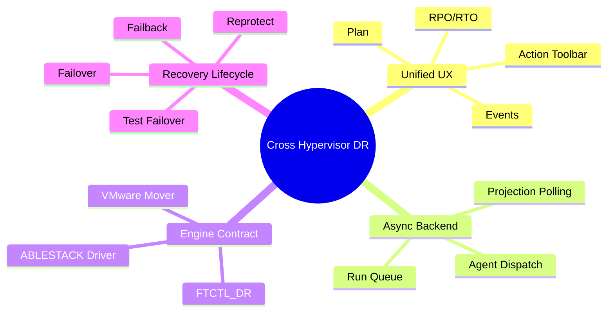
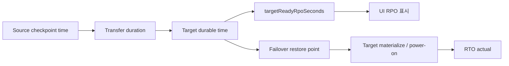

# Cross Hypervisor DR 기대효과, 장점 및 강점

문서 기준일: 2026-07-01

## 1. 기대효과

| 기대효과 | 설명 |
| --- | --- |
| 이기종 DR 운영 표준화 | ABLESTACK와 VMware 간 DR을 동일한 Plan, Run, Restore Point, Event 모델로 관리한다. |
| 운영자 작업 단순화 | UI에서 보호 설정, sync, test failover, failover, failback, reprotect를 같은 화면 흐름으로 수행한다. |
| 비동기 작업 안정성 | API가 장기 작업을 동기 대기하지 않아 UI가 멈추지 않고 다른 작업을 계속할 수 있다. |
| 상태 추적성 | Cloud DB와 ftctl runtime projection을 함께 사용해 실행 이력과 현재 상태를 추적한다. |
| 확장 가능한 데이터 엔진 | ABLESTACK driver와 VMware mover 계약을 분리해 provider별 복제 엔진을 교체/고도화할 수 있다. |

## 2. 기능 강점

| 강점 | 구체 내용 |
| --- | --- |
| UI와 API의 action gating 일치 | UI 버튼 표시와 API 실행 가능 여부가 모두 backend `actionEligibility`를 기준으로 한다. |
| Run 중심 비동기 처리 | `dr_run`이 작업 단위가 되어 retry, cancel, status projection이 가능하다. |
| Agent 위임 구조 | Cloud management가 직접 hypervisor 작업을 오래 수행하지 않고 host Agent로 위임한다. |
| projection 기반 상태 회수 | ftctl `dr-status`가 plan state, progress, checkpoint, RPO를 Cloud DB에 반영한다. |
| provider 확장성 | ABLESTACK, VMware, future provider driver를 같은 FTCTL_DR profile 계약으로 확장할 수 있다. |

## 3. 4개 방향 기능 비교

| 방향 | UI/API/Backend | 데이터 전송 | Failover/Failback | 운영 전 필수 확인 |
| --- | --- | --- | --- | --- |
| ABLESTACK -> VMware | 연결됨 | VMware mover 필요 | 상태 projection 연결, 실제 VMware lifecycle hook 필요 | VDDK, mover, target VM materialize |
| VMware -> VMware | 연결됨 | VMware mover 필요 | reverse도 mover 필요 | source/target vCenter credential, CBT, power-on hook |
| ABLESTACK -> ABLESTACK | 연결됨 | 현재 full seed 반복, delta 개선 필요 | 상태 projection 연결, target VM lifecycle hook 필요 | disk mapping, full copy 시간, target disk 준비 |
| VMware -> ABLESTACK | 연결됨 | VMware mover + ABLESTACK target write 필요 | reverse mover 필요 | VDDK, mover, target disk/VM lifecycle |

## 4. RPO/RTO 관점 요약

| 관점 | 강점 | 현재 한계 |
| --- | --- | --- |
| RPO 측정 | ftctl checkpoint와 Cloud projection으로 target-ready RPO를 표시할 수 있다. | ABLESTACK -> ABLESTACK은 full seed 반복이라 낮은 RPO 보장이 어렵다. VMware 방향은 mover 품질에 좌우된다. |
| RTO 측정 | failover session에 `rto_actual_seconds`를 기록한다. | 실제 VM power-on이 delegated라 provider lifecycle hook이 없으면 실측 RTO와 서비스 복구 RTO가 분리된다. |
| Planned failover | final checkpoint를 통해 손실을 줄이는 구조가 있다. | final checkpoint도 mover 또는 ABLESTACK copy 성능에 의존한다. |
| Disaster failover | 최신 target-ready restore point로 source 없이 복구 상태 전환 가능 | target VM materialize 자동화가 없으면 운영자가 별도 복구 단계를 수행해야 한다. |

## 5. 전략적 장점

1. 기존 FTCTL/Cloud 통합 자산을 활용하면서 Cross Hypervisor DR로 확장할 수 있다.
2. UI/API/Backend/Agent/ftctl의 책임이 분리되어 운영 장애 분석 지점이 명확하다.
3. V2K를 DR 엔진으로 오용하지 않고, 지속 복제 전용 mover 계약을 분리한 구조라 장기적으로 더 안전하다.
4. RPO/RTO를 Cloud projection에 올리는 구조이므로 SLA dashboard나 알림 기능으로 확장하기 쉽다.
5. provider driver를 단계적으로 고도화할 수 있다. 예를 들어 ABLESTACK full seed를 dirty-bitmap/RBD diff 기반으로 교체하고, VMware mover를 CBT incremental로 강화할 수 있다.

## 6. 배포 전 확인해야 할 남은 보강 포인트

| 우선순위 | 보강 포인트 | 이유 |
| --- | --- | --- |
| P0 | VMware mover 실제 구현/배포 | VMware 포함 3개 방향의 지속 복제 필수 조건이다. |
| P0 | Provider lifecycle hook | failover/test failover 시 실제 VM 생성, register, power-on을 자동화해야 운영 RTO가 의미를 가진다. |
| P1 | ABLESTACK delta replication | full seed 반복으로는 큰 VM의 RPO 목표를 만족하기 어렵다. |
| P1 | FTCTL_DR용 fence confirm adapter | 현재 `confirmDrFenceClear`는 FTCTL_DR에서 adapter 단절 후보가 있다. |
| P2 | UI에서 delegated lifecycle 상태 표시 | `POWER_ON_DELEGATED`일 때 운영자가 다음 조치를 명확히 알 수 있어야 한다. |
