# Cross Hypervisor DR Operator Guide

> 2026-08-06 VMware -> ABLESTACK 실제 Failover 최종 권한 확정은 문서 599의
> typed cutover commit, FTCTL ACK, ACK 후 Cloud terminal transaction 순서를
> 따른다. 대상 VM Running만으로 Failover 완료를 판정하지 않는다.

문서 기준일: 2026-07-01
검토 기준 소스: Cloud `bb8857cbc3`, ftctl/qemu-exec-tools `a25443d`

> 2026-07-31 운영 보정: FTCTL_DR에서는 `원본 사이트 격리 해제 확인`을
> 별도로 실행하지 않는다. 원래 사이트 복귀는 `페일백`, 현재 사이트 계속
> 운영은 `현재 운영 사이트에서 재보호`를 사용하며 source isolation은 내부
> preflight가 자동 확인한다. 기술 기준은 문서 587이다.

이 통합 문서는 요청된 6개 Markdown 문서를 PDF 변환용으로 순서대로 묶은 것이다.

---

# Cross Hypervisor DR 기능 개요, 목표, 구성, 사전 조건 및 설정 절차

문서 기준일: 2026-07-01  
검토 기준 소스: Cloud `bb8857cbc3`, ftctl/qemu-exec-tools `a25443d`

## 1. 기능 개요

Cross Hypervisor DR은 ABLESTACK KVM 워크로드와 VMware 워크로드를 하나의 DR 제어 모델로 보호하기 위한 기능이다. 운영자는 Cloud UI에서 사이트, 보호 계획, 복제 상태, 복구 지점, Run 이력을 확인하고 액션을 요청한다. Cloud API와 백엔드는 요청을 장기 동기 작업으로 처리하지 않고 `dr_run`으로 기록한 뒤 Agent를 통해 각 호스트의 ftctl DR runtime에 전달한다.

핵심 원칙은 다음과 같다.

| 원칙 | 설명 |
| --- | --- |
| UI는 API만 호출 | UI는 libvirt, vCenter, ftctl을 직접 호출하지 않는다. |
| API는 비동기 Run 생성 | API는 `dr_run`, `dr_run_step`, `dr_event`를 기록하고 즉시 응답한다. |
| 백엔드는 Agent에 위임 | `DrRunDispatcher`가 Agent Command를 전달하고 장기 작업은 ftctl이 수행한다. |
| 상태는 projection으로 회수 | Cloud는 `FtctlDrStatusCommand`로 ftctl runtime 상태를 읽어 Plan, Run, Restore Point, Replica projection을 갱신한다. |
| 데이터 경로는 엔진 책임 | ABLESTACK 경로는 ftctl ABLESTACK driver가, VMware 포함 경로는 VDDK/CBT 기반 mover가 수행해야 한다. |

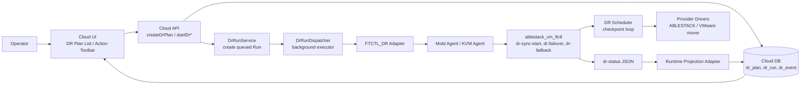

## 2. 목표

| 목표 | 구현/운영 기준 |
| --- | --- |
| 4개 방향 동일 UI/백엔드 모델 | `KVM_TO_VMWARE`, `VMWARE_TO_VMWARE`, `KVM_TO_KVM`, `VMWARE_TO_KVM` 모두 `FTCTL_DR` 엔진 계약으로 표현한다. |
| 비동기 작업 처리 | UI/API는 장기 복제, failover, failback을 동기 대기하지 않는다. |
| 지속 복제 기반 RPO 관리 | ftctl scheduler가 checkpoint를 생성하고 Cloud가 `targetReadyRpoSeconds`를 표시한다. |
| 복구 액션 일관화 | Test Failover, Failover, Failback, Reprotect, Release를 동일 Run/Projection 모델로 관리한다. |
| 운영자가 추적 가능한 상태 | Run, Step, Event, Restore Point, Replica projection을 UI에서 조회할 수 있다. |

## 3. 전체 구성 요소

| 계층 | 주요 소스/명령 | 역할 |
| --- | --- | --- |
| UI | `DrPlanList.vue`, `DrActionToolbar.vue` | 계획 생성, 상태 조회, 액션 버튼, polling |
| UI API wrapper | `ui/src/api/dr.js` | `createDrPlan`, `startDrSync`, `startDrFailover`, `startDrFailback` 등 API 호출 |
| Cloud API | `command/admin/dr/*Cmd.java` | 요청 파라미터 검증, action eligibility 확인, Run 응답 |
| Cloud DB | `dr_site`, `dr_site_credential`, `dr_plan`, `dr_replica`, `dr_restore_point`, `dr_run`, `dr_run_step`, `dr_event` | 사이트 인증정보, 계획, 실행, 이벤트, 복구 지점, replica 상태 저장 |
| Orchestrator | `DrRunServiceImpl`, `DrOrchestratorImpl`, `DrRunExecutorImpl` | Run 생성, 비동기 dispatch, adapter 실행, projection refresh |
| Adapter | `FtctlDrUnifiedActionAdapter`, `FtctlDrRuntimeProjectionAdapter` | FTCTL_DR profile 생성, Agent action/status command 전송 |
| Agent wrapper | `LibvirtFtctlDrActionCommandWrapper`, `LibvirtFtctlDrStatusCommandWrapper` | `ablestack_vm_ftctl` CLI 실행과 JSON answer 변환 |
| ftctl runtime | `ablestack_vm_ftctl.sh`, `dr_runtime.sh`, `dr_scheduler.sh` | DR action 수락, scheduler loop, status 출력, failover/failback 상태 관리 |
| ftctl drivers | `dr_ablestack.sh`, `dr_vmware.sh` | ABLESTACK disk copy, VMware VDDK/CBT mover 계약 |

## 4. 상태 및 데이터 모델

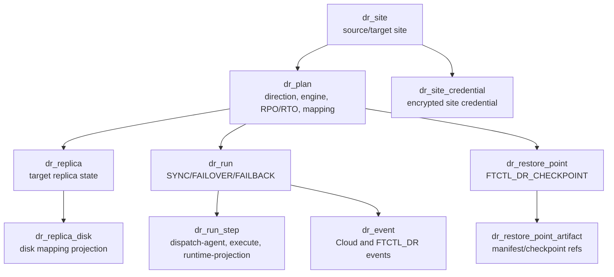

Plan의 핵심 필드는 다음과 같다.

| 필드 | 의미 |
| --- | --- |
| `direction` | `KVM_TO_VMWARE`, `VMWARE_TO_VMWARE`, `KVM_TO_KVM`, `VMWARE_TO_KVM` 중 하나 |
| `engineType`, `engineBindingType` | 완전 DR 경로는 `FTCTL_DR` 사용 |
| `sourceWorkerHostId`, `targetWorkerHostId`, `coordinatorWorkerHostId` | Agent command를 받을 작업 호스트 |
| `mappingJson` | disk, datastore, network, VM reference 등 데이터 경로 계약 |
| `scheduleJson` | scheduler interval, cycle 정책 |
| `lastSourceCheckpointAt`, `lastTargetDurableAt`, `targetReadyRpoSeconds` | RPO projection |
| `activeSide` | `SOURCE` 또는 `TARGET` |

## 5. 사용 사전 조건

### 공통 조건

| 항목 | 조건 |
| --- | --- |
| Cloud DR plugin | DR API, DAO, Spring component, DB upgrade가 배포되어 있어야 한다. |
| Cloud UI | 활성 UI bundle에 `cross-dr`, `createDrPlan`, `startDrFailover`, `pollRuns` marker가 있어야 한다. |
| Mold Agent | KVM Agent에 `FtctlDrActionCommand`, `FtctlDrStatusCommand` wrapper가 포함되어야 한다. |
| ftctl package | 대상 호스트에 `ablestack_vm_ftctl` DR runtime, scheduler, drivers가 설치되어야 한다. |
| 작업 호스트 | Plan에 coordinator 또는 source/target worker host 중 하나 이상이 지정되어야 한다. |
| 사이트 인증정보 | UI에서 Mold/vCenter 접속 정보를 입력하고 Cloud backend가 암호화 저장해야 한다. UI는 credential reference를 요구하지 않는다. |
| Disk mapping | 각 disk의 source/target reference, format, size, target type이 `mappingJson`으로 제공되어야 한다. |

### ABLESTACK 포함 조건

| 항목 | 조건 |
| --- | --- |
| Source disk 접근 | KVM host에서 source RBD, block device, qcow2 path를 읽을 수 있어야 한다. |
| Target disk 준비 | target RBD pool, block device, qcow2 directory가 준비되어야 한다. |
| qemu-img | full seed 및 file/block/rbd copy에 필요한 `qemu-img`가 있어야 한다. |

### VMware 포함 조건

| 항목 | 조건 |
| --- | --- |
| vCenter 정보 | source/target VM ref, datastore, folder, resource pool, network mapping이 필요하다. |
| vCenter 인증정보 | vCenter URL, username, password가 DR Site에 등록되어야 한다. 응답과 화면에는 secret 원문을 표시하지 않는다. |
| VDDK/CBT capability | `nbdkit vddk` 또는 `vmware-vdiskmanager` 등 VDDK 계열 도구가 필요하다. |
| VMware mover | `FTCTL_DR_VMWARE_MOVER`로 지정되는 실제 데이터 전송 엔진이 필요하다. 없으면 `DR_VMWARE_MOVER_UNAVAILABLE`로 중단된다. |
| Lifecycle hook | VMware/ABLESTACK VM materialize, register, power-on은 현재 ftctl runtime에서 `POWER_ON_DELEGATED`로 기록되므로 mover 또는 provider hook이 실제 수행해야 한다. |

## 6. 설정 절차

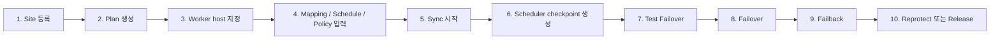

1. DR Site를 등록한다. Source와 Target site의 hypervisor type은 방향과 일치해야 하며, 사이트 유형에 맞는 Mold/vCenter 인증정보를 입력한다. Cloud backend는 이를 암호화 저장한다.
2. DR Plan을 생성한다. 완전 DR 경로는 `engineType=FTCTL_DR`, `engineBindingType=FTCTL_DR`를 사용한다.
3. Worker host를 지정한다. 최소 coordinator host가 필요하며 ABLESTACK 방향에서는 source/target worker도 지정하는 것이 안전하다.
4. Disk mapping과 target mapping을 입력한다.
5. `startDrSync`를 실행한다. Cloud는 Run을 생성하고 Agent에 `dr-sync-start --wait=false --json`을 전달한다.
6. ftctl scheduler가 checkpoint를 생성하고 Cloud projection이 `dr_restore_point`와 RPO 상태를 갱신한다.
7. Target ready 상태에서 `startDrTestFailover`를 실행해 복구 지점 기반 테스트 세션을 만든다.
8. Planned 또는 Disaster 모드로 `startDrFailover`를 실행한다. Planned 모드는 final checkpoint를 시도한다.
9. Source 복구 후 `startDrFailback`을 실행한다.
10. Target 기준 보호를 유지하려면 `startDrReprotect`, 보호를 종료하려면 `releaseDrProtection`을 실행한다.

## 7. 소스 검토로 확인한 연결 상태와 단절 후보

| 구분 | 판정 | 근거/주의점 |
| --- | --- | --- |
| UI -> API | 연결됨 | `DrPlanList.vue`, `DrActionToolbar.vue`, `dr.js`가 계획/액션 API를 호출한다. |
| API -> Run DB | 연결됨 | `AbstractDrPlanActionCmd`가 eligibility 확인 후 `DrRunService.startRun`을 호출한다. |
| Run -> Agent | 연결됨 | `DrRunExecutorImpl`이 background executor에서 `FtctlDrUnifiedActionAdapter`를 실행한다. |
| Agent -> ftctl | 연결됨 | Agent wrapper가 `ablestack_vm_ftctl dr-* --wait=false --json`을 실행한다. |
| ftctl -> Cloud 상태 회수 | 연결됨 | `FtctlDrRuntimeProjectionAdapter`가 `dr-status`를 읽어 plan/run/restore point/replica를 갱신한다. |
| ABLESTACK disk copy | 부분 구현 | 현재 scheduler cycle은 `qemu-img convert` full seed를 반복한다. 진짜 block delta 기반 지속 복제는 추가 개선 대상이다. |
| VMware data plane | 외부 엔진 필요 | `FTCTL_DR_VMWARE_MOVER` 없이는 `DR_VMWARE_MOVER_UNAVAILABLE`이다. V2K는 사용하지 않는다. |
| 실제 VM power-on/promotion | provider hook 필요 | ftctl runtime은 `POWER_ON_DELEGATED`로 기록한다. 실제 VM materialize와 power-on hook이 운영 배포에 포함되어야 한다. |
| `confirmDrFenceClear` for FTCTL_DR | 단절 후보 | UI/API eligibility는 열릴 수 있으나 `FENCE_CONFIRM`은 fencing adapter로 라우팅되고 현재 확인된 adapter는 legacy `FTCTL` 경로다. |
| `adoptDrReplica` for FTCTL_DR | 닫힌 흐름 | eligibility가 legacy `FTCTL`로 제한되어 있어 FTCTL_DR 일반 액션에는 포함되지 않는다. |

---

# ABLESTACK -> VMware DR 아키텍처, 시퀀스, 기능 및 단계별 태스크

문서 기준일: 2026-07-01  
방향: `KVM_TO_VMWARE`  
권장 엔진: `FTCTL_DR`

## 1. 아키텍처

ABLESTACK 운영 VM을 VMware DR site로 보호하는 방향이다. Cloud는 ABLESTACK VM과 disk 정보를 source로 관리하고, target vCenter 정보와 VMDK/datastore/network mapping을 Plan에 저장한다. 실제 VMware 데이터 이동과 target VM lifecycle은 VDDK/CBT 기반 VMware mover가 수행해야 한다.

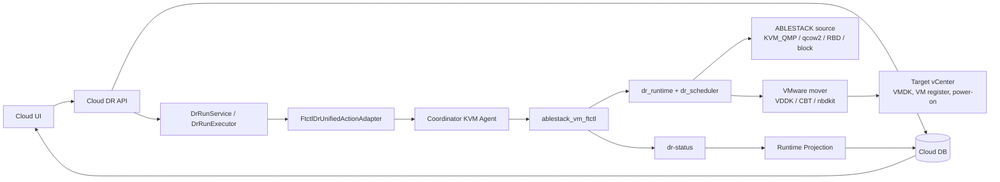

## 2. 기능 범위

| 기능 | 현재 흐름 |
| --- | --- |
| 보호 설정 | UI create plan -> Cloud DB `dr_plan` -> worker binding -> mapping 저장 |
| Sync 시작 | `startDrSync` -> Run 생성 -> Agent `dr-sync-start` -> ftctl scheduler 시작 |
| 지속 복제 | VMware 포함 방향이므로 scheduler cycle은 `ftctl_dr_vmware_replication_cycle`을 호출한다. |
| Restore Point | mover가 checkpoint/manifest를 만들고 ftctl이 restore-points JSONL과 Cloud projection으로 반영한다. |
| Test Failover | target-ready restore point를 선택해 test session과 artifact 상태를 생성한다. 실제 VMware test VM 생성은 mover/lifecycle hook 책임이다. |
| Failover | planned mode는 final checkpoint를 시도하고 target active 상태를 기록한다. target power-on은 `POWER_ON_DELEGATED`로 기록된다. |
| Failback | reverse profile을 만들어 VMware -> ABLESTACK 방향 reverse checkpoint를 수행한다. |
| Reprotect | target을 active side로 둔 reverse protection checkpoint를 시작한다. |

## 3. 시퀀스

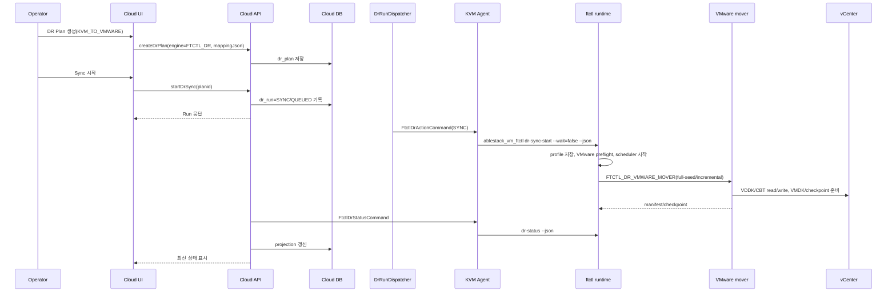

## 4. 단계별 태스크

| 단계 | Operator/UI 태스크 | Backend/Agent/ftctl 태스크 |
| --- | --- | --- |
| 1. Site 등록 | Source ABLESTACK site, Target VMware site 등록. UI에서 Mold/vCenter 인증정보 입력 | `dr_site`와 암호화된 `dr_site_credential` 저장 |
| 2. Plan 작성 | 방향 `KVM_TO_VMWARE`, 엔진 `FTCTL_DR`, RPO/RTO, mapping 입력 | `DrPlanServiceImpl`이 topology와 engine을 검증 |
| 3. Worker 지정 | coordinator/source worker host 선택 | Adapter가 coordinator host id를 Agent command 대상으로 사용 |
| 4. Mapping 입력 | source disk, target datastore/VMDK/network/resource pool 지정 | `mappingJson`이 ftctl profile의 `mapping`으로 전달 |
| 5. Sync 시작 | `Start Sync` 클릭 | Cloud Run 생성, Agent `dr-sync-start`, ftctl VMware preflight |
| 6. 지속 복제 | UI에서 RPO와 checkpoint 확인 | scheduler가 mover를 반복 호출하고 restore point 생성 |
| 7. Test Failover | restore point 선택 후 test failover | ftctl test session 생성, provider hook이 test VM 생성 수행 필요 |
| 8. Failover | planned/disaster 선택 | planned는 final checkpoint, target active 상태 projection |
| 9. Failback | source 복구 후 failback | reverse profile로 VMware -> ABLESTACK checkpoint 수행 |
| 10. Reprotect/Release | target 기준 재보호 또는 보호 해제 | `dr-reprotect` 또는 `dr-release` 실행 |

## 5. RPO/RTO 분석

| 항목 | 분석 |
| --- | --- |
| RPO | scheduler interval, VDDK/CBT delta 추출 시간, target VMDK commit 시간이 합쳐진다. Cloud는 `targetReadyRpoSeconds`를 기준으로 표시한다. |
| RTO | restore point 선택, final checkpoint 여부, VMware target VM materialize/register/power-on 시간이 지배한다. |
| planned failover | final checkpoint가 성공해야 RPO가 가장 낮다. mover 미배치 시 `DR_VMWARE_MOVER_UNAVAILABLE`로 실패한다. |
| disaster failover | source final checkpoint를 건너뛰고 최신 target-ready restore point로 전환한다. |

## 6. 소스 검토 결과와 운영 전 확인 사항

| 항목 | 판정 |
| --- | --- |
| UI/API/Run/Agent/ftctl 제어 경로 | 연결됨 |
| VMware 데이터 전송 | `FTCTL_DR_VMWARE_MOVER` 외부 엔진 필요 |
| V2K 사용 | 사용하지 않는 것이 맞다. V2K는 migration 도구이며 이 DR 경로의 지속 복제 엔진으로 쓰지 않는다. |
| 실제 VMware VM power-on | 현재 runtime은 `POWER_ON_DELEGATED`를 기록한다. mover 또는 provider lifecycle hook으로 구현/배포되어야 한다. |
| 흐름 단절 위험 | mover/hook 미배치 시 UI와 Cloud Run은 생성되지만 데이터 복제와 target VM 활성화는 완료되지 않는다. |

---

# VMware -> VMware DR 아키텍처, 시퀀스, 기능 및 단계별 태스크

문서 기준일: 2026-07-01  
방향: `VMWARE_TO_VMWARE`  
권장 엔진: `FTCTL_DR`

## 1. 아키텍처

VMware 운영 VM을 다른 VMware DR site로 보호하는 방향이다. ABLESTACK Cloud는 orchestration controller로 동작하고, 데이터 전송은 vCenter/VDDK/CBT를 다루는 VMware mover가 수행한다. KVM Agent는 ftctl coordinator 역할을 하며 실제 VMware API와 VMDK 처리는 mover 계약에 위임된다.

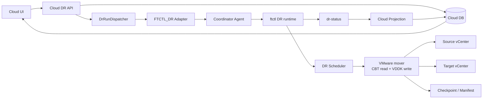

## 2. 기능 범위

| 기능 | 현재 흐름 |
| --- | --- |
| 보호 설정 | VMware source/target site와 VM/VMDK/datastore mapping을 `dr_plan.mappingJson`에 저장 |
| Sync 시작 | `dr-sync-start`가 VMware preflight 후 scheduler를 시작 |
| 지속 복제 | `ftctl_dr_vmware_replication_cycle`이 mover를 호출해 full-seed 또는 incremental checkpoint 생성 |
| Restore Point | mover output을 manifest/checkpoint로 저장하고 Cloud projection이 `dr_restore_point`를 생성 |
| Test Failover | restore point를 기준으로 test session을 만든다. target test VM 생성은 mover/lifecycle hook 책임 |
| Failover | planned final checkpoint 후 target active projection. 실제 vCenter power-on은 delegated |
| Failback | reverse direction도 VMware -> VMware이며 reverse checkpoint를 수행 |
| Reprotect | target side를 기준으로 지속 복제를 재개 |

## 3. 시퀀스

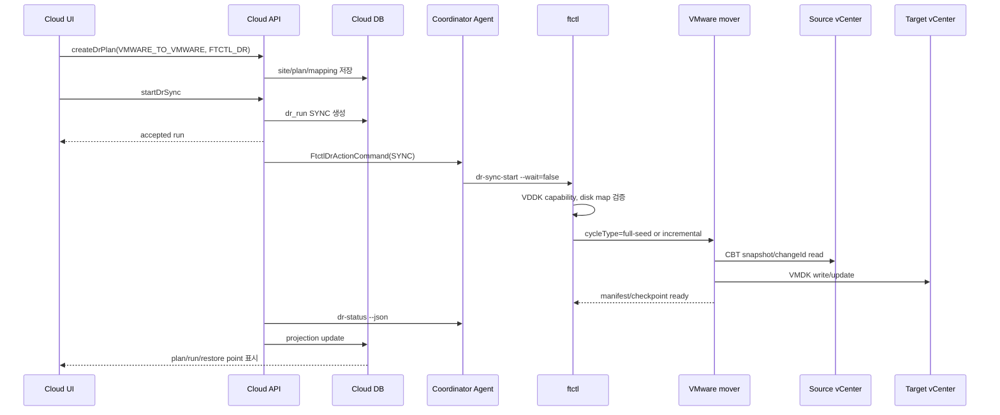

## 4. 단계별 태스크

| 단계 | Operator/UI 태스크 | Backend/Agent/ftctl 태스크 |
| --- | --- | --- |
| 1. VMware sites 등록 | source vCenter, target vCenter site 등록. UI에서 각 vCenter URL/username/password 입력 | `dr_site.hypervisorType=VMWARE`, `dr_site_credential.credential_type=VCENTER` |
| 2. Plan 생성 | `VMWARE_TO_VMWARE`, `FTCTL_DR`, sourceExternalRef, mapping 입력 | 방향과 site hypervisor 검증 |
| 3. Hook/mapping 준비 | datastore, network, resource pool 지정 | 저장 credential은 backend에서 resolve하고 host에는 `/run` credential file로만 전달. profile/log에는 평문 잔류 금지 |
| 4. Sync 시작 | Start Sync | Agent가 ftctl `dr-sync-start` 실행 |
| 5. Preflight | UI에서 오류 여부 확인 | ftctl이 VDDK capability와 disk map을 검증 |
| 6. 지속 checkpoint | RPO, restore point 확인 | mover가 CBT delta를 target VMDK에 적용 |
| 7. Test Failover | test failover 실행 | target test VM 생성은 mover/lifecycle hook에서 수행 |
| 8. Failover | planned 또는 disaster failover | final checkpoint 후 active side를 TARGET으로 projection |
| 9. Failback | 원 site 복구 후 failback | reverse checkpoint와 source promotion 상태 기록 |
| 10. Reprotect | target 운영 기준 재보호 | reverse profile 기반 scheduler 재시작 |

## 5. RPO/RTO 분석

| 항목 | 분석 |
| --- | --- |
| RPO | VMware CBT snapshot 주기, mover 실행 시간, target datastore write latency에 좌우된다. |
| RTO | target VM register/reconfigure/power-on 시간과 네트워크 전환 절차가 지배한다. |
| 장점 | source와 target 모두 VMware이므로 CBT 기반 incremental 설계가 가장 자연스럽다. |
| 위험 | mover가 없으면 Cloud/ftctl 제어 루프만 동작하고 실제 데이터 경로는 실행되지 않는다. |

## 6. 소스 검토 결과와 운영 전 확인 사항

| 항목 | 판정 |
| --- | --- |
| UI/API/Run/Agent/ftctl 제어 경로 | 연결됨 |
| VMware preflight | VDDK 도구 부재 시 `DR_MISSING_VDDK`로 fail-fast |
| VMware mover | 필수. 없으면 scheduler cycle이 `DR_VMWARE_MOVER_UNAVAILABLE` 반환 |
| 실제 VM lifecycle | `POWER_ON_DELEGATED`로 기록되므로 target vCenter VM 생성/전원 제어 hook 필요 |
| Failback/Reprotect | reverse profile 생성 로직은 존재하지만 reverse VMware copy도 동일 mover가 책임져야 한다. |

---

# ABLESTACK -> ABLESTACK DR 아키텍처, 시퀀스, 기능 및 단계별 태스크

문서 기준일: 2026-07-01  
방향: `KVM_TO_KVM`  
권장 엔진: `FTCTL_DR`

## 1. 아키텍처

ABLESTACK 운영 VM을 ABLESTACK DR site로 보호하는 방향이다. source와 target 모두 KVM/ABLESTACK이므로 ftctl ABLESTACK driver가 disk mapping을 canonicalize하고 target RBD/file/block device를 준비한 뒤 `qemu-img convert` 기반 seed/checkpoint를 수행한다.

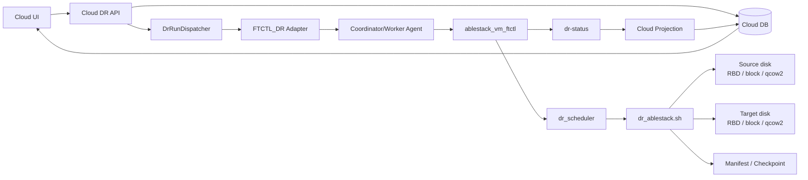

## 2. 기능 범위

| 기능 | 현재 흐름 |
| --- | --- |
| 보호 설정 | ABLESTACK source VM과 target disk mapping을 Plan에 저장 |
| Target 준비 | target RBD create, block size check, qcow2 create를 수행 |
| Sync 시작 | `dr-sync-start` 후 scheduler가 checkpoint loop를 시작 |
| 지속 복제 | 현재 구현은 매 cycle `qemu-img convert` full seed를 수행한다. |
| Restore Point | full seed 완료 시 manifest/checkpoint와 RPO projection 생성 |
| Test Failover | target-ready restore point로 test artifact/session 생성 |
| Failover | final checkpoint 선택 후 active side를 TARGET으로 전환 |
| Failback | reverse profile로 target -> source checkpoint 수행 |
| Reprotect | reverse direction으로 지속 복제를 재개 |

## 3. 시퀀스

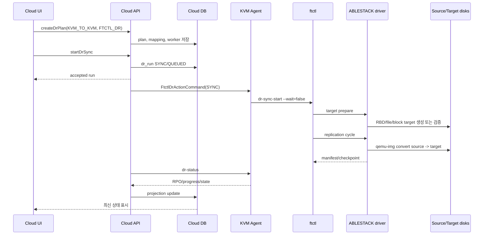

## 4. 단계별 태스크

| 단계 | Operator/UI 태스크 | Backend/Agent/ftctl 태스크 |
| --- | --- | --- |
| 1. Site 등록 | 운영 ABLESTACK site와 DR ABLESTACK site 등록. UI에서 각 Mold API URL/API Key/Secret Key 입력 | `dr_site.hypervisorType=KVM`, `dr_site_credential.credential_type=MOLD_API` |
| 2. Plan 생성 | `KVM_TO_KVM`, `FTCTL_DR`, source VM, RPO/RTO 입력 | topology와 duplicate plan 검증 |
| 3. Disk mapping | source disk path와 target path/type/format/size 지정 | `dr_ablestack_canonicalize_profile`로 disk map 생성 |
| 4. Worker 지정 | source/target/coordinator host 지정 | coordinator가 Agent command를 받음 |
| 5. Sync 시작 | Start Sync | target disk 준비, scheduler 시작 |
| 6. Checkpoint 확인 | UI에서 restore point와 RPO 확인 | 매 cycle manifest/checkpoint 생성 |
| 7. Test Failover | target restore point로 테스트 | test session/artifact 기록 |
| 8. Failover | planned/disaster 선택 | planned는 final checkpoint 후 TARGET active |
| 9. Failback | source 복구 후 failback | reverse profile, reverse checkpoint, SOURCE active |
| 10. Reprotect/Release | 재보호 또는 보호 해제 | scheduler control 또는 runtime release |

## 5. RPO/RTO 분석

| 항목 | 분석 |
| --- | --- |
| RPO | 현재 cycle이 full seed이므로 RPO는 scheduler interval보다 full copy 시간의 영향을 크게 받는다. 큰 disk에서는 목표 RPO를 만족하기 어렵다. |
| RTO | target disk가 준비되어 있고 restore point가 최신이면 failover 상태 전환은 빠르지만, 실제 VM lifecycle hook이 없으면 전원/등록 단계가 별도 작업으로 남는다. |
| 개선 포인트 | KVM block dirty bitmap, qcow2 backing chain, RBD diff/export-diff 등 delta 기반 복제 엔진을 추가해야 낮은 RPO를 안정적으로 만족한다. |

## 6. 소스 검토 결과와 운영 전 확인 사항

| 항목 | 판정 |
| --- | --- |
| UI/API/Run/Agent/ftctl 제어 경로 | 연결됨 |
| ABLESTACK target disk 준비 | 구현됨. RBD/file/block target 준비 경로가 있다. |
| 지속 복제 | 부분 구현. scheduler는 반복 실행되지만 현재 ABLESTACK cycle은 full seed copy이다. |
| 실제 VM lifecycle | runtime은 상태 projection 중심이며 실제 target VM power-on/provision hook은 운영 통합 필요 |
| 흐름 단절 위험 | disk mapping 누락 시 `WAITING_FOR_DISK_MAP`, full seed 장기화 시 RPO 악화 |

---

# VMware -> ABLESTACK DR 아키텍처, 시퀀스, 기능 및 단계별 태스크

문서 기준일: 2026-07-01  
방향: `VMWARE_TO_KVM`  

> 2026-08-10 CBT 보완: 실행 중인 원본 VM은 CBT 설정 저장 직후의 VM
> 요약 Boolean만으로 실패 처리하지 않는다. 정상 최초 복제 스냅샷에서
> 선택한 디스크별 change ID와 CBT 질의 성공을 확인해 활성 상태를
> 판정한다. 이 과정은 비동기이며 원본 VM을 자동 종료하지 않는다.
권장 엔진: `FTCTL_DR`

## 1. 아키텍처

VMware 운영 VM을 ABLESTACK DR site로 보호하는 방향이다. source VMware VMDK/CBT를 읽고 target ABLESTACK disk(RBD, block, qcow2)에 반영해야 하므로 VMware mover와 ABLESTACK target 준비 로직이 함께 필요하다. V2K는 이관용 도구이므로 이 DR 지속 복제 경로에서는 사용하지 않는다.

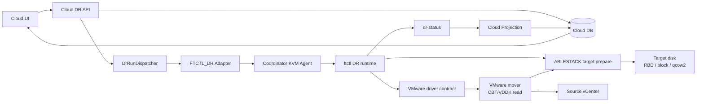

## 2. 기능 범위

| 기능 | 현재 흐름 |
| --- | --- |
| 보호 설정 | VMware source VM ref와 ABLESTACK target disk mapping을 Plan에 저장 |
| Sync 시작 | VMware preflight와 ABLESTACK disk map 준비 후 scheduler 시작 |
| 지속 복제 | VMware mover가 CBT/VDDK delta를 읽어 ABLESTACK target disk에 반영해야 한다. |
| Restore Point | mover와 ftctl scheduler가 manifest/checkpoint/RPO를 생성 |
| Test Failover | ABLESTACK target restore point 기반 test session 생성 |
| Failover | target ABLESTACK active projection. 실제 VM 생성/전원 제어는 provider lifecycle hook 필요 |
| Failback | reverse profile로 ABLESTACK -> VMware checkpoint 수행 |
| Reprotect | target ABLESTACK 운영 기준으로 reverse protection 시작 |

## 3. 시퀀스

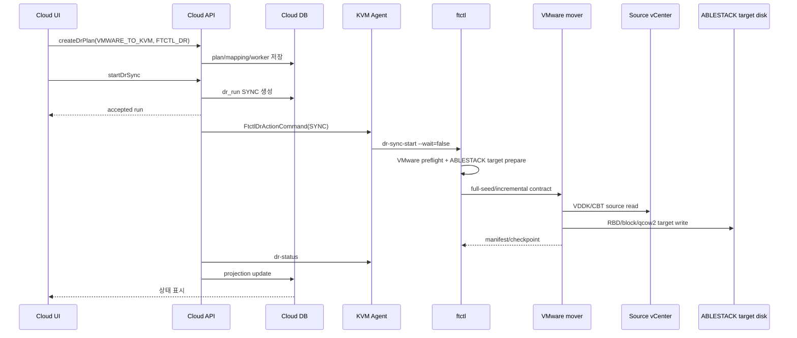

## 4. 단계별 태스크

| 단계 | Operator/UI 태스크 | Backend/Agent/ftctl 태스크 |
| --- | --- | --- |
| 1. Site 등록 | Source VMware site, Target ABLESTACK site 등록. UI에서 vCenter 인증정보와 Mold API 인증정보 입력 | source hypervisor VMWARE, target hypervisor KVM 검증, `dr_site_credential` 암호화 저장 |
| 2. Plan 생성 | `VMWARE_TO_KVM`, `FTCTL_DR`, sourceExternalRef, target mapping 입력 | `DrPlanServiceImpl`이 engine/direction topology 검증 |
| 3. VMware 설정 | VM/VMDK ref, CBT/VDDK 조건 준비 | 저장된 vCenter credential로 ftctl VMware preflight 수행 |
| 4. ABLESTACK target 설정 | target RBD/qcow2/block path와 size 지정 | target disk create/check 수행 |
| 5. Sync 시작 | Start Sync | Agent `dr-sync-start`, scheduler 시작 |
| 6. Checkpoint 확인 | RPO와 restore point 확인 | mover가 checkpoint 생성, projection 반영 |
| 7. Test Failover | target restore point로 test failover | ABLESTACK test VM lifecycle hook 필요 |
| 8. Failover | planned/disaster failover | target active projection, final checkpoint 선택 |
| 9. Failback | source VMware 복구 후 failback | reverse ABLESTACK -> VMware mover 필요 |
| 10. Reprotect | ABLESTACK 운영 기준 재보호 | reverse profile 기반 scheduler 시작 |

## 5. RPO/RTO 분석

| 항목 | 분석 |
| --- | --- |
| RPO | source VMware CBT delta 추출 시간과 ABLESTACK target write 시간이 합쳐진다. |
| RTO | ABLESTACK target VM 생성, disk attach, network mapping, power-on 시간이 지배한다. |
| V2K 판단 | V2K는 one-shot migration/convert 도구 성격이라 지속 checkpoint, failback, reprotect 요구를 만족하지 못한다. |
| 필수 엔진 | VMware mover가 source CBT read와 target ABLESTACK write를 모두 수행해야 한다. |

## 6. 소스 검토 결과와 운영 전 확인 사항

| 항목 | 판정 |
| --- | --- |
| UI/API/Run/Agent/ftctl 제어 경로 | 연결됨 |
| V2K 사용 여부 | Cloud UI에서 migration-only로 분리되어 있고 본 DR 경로에는 사용하지 않는 것이 맞다. |
| VMware source data plane | `FTCTL_DR_VMWARE_MOVER` 필수 |
| ABLESTACK target 준비 | target disk 준비 로직은 있으나 VMware mover가 target write까지 완결해야 한다. |
| 실제 VM lifecycle | ABLESTACK target VM materialize/power-on hook 필요 |
| 흐름 단절 위험 | mover/hook 미배치 시 Run은 accepted 후 status projection에서 오류 또는 delegated 상태로 남을 수 있다. |

---

# Cross Hypervisor DR 기대효과, 장점 및 강점

> Failover 운영 보완 (2026-07-27): VMware -> ABLESTACK 실제 Failover에서
> target VM은 완료 checkpoint의 identity, CBT 결과, NBD 정리 증거가 모두
> 확인된 뒤 Cloud가 시작한다. 일시적 증거 누락은 제한 재시도하고, target 시작
> 전 준비 실패는 source 전원을 자동 조작하지 않은 채 안전하게 정리한다.
> target가 이미 시작된 뒤에는 자동 rollback하지 않고 운영자 복구 상태로
> 전환한다.

문서 기준일: 2026-07-01

## 1. 기대효과

| 기대효과 | 설명 |
| --- | --- |
| 이기종 DR 운영 표준화 | ABLESTACK와 VMware 간 DR을 동일한 Plan, Run, Restore Point, Event 모델로 관리한다. |
| 운영자 작업 단순화 | UI에서 보호 설정, sync, test failover, failover, failback, reprotect를 같은 화면 흐름으로 수행한다. |
| 비동기 작업 안정성 | API가 장기 작업을 동기 대기하지 않아 UI가 멈추지 않고 다른 작업을 계속할 수 있다. |
| 상태 추적성 | Cloud DB와 ftctl runtime projection을 함께 사용해 실행 이력과 현재 상태를 추적한다. |
| 확장 가능한 데이터 엔진 | ABLESTACK driver와 VMware mover 계약을 분리해 provider별 복제 엔진을 교체/고도화할 수 있다. |

## 2. 기능 강점

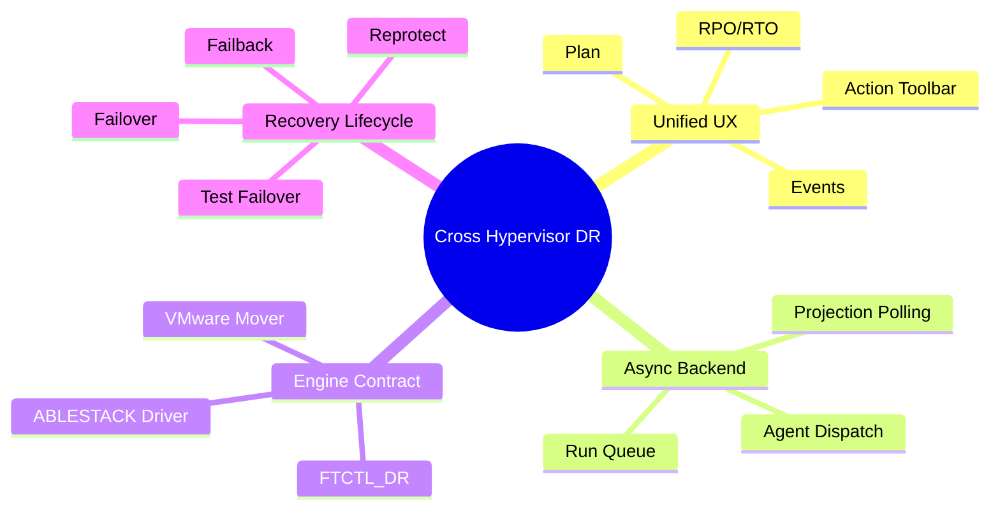

| 강점 | 구체 내용 |
| --- | --- |
| UI와 API의 action gating 일치 | UI 버튼 표시와 API 실행 가능 여부가 모두 backend `actionEligibility`를 기준으로 한다. |
| Run 중심 비동기 처리 | `dr_run`이 작업 단위가 되어 retry, cancel, status projection이 가능하다. |
| Agent 위임 구조 | Cloud management가 직접 hypervisor 작업을 오래 수행하지 않고 host Agent로 위임한다. |
| projection 기반 상태 회수 | ftctl `dr-status`가 plan state, progress, checkpoint, RPO를 Cloud DB에 반영한다. |
| provider 확장성 | ABLESTACK, VMware, future provider driver를 같은 FTCTL_DR profile 계약으로 확장할 수 있다. |

## 3. 4개 방향 기능 비교

| 방향 | UI/API/Backend | 데이터 전송 | Failover/Failback | 운영 전 필수 확인 |
| --- | --- | --- | --- | --- |
| ABLESTACK -> VMware | 연결됨 | VMware mover 필요 | 상태 projection 연결, 실제 VMware lifecycle hook 필요 | VDDK, mover, target VM materialize |
| VMware -> VMware | 연결됨 | VMware mover 필요 | reverse도 mover 필요 | source/target vCenter credential, CBT, power-on hook |
| ABLESTACK -> ABLESTACK | 연결됨 | 현재 full seed 반복, delta 개선 필요 | 상태 projection 연결, target VM lifecycle hook 필요 | disk mapping, full copy 시간, target disk 준비 |
| VMware -> ABLESTACK | 연결됨 | VMware mover + ABLESTACK target write 필요 | reverse mover 필요 | VDDK, mover, target disk/VM lifecycle |

## 4. RPO/RTO 관점 요약

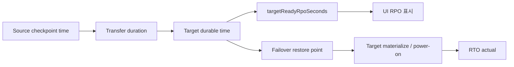

| 관점 | 강점 | 현재 한계 |
| --- | --- | --- |
| RPO 측정 | ftctl checkpoint와 Cloud projection으로 target-ready RPO를 표시할 수 있다. | ABLESTACK -> ABLESTACK은 full seed 반복이라 낮은 RPO 보장이 어렵다. VMware 방향은 mover 품질에 좌우된다. |
| RTO 측정 | failover session에 `rto_actual_seconds`를 기록한다. | 실제 VM power-on이 delegated라 provider lifecycle hook이 없으면 실측 RTO와 서비스 복구 RTO가 분리된다. |
| Planned failover | final checkpoint를 통해 손실을 줄이는 구조가 있다. | final checkpoint도 mover 또는 ABLESTACK copy 성능에 의존한다. |
| Disaster failover | 최신 target-ready restore point로 source 없이 복구 상태 전환 가능 | target VM materialize 자동화가 없으면 운영자가 별도 복구 단계를 수행해야 한다. |

## 5. 전략적 장점

1. 기존 FTCTL/Cloud 통합 자산을 활용하면서 Cross Hypervisor DR로 확장할 수 있다.
2. UI/API/Backend/Agent/ftctl의 책임이 분리되어 운영 장애 분석 지점이 명확하다.
3. V2K를 DR 엔진으로 오용하지 않고, 지속 복제 전용 mover 계약을 분리한 구조라 장기적으로 더 안전하다.
4. RPO/RTO를 Cloud projection에 올리는 구조이므로 SLA dashboard나 알림 기능으로 확장하기 쉽다.
5. provider driver를 단계적으로 고도화할 수 있다. 예를 들어 ABLESTACK full seed를 dirty-bitmap/RBD diff 기반으로 교체하고, VMware mover를 CBT incremental로 강화할 수 있다.

## 6. 배포 전 확인해야 할 남은 보강 포인트

| 우선순위 | 보강 포인트 | 이유 |
| --- | --- | --- |
| P0 | VMware mover 실제 구현/배포 | VMware 포함 3개 방향의 지속 복제 필수 조건이다. |
| P0 | Provider lifecycle hook | failover/test failover 시 실제 VM 생성, register, power-on을 자동화해야 운영 RTO가 의미를 가진다. |
| P1 | ABLESTACK delta replication | full seed 반복으로는 큰 VM의 RPO 목표를 만족하기 어렵다. |
| P1 | FTCTL_DR용 fence confirm adapter | 현재 `confirmDrFenceClear`는 FTCTL_DR에서 adapter 단절 후보가 있다. |
| P2 | UI에서 delegated lifecycle 상태 표시 | `POWER_ON_DELEGATED`일 때 운영자가 다음 조치를 명확히 알 수 있어야 한다. |

## 2026-07-19 VMware → ABLESTACK Test Failover 운영 모델 보정

영구 DR 대상 VM은 실제 Failover용으로 `Stopped` 상태를 유지한다. Test
Failover의 테스트 디스크와 VirtIO 준비는 FTCTL이 담당하지만, 임시 볼륨
등록과 임시 테스트 VM의 생성·기동·검증·삭제는 Cloud가 담당한다. FTCTL이
고객 테스트 VM을 직접 `virsh`로 정의하거나 실행하는 기존 설명은 폐기한다.

테스트 네트워크는 실제 Cloud 네트워크를 선택하며, NIC 없는 테스트는
`NO_NIC`로 명시한다. Cloud는 볼륨과 스토리지 풀에서 구조화한 canonical
locator를 Agent에 전달하고, Agent가 대상 호스트에서 검증한 뒤 FTCTL이
RBD clone 또는 안전한 파일 artifact를 만든다. FTCTL은 디스크 표시 이름으로
스토리지 종류나 경로를 추론하지 않는다. 테스트 작업 실패는 작업/세션
상태로 남고 정상적인 지속 복제 보호 상태를 덮어쓰지 않는다.

기본 수명주기 설계는 상위 `docs/ftctl`의
`561-cross-hypervisor-dr-cloud-managed-test-failover-lifecycle-design-20260719.md`,
canonical artifact와 상태 투영 보정은
`562-cross-hypervisor-dr-test-artifact-contract-and-projection-isolation-design-20260719.md`를 따른다.

## 2026-07-20 VMware -> ABLESTACK 테스트 페일오버 상태 보정

Cloud-managed 테스트 페일오버의 정상 완료 상태는
`DrRun(TEST_FAILOVER)=SUCCEEDED`와 `DrTestSession=ACTIVE`의 조합이다.
Run은 생성/부팅 검증이 끝난 유한 작업 이력이고, Test Session은 운영자가
테스트 환경을 정리할 때까지 유지되는 활성 수명주기다. FTCTL은 이 동안
`TEST_ARTIFACTS_READY`와 체크포인트 lease를 유지할 수 있으며, 이는 완료
실패가 아니다.

UI는 보호 상태, 테스트 실행 결과, 활성 테스트 환경을 분리해 표시한다.
Cloud projection은 `ACTIVE`를 `ARTIFACTS_READY`로 되돌리지 않으며,
materializer는 부팅 검증 직후 Run 완료를 직접 기록한다. 상세 설계는
`../563-cross-hypervisor-dr-test-failover-terminal-convergence-design-20260720.md`를
따른다.

## VMware -> ABLESTACK 보호 상태와 복제 활동 표시 보정 (2026-07-20)

첫 durable 복제본이 준비된 후의 주기적 증분 전송은 Plan을 다시 초기
`동기화 중`으로 만들지 않는다. UI는 `보호 상태=정상`, `복제 활동=복제 중`,
`Scheduler 상태=정상`을 독립적으로 표시한다.

복제본이 존재하더라도 Scheduler가 죽었거나 실제 worker와 제어 owner가 다르면
`보호 저하`로 표시하고 정상 cutover를 차단한다. pause/resume 실행 이력은
Scheduler의 수명주기와 구분한다. 규범 설계는
`../564-cross-hypervisor-dr-plan-scheduler-singleton-authority-design-20260720.md`를
따른다.

## VMware -> ABLESTACK 테스트 정리 이후 화면 해석 (2026-07-21)

완료된 `TEST_CLEANUP`은 작업 이력이며 현재 보호 동작이 아니다. 보호 정보는
현재 Scheduler 권위와 복제 Cycle을 기준으로 표시한다. 활성 유한 작업이
있으면 작업 진행 상태를, 활성 Cycle이 있으면 복제 진행 상태를, 둘 다 없으면
`보호 정상 / 복제 대기`를 표시한다.

따라서 완료된 정리 작업이 보호 정보의 대표 진행 카드에 남거나 그 작업의
종료 status 때문에 Scheduler/control 값이 `UNKNOWN`으로 바뀌면 정상 상태
표시가 아니다. 캐시와 UI는 Plan runtime, active Run, latest operation Run,
current/latest completed Cycle을 분리해야 한다. 상세 계약은 상위
`docs/ftctl`의
`566-cross-hypervisor-dr-current-protection-activity-and-operation-history-projection-design-20260721.md`를
따른다.

## VMware -> ABLESTACK 실제 페일오버 cutover 절차 보정 (2026-07-22)

실제 페일오버는 원본 VMware 가상머신을 삭제하지 않는다. 계획 페일오버는
원본 정지/격리와 마지막 증분 반영을 수행하고, 재해 페일오버는 운영자의 원본
격리 확인과 최신 내구 체크포인트를 사용한다.

실행 전에는 체크포인트/RPO, 원본 격리, Windows 또는 Linux 게스트 정보,
EFI/Secure Boot, 대상 디스크와 스토리지, 기존 대상 가상머신 상태를 읽기
전용으로 검증한다. 실행은 비동기로 진행되며 `사전 검증 -> 원본 격리 ->
체크포인트 확정 -> 게스트 준비 -> CUTOVER_READY -> Cloud 대상 VM 기동 ->
부팅 검증 -> TARGET 활성화` 순서를 따른다.

FTCTL은 데이터와 게스트 준비를 담당하고 Cloud는 대상 가상머신의 수명주기와
활성 사이트 전환을 담당한다. 부팅 검증 전 실패 시 활성 사이트는 SOURCE에
남고, 대상 가상머신은 정지되며, 데이터와 체크포인트는 재시도를 위해 보존된다.
원본은 자동 삭제 또는 자동 시작되지 않는다. 상세 계약은
`../567-cross-hypervisor-dr-real-failover-cutover-manifest-and-rollback-design-20260722.md`를
따른다.

## 현재 권한과 과거 전환 이력

Failover 완료 후 TARGET이 운영 사이트인 동안에는 해당 cutover session이
현재 권한이다. Failback이 완료돼 SOURCE 보호가 재개되면 이전 cutover는
삭제하지 않고 과거 실행 이력으로 보존한다.

보호 정보 화면은 현재 권한만 표시하고 과거 Failover/Failback은 이력 탭에서
조회한다. SOURCE 복귀 후에도 과거 `PROMOTED` 정보가 현재 권한처럼 보이거나
작업 메뉴 갱신에 브라우저 강제 새로고침이 필요하면 projection 결함으로
판정한다.

## 보호 관계 종료 시 대상 자원 처분

`보호 관계 종료`의 기본값은 대상 가상머신과 디스크 보존이다. TARGET이 운영
권한을 가진 상태에서는 삭제 선택을 허용하지 않으며, 보존된 가상머신을 새 원본
workload로 사용해 새 DR 계획을 구성한다. SOURCE 권한의 대기 복제 자원을 완전히
철거할 때만 운영자가 삭제를 명시적으로 선택한다. Cloud는 Stopped 상태와 plan
ownership을 재검증한 뒤 대상 VM과 plan-owned volume만 삭제한다. `DR 계획 삭제`는
메타데이터 전용이며 물리 자원을 삭제하지 않는다. 상세 계약은
`../616-dr-release-resource-disposition-and-target-retention-design-20260823.md`를
따른다.
## 2026-07-30 Failback 상태 해석 보강

Failback은 비동기 작업이다. 요청 접수 후 `COMMIT_VERIFYING`과
`PROTECTION_RESUMING`은 정상 진행 상태이며, 원본 사이트 권한 복구와 원본 방향
보호 재개가 모두 확인된 뒤 완료된다. 완료 checkpoint는 Failback 기준
checkpoint보다 반드시 커야 한다. 응답이 지연되어도 동일 idempotency key로
접수 이력을 복원하므로 사용자가 작업을 다시 제출할 필요가 없다.

## VMware에서 ABLESTACK으로 페일오버한 뒤의 보호

페일오버 후에는 ABLESTACK이 운영 사이트가 되며, VMware 복구 사이트를 향한
역방향 보호를 별도로 구성해야 한다. **현재 운영 사이트에서 재보호**가 최초
역방향 시드와 지속적인 KVM-to-VMware 증분 복제를 담당한다. 이 단계가 완료되기
전에는 페일백할 수 없다.

페일백은 마지막 역방향 변경분과 VMware 부팅 호환성을 검증한 뒤 운영 권한을
원본 사이트로 돌려놓고, 다시 VMware-to-KVM 정방향 보호를 재개한다. 기술 계약은
문서 588을 따른다.

## 테스트 페일오버 접수와 기존 세션

테스트 페일오버 버튼이 활성화돼도 backend transaction에서 이전 테스트
환경이 발견되면 요청은 접수되지 않을 수 있다. 이때 UI는 Cloud async job의
`DR_TEST_SESSION_BLOCKING` 원인을 표시해야 하며 FTCTL 실행 실패로 안내하면
안 된다.

실제 테스트 VM, disk, artifact, lease가 없는 과거 FAILED 세션은 감사 이력으로
보존하되 새 테스트를 차단하지 않는다. 잔존 리소스 또는 cleanup obligation이
있는 세션만 테스트 정리를 요구한다. 기술 계약은 문서 586을 따른다.
