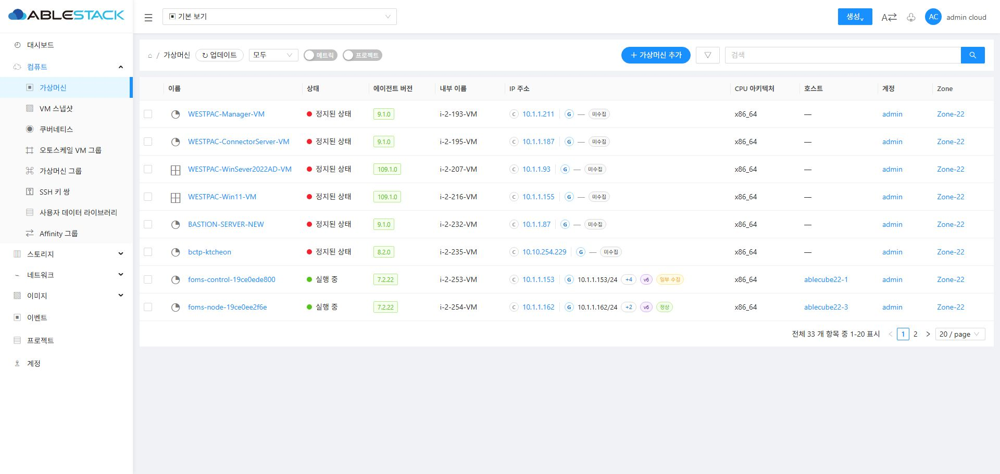
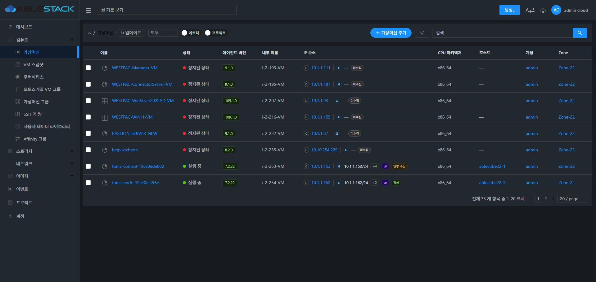
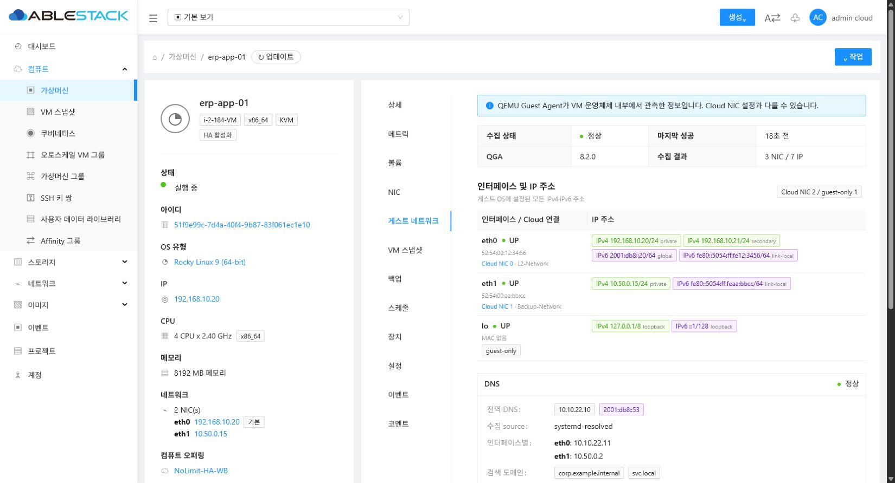
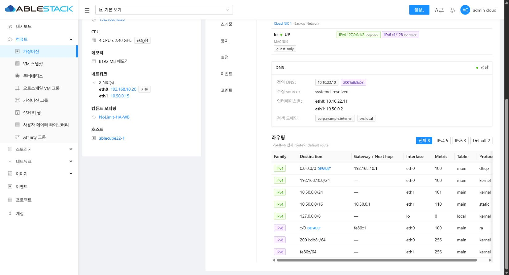

<!--
Licensed to the Apache Software Foundation (ASF) under one
or more contributor license agreements.  See the NOTICE file
distributed with this work for additional information
regarding copyright ownership.  The ASF licenses this file
to you under the Apache License, Version 2.0 (the
"License"); you may not use this file except in compliance
with the License.  You may obtain a copy of the License at

  http://www.apache.org/licenses/LICENSE-2.0

Unless required by applicable law or agreed to in writing,
software distributed under the License is distributed on an
"AS IS" BASIS, WITHOUT WARRANTIES OR CONDITIONS OF ANY
KIND, either express or implied.  See the License for the
specific language governing permissions and limitations
under the License.
-->

# Guest Network Observability Implementation Plan

## 문서 정보

- 상태: 작업 기준 계획(Approved Baseline)
- 작성일: 2026-07-24
- 최근 변경: 2026-07-27(게스트 준비 도구 연계 및 수집 공정성 통합 개선 설계)
- 작업 브랜치: `codex/guest-network-observability`
- 기준 브랜치: `ablestack-europa`
- 기준 커밋: `507c57b8696bf243a4138e45d7fecca0f78b1608`
- 적용 대상: KVM User VM의 게스트 내부 네트워크 정보 수집, API 제공, UI 표시

이 문서는 작업 브랜치에서 게스트 네트워크 관측 기능을 구현하는 기준 계획이다. 구현 범위나 핵심 설계 결정을 변경해야 할 경우 코드 변경보다 먼저 이 문서를 갱신하고, 변경 사유와 영향을 문서 하단의 변경 이력에 기록한다.

## 1. 배경

현재 KVM agent는 QEMU Guest Agent의 `guest-network-get-interfaces` 응답을 조회하지만, 다음과 같이 정보를 축소해 처리한다.

- 한 MAC 주소에 하나의 IPv4 문자열만 저장한다.
- 같은 인터페이스의 여러 IPv4 중 마지막 값만 남는다.
- IPv6와 prefix length를 버린다.
- L2 NIC의 `nics.ip4_address`를 게스트 관측값으로 갱신해 Cloud 관리 주소와 게스트 관측 주소의 의미가 섞인다.
- DNS 및 게스트 라우팅 정보는 수집하지 않는다.
- 수집 실패와 실제 주소 제거를 명확하게 구분하지 못해 오래된 IP가 남을 수 있다.

사용자에게 필요한 것은 Cloud가 할당했다고 알고 있는 주소뿐 아니라 VM 운영체제에 실제로 설정된 전체 네트워크 상태이다.

## 2. 목표

### 2.1 기능 목표

- 모든 게스트 인터페이스와 Cloud NIC의 연결 관계를 표시한다.
- 인터페이스별 모든 IPv4와 IPv6를 prefix와 함께 표시한다.
- 기본 주소, 다중 주소, link-local, loopback을 손실 없이 수집한다.
- 전역 및 인터페이스별 DNS 서버와 DNS search domain을 표시한다.
- IPv4 및 IPv6 라우팅 정보를 표시한다.
- default route, destination/prefix, gateway 또는 next hop, interface, metric을 표시한다.
- QGA 미설치, 연결 실패, 명령 미지원, 부분 성공, 오래된 정보 상태를 구분한다.
- VM 목록에서는 IP 요약을, VM 상세에서는 전체 네트워크 상태를 제공한다.
- QGA가 게스트 OS 내부의 주 IP를 확인할 수 있으면 Cloud 주소보다 우선해 가상머신 대표 IP로 사용한다.
- NIC별 QGA 주·보조 IP와 Cloud 주·보조 IP 역할을 혼합하지 않고 함께 표시한다.

### 2.2 품질 목표

- 구현 계층은 `UI → API → Backend/DB → Agent` 책임 경계를 지키고 역방향 의존을 만들지 않는다.
- 기존 VM 통계 수집 실패와 게스트 네트워크 수집 실패를 격리한다.
- 신규 수집 명령은 VM lifecycle, 볼륨, NIC/네트워크 관련 핵심 libvirt 명령의 실행 경로와 독립시킨다.
- 기존 `nics.ip4_address` 및 `nics.ip6_address` API 호환성을 깨지 않는다.
- 수집 실패 시 마지막 정상 정보를 삭제하지 않고 stale 상태로 표시한다.
- 정상적인 빈 응답은 이전 관측값을 제거하는 신호로 처리한다.
- 기능 비활성 시 유휴 flag 확인 외 추가 QGA 호출, DB 쓰기, collector 작업이 발생하지 않아야 한다.
- 활성 시에도 기존 핵심 명령 지연, 관리 서버/agent CPU, DB 쓰기 부하를 측정 가능한 예산 안으로 제한한다.
- 임의 명령 실행이나 사용자 입력 기반 shell 실행을 추가하지 않는다.

## 3. 비목표

다음 항목은 이번 작업에 포함하지 않는다.

- 게스트 내부 IP, DNS 또는 route 설정 변경
- 비 KVM 하이퍼바이저 지원
- Cloud Management/Agent가 QGA 또는 게스트 패키지를 직접 설치·업그레이드하는 기능
- 게스트 네트워크 정보의 장기 이력 및 시계열 보관
- 게스트 라우팅 테이블을 이용한 Cloud 네트워크 정책 자동 변경
- 관측 주소를 이용한 포트 포워딩 또는 방화벽 규칙 자동 생성
- 일반 목적의 `guest-exec` API 공개

## 4. 확정 설계 원칙

### 4.1 Cloud 관리 정보와 게스트 관측 정보 분리

`nics.ip4_address`와 `nics.ip6_address`는 기존 API 호환을 위해 유지한다. 전체 게스트 관측 정보는 별도 스냅샷에 저장한다.

UI는 다음을 구분해 표시한다.

- Cloud 관리 IP: Cloud NIC 모델에 저장된 주소
- 게스트 관측 IP: QGA를 통해 VM 내부에서 확인한 주소

### 4.2 배열 기반 주소 모델

주소 모델은 `MAC -> 단일 문자열`이 아니라 `인터페이스 -> 주소 배열`로 구성한다. 각 주소는 최소한 다음 값을 가진다.

- family: `IPv4` 또는 `IPv6`
- address
- prefix
- scope: `global`, `private`, `link-local`, `loopback`, `multicast`, `other`
- role: `PRIMARY`, `SECONDARY`, `UNKNOWN`
- roleSource: 역할 판정 근거
- representative: QGA가 선택한 가상머신 대표 주소 여부

scope는 IP 값으로부터 서버에서 일관되게 계산하며, 원본 주소와 prefix는 변형하지 않는다.

### 4.3 전용 수집 경로

게스트 네트워크 수집은 기존 `VmStatsCollector`와 분리한다.

- agent command: `GetVmGuestNetworkStateCommand`
- agent answer: `GetVmGuestNetworkStateAnswer`
- management collector: `VmGuestNetworkCollector`
- KVM wrapper: `LibvirtGetVmGuestNetworkStateCommandWrapper`

수집 지연이나 파싱 오류가 CPU, 메모리, 디스크 통계 수집을 중단시키지 않아야 한다.

### 4.4 최신 스냅샷만 저장

기본 저장 정책은 VM별 최신 정상 또는 부분 정상 스냅샷 한 건이다. 변경 이력은 저장하지 않는다.

- payload hash가 같으면 큰 payload를 다시 쓰지 않는다.
- 상태 및 마지막 시도/성공 시각은 갱신한다.
- VM expunge 시 스냅샷도 제거한다.

### 4.5 Capability 기반 수집

QGA 버전 문자열만으로 명령 지원 여부를 판단하지 않는다. `guest-info.supported_commands`의 명령 존재 여부와 enabled 값을 기준으로 판단한다.

수집 우선순위는 다음과 같다.

1. QGA 표준 읽기 명령
2. `ablestack-qemu-exec-tools`의 versioned read-only Helper
3. 고정된 OS별 읽기 전용 `guest-exec` 어댑터
4. 미지원 상태 반환

### 4.6 UI, API, Backend/DB, Agent 계층 분리

구현은 다음 단방향 책임 구조를 지킨다.

```text
UI
  └─ API response를 표시하고 refresh 요청만 전송
       ↓
API
  └─ RBAC, 요청 검증, response DTO 직렬화
       ↓
Backend / DB
  ├─ collector scheduling 및 Agent 요청 조정
  ├─ 상태 해석, canonicalization, snapshot 저장
  └─ API가 조회할 최신 snapshot 제공
       ↓
Agent
  └─ VM 내부의 읽기 전용 QGA 명령 실행과 원시 결과 parsing
```

계층별 금지 사항:

- UI에서 Agent 또는 host endpoint를 직접 호출하지 않는다.
- 조회 API에서 host/QGA를 동기 호출하거나 수집 완료를 기다리지 않는다.
- API controller에서 QGA payload를 해석하거나 DB entity를 직접 조립하지 않는다.
- Agent에서 RBAC, UI 표시 정책 또는 DB 저장 정책을 판단하지 않는다.
- DB entity를 agent wire DTO로 재사용하지 않는다.
- 신규 UI는 신규 API 계약만 사용하고 backend 내부 payload 구조에 의존하지 않는다.

### 4.7 핵심 libvirt 명령과 실행 격리

게스트 네트워크 관측은 읽기 전용 보조 기능이며 다음 핵심 경로와 결합하지 않는다.

- VM: start, stop, reboot, migrate, snapshot
- 볼륨: attach, detach, resize, snapshot
- 네트워크: plug/unplug NIC, VIF update, security/network rule 적용
- 기존 VM/host statistics 수집

격리 원칙:

- 전용 `GetVmGuestNetworkStateCommand`/answer/wrapper만 사용한다.
- 기존 핵심 command의 request/answer에 관측 payload를 추가하지 않는다.
- `GetVmStatsCommand`, `VmStatsCollector`, VM lifecycle handler에서 신규 수집을 호출하지 않는다.
- 핵심 libvirt operation lock 또는 volume/network device lock을 획득한 상태에서 실행하지 않는다.
- 신규 command의 timeout, 예외, queue 포화가 핵심 command의 answer나 transaction을 실패시키지 않는다.
- Agent dispatcher가 실행 자원을 공유하더라도 신규 작업은 별도의 bounded executor와 낮은 동시성 제한을 사용한다.
- bounded executor가 포화되면 수집을 지연/생략하고 `STALE`로 처리하며 핵심 명령에 backpressure를 전달하지 않는다.
- VM이 lifecycle 또는 device 변경 중이면 해당 VM 수집을 건너뛰고 다음 주기에 재시도한다.

Phase 1 시작 시 Agent command dispatch와 libvirt lock 사용 범위를 먼저 분석한다. 기존
dispatcher만으로 위 격리를 증명할 수 없으면 신규 수집용 executor/admission gate를
추가하되 기존 핵심 command 구현은 변경하지 않는다.

### 4.8 부하 최소화 우선 원칙

기능 구현 전에 현재 `VmStatsCollector`, 대표 libvirt command, DB write rate의 기준값을
측정한다. 신규 수집은 다음 순서로 부하를 줄인다.

1. feature flag 기본 비활성 및 단계적 host/zone 활성화
2. Running KVM User VM만 대상으로 제한
3. host/VM별 deterministic jitter로 동시 burst 분산
4. host별/전체 동시성 및 cycle당 VM 수 hard limit
5. capability 결과 캐시와 미지원/실패 VM exponential backoff
6. interface, DNS, route의 서로 다른 수집 주기 적용
7. 요청 시점에 이번 cycle에서 due인 section만 실행
8. 단일 유효 주소는 추가 명령 없이 QGA 주 IP로 확정하고, 다중 주소 VM에만 고정 allowlist address-role `guest-exec` 실행
9. 동일 VM/host의 중복 실행 및 이전 cycle overlap 방지
10. canonical payload hash가 같으면 큰 payload DB rewrite 생략
11. 목록 API에는 작은 summary만 제공하고 DNS/route payload를 포함하지 않음
12. 조회 API는 DB snapshot만 읽고 Agent 부하를 만들지 않음

주기를 줄이거나 동시성을 높이는 변경은 부하 측정 결과와 변경 사유를 이 문서에
기록한 뒤 적용한다.

### 4.9 qemu-exec-tools 게스트 준비 계층

QGA의 파일 및 향후 게스트 자동화 기능을 보존하기 위해
`ablestack-qemu-exec-tools`의 `policyMode=FULL`은 유지한다. 전체 RPC 허용과 Cloud
네트워크 수집 준비 상태는 서로 다른 상태다.

- qemu-exec-tools: QGA 전체 RPC 정책, 전용 read-only Helper, SELinux/AppArmor,
  OS별 package lifecycle을 담당
- Cloud Agent: Helper 또는 고정 fallback만 호출하고 게스트 설정을 변경하지 않음
- Backend/DB: Helper/QGA/Agent fingerprint와 section별 schedule을 관리
- API: 전체 정책 상태와 network readiness를 구분해 운영 진단 데이터로 제공
- UI: readiness/collector/Helper 상세 카드는 노출하지 않고, 일부 OS에서 route/DNS
  수집에 ABLESTACK 게스트 도구가 필요할 수 있다는 비에러성 안내만 제공

Cloud Agent의 고정 command allowlist는 QGA 전체 RPC 정책을 축소하기 위한 것이 아니라
네트워크 collector가 임의 명령을 만들지 못하도록 하는 코드 경계다. 파일 쓰기 등 향후
기능은 별도 Agent command/API/RBAC로 구현하며 이 collector에 추가하지 않는다.

상세 코드 계약과 22.x preflight는
`docs/guest_network_observability_integrated_improvement_design.md`를 기준으로 한다.

## 5. 목표 데이터 계약

스냅샷 payload의 초기 스키마 버전은 `1`, 주·보조 IP 역할과 대표 IP를 추가한
버전은 `2`다. qemu-exec-tools/readiness/collector metadata와 section별 시각을
추가하는 목표 버전은 `3`이다. v1/v2 payload는 신규 필드를 optional로 읽어 하위
호환한다.

```json
{
  "schemaVersion": 2,
  "vmId": "vm-uuid",
  "status": "PARTIAL",
  "observedAt": "2026-07-24T15:20:00+09:00",
  "agent": {
    "connected": true,
    "version": "8.2.0"
  },
  "sections": {
    "interfaces": {
      "status": "OK",
      "source": "qga-native"
    },
    "dns": {
      "status": "OK",
      "source": "guest-exec-linux-resolvectl"
    },
    "routes": {
      "status": "UNSUPPORTED",
      "source": null
    }
  },
  "interfaces": [
    {
      "name": "eth0",
      "macAddress": "52:54:00:12:34:56",
      "cloudNicId": "nic-uuid",
      "cloudNetworkId": "network-uuid",
      "linkState": true,
      "addresses": [
        {
          "family": "IPv4",
          "address": "192.168.10.20",
          "prefix": 24,
          "scope": "private",
          "role": "PRIMARY",
          "roleSource": "QGA_LINUX_ADDRESS_FLAGS",
          "representative": true
        },
        {
          "family": "IPv4",
          "address": "192.168.10.21",
          "prefix": 24,
          "scope": "private",
          "role": "SECONDARY",
          "roleSource": "QGA_LINUX_ADDRESS_FLAGS",
          "representative": false
        },
        {
          "family": "IPv6",
          "address": "2001:db8::20",
          "prefix": 64,
          "scope": "global"
        },
        {
          "family": "IPv6",
          "address": "fe80::5054:ff:fe12:3456",
          "prefix": 64,
          "scope": "link-local"
        }
      ]
    }
  ],
  "dns": {
    "servers": [
      {
        "family": "IPv4",
        "address": "10.10.10.2",
        "interfaceName": "eth0"
      },
      {
        "family": "IPv6",
        "address": "2001:db8::53",
        "interfaceName": "eth0"
      }
    ],
    "searchDomains": [
      "example.internal"
    ]
  },
  "routes": [
    {
      "family": "IPv4",
      "destination": "0.0.0.0",
      "prefix": 0,
      "gateway": "192.168.10.1",
      "interfaceName": "eth0",
      "metric": 100,
      "table": "main",
      "default": true
    },
    {
      "family": "IPv6",
      "destination": "::",
      "prefix": 0,
      "gateway": "fe80::1",
      "interfaceName": "eth0",
      "metric": 100,
      "table": "main",
      "default": true
    }
  ]
}
```

OS 또는 QGA가 제공하지 않는 필드는 `null` 또는 생략으로 처리한다. 의미를 추정할 수 없는 값을 임의로 채우지 않는다.

## 6. 수집 설계

### 6.1 QGA 연결 및 capability

`guest-info`에서 다음을 수집한다.

- QGA version
- `guest-network-get-interfaces` 지원 및 활성 상태
- `guest-network-get-route` 지원 및 활성 상태
- `guest-exec` 지원 및 활성 상태

capability 결과는 VM 단위로 짧게 캐시하되 VM 재부팅, agent 재연결 또는 TTL 만료 시 다시 조회한다.
QGA capability, Agent build, Helper version/profile을 합친 fingerprint가 변경되면
실패 또는 미지원 section의 backoff를 즉시 초기화한다.

### 6.2 인터페이스와 IP

표준 `guest-network-get-interfaces`를 사용한다.

- 모든 인터페이스를 파싱한다.
- interface name, hardware address, address type, address, prefix를 보존한다.
- MAC은 비교용으로만 소문자 정규화한다.
- Cloud NIC 연결은 동일 VM의 실제 NIC 목록과 정규화된 MAC으로 수행한다.
- 전역 L2 MAC 목록이나 `user_vm_view`를 매칭 기준으로 사용하지 않는다.
- 동일 NIC에 여러 IPv4/IPv6가 있어도 모두 보존한다.
- MAC이 없거나 Cloud NIC와 일치하지 않는 인터페이스도 게스트 전용 인터페이스로 보존한다.

### 6.2.1 QGA OS 계열 판별

route와 DNS의 guest-exec fallback은 `guest-get-osinfo`의 배포판 `id`를
단순 문자열 포함 여부로 판별하지 않는다. QGA OS 정보의 `id`,
`kernel-name`, `name`, `pretty-name`을 독립적으로 보존하고 내부
fail-closed resolver가 `LINUX`, `WINDOWS`, `UNSUPPORTED`를 결정한다.

- `debian`, `ubuntu`, `rocky`, `centos` 등 검증된 Linux 배포판 ID를
  immutable 집합으로 관리한다.
- `kernel-name=Linux` 또는 표시 이름의 명시적 Linux token은 보조 근거다.
- 실제 22.x QGA 7.2.22는 Linux/Windows 표본 모두 `kernel-name`을
  제공하지 않았으므로 이 필드에만 의존하지 않는다.
- 알 수 없는 OS는 guest-exec를 실행하지 않고 `UNSUPPORTED`로 닫힌다.
- resolver는 고정 adapter만 선택하며 실행 파일과 인수 allowlist를
  확장하거나 외부 입력을 받지 않는다.
- route와 DNS가 함께 due여도 OS 정보는 cycle당 한 번만 조회한다.

상세 코드 설계와 22.x preflight 결과는
`docs/guest_network_observability_os_family_design.md`를 기준으로 한다.

### 6.3 라우팅

수집 순서는 다음과 같다.

1. `guest-network-get-route`
2. Linux 고정 명령 fallback
3. Windows 고정 명령 fallback
4. `UNSUPPORTED`

Linux fallback:

- `/usr/sbin/ip -j -4 route show table all`
- `/usr/sbin/ip -j -6 route show table all`
- 배포판에 따른 `/usr/bin/ip` 위치도 명시적 allowlist로 지원

Windows fallback:

- PowerShell `Get-NetRoute`
- 필요한 속성만 선택
- `ConvertTo-Json -Compress`

route 결과에는 가능한 범위에서 다음을 보존한다.

- family
- destination/prefix
- gateway 또는 next hop
- interface
- metric
- table
- protocol
- scope
- default route 여부

### 6.4 DNS

QGA에는 DNS 전용 표준 조회 명령이 없으므로 OS별 읽기 어댑터를 사용한다.

Linux 우선순위:

1. `resolvectl`을 통한 실제 upstream DNS 및 search domain
2. `nmcli`을 통한 인터페이스별 DNS
3. `/etc/resolv.conf` fallback

Windows:

- `Get-DnsClientServerAddress`
- `Get-DnsClientGlobalSetting`
- 필요한 속성만 선택한 JSON

DNS 정보에는 가능한 범위에서 다음을 보존한다.

- IPv4/IPv6 DNS 서버
- 전역 또는 인터페이스별 구분
- search domain
- 수집 source

`/etc/resolv.conf`가 local stub만 제공하는 경우 source를 명시하고, 실제 upstream을 확인할 수 없으면 임의로 추정하지 않는다.

### 6.5 안전한 guest-exec 및 Helper

- 외부 입력으로 실행 파일, 인수 또는 shell 문자열을 만들지 않는다.
- 허용된 절대 경로와 인수 템플릿만 사용한다.
- `/bin/sh -c`, `cmd.exe /c`와 같은 범용 shell 실행은 사용하지 않는다.
- stdout/stderr는 크기를 제한하고 base64 디코딩 후 UTF-8 검증을 수행한다.
- timeout 후 `guest-exec-status`를 정리한다.
- 비정상 또는 잘린 JSON은 해당 section만 실패 처리한다.
- generic guest command API는 추가하지 않는다.
- Helper 호출 경로와 argument도 enum 기반 고정 allowlist로 관리한다.
- address-role, route, DNS가 함께 due이면 Helper 결과 한 건을 cycle 내에서 공유한다.
- Helper가 없거나 schema가 호환되지 않을 때만 기존 OS별 고정 fallback을 사용한다.

### 6.6 수집 주기

초기 rollout 설정값은 다음과 같이 계획한다.

```text
vm.guest.network.details.enabled=false
vm.guest.network.details.zone.ids=
vm.guest.network.details.host.ids=
vm.guest.network.details.interface.interval=120
vm.guest.network.details.dns.interval=600
vm.guest.network.details.route.interval=600
vm.guest.network.details.jitter.percent=20
vm.guest.network.details.max.concurrent.hosts=2
vm.guest.network.details.max.concurrent.vms.per.host=1
vm.guest.network.details.max.vms.per.host.cycle=50
vm.guest.network.details.failure.backoff.max=1800
vm.guest.network.details.exec.fallback.enabled=false
```

단위는 초이며 interval에는 VM/host 식별자 기반 deterministic jitter를 적용한다.
한 VM에서 interface 수집이 due여도 DNS/route가 due가 아니면 해당 명령은 실행하지
않는다. `UNSUPPORTED`, 반복 timeout, QGA 미연결 VM은 exponential backoff를 적용하고
성공 시 기본 주기로 복귀한다.

`guest-exec` fallback은 초기 배포에서 명시적으로 활성화해 검증한 뒤 기본값 변경
여부를 결정한다. 표준 QGA 인터페이스 수집은 기능이 활성화된 경우에만 사용한다.

### 6.7 실행 admission과 취소

- collector는 동일 host의 이전 cycle이 종료되지 않았으면 새 cycle을 만들지 않는다.
- 동일 VM에 실행 중인 요청이 있으면 중복 요청을 합치거나 다음 주기로 미룬다.
- VM operation 상태가 `Starting`, `Stopping`, `Migrating` 또는 device update 중이면
  수집 대상에서 제외한다.
- host 연결 해제, maintenance 진입, management shutdown 시 대기 작업을 취소한다.
- queue는 bounded로 만들고 rejection은 수집 실패 상태로만 기록한다.
- timeout 이후 executor thread, QGA request polling, 임시 buffer가 남지 않아야 한다.
- batch 크기는 payload 크기가 아니라 대상 VM 수와 section 비용을 기준으로 제한한다.

### 6.8 초기 성능 예산

Phase 0/1에서 동일 testbed의 기능 비활성 기준값을 측정하고 Phase 6에서 다음 gate를
검증한다.

- 대표 VM/볼륨/NIC libvirt 명령 p95 지연 증가: 5% 이하
- management server 및 KVM agent 평균 CPU 증가: 각각 2 percentage points 이하
- 기능 비활성 상태: 신규 QGA 호출 및 신규 테이블 DB write 0
- unchanged payload: payload column rewrite 0
- collector queue: 설정된 bound 초과 0, overlap 0
- timeout/rejection 발생 시 핵심 command 실패 증가 0

환경 변동 때문에 수치를 조정해야 하면 조정 전/후 baseline과 이유를 변경 이력에
남긴다. 평균값만 보지 않고 p95 command latency, QGA 호출 수, section별 실행 시간,
DB update 수, queue depth와 rejection 수를 함께 기록한다.

## 7. 상태 모델

VM 전체 상태:

- `OK`: 요청한 모든 section 수집 성공
- `PARTIAL`: 하나 이상의 section은 성공하고 하나 이상은 실패 또는 미지원
- `UNAVAILABLE`: QGA에 연결할 수 없음
- `STALE`: 마지막 정상 정보는 있으나 최신 수집 실패
- `STOPPED`: VM이 정지되어 현재 정보를 수집할 수 없음
- `UNSUPPORTED`: 모든 요청 section을 지원하지 않음

section 상태:

- `OK`
- `EMPTY`
- `UNSUPPORTED`
- `DISABLED`
- `UNAVAILABLE`
- `PARTIAL`
- `STALE`
- `NOT_DUE`
- `NOT_COLLECTED`

처리 원칙:

- 성공한 빈 결과는 `EMPTY`로 저장하고 이전 해당 section 데이터를 제거한다.
- 실패한 section은 마지막 성공 payload를 유지할 수 있으나 section 상태와 마지막 성공 시각을 함께 반환한다.
- VM 정지 시 마지막 성공 payload를 유지하되 전체 상태를 `STOPPED`로 변경한다.
- UI는 상태와 관측 시각 없이 주소만 단독으로 표시하지 않는다.

## 8. DB 변경 계획

기존 aggregate 테이블 `vm_guest_network_state`를 유지하고 section별 payload,
시각, schedule, backoff, lease의 authoritative store로
`vm_guest_network_section_state`를 추가한다.

| 컬럼 | 형식 | 설명 |
|---|---|---|
| `id` | bigint unsigned | PK |
| `vm_id` | bigint unsigned | VM ID, UNIQUE |
| `schema_version` | smallint unsigned | payload schema version |
| `status` | varchar(32) | 전체 상태 |
| `qga_version` | varchar(64) | 마지막 확인 QGA 버전 |
| `observed_at` | datetime | 마지막 시도 시각 |
| `last_success_at` | datetime | 마지막 성공 시각 |
| `payload_hash` | char(64) | canonical payload SHA-256 |
| `payload` | mediumtext | 최신 네트워크 상태 JSON |
| `error_code` | varchar(64) | 구조화된 오류 코드 |
| `error_message` | varchar(255) | 제한된 오류 설명 |
| `created` | datetime | 생성 시각 |
| `updated` | datetime | 갱신 시각 |

aggregate 테이블에는 `collector_build_id`, `collector_host_id`,
`capability_hash`, `guest_tools_version`, `qga_policy_mode`,
`readiness_status`, `readiness_checked_at`을 추가한다.

section 테이블 핵심 컬럼:

- `vm_id`, `section` unique key
- `status`, `source`
- `observed_at`, `last_success_at`, `next_due_at`
- `failure_count`, `error_code`, `error_message`
- `payload_hash`, `payload`
- `lease_owner`, `lease_until`

DB 작업 원칙:

- `vm_id` unique index를 둔다.
- VM expunge 시 명시적으로 정리한다.
- payload 크기 상한을 적용한다.
- DAO 갱신은 트랜잭션으로 처리한다.
- payload는 schema version별 parser를 통해 읽는다.
- 신규 upgrade SQL과 fresh schema 양쪽을 갱신한다.
- 실제 적용 전 대상 DB 엔진에서 `MEDIUMTEXT`, index, foreign key 사용 방식을 검증한다.
- global lock은 due work claim 동안만 보유하고 Agent I/O 전에 해제한다.
- 오래된 `next_due_at`을 기준으로 host를 선택해 host ID starvation을 제거한다.

정확한 DDL과 migration 순서는
`docs/guest_network_observability_integrated_improvement_design.md`를 따른다.

향후 게스트 IP 검색 요구가 생길 경우 별도의 `vm_guest_ip_address` 현재값 인덱스 테이블을 추가한다. 이번 구현에서는 검색용 테이블을 먼저 만들지 않는다.

## 9. Management Server 및 Agent 변경 지점

### 9.1 Core agent API

신규 타입:

- `GetVmGuestNetworkStateCommand`
- `GetVmGuestNetworkStateAnswer`
- `VmGuestNetworkState`
- `VmGuestNetworkInterface`
- `VmGuestIpAddress`
- `VmGuestDnsState`
- `VmGuestRoute`
- `VmGuestNetworkSectionStatus`

agent wire 객체는 Gson 직렬화 호환성을 유지하고 기본 생성자를 제공한다.

### 9.2 KVM plugin

신규 wrapper에서 다음을 담당한다.

- 기존 VM/볼륨/NIC command wrapper와 분리된 전용 read-only 실행
- VM별 QGA capability 조회
- 인터페이스/IP 파싱
- route 표준 명령 및 fallback
- DNS OS별 fallback
- section별 오류 격리
- 결과 크기 제한
- QGA 표준/Helper/legacy fallback source 선택
- 공통 bounded guest-exec launch/poll/decode
- Agent build, Helper/readiness, 구조화 오류 반환

신규 wrapper는 VM/volume/network device 변경 메서드를 호출하지 않는다. 기존
`LibvirtComputingResource.getVmStat()`의 QGA 네트워크 파싱은 신규 수집기가 안정화된
후 제거하거나 하위 호환 projection만 남긴다. 제거 전후에도 `GetVmStatsCommand`
실행 시간과 결과는 신규 수집 기능 활성 여부에 영향을 받지 않아야 한다.

### 9.3 Management collector

`VmGuestNetworkCollector`는 다음과 같이 동작한다.

- UP 상태의 Routing host 조회
- Running User VM을 host별로 묶음
- host agent에 batch command 전송
- VM별 answer를 독립 처리
- payload 정규화 및 hash 계산
- 최신 스냅샷 저장
- 한 VM 실패가 같은 host의 다른 VM 결과를 중단시키지 않음
- 이전 collection이 끝나지 않았으면 같은 host에 중복 실행하지 않음
- 전용 bounded executor/admission gate 사용
- section due schedule, jitter, backoff 및 queue metric 관리
- VM lifecycle/device operation 중 수집 생략
- 기능 비활성 시 동적 활성화용 단일 scheduler만 유휴 상태로 유지하고 worker와 Agent request를 생성하지 않음
- oldest-due host/VM section을 DB lease로 짧게 claim한 뒤 global lock 해제
- capability/Agent/Helper fingerprint 변경 시 실패 section만 즉시 retry

### 9.4 기존 대표 IP 호환

신규 UI와 API는 스냅샷 주소 배열을 사용한다. 기존 `nics.ip4_address` projection은 다음 조건에서만 유지한다.

- L2 네트워크
- Cloud NIC와 MAC이 정확히 일치
- 대표 주소 선정 규칙이 결정적

대표 주소 선정은 default route의 egress interface 및 source address를 우선하고, 판별할 수 없으면 기존 값을 무조건 덮어쓰지 않는다. 이 projection은 전체 주소 표시의 source of truth가 아니다.

## 10. API 계획

### 10.1 상세 조회 API

신규 API:

```text
getVirtualMachineGuestNetworkState
```

파라미터:

- `id`: VM UUID

동작:

- VM 접근 권한 확인
- DB 최신 스냅샷 반환
- API 호출 중 host 또는 QGA에 직접 접근하지 않음
- API timeout을 Agent command timeout과 연결하지 않음
- 스냅샷이 없으면 구조화된 `UNAVAILABLE` 응답

### 10.2 목록 요약

`listVirtualMachines` 및 `listVirtualMachinesMetrics`에 선택 가능한 detail을 추가한다.

```text
details=guestnetworksummary
```

요약 필드:

- `guestnetworkstatus`
- `guestnetworkobservedat`
- `guestipv4addresses`
- `guestipv6addresses`
- `guestnetworkinterfacecount`

목록 전체에 DNS와 route를 포함하지 않는다.

### 10.3 즉시 갱신

화면의 DB 재조회와 실제 Agent 수집을 구분하기 위해 다음 async API를 필수 후속 범위로
추가한다.

```text
refreshVirtualMachineGuestNetworkState
```

- 별도 권한 등록
- 중복 refresh 방지
- VM별 cooldown과 pending request 합치기
- section 선택적 refresh
- schedule을 due로 만들고 실패 backoff 초기화
- async job 결과로 접수 및 완료 여부 제공
- read API와 분리
- API thread에서 Agent/QGA를 직접 호출하지 않음

## 11. UI 계획

### 11.1 프로토타입

구현 전에 정보 구조와 화면 밀도를 확인할 수 있도록 실제 UI 런타임과 같은
Vue 3 및 Ant Design Vue 3.2.20을 사용하는 프로토타입을 작성했다.

- [대화형 프로토타입 열기](prototypes/guest-network-observability/index.html)
- VM 이름을 선택하면 상세 화면으로 이동하고, breadcrumb 또는 왼쪽 `가상머신`
  메뉴로 목록에 돌아간다.
- 실제 API를 호출하지 않으며, 아래 예시 데이터와 상태 표현은 구현·검수 기준으로
  사용한다.

디자인과 배치 기준은 다음 실제 구현 및 22.x 운영 UI를 확인해 정했다.

- `ui/src/views/AutogenView.vue`: breadcrumb, 업데이트, 필터, 검색, 목록 action toolbar
- `ui/src/components/view/ListView.vue`: `a-table` 크기, 상태, 에이전트 버전, IP cell
- `ui/src/components/view/ResourceView.vue`: VM 상세의 `7:17` 좌우 카드 배치
- `ui/src/components/view/InfoCard.vue`: 왼쪽 VM 요약 카드
- `ui/src/views/compute/InstanceTab.vue`: 오른쪽 카드 내부의 세로 탭
- `ui/public/config.json`: 흰색 navigation, `#1890ff` primary color와 실제 로고

#### VM 목록

일반 테마:



다크 테마:



목록에서는 운영자가 VM별 네트워크 상태를 빠르게 비교할 수 있도록 다음 순서로
표시한다.

1. 한 행 안에 `C` source marker와 Cloud 관리 IP를 먼저 표시한다.
2. 구분선 뒤에 `G` source marker와 게스트 대표 주소 하나만 표시한다.
3. 나머지 주소는 `+N`으로 접고, popover에서 모든 IPv4/IPv6와 prefix를
   family별로 확인한다. `+N`은 마우스뿐 아니라 키보드 focus/click도 지원한다.
4. IPv6가 하나라도 있으면 작은 `v6` marker를 표시한다. 주소 자체를 추가로
   펼쳐 목록 폭을 늘리지는 않는다.
5. 수집 상태는 `정상`, `일부 수집`, `오래됨`, `마지막 값`, `미수집`처럼
   짧은 현지화 tag로 표시하고 마지막 관측 시각과 원래 실패 사유는 tooltip에
   둔다.
6. 게스트 주소가 없으면 `G — 미수집`으로 표시해 불필요한 두 번째 줄을
   만들지 않는다.
7. 목록에는 DNS와 route를 싣지 않고 상세 탭으로 이동시킨다.

현재 목록 summary API에는 주소와 route/interface 연결 정보가 없으므로
UI-only 구현에서는 non-loopback/non-link-local IPv4를 우선하고, 없으면
동일 조건의 IPv6, 그 다음 첫 non-loopback 주소 순서로 대표 주소를 선택한다.
default route interface 우선 선택은 summary API 계약 확장이 필요한 후속
범위다. 전체 주소의 저장·API 계약은 변경하지 않으며 대표 주소는 목록 표시
정책일 뿐이다.

파일럿 기준 IP column 폭은 `510px`에서 `390px`, table horizontal scroll
기준은 `1580px`에서 `1460px`로 줄었다. 주소 수가 증가해도 한 줄 구조와
동일한 행 높이를 유지한다. 좁은 viewport에서는 기존 `ListView`의 가로
스크롤과 열 선택 기능을 그대로 사용한다.

#### VM 상세



상세 화면은 기존 `ResourceView`의 왼쪽 VM 정보 카드와 오른쪽 세로 탭 구조를
유지한다. `IP 구성`은 `NIC`와 `VM 스냅샷` 사이에 추가하고 다음과 같이
배치한다.

| 영역 | 표시 내용 | 주요 동작 |
| --- | --- | --- |
| 상단 요약 | 수집 상태, 마지막 성공, QGA 버전, 인터페이스·주소 개수 | `게스트 정보 갱신` 결과와 stale 여부 확인 |
| 인터페이스 및 IP 주소 | 인터페이스명, MAC, link state, Cloud NIC 연결, 모든 IPv4·IPv6/prefix/scope | 주소 복사, 시스템·loopback 인터페이스 접기/펼치기 |
| DNS | 전역/인터페이스별 DNS, IPv4·IPv6, search domain, 수집 source와 시각 | 부분 수집 또는 미지원 상태를 섹션 단위로 확인 |
| 라우팅 | family, destination, gateway/next hop, interface, metric, table, protocol | 전체/IPv4/IPv6/default 필터, 검색과 정렬 |

라우팅 표는 실제 오른쪽 카드 폭에서 모든 열을 억지로 축소하지 않고 기존
Ant Design table의 가로 스크롤을 사용한다.



프로토타입은 다음 상태를 의도적으로 함께 보여 준다.

- 하나의 NIC에 여러 IPv4와 IPv6가 설정된 상태
- Cloud NIC에 연결되지 않은 guest-only 인터페이스
- IPv6 global, link-local, loopback 주소
- IPv4와 IPv6 default route
- 정상, 부분 수집, stale 상태

### 11.2 VM 목록

기존 IP 컬럼을 다음과 같이 확장한다.

- `C`/`G` source marker와 tooltip으로 Cloud 관리 주소와 게스트 관측 주소를 구분
- Cloud IP, 게스트 대표 IP, `+N`, IPv6 존재 marker, 수집 상태를 한 줄로 표시
- prefix 포함
- 기본 표시를 대표 주소 한 개로 제한하고 `+N` popover에서 전체 IPv4/IPv6 확인
- popover에서 주소별 복사 및 전체 주소 복사
- 짧은 현지화 상태 tag와 stale 상태·마지막 관측 시각·실패 사유 tooltip
- 일반/다크 테마에서 같은 정보 위계와 WCAG AA 수준의 대비 유지
- guest summary가 없는 VM은 `G — 미수집`으로 단일 행 표시

링크가 DOWN인 Cloud NIC도 게스트 전용 인터페이스와 혼동하지 않도록 상태를 표시한다.

### 11.3 VM 상세

신규 `IP 구성` 탭을 추가한다. 실제 Guest Network 리소스에 사용하는 공용
`label.guest.network`와 분리해 VM 상세 전용 `label.vm.ip.configuration` 키를
사용한다.

섹션:

1. 수집 상태
   - 전체 상태
   - QGA 버전
   - 마지막 시도/성공 시각
   - section별 상태

2. 인터페이스 및 주소
   - interface name
   - MAC
   - Cloud NIC 및 네트워크 연결
   - 모든 IPv4/IPv6와 prefix
   - scope 및 link state

3. DNS
   - global/per-interface
   - IPv4/IPv6
   - search domain
   - 수집 source

4. 라우팅
   - IPv4/IPv6 필터
   - default route 우선
   - destination/prefix
   - gateway/next hop
   - interface, metric, table
   - 검색 및 정렬

### 11.4 표시 정책

- IPv6는 압축 표기하되 원본 값을 복사한다.
- 주소가 많아도 상세 탭에서는 전부 확인할 수 있어야 한다.
- loopback 및 link-local은 기본 접힘 그룹에 표시한다.
- `Not Installed` 하나로 모든 QGA 오류를 표현하지 않고 연결/미지원/실패를 구분한다.
- 마지막 성공값을 표시할 때는 `STALE`을 숨기지 않는다.

## 12. 보안 및 자원 제한

- 기존 VM 조회 권한과 동일한 RBAC를 적용한다.
- 사용자는 접근 권한이 있는 VM의 게스트 네트워크 정보만 조회한다.
- DNS search domain과 내부 route가 네트워크 토폴로지를 노출하므로 audit 대상 API로 취급한다.
- guest-exec fallback은 별도 global setting으로 제어한다.
- per-command timeout, per-VM timeout, per-host 동시성 제한을 적용한다.
- 인터페이스, 주소, DNS, route 개수 및 전체 JSON 크기에 상한을 둔다.
- 제한 초과 시 임의 절단 대신 `truncated=true`와 원래 개수 정보를 제공한다.
- command stdout/stderr 전체를 management log에 기록하지 않는다.
- IP, DNS, route 정보에 포함된 값을 shell 명령으로 재사용하지 않는다.
- qemu-exec-tools는 향후 파일 기능을 위해 QGA 지원 RPC 전체를 허용한다.
- 전체 QGA RPC 허용과 Cloud 네트워크 collector의 실행 allowlist를 혼동하지 않는다.
- Cloud collector는 Helper와 고정 OS별 조회 operation 외 임의 guest-exec/file RPC를
  사용하지 않는다.
- 파일 작업 기능은 별도 Agent command/API/RBAC/audit 경계로 구현한다.

초기 상한 제안:

- interfaces: 128
- addresses: 512
- DNS servers: 64
- search domains: 64
- routes: 4096
- decoded payload: VM당 2 MiB

실제 상한은 테스트 결과로 조정하고 변경 이력에 기록한다.

## 13. 단계별 작업 계획

### Phase 0. 기준선 및 회귀 정리

- [x] 현재 `ablestack-europa`의 QGA IP 수집 경로에 대한 unit test fixture 추가
- [x] 과거 MAC 정규화, VM별 NIC scope, IP 제거 안정화 변경과 현재 코드 차이 문서화
- [x] 기존 `VmStatsCollector` 동작에 대한 회귀 테스트 추가
- [x] 신규 수집기 활성화 전 기존 UI/API 동작 기준 캡처

완료 보고 및 증적:

- [`guest_network_observability_phase0_baseline.md`](guest_network_observability_phase0_baseline.md)
- 실제 22.x UI 목록/상세 캡처 2종
- KVM fixture 테스트 1건, Management Server 회귀 테스트 3건 통과

종료 조건:

- 현재 동작과 알려진 문제를 재현하는 테스트가 존재한다.
- 신규 구현이 해결해야 할 회귀 항목이 테스트 이름으로 식별된다.

### Phase 1. 도메인 모델 및 Agent IP 수집

- [x] Agent request dispatch, executor, libvirt operation lock 기준선 분석
- [x] VM/볼륨/NIC 핵심 command와 독립된 전용 command 실행 구조 확정
- [x] 신규 core command/answer 및 network state DTO 추가
- [x] bounded executor/admission gate 및 취소/timeout 구현
- [x] QGA `guest-info` capability parser 구현
- [x] `guest-network-get-interfaces` 전체 parser 구현
- [x] IPv4/IPv6, 다중 주소, prefix 보존
- [x] MAC 정규화 및 동일 VM NIC 매핑
- [x] loopback, MAC 없는 인터페이스, link-local 처리
- [x] Linux/Windows QGA fixture unit test

완료 보고 및 증적:

- [`guest_network_observability_phase1_report.md`](guest_network_observability_phase1_report.md)
- 전용 `GuestNetwork-Worker`: 기본 1 worker, bounded queue 16, 포화 시 즉시 거부
- Core 2건, Agent 27건, KVM 7건 등 대상 테스트 총 36건 통과

종료 조건:

- 한 NIC의 여러 IPv4와 IPv6가 손실 없이 answer에 포함된다.
- 특정 VM 파싱 실패가 같은 batch의 다른 VM을 실패시키지 않는다.
- 신규 command가 기존 VM/볼륨/NIC/GetVmStats command나 operation lock에서 호출되지 않는다.
- queue 포화와 timeout이 핵심 command의 실행/answer에 영향을 주지 않는 테스트가 통과한다.

### Phase 2. 저장 및 Management 수집기

- [x] Backend service/DAO/collector 책임 경계 구현
- [x] DB upgrade SQL 및 fresh schema 추가
- [x] VO/DAO/service 추가
- [x] `VmGuestNetworkCollector` 구현
- [x] 상태, stale, stopped, empty 처리
- [x] payload canonicalization 및 hash 갱신
- [x] VM expunge cleanup
- [x] feature enable/interval global setting 추가
- [x] jitter, section due schedule, capability cache, failure backoff 구현
- [x] host/VM 동시성, cycle limit, overlap 방지 구현
- [x] disabled 상태에서 유휴 flag 확인 외 worker/QGA/DB 작업 0 검증
- [x] unchanged payload DB rewrite 0 검증
- [x] management unit test 및 DAO test

완료 기록:

- `vm_guest_network_state` 테이블을 fresh schema와 Europa upgrade hook에 동일하게 추가했다.
- 독립 `VmGuestNetworkCollector`가 전용 Agent command만 사용하며 기존 stats/lifecycle/볼륨/NIC command 경로를 호출하지 않도록 구현했다.
- 다중 Management Server 중복 실행은 전용 global scan lock으로 차단하고, 단일 서버 내 cycle/host 중복도 별도 gate로 제한했다.
- 기능 기본값은 비활성이다. 비활성 상태에서는 동적 활성화용 단일
  scheduler가 flag만 확인하며 worker를 만들지 않으므로 신규 QGA 호출 및
  신규 DB 작업은 0이다.
- payload hash가 같을 때는 상태 시각 등 metadata만 갱신하고 `payload`와 `payload_hash` column을 다시 쓰지 않는다.
- 상세 구현·DB migration·검증 결과는 `docs/guest_network_observability_phase2_report.md`에 기록했다.

종료 조건:

- Running VM의 최신 스냅샷이 저장된다.
- QGA 실패 후 마지막 성공값과 stale 상태가 함께 유지된다.
- 정상 빈 응답이 이전 주소를 제거한다.
- 수집 기능 비활성 및 unchanged snapshot의 부하 제한 조건이 테스트로 증명된다.

### Phase 3. IP API 및 UI

- [x] Backend service를 통해 DB snapshot만 읽는 상세 조회 API 추가
- [x] VM 목록 guest network summary detail 추가(DNS/route 제외)
- [x] API RBAC 및 serialization test
- [x] 조회 API가 Agent/host command를 생성하지 않는 test
- [x] 승인된 프로토타입의 정보 구조와 상태 표현을 실제 UI 컴포넌트에 반영
- [x] UI에서 Agent/host endpoint 직접 호출이 없음을 검증
- [x] VM 목록 IPv4/IPv6 다중 주소 표시
- [x] VM 상세 `IP 구성` 탭 기본 구조 추가
- [x] 인터페이스 및 전체 주소 표시
- [x] stale/partial/unsupported 상태 표시
- [x] locale 문구 추가 및 JSON 검증

Phase 3 완료 기록(2026-07-24):

- `getVirtualMachineGuestNetworkState`는 VM RBAC 확인 후 `vm_guest_network_state`의 최신 저장값만 반환하며 Agent 또는 host command를 생성하지 않는다.
- VM 목록은 UI가 `details=guestnetwork`를 명시한 경우에만 guest summary를 포함한다. 기존 기본 API 요청은 신규 snapshot 조회를 수행하지 않는다.
- 목록 snapshot은 VM별 반복 조회가 아니라 한 번의 `IN` batch query로 읽는다.
- 목록에는 Cloud 관리 IP와 guest-observed IPv4/IPv6를 구분해 표시하고, 상세 탭에는 interface, MAC, Cloud NIC 매핑, prefix/scope를 포함한 모든 IP를 표시한다.
- `STALE`, `PARTIAL`, `STOPPED`, `UNSUPPORTED`, `UNAVAILABLE`, `NOT_COLLECTED` 상태를 UI에서 구분한다.
- 상세 구현 및 검증 결과는 `docs/guest_network_observability_phase3_report.md`에 기록한다.

종료 조건:

- VM 목록과 상세에서 모든 관측 IPv4/IPv6를 확인할 수 있다.
- Cloud 관리 주소와 게스트 관측 주소가 구분된다.
- 기존 VM API/UI 기본 동작이 유지된다.
- UI → API → Backend/DB 경계를 벗어난 동기 Agent 호출이 없다.

### Phase 4. 라우팅 수집 및 UI

- [x] `guest-network-get-route` capability 및 parser 구현
- [x] Linux IPv4/IPv6 route fallback 구현
- [x] Windows route fallback 구현
- [x] guest-exec allowlist, timeout, output limit 구현
- [x] default route 및 route 필드 정규화
- [x] route section API 및 UI table 구현
- [x] route filter, search, sort 구현
- [x] 표준/구버전 QGA fixture test

Phase 4 완료 기록(2026-07-24):

- `guest-info` capability에 따라 표준 `guest-network-get-route`를 우선 사용하고, 표준 명령 미지원 또는 실패 시 설정이 활성화된 경우에만 고정 allowlist `guest-exec` fallback을 사용한다.
- Linux fallback은 `/usr/sbin/ip`, `/usr/bin/ip`의 고정 IPv4/IPv6 JSON route 명령만 허용한다.
- Windows fallback은 절대 경로 PowerShell과 고정 `Get-NetRoute` projection만 허용한다. 외부 입력과 범용 shell은 사용하지 않는다.
- fallback은 기본 비활성이고 decoded stdout/stderr 기본 1 MiB 제한, UTF-8 검증, timeout polling 및 종료 status 정리를 적용했다.
- route는 최대 4,096개로 제한하고 초과 시 `PARTIAL`, `truncated`, 원본 개수를 snapshot section에 기록한다.
- interface와 route cadence를 분리해 route-only cycle에서는 NIC DAO와 interface QGA 명령을 호출하지 않는다.
- due가 아닌 section과 실패한 section의 마지막 성공값을 DB snapshot 병합 과정에서 보존한다.
- 상세 API와 UI에 IPv4/IPv6 route, default route, gateway, interface, metric, table, protocol, scope를 추가했다.
- 상세 구현 및 검증 결과는 `docs/guest_network_observability_phase4_report.md`에 기록한다.

Phase 4 사후 보완 구현 및 검증(2026-07-26):

- 실제 22.x QGA는 Linux 배포판 ID를 `debian`, `rocky`, `centos`로
  반환했으며 기존 `contains("linux")` 판별은 고정 route 명령 실행 전에
  이를 거부했다.
- `/usr/sbin/ip` 고정 IPv4/IPv6 명령은 동일 Debian VM에서 exit 0과
  유효한 JSON을 반환해 command allowlist 자체는 정상임을 확인했다.
- 문자열 판별을 제거하고 명시적 OS family resolver로 교체했다.
- resolver/parser/route/DNS/wrapper 테스트와 22.x Debian 단일 VM
  gate를 통과했으며 route 10개가 `OK`로 저장됐다.

종료 조건:

- IPv4/IPv6 default route와 다중 route가 표시된다.
- 표준 명령 미지원 시 허용된 fallback 또는 명확한 `UNSUPPORTED` 상태가 반환된다.

### Phase 5. DNS 수집 및 UI

- [x] Linux `resolvectl` parser
- [x] Linux `nmcli` parser
- [x] Linux `/etc/resolv.conf` fallback parser
- [x] Windows DNS Client parser
- [x] IPv4/IPv6, global/per-interface, search domain 모델 구현
- [x] DNS section API 및 UI 구현
- [x] local stub와 upstream DNS 구분 test

Phase 5 완료 기록(2026-07-24):

- QGA에는 DNS 전용 표준 명령이 없으므로 명시적으로 활성화된 고정 allowlist `guest-exec`만 사용한다.
- Linux는 `resolvectl`을 우선 사용하고, usable DNS 정보가 없으면 `nmcli`, 고정 `/etc/resolv.conf` 읽기 순으로 진행한다.
- 기본 실행 파일이 없을 때만 `/bin` 대체 경로를 시도해 불필요한 중복 명령을 제한한다.
- Windows는 고정 PowerShell에서 `Get-DnsClientServerAddress`, `Get-DnsClient`, `Get-DnsClientGlobalSetting`의 필요한 속성만 JSON으로 반환한다.
- IPv4/IPv6 DNS 서버, global/per-interface scope, search domain, routing-only domain, source를 보존한다.
- loopback DNS 주소는 local stub로 표시하며, local stub만 확인된 경우 upstream 서버를 추정하지 않는다.
- DNS 서버와 domain은 각각 최대 64개로 제한하고 초과 시 section을 `PARTIAL` 및 `truncated`로 기록한다.
- interface, route, DNS cadence와 failure backoff를 독립적으로 유지하며 DNS-only cycle은 NIC DAO와 interface/route 요청을 생성하지 않는다.
- DNS 실패 시 마지막 성공값을 `STALE`로 보존하고, 상세 API와 Ant Design UI는 DB snapshot만 조회한다.
- 상세 구현 및 검증 결과는 `docs/guest_network_observability_phase5_report.md`에 기록한다.

Phase 5 사후 보완 설계(2026-07-26):

- 동일 Debian preflight에서 `resolvectl`과 `nmcli`는 없었지만 고정
  `/usr/bin/cat /etc/resolv.conf` fallback은 exit 0으로 동작했다.
- DNS source 우선순위와 command allowlist는 유지하고, DNS adapter에
  도달하지 못하게 하는 OS family 판별만 교체한다.
- Ubuntu 실행 표본은 현재 22.x에서 찾지 못했으므로 `id=ubuntu` fixture와
  배포 전 Ubuntu preflight를 필수 gate로 남긴다.
- resolver 구현 후 동일 Debian VM에서 `/etc/resolv.conf` source의
  DNS 서버 2개가 `OK`로 저장됐다.

종료 조건:

- Linux와 Windows에서 실제 확인 가능한 DNS 정보와 source가 표시된다.
- upstream을 확인할 수 없는 경우 추정값을 만들지 않는다.

### Phase 6. 통합 검증 및 배포 준비

- [x] backend module test
- [x] KVM plugin test
- [x] API test
- [x] UI lint/build
- [x] fresh/upgrade DB schema 계약 자동 검증
- [x] 대량 VM 및 대형 route table 부하 상한 검증
- [x] 기능 off 상태의 QGA 호출, DB write, collector 작업 0 검증
- [x] Agent queue 포화와 core executor 격리 검증
- [x] snapshot write 결과와 collector section 실행 시간 측정 지점 구현
- [x] host/zone 파일럿 allowlist와 fail-closed 검증
- [x] 22.x 공유 환경 최소 artifact 배포 계획 작성
- [x] feature flag off rollback 자동 검증 및 운영 절차 작성
- [x] 운영 문서 및 사용자 도움말 작성
- [x] DB clone에서 fresh/upgrade SQL 실제 적용
- [ ] shared 파일럿에서 기능 on QGA/DB write/queue depth 측정
- [ ] shared 파일럿에서 VM/volume/NIC p95 회귀 측정
- [ ] shared 파일럿에서 management/agent CPU 측정

Phase 6 repository 완료 기록(2026-07-25):

- 1,000 VM 입력에서 host cycle 50개, batch 10개, Agent command 5회 상한을 자동 검증했다.
- 4,098 route 입력은 4,096개로 제한하고 원본 개수와 `truncated`를 보존한다.
- fresh와 Europa upgrade SQL의 table column/constraint/index/charset 계약을 동일 테스트로 고정했다.
- host/zone DB ID allowlist를 추가했으며 잘못된 non-empty 설정은 전체 허용이 아니라 수집 0으로 닫힌다.
- KVM section 실행 시간, Backend snapshot write 결과, Agent queue 지표의 운영 측정 지점을 준비했다.
- Maven 관련 통합 테스트, UI lint와 production build를 완료했다.
- 격리 MariaDB schema clone에서 fresh/upgrade SQL 실제 적용, migration 재실행,
  DDL 일치, unique/FK/cascade와 network payload DML을 검증했다.
- 최소 artifact 배포, 성능 수락, rollback 절차는
  `docs/guest_network_observability_operations.md`에 기록했다.
- 상세 결과는 `docs/guest_network_observability_phase6_report.md`에 기록한다.
- artifact checksum과 DB 적용 결과는
  `docs/guest_network_observability_release_validation.md`에 기록했다.
- shared 22.x DB/artifact/service는 변경하지 않았다.

repository gate와 실제 환경 acceptance gate를 분리한다. DB clone 적용은
완료했으며, 실제 libvirt 작업 p95, Management/Agent CPU와 feature-on
queue/write 측정은 artifact 배포 전에는 유효한 값을 만들 수 없으므로 다음
승인된 파일럿 배포에서 수행한다. 측정 전에는 해당 acceptance 항목을 통과로
간주하지 않는다.

종료 조건:

- repository 자동화 gate를 충족한다.
- 변경 artifact와 DB migration이 명확히 정리된다.
- shared 22.x 환경에 대한 좁은 범위의 배포·복구 절차가 준비된다.
- 핵심 command 실행 격리 gate를 충족한다.
- 실제 환경 acceptance gate는 파일럿 배포 후 별도로 충족해야 한다.

## 14. 테스트 매트릭스

| 구분 | 시나리오 | 기대 결과 |
|---|---|---|
| Linux IP | NIC 1개, IPv4 1개 | 주소/prefix 표시 |
| Linux IP | NIC 1개, IPv4 여러 개 | 모든 주소 표시 |
| Linux IP | IPv4 + IPv6 global + link-local | family/scope별 표시 |
| Windows IP | IPv4/IPv6 혼합 | 모든 주소 표시 |
| Multi NIC | Cloud NIC 2개 | MAC 기준 정확한 매핑 |
| Guest-only | loopback, tunnel, VPN | Cloud NIC 없이 별도 표시 |
| Address removal | 주소 정상 제거 | 다음 성공 스냅샷에서 제거 |
| QGA failure | 마지막 성공 후 QGA 중지 | 값 유지 + STALE |
| QGA unavailable | 최초부터 연결 실패 | UNAVAILABLE |
| VM stopped | 마지막 정상 수집 후 정지 | STOPPED + 마지막 시각 |
| Native route | QGA route 명령 지원 | 표준 결과 표시 |
| Legacy route | QGA route 미지원 | fallback 또는 UNSUPPORTED |
| Debian OS ID | `id=debian`, kernel-name 없음 | LINUX adapter 선택 |
| Ubuntu OS ID | `id=ubuntu`, kernel-name 없음 | LINUX adapter 선택 |
| Rocky/CentOS OS ID | 배포판별 ID, kernel-name 없음 | LINUX adapter 선택 |
| Unknown OS ID | Linux/Windows 근거 없음 | guest-exec 0 + UNSUPPORTED |
| Linux DNS | systemd-resolved | upstream/per-link 표시 |
| Linux DNS | NetworkManager | 인터페이스별 DNS 표시 |
| Linux DNS | resolv.conf only | fallback source 표시 |
| Windows DNS | DNS Client 설정 | 서버 및 suffix 표시 |
| Large route | route 수 상한 초과 | truncated 상태와 안전한 제한 |
| RBAC | 타 계정 VM 조회 | 접근 거부 |
| API compatibility | 기존 details 요청 | 기존 응답 유지 |
| Collector isolation | 한 VM parser 예외 | 다른 VM 정상 저장 |
| Layer boundary | read API 반복 호출 | Agent/QGA 호출 수 증가 없음 |
| Feature disabled | collector 비활성 | 유휴 flag 확인 외 worker/QGA/DB write 0 |
| Unchanged payload | 같은 snapshot 반복 | payload DB rewrite 0 |
| Queue saturation | 수집 queue bound 도달 | 수집 지연/STALE, 핵심 command 정상 |
| Core isolation | slow QGA + VM start/stop | 핵심 command timeout/실패 증가 없음 |
| Core isolation | slow QGA + volume attach/detach | 핵심 command timeout/실패 증가 없음 |
| Core isolation | slow QGA + NIC plug/unplug | 핵심 command timeout/실패 증가 없음 |
| Load | 대량 VM + route 상한 | 동시성/주기/CPU/DB 예산 준수 |
| Migration | 기존 DB upgrade | 테이블/DAO 정상 동작 |

## 15. 빌드, 배포 및 롤백

### 15.1 빌드

변경 범위에 따라 다음 최소 단위로 검증한다.

- core/agent API 관련 Maven module
- KVM hypervisor plugin module
- server/management 관련 module
- API/plugin metrics 관련 module
- UI module

전체 Cloud rebuild는 릴리즈 또는 통합 검증 단계에서만 수행한다.

### 15.2 shared 22.x 배포

- DB migration을 먼저 검증하고 정확한 table/column을 기록한다.
- management server는 변경된 backend artifact만 배포한다.
- KVM host agent는 현재 배포 runtime과 일치하는 artifact 또는 변경 class만 반영한다.
- 최신 branch 전체 jar를 shared host에 무조건 교체하지 않는다.
- UI는 변경된 정적 artifact만 배포한다.
- 서비스 재시작 후 VM stats와 agent ReadyAnswer가 정상인지 함께 확인한다.

### 15.3 롤백

- `vm.guest.network.details.enabled=false`로 신규 수집을 즉시 중단할 수 있어야 한다.
- 신규 UI는 스냅샷이 없으면 기존 NIC 표시로 fallback한다.
- 신규 테이블은 rollback 중 삭제하지 않고 사용을 중단한다.
- 기존 VM 통계 수집과 기존 NIC API는 신규 기능 비활성화 후에도 동작해야 한다.
- DB downgrade가 필요한 구조 변경은 별도 승인 없이 수행하지 않는다.

## 16. 알려진 위험과 대응

| 위험 | 대응 |
|---|---|
| 구버전 QGA의 route 미지원 | capability 검사와 제한된 fallback |
| 전체 QGA RPC 허용의 오용 위험 | qemu-exec-tools는 FULL 정책을 유지하되 Cloud 기능별 Agent command/API/RBAC/audit를 분리 |
| guest-exec 보안 위험 | Cloud collector 고정 operation allowlist, shell 금지, Helper 전용 SELinux/AppArmor |
| QGA 응답 지연으로 stats 영향 | 전용 collector와 timeout |
| Agent worker 고갈로 핵심 명령 지연 | 전용 bounded executor, 낮은 동시성, 포화 시 수집 생략 |
| 수집 burst | deterministic jitter, cycle limit, host/VM 동시성 제한 |
| 반복 미지원/timeout 호출 | capability cache와 exponential backoff |
| route payload 과대 | 개수/크기 상한, truncated 표시 |
| DNS 도구 배포판 차이 | resolver별 adapter와 source 표시 |
| QGA OS ID가 `linux`가 아닌 배포판 ID | 명시적 OS family resolver, 실제 22.x fixture와 preflight |
| MAC 대소문자 및 표기 차이 | 정규화 후 동일 VM NIC에서만 매칭 |
| Cloud IP와 게스트 IP 불일치 | 두 값을 분리 표시하고 자동 동일시 금지 |
| stale 정보를 최신으로 오인 | 상태와 마지막 성공 시각 필수 표시 |
| DB write 증가 | payload hash, 변경 시 payload 갱신 |
| shared 환경 agent jar 불일치 | 기존 runtime 기준 최소 class 배포 |
| Host ID 정렬 starvation | persisted oldest-due 선택과 section lease |
| QGA 설정 변경 후 긴 backoff | capability/Helper/Agent fingerprint 변경 시 실패 section 즉시 retry |
| 전체 observed 시각이 section freshness를 은폐 | section table에 attempt/success/next-due 저장 |
| `/bin/true` 성공을 기능 준비 완료로 오판 | 실제 Helper 및 고정 수집 command preflight |

## 17. Definition of Done

다음 항목이 모두 충족되어야 기능 구현 완료로 판단한다.

- [x] 모든 IPv4/IPv6와 prefix가 손실 없이 수집된다.
- [x] 동일 인터페이스의 다중 주소가 모두 표시된다.
- [x] Cloud 관리 주소와 게스트 관측 주소가 분리된다.
- [x] DNS 서버와 search domain이 source와 함께 표시된다.
- [x] IPv4/IPv6 라우팅 및 default route가 표시된다.
- [x] QGA 상태와 section별 성공/실패/미지원이 구분된다.
- [x] stale 데이터에 마지막 성공 시각이 표시된다.
- [x] VM 목록과 상세 UI가 요구사항을 충족한다.
- [x] 기존 VM 조회 API와 UI가 회귀하지 않는다.
- [x] 한 VM 오류가 다른 VM과 기존 stats collector에 영향을 주지 않는다.
- [x] UI → API → Backend/DB → Agent 책임 경계가 코드와 테스트로 확인된다.
- [x] 조회 API가 host/Agent/QGA를 동기 호출하지 않는다.
- [x] 신규 수집 command가 VM/볼륨/NIC/GetVmStats command 경로 및 lock과 분리된다.
- [x] slow/timeout/queue 포화 상황에서 core executor로 실패가 전파되지 않는다.
- [x] 기능 비활성 시 신규 QGA 호출, collector 작업, 신규 테이블 DB write가 0이다.
- [x] jitter, 동시성/cycle limit, capability cache, section cadence, backoff가 구현된다.
- [x] unchanged snapshot의 payload DB rewrite가 발생하지 않는다.
- [x] 핵심 command p95, management/agent CPU, DB write, queue 지표가 성능 예산을 충족한다.
- [x] DB clone에서 fresh install 및 upgrade 실제 적용이 검증된다.
- [x] backend, agent, API, UI test/build가 통과한다.
- [x] 보안 제한과 payload 상한이 테스트된다.
- [x] shared 22.x 최소 배포 및 rollback 절차가 준비된다.
- [x] shared 22.x 파일럿에서 최소 배포 및 rollback 절차가 실행 검증된다.
- [x] 사용자 및 운영 문서가 갱신된다.
- [x] 문자열 `contains("linux")` OS dispatch가 명시적 family resolver로 교체된다.
- [x] Debian/Ubuntu/Rocky/CentOS OS ID 회귀 테스트가 통과한다.
- [x] 22.x Debian 단일 VM route/DNS 수집이 preflight 결과와 일치한다.
- [ ] 22.x Ubuntu 실행 표본이 확보되면 Ubuntu 수집 gate를 통과한다.
- [x] Host 1·2·3에 동일 source build의 Agent guest-network class set을 최소 배포하고 collector build ID를 확인한다.
- [x] qemu-exec-tools FULL QGA policy와 network readiness가 별도 상태로 반환된다.
- [x] Rocky SELinux enforcing QGA context에서 전용 Helper address/route/DNS 수집이 통과한다.
- [x] qemu-exec-tools 미설치 VM이 legacy fallback과 정확한 readiness를 반환한다.
- [x] oldest-due host 선택과 DB lease가 Host 3 starvation을 제거한다.
- [x] section별 시각/backoff/error가 DB/API/UI에서 일치한다.
- [x] DB 새로고침과 async 실제 재수집이 UI에서 분리된다.

## 18. 작업 진행 규칙

- 각 Phase 시작 전 선행 Phase 종료 조건을 확인한다.
- 각 구현 변경은 UI, API, Backend/DB, Agent 중 소유 계층을 먼저 명시한다.
- 계층을 건너뛰는 직접 호출 또는 core libvirt command 결합은 계획 변경 승인 없이 추가하지 않는다.
- 성능 최적화는 추정이 아니라 off baseline과 on 측정값으로 검증한다.
- 완료 체크는 코드 존재가 아니라 test/build 또는 실행 증거가 있을 때만 표시한다.
- 계획에 없는 DB, API 또는 배포 범위 확장은 먼저 이 문서에 반영한다.
- 구현 중 확인된 제약은 숨기지 않고 상태 모델 또는 알려진 위험에 추가한다.
- 커밋은 Phase 또는 독립 검증 단위로 나눈다.
- 원격 push와 PR 생성은 별도 사용자 요청이 있을 때만 수행한다.
- upstream 반영은 fork의 작업 브랜치에서 upstream 기준 브랜치로 PR을 통해서만 수행한다.

## 19. 변경 이력

| 날짜 | 변경 | 사유 |
|---|---|---|
| 2026-07-27 | qemu-exec-tools FULL QGA 정책, 전용 Helper/SELinux, Agent source abstraction, persisted section schedule/lease, async 재수집을 통합한 상세 설계 반영 | 전체 RPC 허용 목적을 유지하면서 Rocky 실행 권한, Agent 배포 불일치, host starvation, section freshness 문제를 구조적으로 해결 |
| 2026-07-26 | VM 목록 IP cell을 대표 주소 한 개, `+N` popover, IPv6 marker, 짧은 상태 tag의 단일 행 요약으로 재설계하고 일반/다크 테마 파일럿 추가 | 모든 주소 접근성을 유지하면서 IP column 폭과 행 높이를 줄이고 목록 비교성을 높이기 위함 |
| 2026-07-26 | OS family resolver와 collector backoff 정합성 수정 구현, 22.x Debian 단일 VM 최소 배포 검증 완료 | route 10개와 DNS 서버 2개가 모두 `OK`로 저장되는 실제 기능 경로 확인 |
| 2026-07-26 | QGA OS 계열 판별 결함과 코드 수준 개선 설계, 22.x Debian preflight 및 Ubuntu 후속 gate 반영 | 실제 QGA 배포판 ID가 `linux` 문자열을 포함하지 않아 route/DNS adapter에 도달하지 못하는 문제 보완 |
| 2026-07-25 | 실제 22.x 비식별 DB clone migration과 단일 호스트 최소 배포 파일럿 완료, 동적 활성화 및 VM 순환 선택 보완 | 실제 runtime 호환성, 핵심 작업 p95, CPU/queue 예산과 rollback 가능성 확인 |
| 2026-07-25 | 배포 artifact와 SHA-256 기록, 격리 MariaDB schema clone의 fresh/upgrade 실제 적용 검증 완료 | 배포 입력물의 무결성과 fresh/upgrade 최종 DDL 및 제약조건 일치 확인 |
| 2026-07-25 | Phase 6 repository 통합 검증, 파일럿 allowlist, 운영 측정 지점과 최소 배포/복구 절차 반영 | shared 환경 부하와 배포 위험을 제한하고 실제 환경 acceptance를 분리 |
| 2026-07-24 | Phase 1 구현 및 검증 결과 반영 | 전용 Agent 실행 격리, Core DTO, QGA interface/IP parser와 회귀 테스트 완료 |
| 2026-07-24 | Phase 2 구현 및 검증 결과 반영 | DB snapshot, Management collector, stale/hash/cleanup, 부하 제한 및 전용 global lock 구현 완료 |
| 2026-07-24 | 계층 책임, 핵심 libvirt 명령 격리, 부하 예산과 제어 계획 보강 | UI-API-Backend/DB-Agent 구조 준수와 기존 핵심 작업 영향 최소화 요구 반영 |
| 2026-07-24 | 최초 작업 기준 계획 작성 | 전체 IP, IPv6, DNS, route 관측 요구사항 구현 기준 확정 |
