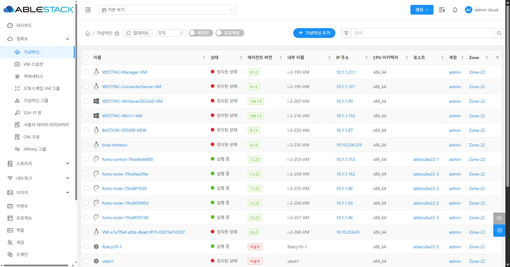
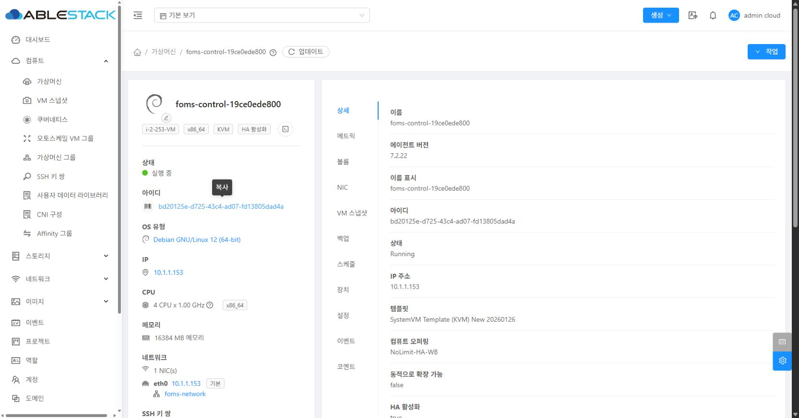

# 게스트 네트워크 관측성 Phase 0 기준선

## 1. 목적과 범위

이 문서는 `codex/guest-network-observability` 브랜치에서 Phase 1 이후 구현이
기존 동작을 의도치 않게 변경하지 않도록 다음 기준을 고정한다.

- KVM Agent의 QGA IP 수집 및 축약 규칙
- Management Server `VmStatsCollector`의 L2 NIC 반영 규칙
- VM 목록/상세 UI 및 API 응답 모델의 현재 표시 범위
- MAC 정규화, VM별 NIC 범위, IP 제거 안정성에 관한 기존 제약

Phase 0에서는 새 게스트 네트워크 기능이나 DB 스키마를 추가하지 않는다.
테스트 가능성을 위한 메서드 추출만 수행하며 기존 결과는 유지한다.

기준 일시: 2026-07-24 (Asia/Seoul)

기준 브랜치:

- base: `ablestack-europa`
- work: `codex/guest-network-observability`
- Phase 0 시작 시 `ablestack-europa...upstream/ablestack-europa`: `0 0`
- Phase 0 시작 시 `ablestack-europa...HEAD`: `0 0`

## 2. 현재 수집 및 표시 경로

```text
QEMU Guest Agent
  guest-network-get-interfaces
        |
        v
LibvirtComputingResource.getVmStat
  Map<raw MAC, one IPv4>
        |
        v
VmStatsEntry.nicAddrMap
        |
        v
StatsCollector.VmStatsCollector
  findByMacAddress(raw MAC)
  L2 NIC의 nics.ip4_address 갱신
        |
        v
listVirtualMachines / UserVmResponse
  vm.ipaddress = 첫 NIC의 ipaddress
  nic[].ipaddress = NIC당 단일 IPv4
        |
        v
Vue UI
  목록 IP 주소 / 상세 IP / NIC 요약
```

관련 코드:

- `LibvirtComputingResource#getVmStat`
- `LibvirtComputingResource#parseQemuGuestNetworkInterfaces`
- `VmStatsEntryBase#nicAddrMap`
- `StatsCollector.VmStatsCollector#updateL2NicAddresses`
- `UserVmJoinDaoImpl`의 `NicResponse` 구성
- `UserVmResponse#setIpAddress`
- `ListView#activeNicAddresses`
- `DetailsTab#activeNicAddresses`

## 3. QGA 응답 기준 fixture

Fixture:

`plugins/hypervisors/kvm/src/test/resources/qga/guest-network-get-interfaces-multiple-ip.json`

한 응답에 다음 경우를 모두 포함한다.

- loopback IPv4/IPv6
- 동일 NIC의 IPv4 2개
- 동일 NIC의 IPv6 1개
- 하이픈과 대문자를 사용한 MAC
- IPv6만 가진 NIC

현재 projection 결과:

| QGA 입력 | 현재 결과 |
|---|---|
| loopback 주소 | 제외 |
| 동일 NIC의 IPv4 2개 | 마지막 IPv4 하나만 유지 |
| IPv6 | 제외 |
| MAC 표기 | 변환 없이 원문을 map key로 유지 |
| IPv6만 가진 NIC | map에서 제외 |

회귀 테스트:

`parseQemuGuestNetworkInterfacesCurrentBehaviorKeepsLastIpv4AndDropsIpv6`

이 테스트는 개선 목표가 아니라 현재 손실 동작의 기준선이다. Phase 1에서 전체
주소 DTO가 도입되면 새 테스트가 다중 IPv4와 IPv6 보존을 검증해야 하며, 이
기준 테스트는 legacy projection 호환 범위에 맞게 유지 또는 교체한다.

## 4. VmStatsCollector 기준선과 과거 변경 비교

### 4.1 현재 동작

`VmStatsCollector`는 전체 L2 VM 응답에서 MAC 목록을 만들고, QGA가 보고한
`Map<MAC, IPv4>`를 순회한다.

- MAC은 대소문자, 구분자 변환 없이 정확히 비교한다.
- NIC 조회는 `findByMacAddress(mac)`이며 VM ID 범위가 없다.
- L2 NIC 목록에 같은 문자열의 MAC이 있을 때만 `ip4_address`를 갱신한다.
- QGA map이 `null` 또는 비어 있으면 기존 NIC IP를 제거하지 않는다.
- QGA가 특정 NIC를 다음 응답에서 누락해도 기존 값은 유지된다.

회귀 테스트:

- `vmStatsCollectorCurrentBehaviorUpdatesL2NicUsingGlobalExactMacLookup`
- `vmStatsCollectorCurrentBehaviorDoesNotNormalizeMacAddress`
- `vmStatsCollectorCurrentBehaviorDoesNotClearIpWhenAgentStopsReportingIt`

### 4.2 과거 이력과 현재 차이

| 이력 | 당시/현재 의미 | 개선 시 반영할 원칙 |
|---|---|---|
| `c7b43d391a1`, `b079ab7fcc6` | QGA MAC-IP map과 L2 NIC DB 갱신 도입 | 기존 L2 IP 표시 호환성 보존 |
| `a8ba994cc23` | QGA capability 확인 후 IP 수집, L2 VM MAC 목록 기반 갱신 | capability/수집 상태를 별도 상태로 모델링 |
| `92188d4a6e2` | `agentNicMap == null` 방어 추가 | 실패 응답과 정상 빈 응답을 구분 |
| `8b7de77e462` | VM 통계 map 구조 변경 후에도 전역 MAC 조회 유지 | 신규 수집기는 반드시 VM ID + 정규화 MAC으로 조회 |
| 현재 | exact MAC, 전역 NIC 조회, 누락 IP 미삭제 | Phase 1/2에서 정규화, VM scope, snapshot 교체 semantics 적용 |

과거 코드에도 MAC 정규화와 VM별 NIC 조회는 존재하지 않는다. 따라서 해당 두
항목은 “되돌릴 기능”이 아니라 신규 구현에서 명시적으로 도입해야 하는 안전장치다.

IP 제거는 다음과 같이 구분해야 한다.

- 수집 실패/timeout/미지원: 마지막 성공값 유지 + `STALE` 또는 상태 표시
- 정상 응답이며 주소 목록이 비어 있음: 해당 snapshot의 이전 주소 제거
- 정상 응답에서 특정 NIC가 사라짐: VM의 현재 NIC scope와 대조 후 snapshot 갱신

## 5. 현재 API 기준

현재 VM 조회 API 모델은 게스트 관측 주소 전용 snapshot을 제공하지 않는다.

- `UserVmResponse.ipaddress`: `nics.iterator().next().getIpaddress()`로 정한
  첫 NIC의 단일 IPv4
- `NicResponse.ipaddress`: NIC의 단일 IPv4
- `NicResponse.ip6address`: NIC의 단일 IPv6 필드
- `NicResponse.ipaddresses`: unmanaged instance용 필드이며 현재 QGA 수집
  결과의 다중 주소 저장소로 사용되지 않음
- DNS, search domain, route, 수집 상태, 수집 시각 필드 없음

실제 화면에서 관측한 값을 기준으로 한 최소 응답 형태는 다음과 같다. 인증
세션이나 전체 원시 응답은 저장하지 않았다.

```json
{
  "id": "bd20125e-d725-43c4-ad07-fd13805dad4a",
  "name": "foms-control-19ce0ede800",
  "ipaddress": "10.1.1.153",
  "qemuagentversion": "7.2.22",
  "nic": [
    {
      "deviceid": "0",
      "ipaddress": "10.1.1.153",
      "isdefault": true,
      "networkname": "foms-network"
    }
  ]
}
```

Phase 3 이후에도 기존 `ipaddress` 호환 필드를 유지하되, 전체 IPv4/IPv6,
DNS, route 및 상태는 신규 guest network response에서 제공한다.

## 6. 현재 UI 기준 캡처

### 6.1 VM 목록



현재 목록은 `IP 주소` 열에 NIC별 단일 `ipaddress`를 쉼표로 결합해 표시한다.
동일 NIC의 다중 주소와 DNS/route는 확인할 수 없다.

### 6.2 VM 상세



현재 상세 화면은 다음 두 위치에 같은 단일 IPv4를 표시한다.

- 좌측 요약의 `IP`
- 좌측 네트워크 요약의 NIC별 IP

상세 탭의 `IP 주소`도 API의 첫 NIC 단일 IPv4 projection이다. IPv6 필드는
존재하지만 QGA legacy 수집 경로에서는 채우지 않는다.

## 7. 검증 결과

### 7.1 KVM QGA fixture

```text
mvn -pl plugins/hypervisors/kvm -am \
  -Dtest=LibvirtComputingResourceTest#parseQemuGuestNetworkInterfacesCurrentBehaviorKeepsLastIpv4AndDropsIpv6 \
  -Dsurefire.failIfNoSpecifiedTests=false test

Tests run: 1, Failures: 0, Errors: 0, Skipped: 0
BUILD SUCCESS
```

### 7.2 Management Server 회귀

```text
mvn -pl server -am \
  -Dtest=StatsCollectorTest#vmStatsCollectorCurrentBehaviorUpdatesL2NicUsingGlobalExactMacLookup+vmStatsCollectorCurrentBehaviorDoesNotNormalizeMacAddress+vmStatsCollectorCurrentBehaviorDoesNotClearIpWhenAgentStopsReportingIt \
  -Dsurefire.failIfNoSpecifiedTests=false test

Tests run: 3, Failures: 0, Errors: 0, Skipped: 0
BUILD SUCCESS
```

두 실행 모두 대상 모듈과 상위 리액터의 Checkstyle을 통과했다. 모듈 단독
실행은 로컬 Maven 저장소의 이전 SNAPSHOT 때문에 최신 reactor class를 찾지
못하므로 `-am`을 사용해야 한다.

추가 정적 검증:

```text
git diff --check
```

결과: 오류 없음.

## 8. Phase 0 종료 판단

- 현재 QGA 축약 동작을 재현하는 fixture와 테스트가 있다.
- `VmStatsCollector`의 exact MAC, 전역 조회, 미삭제 동작이 테스트 이름으로
  식별된다.
- 과거 변경과 신규 구현에서 보완할 원칙이 분리되어 있다.
- 현재 실제 22.x UI와 API 모델의 표시 범위가 캡처되어 있다.
- 공유 22.x 환경의 코드, DB, 서비스에는 변경을 배포하지 않았다.

따라서 Phase 0 종료 조건을 충족한다.
