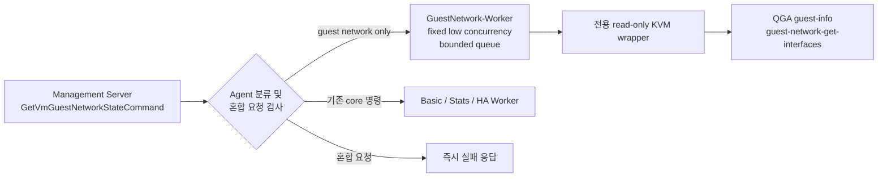

<!--
Licensed to the Apache Software Foundation (ASF) under one
or more contributor license agreements. See the NOTICE file
distributed with this work for additional information
regarding copyright ownership. The ASF licenses this file
to you under the Apache License, Version 2.0 (the
"License"); you may not use this file except in compliance
with the License. You may obtain a copy of the License at

  http://www.apache.org/licenses/LICENSE-2.0

Unless required by applicable law or agreed to in writing,
software distributed under the License is distributed on an
"AS IS" BASIS, WITHOUT WARRANTIES OR CONDITIONS OF ANY
KIND, either express or implied. See the License for the
specific language governing permissions and limitations
under the License.
-->

# Guest Network Observability Phase 1 완료 보고

## 1. 결과

- 상태: 완료
- 작업 브랜치: `codex/guest-network-observability`
- 완료일: 2026-07-24
- 구현 범위: Core wire model, Agent 실행 격리, KVM QGA interface/IP 수집
- 미포함 범위: Management collector, DB, 조회 API, UI, DNS 및 route 실제 수집

Phase 1에서는 게스트 네트워크 명령이 VM lifecycle, 볼륨, NIC/네트워크 및 기존
통계 명령과 같은 `Basic-Worker`에서 실행되지 않도록 전용 실행 경로를 추가했다.
QGA가 반환하는 모든 인터페이스와 IPv4/IPv6 주소를 prefix와 함께 보존하고, 한 VM의
오류가 같은 batch의 다른 VM 결과를 훼손하지 않도록 VM별로 격리했다.

## 2. 실행 구조 분석 및 확정 결과

기존 `Agent.selectExecutorForRequest()`는 HA와 stats 명령만 별도 분류하고 그 외
명령을 모두 `Basic-Worker`로 보냈다. 따라서 신규 명령을 단순 등록하면 VM 시작/중지,
볼륨, NIC 작업과 실행 자원을 공유하게 되는 구조였다.

Phase 1에서 다음 구조로 변경했다.



격리 규칙:

- `GetVmGuestNetworkStateCommand`가 포함된 요청은 `GuestNetwork-Worker`만 사용한다.
- 신규 명령과 기존 core 명령이 한 request에 섞이면 실행 전에 거부한다.
- 전용 queue 포화 시 NIO 또는 `Basic-Worker`에서 대신 실행하지 않고 즉시 실패한다.
- 전용 wrapper는 VM/volume/NIC 변경 메서드와 기존 `GetVmStatsCommand` 경로를 호출하지 않는다.
- 기존 core operation lock 또는 device lock을 획득하지 않는다.
- agent 종료 시 대기 중인 전용 수집 작업은 `shutdownNow()`로 취소한다.

libvirt 연결 기반 시설은 기존 KVM agent 연결 관리자를 재사용하지만, command,
executor, queue, admission, wrapper 및 operation lock 경로는 기존 핵심 명령과
분리했다. QGA 호출에는 command별 짧은 timeout을 적용하고 동시성을 낮게 제한했다.

## 3. 부하 제한

전용 실행기는 thread를 미리 시작하지 않으며 최초 요청 시에만 worker가 생성된다.
Phase 2 collector가 아직 없기 때문에 Phase 1 코드만으로 주기적 QGA 호출이나 DB
write는 발생하지 않는다.

| 설정 | 기본값 | 강제 범위 | 목적 |
|---|---:|---:|---|
| `guest.network.workers` | 1 | 1~4 | QGA 동시 호출 제한 |
| `guest.network.queue.size` | 16 | 1~256 | 메모리 및 대기 작업 상한 |
| command timeout | 3초 | 최소 1초 | VM별 QGA 지연 제한 |

포화 시 `AbortPolicy`를 사용해 수집 요청만 실패시키고 core worker에 backpressure를
전달하지 않는다. Phase 2에서는 feature flag, 주기, jitter, capability cache,
backoff 및 host/VM cycle 제한을 Management collector에 추가한다.

## 4. 데이터 및 파싱

추가된 wire model:

- `GetVmGuestNetworkStateCommand`
- `GetVmGuestNetworkStateAnswer`
- `VmGuestNetworkState`
- `VmGuestNetworkInterface`
- `VmGuestIpAddress`
- `VmGuestNetworkSectionStatus`
- `VmGuestDnsState`
- `VmGuestRoute`

QGA 처리:

1. VM이 running 상태인지 확인한다.
2. `guest-info`에서 QGA version과 command별 `enabled` 값을 읽는다.
3. `guest-network-get-interfaces`가 활성화된 경우에만 호출한다.
4. 모든 interface와 모든 IPv4/IPv6, prefix를 배열로 보존한다.
5. scope를 `global`, `private`, `link-local`, `loopback`, `multicast`,
   `unknown`으로 분류한다.
6. 원본 hardware address를 보존하고 비교용 MAC만 소문자 colon 형식으로 정규화한다.
7. Cloud NIC 연결은 command에 포함된 동일 VM의 MAC map 안에서만 수행한다.
8. loopback, MAC 없는 tunnel/VPN 인터페이스 및 Cloud NIC 미매칭 인터페이스도 버리지 않는다.

DNS와 route DTO는 이후 wire 계약을 위해 포함했지만 실제 수집 section은
`NOT_COLLECTED`로 명시한다. 임의 값은 만들지 않는다.

## 5. 테스트 결과

| 모듈 | 테스트 | 결과 |
|---|---|---:|
| Core | command Gson round-trip, VM별 NIC map, defensive copy | 2/2 통과 |
| Agent | 기존 Agent 회귀 + 전용 executor 선택, 혼합 차단, queue 포화 격리 | 27/27 통과 |
| KVM | capability, Linux/Windows 다중 IP, IPv6, prefix, scope, MAC, VM별 오류 격리 | 7/7 통과 |

검증 명령:

```bash
mvn -pl core -am \
  -Dtest=GetVmGuestNetworkStateCommandTest \
  -Dsurefire.failIfNoSpecifiedTests=false test

mvn -pl agent -am \
  -Dtest=AgentTest \
  -Dsurefire.failIfNoSpecifiedTests=false test

mvn -pl plugins/hypervisors/kvm -am \
  -Dtest=QemuGuestNetworkStateParserTest,LibvirtGetVmGuestNetworkStateCommandWrapperTest \
  -Dsurefire.failIfNoSpecifiedTests=false test
```

세 명령 모두 `BUILD SUCCESS`이며 대상 테스트 총 36건이 통과했다.

## 6. Phase 1 종료 조건 확인

- 한 NIC의 여러 IPv4/IPv6와 prefix가 answer에 손실 없이 포함됨
- 특정 VM의 malformed QGA 응답이 같은 batch의 다른 VM을 실패시키지 않음
- 신규 명령이 기존 VM/볼륨/NIC/GetVmStats command 또는 operation lock에서 호출되지 않음
- 전용 queue 포화 상태에서도 `Basic-Worker` 작업이 완료됨
- Linux 및 Windows QGA fixture 검증 완료
- shared 22.x 환경 배포 및 서비스 재시작은 수행하지 않음

다음 단계는 Phase 2의 `Backend/DB → Agent` 수집 경계를 구현하는 것이다. 기능 flag는
기본 비활성으로 두고, DB schema/DAO/service와 `VmGuestNetworkCollector`를 추가한 뒤
disabled 상태에서 scheduler/QGA/DB 작업이 0인지 먼저 검증한다.
