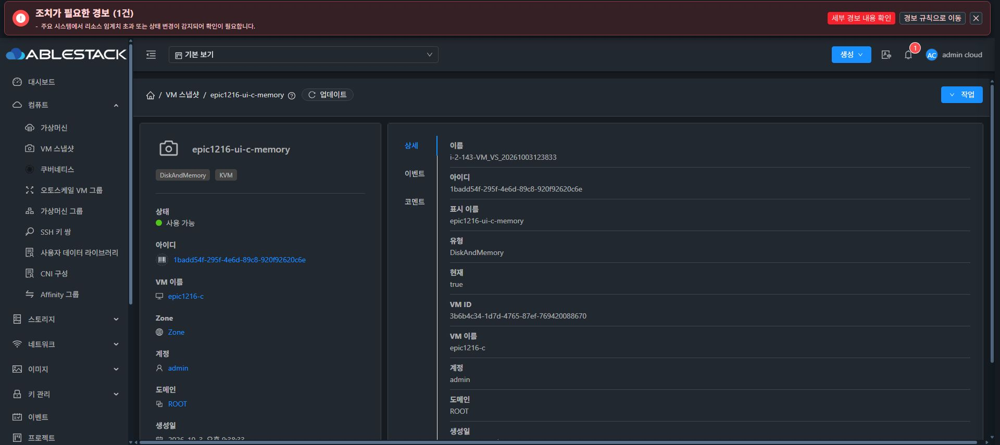
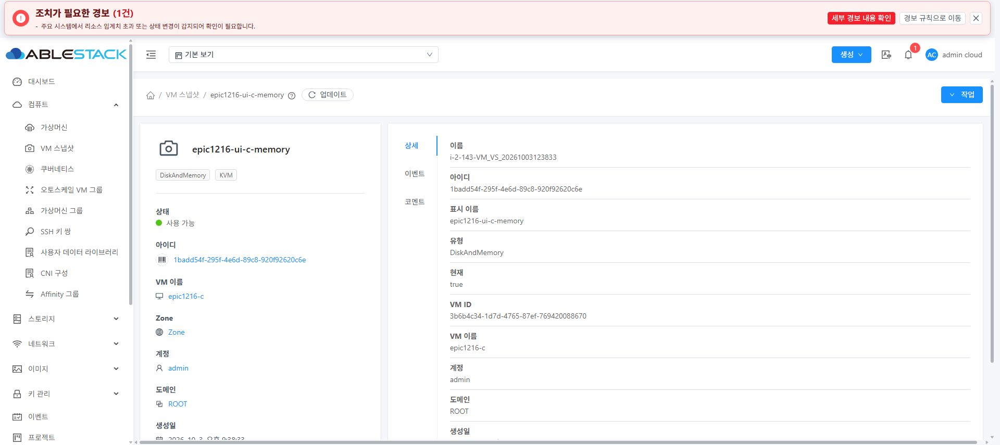
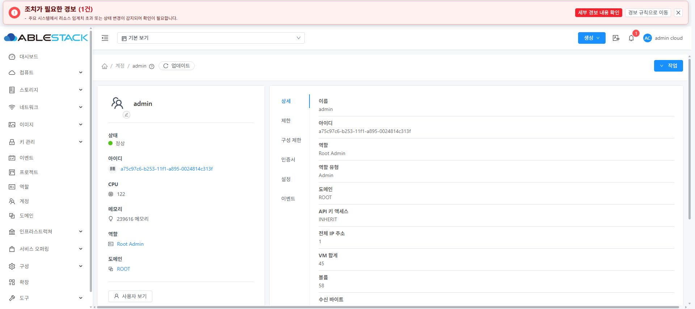
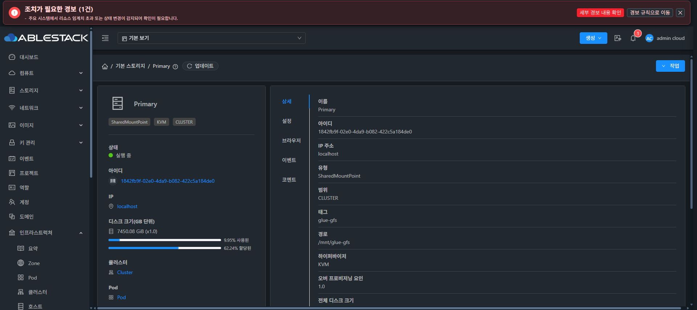
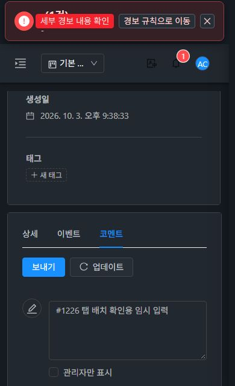

<!--
Licensed to the Apache Software Foundation (ASF) under one
or more contributor license agreements. See the NOTICE file
distributed with this work for additional information
regarding copyright ownership. The ASF licenses this file
to you under the Apache License, Version 2.0 (the
"License"); you may not use this file except in compliance
with the License. You may obtain a copy of the License at

  http://www.apache.org/licenses/LICENSE-2.0

Unless required by applicable law or agreed to in writing,
software distributed under the License is distributed on an
"AS IS" BASIS, WITHOUT WARRANTIES OR CONDITIONS OF ANY
KIND, either express or implied. See the License for the
specific language governing permissions and limitations
under the License.
-->

# #1226 공통 자원 상세 세로 탭 구현·31번 검증

- Epic: [#1216](https://github.com/ablecloud-team/ablestack-cloud/issues/1216)
- 하위 이슈: [#1226](https://github.com/ablecloud-team/ablestack-cloud/issues/1226)
- 통합 PR: [#1224](https://github.com/ablecloud-team/ablestack-cloud/pull/1224)
- 검증일: 2026-10-04 KST
- 제품 코드·UI 빌드 소스: `8d73ddb8be44f894aae1a800fd1449baa83de93f`
- upstream Europa 기준: `b31026f919856a1b61c1f86dca450e16ac0673e1` (이번 작업 시작 시 fetch 및 조상 관계 확인)

## 확정 범위와 구현

사용자 최종 지시에 따라 VM 스냅샷의 opt-in 방식 대신 **모든 자원 상세 내비게이션**에 가상머신 표준을 적용했다. 기존 VM은 별도 세로 탭 라이브러리를 사용하지 않고 현재 **Ant Design Vue `a-tabs`와 공통 `vars.less`**를 사용한다. 같은 컴포넌트와 스타일을 그대로 재사용했다.

기존 `mixinDevice`에 `resourceTabPosition`을 추가하여 desktop/tablet는 `left`, mobile은 `top`으로 공유한다. 새 라이브러리·대체 탭 컴포넌트·route meta 옵션을 추가하지 않았다. 기존 세로 VM/VPC 등도 같은 정책을 참조한다. ResourceView/DR 상세의 상단 전용 `-12px` 여백은 상단 탭에만 유지하며 세로 탭에서는 VM 기준인 `0`을 사용한다. 공통 세로 패딩 `8px 24px 8px 8px`과 테마·선택선은 기존 규칙이다.

적용된 16개 컨테이너:

| 종류 | 기존 컴포넌트 |
| --- | --- |
| 공통 상세/트리/GPU | ResourceView, TreeView, GPUTab |
| 컴퓨트/데스크톱 | InstanceTab, KubernetesServiceTab, DesktopTab |
| 자동화 | AutomationControllerTab, DeployedResourceTab |
| 호스트/인프라 | HostRedfishTab의 바깥 상세 탭, ListHostDevicesTab |
| DR 상세 | DrPlanList, DrSiteList의 상세 분기 |
| 네트워크 | VpcTab, ServiceProvidersTab, TrafficTypesTab |
| 공유 스토리지 | SharedFSTab |

**탭 내부 콘텐츠는 변경하지 않았다.** Vue compiler의 소스 위치로 추출한 90개 `a-tab-pane` 블록이 직전 설계 HEAD `271962838978be6c0aadd517cd7cf731aa58e5d7`와 모두 동일하다. DetailsTab/EventsTab/AnnotationsTab/InfoCard, compute/router 설정, AutogenView, vars.less, dark-mode.less 9개 파일도 바이트 단위로 동일하다. [비교 JSON](evidence/detail-tabs-1226/content-contract.json)에 각 파일·블록 해시를 남겼다.

로그인·첫 설정·생성 마법사·작업 대화상자 등 자원 상세 내비게이션이 아닌 탭과 Redfish 내부의 저장장치/로그 선택기는 유지한다. API, 자원 필드, 표, 버튼, 권한, URL, KeepAlive 처리도 유지한다.

## 변경 UI 모듈 검증

WSL ext4 `/home/ablecloud/work/dhslove/ablestack-cloud-epic-1216/ui`, Node 14.21.3에서 실행했다. Windows 체크아웃의 소스를 Git bundle로 동기화하고 두 체크아웃의 commit/tree를 대조했다.

| 검증 | 결과 |
| --- | --- |
| 관련 UI Jest | **8 suites / 217개 통과** |
| 공통/스냅샷 회귀 | ResourceView, SharedDetailTabs, AutogenView, DetailSettings, VmSnapshotsTab: 5 suites / 177개 |
| 전용 상세 회귀 | SharedFSTab, VmProtectionTabs, DrSiteList: 3 suites / 40개 |
| 실제 AntD mount | 모바일/태블릿/데스크톱 전환 중 선택 탭·임시 입력 유지, 권한에 따른 숨김, 단일 탭 내비게이션 숨김, 기존 URL/리스너/자원 이동 회귀 |
| 전체 UI lint | `npm run lint -- --no-fix` 통과 |
| UI production build | `npm run build` 통과; 기존 Browserslist/bundle size 경고만 있음 |
| Apache RAT | tracked-source archive, BUILD SUCCESS; unapproved/unknown 0 |

이번 변경은 UI 전용으로 변경 Maven/Agent 모듈이 없다. 전체 Cloud workflow를 수동 실행하지 않았다. 기존 #1225의 변경 Maven 모듈 6,328개 통과 기록과 전체 UI의 변경 전에도 재현된 6개 실패는 [#1225 기록](vm-snapshot-force-delete-1225.md)에 보존한다. 이번 관련 테스트 통과를 전체 UI/전체 Cloud CI 통과로 확대하지 않는다.

## 31번 정적 UI 배포

활성 경로 `/usr/share/cloudstack-management/webapp`의 UI 정적 파일만 갱신하고 index는 마지막에 교체했다. webapp 루트를 삭제하거나 dist의 rsync --delete를 실행하지 않았다. 사전 디스크 여유는 약 16 GiB였다.

- **834개 정적 파일 전체 SHA-256 일치**, served index도 빌드 결과와 일치.
- `WEB-INF` 존재 및 서버 파일 전체 해시 보존. `META-INF`는 배포 전부터 없었고 같은 상태를 유지.
- `config.json` SHA-256 `b54d18abc5a143c64e2dec3441af0a45619ec20f110647119e6b8d2e199ff453` 보존.
- Mold active, `/client/` **HTTP 200**, 관리 PID **1798760 유지**. 재시작하지 않음.
- `resourceTabPosition`, 기존 스냅샷·MoldDialog·FTCTL `blockingLoadingState`/`fetchSyncProgress`/`extractJobId` 마커 보존.
- 백업: `/root/epic1226/ui-backup-20261004-141422`.
- 실제 새 브라우저가 받은 `/client/js/app.ab9928c6.js` SHA-256 **`0283fdf54dae01be94fd6b91027fa70215eed6b58c5ea7979d941808e9ddfa07`**. source dist, 활성 webapp, HTTP 응답의 세 해시가 일치.

[배포 결과](evidence/detail-tabs-1226/deployment.json) · [패키지 SHA](evidence/detail-tabs-1226/package.json).

## 실제 브라우저 검증

31번에 새 문서를 로드한 Chrome에서 **24개 관측 기록**, console warn/error **0건**을 수집했다. [브라우저 JSON](evidence/detail-tabs-1226/browser-verification.json) · [변경 전 내용](evidence/detail-tabs-1226/content-before.json).

| 범위 | 실제 결과 |
| --- | --- |
| VM 스냅샷 desktop 다크/라이트 | 3개 탭 left, y 좌표가 서로 다름, 패딩/선택선은 기존 VM 규칙. 1920px·1366px에서 페이지 가로 넘침 없음 |
| 상세·이벤트·코멘트 | 표시 텍스트가 변경 전과 동일. 이벤트/코멘트 0건의 기존 표·입력·버튼·페이지 형식 유지 |
| 같은 화면 탭 전환·resize | 코멘트 임시 입력과 선택 탭 유지; 저장 버튼은 누르지 않음 |
| mobile | 390px(다크/라이트), 765px에서 기존 VM 규칙인 top; 766px부터 left. 390px 이벤트 표의 페이지 가로 넘침 없음 |
| 키보드 | Tab으로 이벤트 탭 포커스, Enter로 선택 가능 |
| URL·이력 | 새로고침 및 뒤로/앞으로에서 유효한 탭 선택 복원 |
| 계정 | 기존 6개 탭 이름/순서 동일, left; 제한 탭의 기존 사용량/제한 표시 정상 |
| 다른 상세 | VM, 볼륨, 1차 스토리지, 존, 도메인의 기존 탭과 콘텐츠가 left 배치로 표시 |

브라우저 뒤로/앞으로의 자원 재조회 때 코멘트 미저장 입력이 비워지는 동작은 이전 앱 `app.4c33579b.js`의 **가로 탭 화면에서도 동일하게 재현**했다. 이력 이동의 기존 동작을 유지했으며 이번 작업에 별도 입력 보존 수정을 추가하지 않았다. JSON의 `draftRetained=false`는 이 비교 결과를 명시한 기록이다. 같은 화면의 탭 전환/resize에서는 임시 입력을 유지한다.

전용 자원이 필요한 쿠버네티스/데스크톱/자동화/Redfish/DR/SharedFS/GPU 등의 모든 실제 상세 인스턴스를 생성하여 시험하지 않았다. 해당 컨테이너는 16개 소스 적용/90개 내부 콘텐츠 비교와 관련 자동 회귀 범위에 포함된다. 실화면 검증은 위 7종 자원이다. VM/스냅샷 작업이나 코멘트 제출 등 데이터 변경을 수행하지 않았고, 검증 후 다크 테마와 기본 뷰포트를 복원했다.

### 배포 후 실제 화면

### 검토·종료 상태

이슈 #1226의 구현·변경 UI 모듈 빌드·31번 배포·대표 상세의 실제 UI 검증을 완료하여 통합 PR #1224에 추가한다. Epic의 총 9개 하위 작업 구현 근거가 준비된 상태다. PR 검토/Europa 병합과 검증 기록 확인 전까지 이슈는 OPEN으로 유지하며 자동 CI 결과는 로컬 모듈 검증과 별도로 보고한다.
