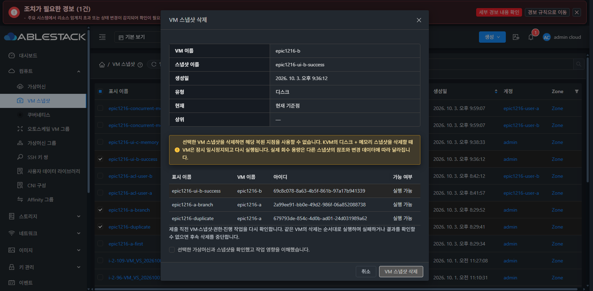
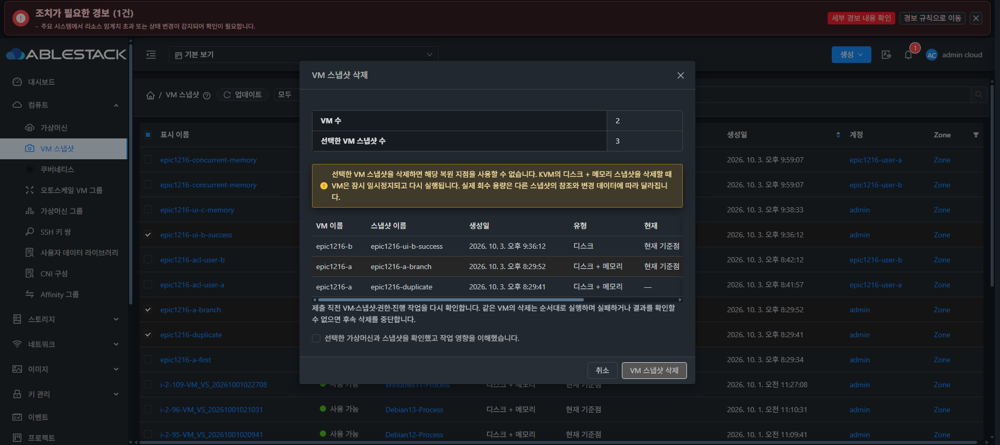
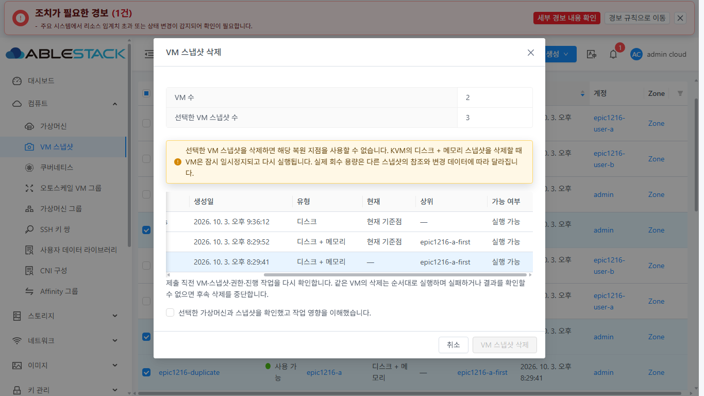
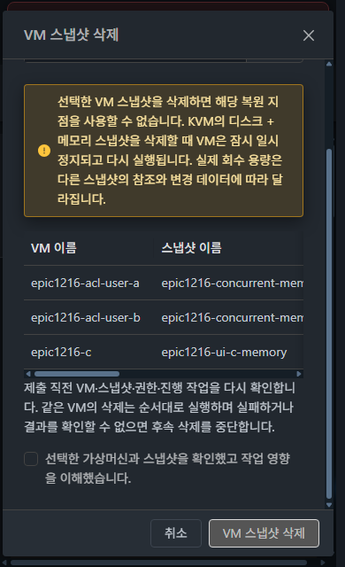

<!--
Licensed to the Apache Software Foundation (ASF) under one
or more contributor license agreements.  See the NOTICE file
distributed with this work for additional information
regarding copyright ownership.  The ASF licenses this file
to you under the Apache License, Version 2.0 (the
"License"); you may not use this file except in compliance
with the License.  You may obtain a copy of the License at

  http://www.apache.org/licenses/LICENSE-2.0

Unless required by applicable law or agreed to in writing,
software distributed under the License is distributed on an
"AS IS" BASIS, WITHOUT WARRANTIES OR CONDITIONS OF ANY
KIND, either express or implied.  See the License for the
specific language governing permissions and limitations
under the License.
 -->

# VM 스냅샷 다중 삭제 요약 개선

PR #1224의 후속 수정이다. VM 두 대의 스냅샷 세 개를 선택해도 상단에 첫 스냅샷의 VM 이름·생성일·유형·현재 여부만 표시되던 문제를 수정했다.

## 변경

- 다중 삭제의 상단은 선택한 **VM 수·스냅샷 수**를 기존 Ant Design Vue Descriptions로 표시한다. VM 수는 불변 대상의 VM UUID를 중복 제거해 계산하므로 같은 VM의 여러 스냅샷이나 서로 다른 VM의 같은 스냅샷 이름에 영향을 받지 않는다.
- 기존 대상 표에는 **VM 이름·스냅샷 이름·생성일·유형·현재 여부·상위·실행 가능 여부**를 표시한다. UUID는 화면에서 제거하고 내부 대상 식별자로 유지한다.
- 대상 UUID와 VM UUID에 맞는 최신 스냅샷/VM 응답으로 각 행을 연결한다. 응답 순서와 이름 변경에 의존하지 않는다. 조회되지 않은 항목은 선택 집합에서 빠지지 않으며 확인되지 않은 정보는 —로 표시하고 실행을 차단한다.
- 단일 삭제·복원은 기존 6행 요약을 유지한다. 공통 MoldDialog·Descriptions·Table 및 mold-dialog-section/summary 스타일을 재사용하고 새 스타일이나 공통 컴포넌트를 추가하지 않는다. 표는 기존 AntD 가로 스크롤을 사용한다.
- 삭제 실행 엔진·권한·불변 대상·제출 직전 검증·같은 VM 직렬 처리·실패/결과 불명 중단·단일 Error 강제 삭제 제한은 변경하지 않는다.

## 빌드·배포

UI 빌드 소스는 `2d4d8eb42d1cf71b46b491be3d99df329896de32`다. WSL ext4 clone과 Node 14.21.3에서 관련 **11 suites / 252개 통과**, 전체 UI lint와 production build를 완료했다. 새 회귀 4개는 렌더링된 3대상/2VM의 개별 정보·응답 순서/최신 이름 변경·대상 조회 불가·단일 삭제/복원 요약을 확인한다.

31번의 활성 `/usr/share/cloudstack-management/webapp`에 **834개 정적 파일의 SHA-256 일치**를 확인했다. WEB-INF/config·서버 파일을 보존했고 Mold active, PID **1798760 유지**, `/client/` **HTTP 200**이다. 백업은 `/root/epic1224-summary/ui-backup-20261004-171331`이다. Java/Agent는 변경하지 않았다.

브라우저와 HTTP에서 사용하는 `app.eb396625.js`의 SHA-256은 `5895a4af742e2593d6e93c33cb6d17ede5d05c4af2edf93964a657f05bfe7dcf`다. 실제 대화상자 lazy chunk `chunk-72b4e179.4acaff89.js`도 source/배포/HTTP가 `fa06d4e1015f8a79ea986aac7eadb1ec5a9658041c51c768123c7aff17f7915d`로 일치한다. 새 한국어 레이블과 기존 상세 탭·스냅샷·MoldDialog·FTCTL 마커를 확인했다.

[검증 결과](evidence/vm-snapshot-bulk-summary-1224/validation.json) · [배포 결과](evidence/vm-snapshot-bulk-summary-1224/deployment.json) · [패키지](evidence/vm-snapshot-bulk-summary-1224/manifest.json) · [HTTP 번들](evidence/vm-snapshot-bulk-summary-1224/served-bundle.json)

## 실제 UI 검증

**13개 관측**을 저장했다. 다크 1920×855, 라이트 1366×768, 다크/라이트 390×640에서 표의 각 행과 요약을 확인했다.

| 검증 | 결과 |
| --- | --- |
| 사용자 사례 | epic1216-ui-b-success / epic1216-a-branch / epic1216-duplicate: 상단 VM 수 2·스냅샷 수 3. 모든 행의 6개 정보가 수정 전 목록의 해당 UUID와 일치한다. 서로 다른 유형·현재 여부·상위가 첫 항목의 값으로 덮이지 않는다. |
| 세 VM | ACL user-a/user-b/C의 세 스냅샷: 상단 VM 수 3·스냅샷 수 3. 두 스냅샷의 이름이 같아도 개별 행과 집계를 유지한다. 실제 API 응답의 6개 필드와 UUID별 대조가 모두 일치한다. |
| 단일 삭제 | VM B의 기존 6행 요약이 유지되며 다중 대상 표/집계는 나타나지 않는다. |
| 확인 | 다중 대상의 영향 확인 체크 전에는 삭제 버튼이 비활성, 체크 후 활성임을 확인하고 취소했다. |
| 가독성·스크롤 | 다크/라이트의 요약·행 정보·버튼을 확인했다. 표의 가로 스크롤 0→248로 상위/가능 여부에 접근했다. 모바일 본문 scrollTop 0→115 동안 헤더 y=12·푸터 y=575가 유지된다. |

검증에 사용한 삭제창은 확인 후 취소했고 최종 검토용 확인창만 미제출 상태로 열어 두었다. 삭제 제출 버튼을 호출하지 않았으며 이번 표시 수정의 검증을 위해 실제 스냅샷을 삭제하지 않았다. 네트워크 이벤트 보관 범위의 삭제 요청도 0건이지만 초기 일부 이벤트가 누락되어 전체 네트워크 이력 증거로 사용하지 않는다. 테마는 원래 다크로 복원하고 임시 뷰포트 설정을 해제했다. 브라우저에는 사용자 사례의 수정된 확인창을 열어 두었다.

[브라우저 관측](evidence/vm-snapshot-bulk-summary-1224/browser-verification.json) · [수정 전 대상](evidence/vm-snapshot-bulk-summary-1224/before-selection.json) · [실제 API 대조](evidence/vm-snapshot-bulk-summary-1224/api-comparison.json)

전체 UI/전체 Cloud workflow는 이번에 다시 실행하지 않았다. 이전 전체 UI 검증의 6개 실패와 저장소 전체 CI 제한은 [Epic 기록](vm-snapshot-epic-1216.md)에 유지한다. 관련 252개·lint·production build·31번 표시 검증을 전체 CI 성공으로 확대하지 않는다.

