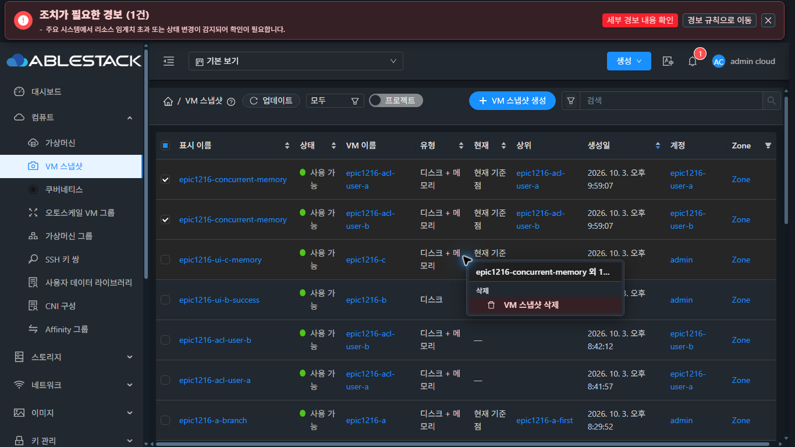
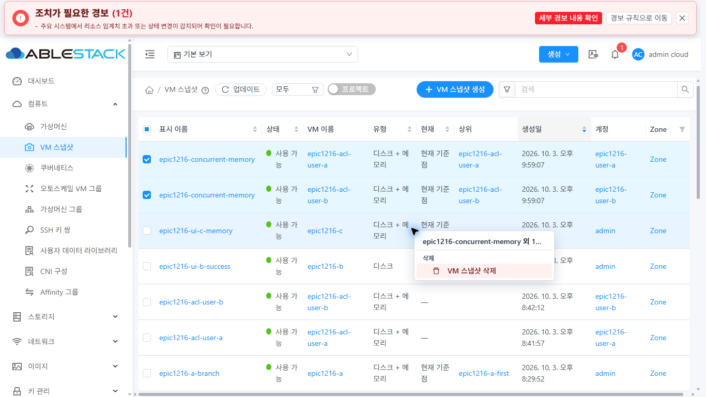
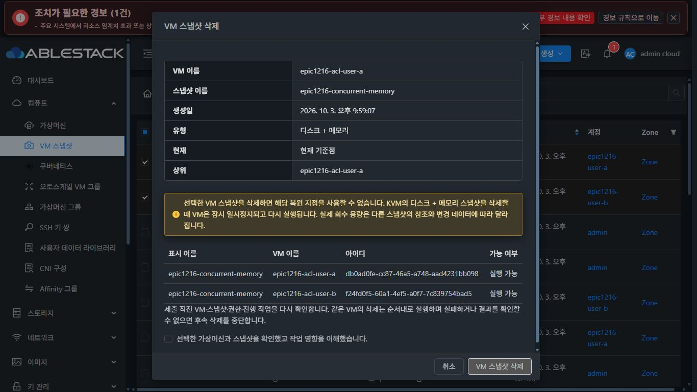
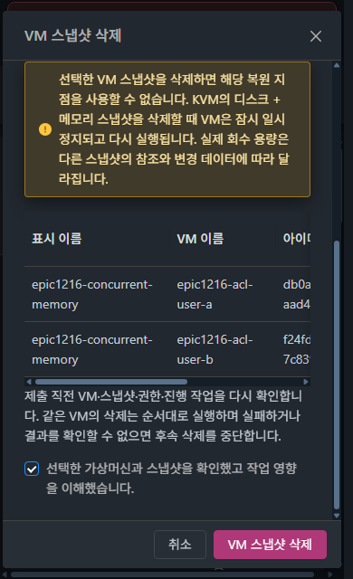

<!--
Licensed to the Apache Software Foundation (ASF) under one
or more contributor license agreements.  See the NOTICE file
distributed with this work for additional information
regarding copyright ownership.  The ASF licenses this file
to you under the Apache License, Version 2.0 (the
"License"); you may not use this file except in compliance
with the License.  You may obtain a copy of the License at

  http://www.apache.org/licenses/LICENSE-2.0

Unless required by applicable law or agreed to in writing,
software distributed under the License is distributed on an
"AS IS" BASIS, WITHOUT WARRANTIES OR CONDITIONS OF ANY
KIND, either express or implied.  See the License for the
specific language governing permissions and limitations
under the License.
 -->

# VM 스냅샷 다중 선택 공통 컨텍스트 메뉴

PR #1224의 후속 개선이다. 상단의 선택 삭제 버튼을 제거하고, 가상머신 목록에서 사용하는 기존 ListView → ResourceContextMenu → ResourceActionMenu 경로로 다중 삭제를 실행한다. 메뉴의 스타일·그룹·아이콘·위치 계산은 변경하지 않는다.

## 대상 결정

| 선택 | 메뉴 대상 | 작업 |
| --- | --- | --- |
| 0~1개 | 우클릭한 스냅샷 | 기존 단일 행 작업. A 한 개 체크 후 B를 우클릭하면 B가 대상이다. |
| 2개 이상 | 선택한 전체 스냅샷 | VM 목록처럼 첫 이름과 나머지 개수를 제목에 표시한다. 삭제만 제공하며 선택 밖 행이나 표 배경을 우클릭해도 같은 선택 묶음이다. |

대화상자를 열 때 모든 대상 UUID와 VM UUID를 복사하여 동결한다. 목록 갱신이나 선택 변경으로 작업 대상이 바뀌지 않는다. 권한이 없는 삭제 메뉴는 노출하지 않는다.

공통 ListView의 선택 행 객체 전달 누락도 수정했다. 화면의 체크 상태만 가지고 있던 경로에서 현재 목록과 선택 키로 실제 행을 구한 뒤, 그룹 자격 검사와 공통 메뉴에 동일한 행 집합을 전달한다. VM/스냅샷을 직접 렌더링하는 테스트로 이 경로를 검증한다.

## 기존 삭제 제한

일괄 일반 삭제는 기존 구현을 재사용한다. 모든 대상의 최신 스냅샷/VM/작업/백업/권한을 검증하고, 차단 사유가 있으면 제출을 비활성화한다. 같은 VM은 직렬, 다른 VM은 최대 두 묶음까지 병렬 처리한다. 실패나 결과 불명은 해당 VM의 나머지 항목을 미실행으로 남긴다.

이슈 #1225의 강제 삭제는 루트 관리자에게 허용된 단일 Error 항목으로 제한한다. 일괄 강제 삭제로 확장하지 않는다. 목록 선택이 여러 개라면 해제 후 해당 오류 항목의 기존 단일 삭제창에서 복구한다.

## 빌드·배포·검증

- 최종 UI 빌드 소스: `a9b53c45c00153ed0c25981f348e8db17907b4e4`. WSL ext4 + Node 14.21.3에서 관련 **11 suites / 248개**, 전체 lint, production build 통과. VM/스냅샷의 렌더링된 메뉴를 포함하며 계정·디스크 오퍼링도 회귀 범위에 포함했다.
- 전체 UI 재실행은 **90 suites / 898개 중 892 통과·6 실패**다. 이전 기록과 같은 NIC·경보 발견·Array.at·네트워크 요약의 4개 suite이며 전체 UI 성공으로 보고하지 않는다. 전체 Cloud workflow는 수동 실행하지 않았다.
- 31번의 활성 webapp에서 **834개 정적 파일 SHA-256 일치**, WEB-INF/server 파일·config 보존, Mold active·PID **1798760 유지**, `/client/` HTTP **200**을 확인했다. 백업은 `/root/epic1224-context/ui-backup-20261004-151746`이다.
- 브라우저가 사용하는 `app.7d38d664.js`의 빌드 파일·활성 파일·HTTP SHA-256은 모두 `be912d908a0c662836285408bdfd50187fc124cdd155fb11dba8a1c9fd226e19`로 일치한다. 기존 상세 탭·스냅샷·MoldDialog·FTCTL 마커를 보존했다.

증거 파일 검사에서 발견한 JPEG 확장자 4개를 실제 형식에 맞췄고, 새 PNG 7개는 저장소와 같은 oxipng 9.1.5 옵션으로 최적화했다. 변환 전후의 디코딩된 픽셀이 모두 동일하며 재실행해도 파일이 바뀌지 않는다. 이번에 변경한 문서 4개의 라이선스 헤더도 저장소 템플릿과 정확히 맞췄다. 제품 소스와 배포 파일은 변경하지 않았다.

[자동 검증 결과](evidence/vm-snapshot-toolbar-1224/validation.json) · [배포 결과](evidence/vm-snapshot-toolbar-1224/deployment.json) · [패키지](evidence/vm-snapshot-toolbar-1224/package.json) · [실제 HTTP 번들](evidence/vm-snapshot-toolbar-1224/served-bundle.json)

## 실제 UI 검증

**16개 관측 기록**을 남겼다. 다크/라이트, 1920·1366·390px에서 메뉴와 확인창을 확인하고 최종 브라우저를 기존 다크 테마·원래 화면 크기로 복원했다.

| 경로 | 결과 |
| --- | --- |
| 툴바 | 선택 두 개에서도 생성 버튼만 남고 검색과 같은 y 좌표다. 상단 선택 삭제가 없다. |
| 다중 대상 | ACL user-a/user-b의 두 스냅샷 선택 후 선택 밖 user-c 행을 우클릭해도 선택한 두 개가 제목·삭제 확인창과 일치한다. 모두 실행 가능이며 영향 확인 체크 후 버튼 활성화를 확인하고 취소했다. |
| 단일 대상 | A 한 개를 체크하고 C를 우클릭하면 C 메뉴와 C 단일 확인창이다. A가 삭제 대상으로 섞이지 않는다. |
| 공통 메뉴 | VM 목록과 폭 272px, 배경·텍스트 색·그룹·삭제 강조가 동일하다. 최종 VM 목록도 두 개 선택 후 정지·재시작·삭제 메뉴가 그대로 표시된다. VM 작업은 실행하지 않았다. |
| 키보드 | Shift+F10으로 다중 메뉴를 열고 Escape로 닫았다. |
| 대화상자 | 다크/라이트 요약·대상 표·버튼 가독성을 확인했다. 390px에서 본문 scrollTop 0→320 동안 헤더 y=12·푸터 y=575가 유지된다. |

실환경은 메뉴 실행 → 최신 자격 조회 → 확인창/확인 체크 → 취소까지 검증했다. 이번 후속 변경에서 실제 스냅샷 삭제를 제출하지 않았다. 같은 VM 직렬/다른 VM 제한 병렬·실패/결과 불명 중단·중복 제출·UUID 고정·단일 강제 삭제는 관련 자동 테스트로 확인했고, 기존 실제 일괄 삭제 기록은 [Epic 검증 이력](vm-snapshot-epic-1216.md)에 보존한다.

[브라우저 관측](evidence/vm-snapshot-toolbar-1224/browser-verification.json) · [최종 툴바 좌표](evidence/vm-snapshot-toolbar-1224/after-dark-default.json) · [기존 VM 메뉴 관측](evidence/vm-snapshot-toolbar-1224/vm-standard-context.json)

