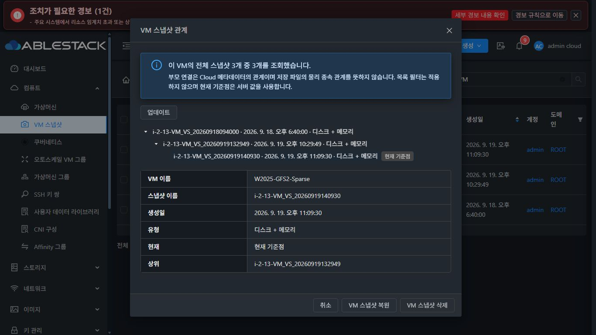
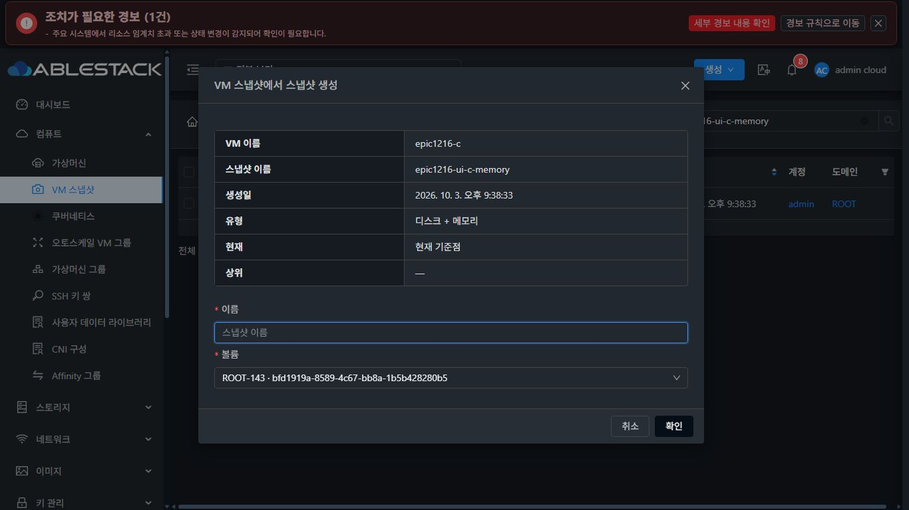
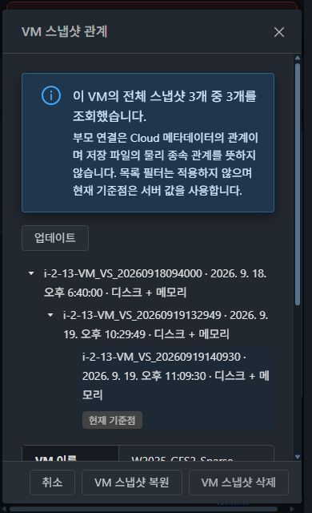
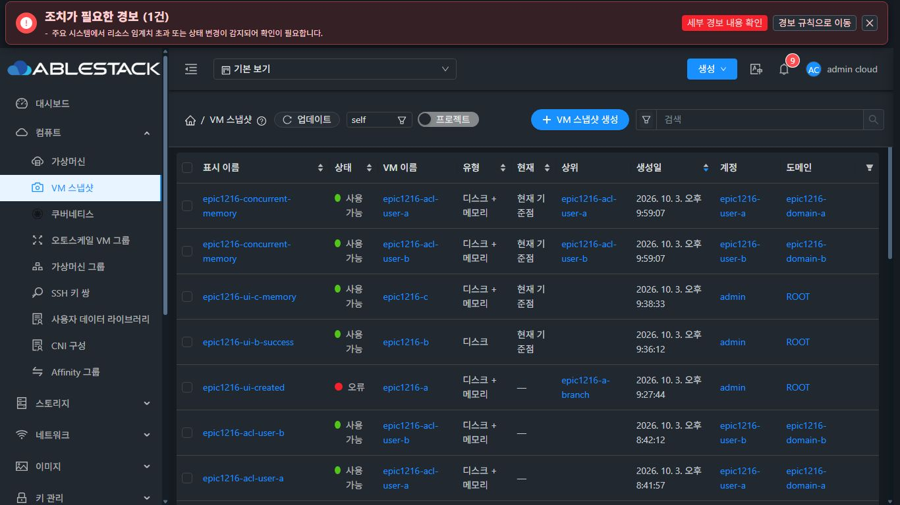
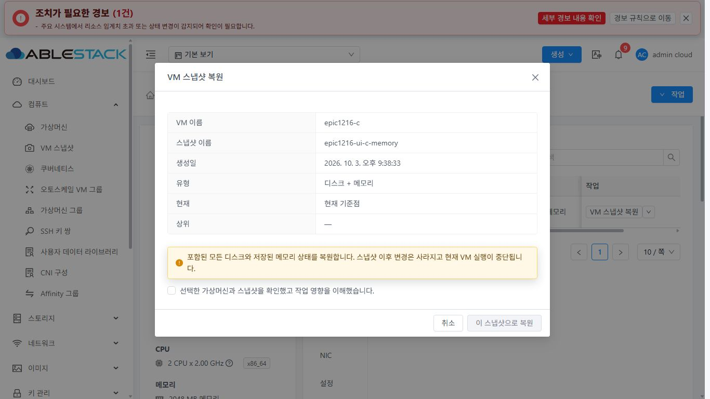
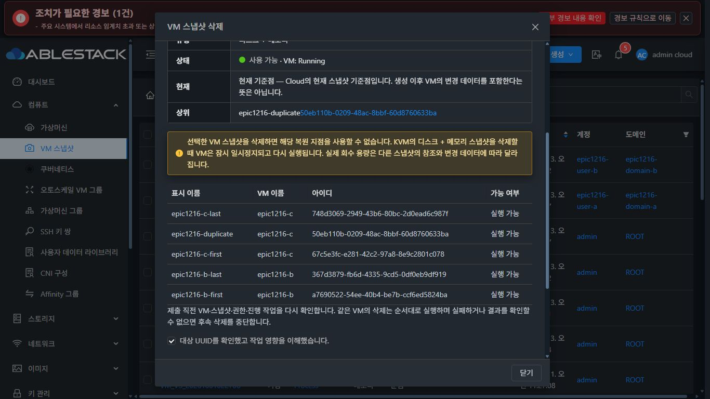
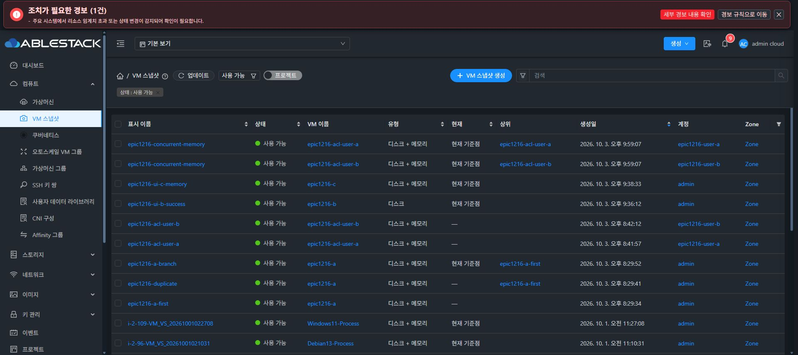
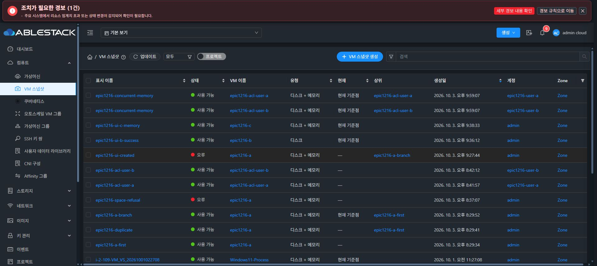

<!--
Licensed to the Apache Software Foundation (ASF) under one
or more contributor license agreements.  See the NOTICE file
distributed with this work for additional information
regarding copyright ownership.  The ASF licenses this file
to you under the Apache License, Version 2.0 (the
"License"); you may not use this file except in compliance
with the License.  You may obtain a copy of the License at

  http://www.apache.org/licenses/LICENSE-2.0

Unless required by applicable law or agreed to in writing,
software distributed under the License is distributed on an
"AS IS" BASIS, WITHOUT WARRANTIES OR CONDITIONS OF ANY
KIND, either express or implied.  See the License for the
specific language governing permissions and limitations
under the License.
 -->

# VM 스냅샷 Epic #1216: 구현 및 검증 기록

Epic #1216과 하위 #1217~#1223의 구현·빌드·31번 배포·검증 기록이다. 자동 검증과 실환경에서 실행한 범위를 구분하며, 미실행 항목을 실환경 성공으로 취급하지 않는다.

## 구현 계약

| 하위 이슈 | 구현 |
| --- | --- |
| #1217 대상 안전성 | 선택 0~1개에서는 우클릭한 행, 2개 이상에서는 VM 목록의 공통 컨텍스트 메뉴로 선택한 전체 항목을 대상으로 한다. 메뉴 제목에 묶음 대상을 표시하고 확인창 UUID를 고정한다. 상단 선택 삭제 버튼은 제거한다. |
| #1218 검색·페이지 | VM 표시 이름·내부 이름·호스트 이름과 스냅샷 이름·UUID·설명을 서버에서 검색한다. 유형·현재 기준점·상태 필터 및 허용된 서버 정렬에 ID 보조 정렬을 적용한다. 목록과 count에 같은 ACL 조건을 적용한다. |
| #1220 작업 상태 | 제출 직전에 스냅샷·VM·진행 중 작업·백업 및 접근 권한을 재조회한다. 같은 VM의 삭제는 직렬, 다른 VM은 최대 두 개를 병렬 처리한다. 실패·결과 불명 시 해당 VM의 후속 요청을 중단한다. |
| #1221 공통 UI | 기존 AutogenView/ListView, Vue 3, Ant Design Vue, ResourceContextMenu를 사용한다. 목록 배치를 유지한다. 공통 대화상자 스타일에서 헤더·푸터를 고정하고 본문만 스크롤한다. |
| #1222 관계 | VM 범위의 모든 페이지를 독립적으로 읽는다. 숨겨진 노드는 VM ID를 지정한 요청에서만 포함하고 기존 ACL을 적용한다. UUID로 연결하며 누락 부모·순환·부분 결과를 표시한다. 최대 2,000개이다. |
| #1219 스토리지 | 관리되지 않는 SharedMountPoint/KVM/QCOW2의 내부 COW 스냅샷에만 논리 할당량 정책을 적용한다. 다른 제공자와 managed storage의 카운터·드라이버 경로를 유지한다. |

`current`는 복원 기준점이다. 최신 생성 시각, 백업 완료 여부, 물리 사용량을 뜻하지 않는다. 숨겨진 관계 노드는 Ready 작업 대상이 아니며 작업을 활성화하지 않는다.

## 스토리지 용량 계약

논리 할당량에는 각 볼륨의 가상 크기를 한 번 반영한다. 내부 qcow2 스냅샷마다 같은 볼륨의 가상 크기를 더하지 않는다. 기존 `vm_snapshot_chain_size` 값이 남아 있어도 적용 대상 풀의 집계에서는 제외한다. 이것은 과거 모든 스냅샷의 실제 사용량을 0으로 정의하는 변경이 아니다.

물리 사용량은 풀의 실제 통계로 유지한다. RAM 저장과 이후 COW 쓰기는 물리 공간을 사용한다. 메모리 스냅샷 생성 시 영향을 받는 풀의 잠금을 ID 순서로 잡고 Agent의 최신 통계를 읽는다. 루트 풀은 RAM + 10% + 1 GiB, 추가 데이터 풀은 1 GiB의 여유 공간을 검사한다. 실제 임계치와 잔여 공간을 적용하며 논리 over-provisioning은 사용하지 않는다. 통계가 없거나 공간이 부족하면 요청을 거부한다. 이 검사 뒤 장시간의 게스트 쓰기로 생기는 물리 소모는 일반적인 풀 모니터링·경보의 대상이다.

정책 버전과 최초 카운터는 표시되지 않는 volume details에 보존한다. 중간에 중단된 전환의 원본 출처를 다시 쓰지 않는다. 생성·삭제 재시도, resize, 새로운 작업에서 원래 볼륨 크기를 반복 누적하지 않는다.

### 기존 카운터 감사 도구

`tools/vmsnapshot-accounting-transition.py`의 기본 `dry-run`은 DB를 수정하지 않는다. MySQL 인증은 관리 서버의 별도 파일에 두고 `chmod 600`을 적용한다. 인증 파일과 세션/API 키는 Git, 이슈, 검증 기록에 포함하지 않는다.

```sh
python3 tools/vmsnapshot-accounting-transition.py dry-run \
  --mysql-defaults-file /root/epic1216/mysql.cnf \
  --audit /root/epic1216/legacy-audit.json
```

저장된 감사에는 볼륨 UUID, VM·풀 ID, 가상 크기, 원본 카운터, 스냅샷 메타데이터 지문과 고유 감사 ID를 포함한다. 기존 감사 파일을 덮어쓰지 않는다. 미버전 출처가 이미 있으면 자동 전환하지 않는다.

`apply`와 `rollback`은 Mold가 inactive이고 대상 VM에 미완료 스냅샷 작업이 없을 때만 실행한다. 적용 전 UUID·풀·크기·지문을 대조하고 행 잠금·원본 카운터·자기 감사 ID 조건으로 변경한다. 재실행은 같은 상태에서만 no-op이다. 적용 이후 다른 작업·resize·migration이 발생하면 rollback을 거부한다. 현재 배포안은 기존 카운터를 보존하며 이 도구의 apply/rollback을 자동으로 실행하지 않는다.

## 빌드와 배포 절차

Windows의 별도 `codex/vm-snapshot-epic-1216` 작업 트리와 WSL ext4의 전용 작업 트리를 사용한다. 기존 FTCTL 작업 트리를 변경하지 않는다. 전체 Cloud 빌드를 실행하지 않는다.

```sh
source /home/ablecloud/work/dhslove/europa-build-env.sh
cd /home/ablecloud/work/dhslove/ablestack-cloud-epic-1216
mvn -B -pl api,engine/schema,server,engine/storage/snapshot install
cd ui
unset NODE_OPTIONS
npm ci --ignore-scripts --no-audit --no-fund
npm run lint
npm run test:unit -- --runInBand \
  'VmSnapshot|vmSnapshot|ResourceContextMenu|ListViewAccounts|ListViewDiskOffering|ListViewSnapshotContext|AutogenView|AutogenSnapshotActions'
npm run build
```

31번 관리 서버는 `cloudstack-4.23.0.0-Mold.Europa-202609222315.jar`에 클래스를 합친 형태이다. 변경 모듈 빌드 결과에서 변경 Java 클래스와 내부 클래스만 추출하고 SHA-256 목록을 저장한다. 실제 JAR을 먼저 백업한 뒤 Mold를 중지하고 이 클래스들을 반영한 후 재시작한다. 원본 manifest와 관련 없는 JAR 항목을 유지한다. 관리 서버의 실제 클래스 바이트를 빌드 산출물의 SHA-256과 대조한다.

UI는 `/usr/share/cloudstack-management/webapp`의 정적 파일만 업데이트한다. 기존 `WEB-INF`, `META-INF`, `config.json` 및 서버 디렉터리를 유지한다. 웹앱 루트 교체나 `rsync --delete`를 사용하지 않는다. 배포 전후 WEB-INF 존재, `/client/` HTTP 200, Mold active, 번들 마커·해시, 런타임 로그·API 응답을 확인한다.

복구 시 백업한 JAR을 원래 경로에 되돌리고 서비스를 재시작한다. 정적 파일은 개별 백업에서 복구한다. DB를 보존하는 배포이므로 배포 복구에 DB 카운터 복원이 필요하지 않다.

## 31번 배포와 검증 결과

2026-10-03, 관리 서버 `10.10.31.10` 및 호스트 31.2/31.3에서 검증했다. upstream Europa를 다시 fetch하여 기준 commit `b31026f919856a1b61c1f86dca450e16ac0673e1`과 같음을 확인했다. 기존 사용자 VM은 읽기만 수행했고, 복원·삭제·추출은 이 Epic의 전용 시험 자원에서 수행했다.

### 빌드 범위

| 검사 | 결과 |
| --- | --- |
| API 모듈 install / 전체 단위 테스트 | 1,025개, 실패 0, 오류 0 |
| 스키마 모듈 install / 전체 단위 테스트 | 410개, 실패 0, 오류 0 |
| 서버 모듈 install / 전체 단위 테스트 | 3,905개, 실패 0, 오류 0, 기존 skip 5개 |
| 스냅샷 모듈 install / 전체 단위 테스트 | 68개, 실패 0, 오류 0 |
| UI 회귀 | 17 suites, 260개 통과 |
| UI 변경 파일 lint / production build | 통과. 기존 번들 크기 관련 경고 2건과 Browserslist 안내가 있다. |
| 카운터 전환 Python 단위 테스트 | 4개 통과 |
| MySQL 전환 통합 검증 | 격리 fixture DB에서 실제 SQL apply/재실행/rollback/재실행, 출처·resize·migration·스냅샷 변경 거부 검증. fixture DB 제거 완료 |
| Apache RAT | 최종 tracked-source archive에서 CI와 같은 RAT 명령 실행. BUILD SUCCESS, 승인 13,038 / 미승인 0 / unknown 0 |

Maven 테스트 합계는 5,408개이며 실패·오류는 0, skip은 5개이다. 로그: `module-build-10-all-tests.log` (API/서버), `module-build-9-all-tests.log` (스키마), `module-build-14-snapshot.log` (최종 스냅샷), `ui-tests-final-9.log`, `ui-lint-final-9.log`, `ui-build-final-9.log`. WSL ext4에서 실행했다. 전체 Cloud 빌드와 수동 GitHub Actions full build는 실행하지 않았다.

서버 전체 테스트에서 upstream ISO 기본값 2를 과거 기본값 1로 기대하던 fixture를 수정했다. 운영 ISO 동작은 변경하지 않았다. 제품 버전은 lockfile의 Vue/compiler-sfc 3.2.37, Ant Design Vue 3.2.20이며 별도 목업과 배포 제품을 구분한다.

### 실제 용량과 스냅샷 동작

| 항목 | 실제 검증 |
| --- | --- |
| 기존 데이터 재계산 | 양수 legacy 카운터 14개의 합계 1,717,986,918,400 B를 보존. Primary 논리 할당량이 6,052,431,595,232 → 4,334,444,676,832 B로 정확히 이 합계만큼 줄었다. 배포 전후 61개 볼륨과 기존 16개 스냅샷 DB 값은 동일 |
| 다른 풀 | CLVM / CLVM_NG는 각각 230,477,004,800 B로 유지 |
| 새 시험 볼륨 | A/B/C 및 ACL용 3개, 각 root 100 GiB. 실제 볼륨 6개만큼 증가하여 Primary 4,978,689,969,440 B. 내부 스냅샷 생성·복원·삭제로 반복 증가하지 않음 |
| 게스트 복원 | A에 marker/16 MiB payload 1 기록 → A1 → payload 2/A2 → A1 복원. QGA로 marker 1과 원래 payload SHA-256 일치 및 payload 2와 다름 확인. 이어 A1에서 A3 분기 생성, parent/current/DB/provider 대조 |
| 실제 물리 사용 | A qcow2 파일 7,000,080,384 → A1 7,661,678,592 → A2 8,342,761,472 → A3 9,025,028,096 B. C의 UI 메모리 스냅샷은 vm-state-size 1,212,637,415 B. RAM/COW 사용을 0으로 취급하지 않음 |
| 단일 대상 | A 체크/B 우클릭 상태에서 B 복원과 B 중간 삭제 각각 POST 1회, B UUID만 전달. 다른 A 스냅샷은 보존 |
| 선택 삭제 | B 2개/C 3개를 UI에서 삭제. POST 정확히 5회, 같은 VM 직렬/다른 VM 최대 2개 병렬, 이중 클릭 중복 없음. 결과 5개 성공 및 job ID 표시. DB/provider에서 B/C 체인 제거, 논리 할당량 유지 |
| 물리 회수 | 삭제 전후 B 7,967,473,664 → 7,522,471,936 B, C 8,773,877,760 → 6,871,363,584 B. 가상 크기 100 GiB와 회수량을 동일시하지 않음 |
| 생성 UI | B Disk 생성 job `372c6f7e-2cfa-4c4c-98a6-11b4e50daa5a`, C DiskAndMemory 생성 job `8bda3a34-51eb-4145-b188-0022e3486fe3` 성공. 각각 POST 1회, C Cloud Ready와 libvirt/qcow2 provider 일치, 논리 할당량 유지. B Disk는 Cloud Ready/연결된 volume snapshot과 Primary Ready 참조를 확인했으며, libvirt 내부 스냅샷 성공으로 보고하지 않음 |
| 볼륨 추출 UI | C snapshot `1badd54f-295f-4e6d-89c8-920f92620c6e` / 소유 volume `bfd1919a-8589-4c67-bb8a-1b5b428280b5`로 POST 1회. job `5331ccee-3500-4998-9068-45871fce35a4` 성공. 결과 snapshot `51df57e9-bed5-4c4d-bce9-351d32e6dfda` BackedUp/Image Ready. 실제 secondary qcow2 virtual 107,374,182,400 B / 파일 크기 6,910,246,912 B / 디스크 점유 6,922,641,408 B 확인 |
| 공간 부족 | 풀 임계치를 일시적으로 0.01로 설정한 시험은 최신 실제 통계에서 거부. agent/provider에 새 스냅샷 없음. 원래 임계치 0.85 복구 확인. logical over-provisioning으로 우회하지 않음 |
| 동일 풀 동시 생성 | ACL 시험 VM A/B의 메모리 생성 요청을 1ms 이내에 함께 시작, 두 job 성공. 동일 풀 논리 할당량 4,978,689,969,440 B 유지. job `cde49624-743a-4741-ab42-f0ac9b435f2f` / `2c142a00-c435-4456-a8fc-31e98b77cd95` |
| 상태 경쟁 | Running A의 메모리 복원창을 연 후 Cloud API로 Stopped 확인. 최종 버튼에서 fresh 조회로 start-first 거부, restore POST 0회. 이후 A를 다시 Running으로 복구 |
| 목록/상세/배치 | Primary list/detail 모두 4,978,689,969,440 B (4,636.77 GiB / 62.24%). listDeploymentStoragePools 및 capacity DB와 동일. 100 GiB 배치 적합성·물리 가용량·3개 호스트 후보 확인. 경보·allocator는 동일 CapacityManager 계산 경로를 사용하며 별도 용량 수식을 추가하지 않음 |

전용 VM A `47fbae47-18cb-43d7-b00b-f14080bf9a2f`, B `5e6a5131-d75e-48af-be7e-70caa6460c03`, C `3b6b4c34-1d7d-4765-87ef-769420088670` 및 ACL fixture VM은 검토를 위해 보존한다. 최종 root 카운터는 0이며 `kvm-internal-cow-v1`/최초 legacy 출처가 유지된다. 실제 `cloud` DB에서 기존 카운터 apply/rollback을 실행한 것으로 보고하지 않는다. active Mold에서 transition apply가 거부됨도 확인했다.

A의 추가 생성 시험은 기존 KVM process guard의 `restore-vm-snapshot` 잔여 lease가 `Unreconciled operation lease; observation unknown`으로 판정되어 실패했다 (job `d96e444f-cec1-46b0-af58-e674caf602fd`). 이 장애의 제한된 스냅샷 복구를 하위 이슈 #1225에 추가했다. 원래 Agent 프로세스 종료와 공통 flock 아래의 반복된 native/block/볼륨 관측을 확인한 뒤 lease와 관측 근거를 감사 경로로 옮겨 두 Error 항목을 실제 삭제했다. 일반 프로세스 복구 기능 전체로 확대하지 않는다. 추가 구현·배포·장애 주입·재시도 근거는 [#1225 검증 기록](vm-snapshot-force-delete-1225.md)을 따른다.

### 조회·권한·UI

- 실제 25개 목록을 20+5 두 페이지로 읽고 6개 정렬 키의 asc/desc, 동률 ID 순서, VM 표시 이름/내부 이름/중복 이름, 유형/current/여러 VM 필터, count/중복 없는 ID, 잘못된 정렬 거부를 확인했다.
- 신규 User A/B, DomainAdmin A 및 project A의 API 키로 own/foreign 조회·count·프로젝트 범위와 다른 계정 삭제 거부를 확인했다. 프로젝트 VM은 멤버만 접근하며 domain 관리자라는 이유로 비멤버 프로젝트를 자동 노출하지 않는다.
- 가상머신 목록과 같은 AutogenView/ListView/SearchView의 `size=middle`, 기본 20개/쪽, 헤더 열 설정과 하단 페이지 배치. 선택 열 설정 30px/실제 렌더 32px. 별도 ellipsis 버튼 없음.
- 기존 ResourceActionMenu의 272px/28px 항목, 그룹·아이콘·삭제 강조·비활성 사유 형식을 유지한다. Shift+F10/방향키/Escape·포커스 복귀와 오른쪽 8px 경계 제한, resize 및 실제 목록 scrollTop 517에서 닫힘을 확인했다. ‘상세’ 메뉴와 별도 상세 대화상자를 제거하고 항목 이름 링크의 기존 상세 페이지를 유지한다.
- 조회 오류를 브라우저에서 주입한 뒤 로그아웃 없이 마지막 행·선택·검색어·URL을 보존하고 실패 안내를 표시했다. 차단을 해제하여 업데이트로 복구했다. 검색 결과 없음과 등록 없음 문구를 구분한다. 401은 기존 인증 만료 처리를 유지한다.
- 복원/삭제/생성/관계/추출은 공유 MoldDialog와 테마를 사용한다. 단일 항목 요약은 VM 이름·스냅샷 이름·생성일·유형·현재 여부·상위의 6행이며 ID·중복 이름·설명·긴 current 설명을 제거했다. 다중 삭제는 상단에 VM 수·선택한 스냅샷 수를 표시하고 각 대상의 6개 정보와 실행 가능 여부를 UUID별 최신 조회로 연결한다. 요약 다음 입력 영역 간격은 24px. 작업 대상 UUID는 내부 불변 컨텍스트로 보존한다.
- 1920×1080, 1366×768, 390×640에서 가운데 정렬과 고정 헤더/푸터, 본문만 스크롤 확인. 1366 화면의 긴 삭제창은 body scrollTop 23→335 동안 헤더 Y=24/푸터 Y=691과 document scrollTop=0 유지. 모바일 body 가로 overflow 없음/푸터 버튼 노출.
- 다크모드 Descriptions label은 bg `rgb(22,27,34)` / fg white 85%. 트리 expand svg는 white 85%; 선택 텍스트는 밝은 색, 선택 배경은 공통 primary의 18%. 실측 대비는 헤더 7.13:1, 요약 label 12.70:1, 값 11.12:1, 펼침 아이콘 11.12:1, 선택 텍스트 10.89:1, 현재 tag 5.28:1이다. label/tag는 8px 간격이고 모바일 줄바꿈 시 세로 간격도 8px. 긴 기존 i-2-13 체인으로 재현·수정 검증했다.
- VM 상세 스냅샷 탭과 볼륨 목록(59개/20개 페이지), 프로젝트 범위 전환(프로젝트 snapshot 1개)을 실제 확인했다. 31번의 listApis 1,051개에는 listBackups가 없고 백업 UI/API가 비활성이다. 이 환경에서 백업 목록을 성공 검증한 것으로 보고하지 않는다. 백업 제약·API가 있을 때의 fresh 조회는 서버/UI 자동 회귀에 포함한다. 대상 변경/삭제 경쟁·백업/권한 변경·결과 불명·HTTP/network 오류·누락 부모/순환/부분 페이지는 자동 회귀에도 포함한다. 결과를 확인할 수 없는 제출은 같은 VM의 재제출을 잠그고 후속 삭제를 중단한다.

다중 root/data 풀 잠금 순서·풀별 threshold·통계 불명 거부·provider 범위·resize/migration·중단 출처 보존·재실행/rollback·음수 방지는 Maven/Python 및 격리 MySQL 검증이다. 실제 모든 provider에서 생성·복원이나 모든 resize/migration을 수행한 결과로 확대하지 않는다. 실환경은 unmanaged SharedMountPoint 내부 memory 및 file-based Disk 경로, CLVM/CLVM_NG 조회 회귀이며 managed/NFS/RBD/VMware 정책은 자동 테스트와 범위 제한으로 보존했다. Default KVM memory 경로의 stopped VM 거부와 기존 runtime guard는 우회하지 않는다.

### 실제 화면

UI 요약·트리 스타일은 `38352ee9c27`에서 먼저 검증하고 최종 `fac80416b51` 번들에서도 다시 확인했다. 최종 UI는 같은 스타일과 후속 ‘상세’ 제거/상세 탭의 결과 불명 보호를 포함한다. 이름 기준 영향 확인 문구의 locale 소스는 `036da8b71eb`이다. bulk/state-race 증거는 `a2e440cfab8` 배포 시점의 실제 시험이며 후속 요약 축약 이전이다.








브라우저 측정은 `evidence/vm-snapshot-epic-1216/ui-validation.json`에 저장한다. 원본 인증/키/쿠키/세션·raw management log는 Git/이슈에 포함하지 않는다. 전체 실행 증거는 WSL `/home/ablecloud/work/vm-snapshot-epic-1216`에 보존한다.

### 최종 배포 식별

- backend 빌드 소스: `53e7b35400bba48d3ec1951e77dddef299fa8d7f`; 변경 클래스 20개와 실제 JAR class SHA-256 일치.
- 활성 JAR SHA-256: `eb1ca2d2248baca89141e7079f9f921eee4b6f5259c305528adc1c2f59c6d32c`.
- 원본 JAR SHA-256: `a15a08feab011da04138bc9d8bed278fb5b4e4e774943b6973fdc9458dee52c9`, 백업 `/root/epic1216/deploy-20261003-201318`.
- `backend-overlay.zip` SHA-256: `3f9dfb7097daaebbefecdb6c8ce8e819672e7810333a623b755b68d52aeb55fd`.
- 최종 UI build source: `fac80416b51d25815f505bfcfffda0936c03a0a1`. locale/정적 패키지 소스: `036da8b71ebf176707a73566f762117bfa16d4dd`. 최종 UI-static SHA-256: `2fbe863cb43fd142ce8b0e9d57099d609efe2e69574359b0b5bea2e02405cdbe`. 정적 파일 834개.
- 최종 UI backup: `/root/epic1216/ui-backup-20261003-220348`.
- WEB-INF 및 원래 config 보존; META-INF 경로는 정적 배포 적용 대상에서 제외한다. config SHA-256 `b54d18abc5a143c64e2dec3441af0a45619ec20f110647119e6b8d2e199ff453`. Mold active, /client/ 200, served index/bundle 전체 해시 대조 및 FTCTL 기존 marker 3개 보존 확인.
- locale은 런타임 `fetch(locales/...)` JSON이다. 마지막 문구 수정은 en/ko_KR JSON 구문 검증 후 public→dist 정적 복사로 반영했고, 변경 파일이 정확히 이 두 파일이며 JS/CSS 해시는 동일함을 확인했다. webpack/build source와 locale/package source를 manifest에서 별도로 기록한다.
- 최종 RAT: `license-check-final.log`에서 BUILD SUCCESS, resources 13,445 / approved 13,038 / unapproved 0 / unknown 0. 바이너리·NOTICE 등은 RAT 출력의 별도 분류를 따른다.

원본 manifest와 관련 없는 JAR 항목을 유지한 변경 모듈 배포이며 전체 Cloud 패키지 빌드로 보고하지 않는다. merge 전에 이슈를 수동 종료하지 않고 #1216~#1223 closing reference를 가진 통합 PR 하나로 검토한다.

## 목록 후속 수정

상태 선택기의 `self` 기본값을 ‘모두’로 변경했다. `label.ready`처럼 없는 번역 키를 사용하던 부분은 기존 Status의 `state.*` 번역을 재사용한다. 상태는 모두·사용 가능·생성 중·할당 됨·복원 중·제거 중·오류의 7개이다. 공통 목록에는 섹션별 기본값·번역 키 설정을 전달하고, 다른 목록의 기존 동작을 유지한다. 이전 self/잘못된 URL 값은 모두로 보정한다. 모두를 선택하면 state만 제거하고 검색·유형·current·계정·도메인·프로젝트 조건을 보존하며 1페이지부터 조회한다.

가상머신 목록의 열 기준에 맞춰 계정·존을 표시하고 도메인 열을 제거했다. 계정 열의 기존 역할별 표시 규칙과 프로젝트 열 조건을 유지한다. 도메인·계정은 권한과 검색 조건으로 계속 사용한다. 기존 열 선택에서 도메인은 존으로 전환하여 이전 브라우저 설정에도 적용한다. API가 제공하는 zonename/zoneid를 기존 존 상세 링크에 연결한다.

모든 행에 동일하게 붙던 현재 기준점 설명 툴팁을 제거했다. current=true에는 ‘현재 기준점’, false에는 ‘—’만 표시한다. 관계 트리와 대화상자 요약도 각 스냅샷의 current 값을 사용한다. 여러 VM의 현재 기준점이 전체 목록에서 함께 표시될 수 있다. 불필요한 생성 이후 변경 데이터 설명을 en/ko_KR locale에서도 제거했으며 다른 자원의 기존 Status 표시는 유지한다.

검색 조건에서는 중복 내부 filter 태그만 제거하고 ‘상태: 사용 가능’ 등 번역된 상태 태그를 유지한다. 상태 태그를 지우면 state와 내부 filter를 함께 제거하여 선택기도 ‘모두’로 돌아간다. 검색·유형·current·계정·도메인·프로젝트 조건은 유지한다. 공통 SearchFilter의 VM 스냅샷 상태 번역을 보완하고 다른 자원의 기존 번역과 태그 동작은 유지한다.

UI 전체 lint(`--no-fix`)는 `73506b83ba5`에서 통과했다. 최종 소스 `743b2ce8b7c`에서 변경한 두 파일의 lint와 18 suites / 287개 회귀 테스트도 통과했다. 한국어/영어 선택기·상태 태그 번역, URL 복원, 모두 선택/상태 태그 제거 시 조건 보존, 역할별 계정·존 열, current true/false의 실제 셀 렌더링과 툴팁 제거, 다른 자원의 Status·태그 유지가 포함된다. 상태 태그 테스트는 실제 compute 섹션의 `listVMSnapshot` permission을 사용하여 목록의 API 계약과 일치한다. 로그는 `ui-followup-final-lint-all.log`, `ui-api-final-lint.log`, `ui-api-final-tests-all.log`이다. Java 변경이 없어 앞선 변경 Maven 모듈 검증과 backend 배포를 유지한다.

### 후속 실제 배포와 화면 검증

2026-10-03 23:23 (Asia/Seoul), 최종 UI `743b2ce8b7c6704c785c1353e1f4164344b5a3d4`를 31번 관리 서버에 배포했다. 아래 UI 식별 정보가 앞선 최초 최종 UI 기록을 대체한다. production build 로그는 `ui-api-final-build.log`이다.

- UI·locale·정적 패키지 소스: `743b2ce8b7c6704c785c1353e1f4164344b5a3d4`.
- UI-static SHA-256: `5a0529c8d54815c647c8ed0809d48aa5943f89da5a50d84ed142fe5cbde9c42e`. 834개 정적 파일과 served index 해시가 일치한다.
- UI 백업: `/root/epic1216/ui-backup-20261003-232304`.
- WEB-INF와 config SHA-256을 보존했다. META-INF는 활성 webapp에 없으며, 배포 전후 경로 상태가 같고 정적 적용 대상에서 제외된다. Mold active / MainPID `1773105` 유지 / client HTTP 200과 기존 FTCTL 마커 3개를 확인했다.
- 실제 다크 화면에서 모두 27건, 사용 가능 25건, 오류 2건을 조회했다. 사용 가능/오류에는 번역된 상태 태그만 표시된다. 태그 닫기 시 state/filter가 URL에서 함께 제거되고 모두 27건으로 복귀한다. 기본 모두에는 중복 filter 태그가 없다.
- 계정·Zone 열 및 실제 존 상세 링크를 확인했고 도메인 열은 없다. 현재/비현재 셀에 각각 마우스를 올려 설명 툴팁이 없고 ‘현재 기준점’/‘—’로 표시됨을 확인했다.




최종 브라우저 기록은 `evidence/vm-snapshot-epic-1216/ui-followup-validation.json`이다. 기존 기능·데이터 복원·저장소 검증은 앞선 기록을 유지한다.

### 자동 CI 결과

직전 PR HEAD `6c12e5e206f`의 자동 CI는 전체 통과 상태가 아니었다. UI Build의 테스트 파일 중복 빈 줄 5건은 `a96695eb29b`에서 수정했고 최신 소스의 UI 전체 lint가 통과했다. Build 및 두 Rocky 패키지 작업은 upstream 기준과 동일한 `core/src/test/java/com/cloud/agent/api/VmProcessProfileTest.java:18`의 wildcard import 검사에서 실패했다. 공통 pre-commit Lint에는 기존 저장소 파일뿐 아니라 이 Epic 초기 목업의 번들과 문서에 대한 codespell/문서 검사도 포함되므로 모두 upstream 원인으로 분류하지 않는다. License Check와 Merge Conflict Check는 통과했다. 수동 Full Cloud build나 전체 workflow 디스패치는 실행하지 않았다. 최신 PR HEAD의 GitHub Checks 결과와 로컬 변경 모듈·UI·31번 검증은 구분한다.

## 다중 삭제 요약 후속 검증 (2026-10-04)

첫 스냅샷의 정보를 전체 요약처럼 표시하던 문제를 수정했다. VM 수·스냅샷 수 집계와 UUID별 최신 대상 정보를 표시하며 단일 6행 요약은 유지한다. 관련 252개·lint·UI build, 31번 정적 834개 hash와 13개 화면 관측 및 실제 API 대조를 확인했다. 이번에는 삭제를 제출하지 않았다. [최종 구현·배포·검증 기록](vm-snapshot-bulk-summary-1224.md).
