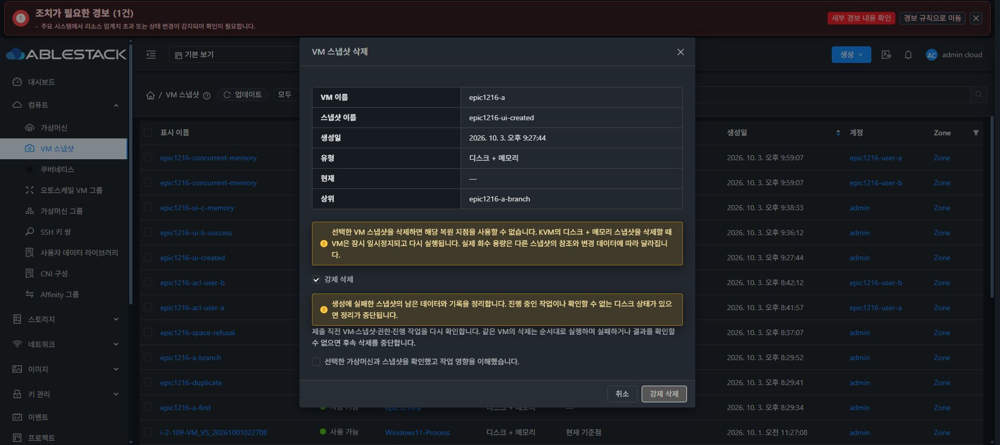
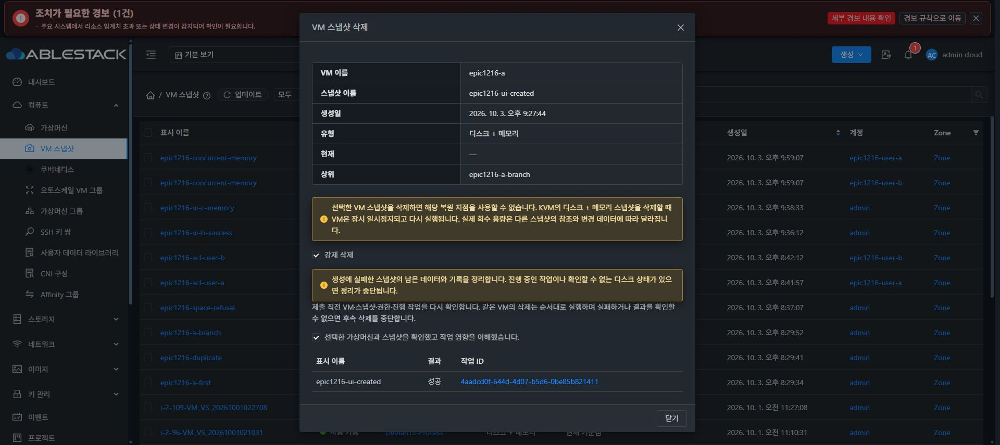
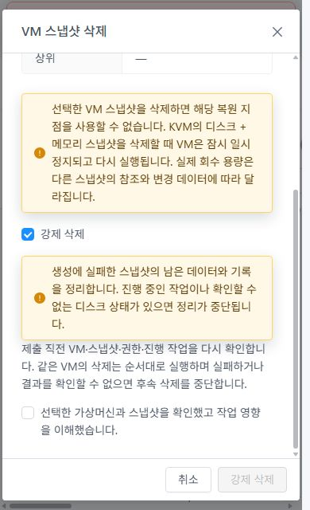
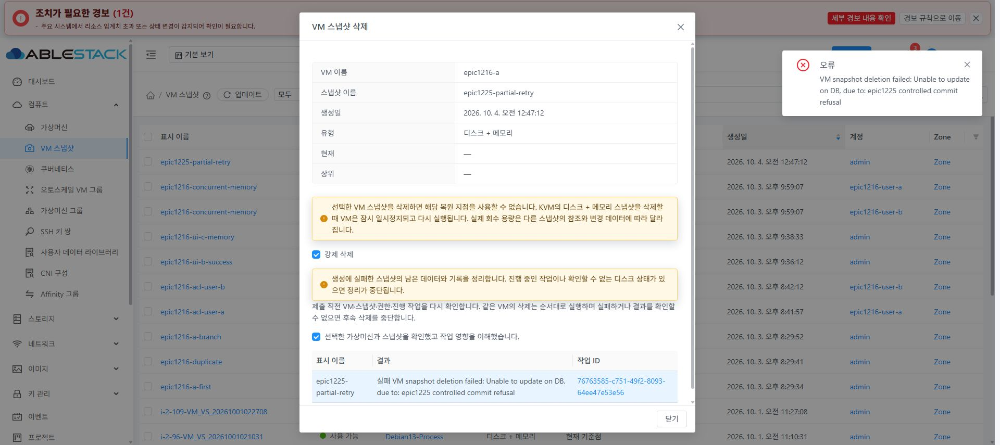
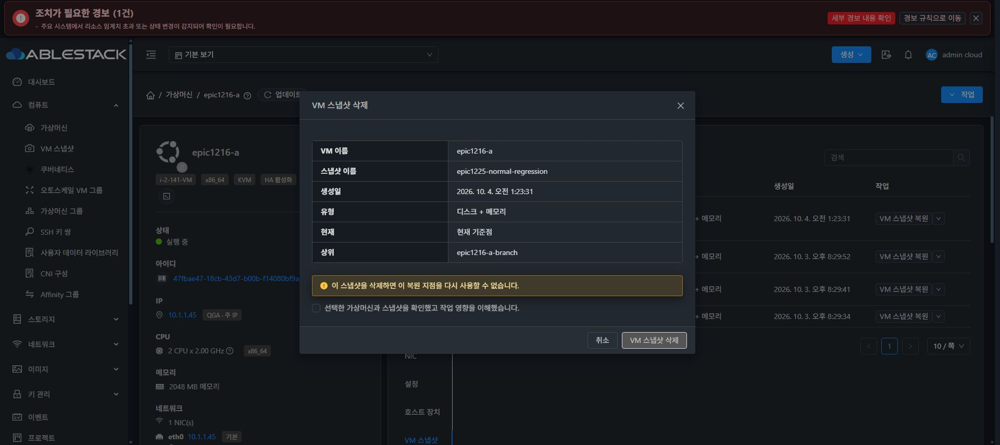
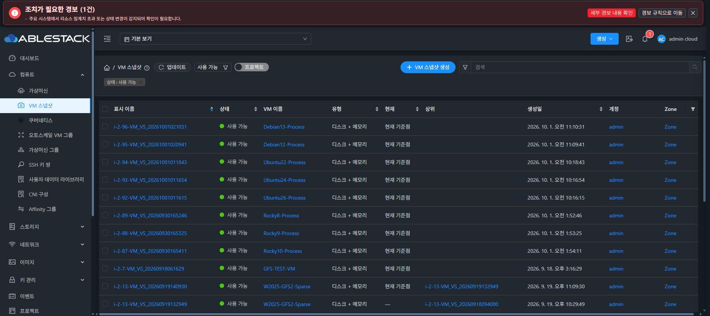

<!--
Licensed to the Apache Software Foundation (ASF) under one
or more contributor license agreements. See the NOTICE file
distributed with this work for additional information
regarding copyright ownership. The ASF licenses this file
to you under the Apache License, Version 2.0 (the
"License"); you may not use this file except in compliance
with the License. You may obtain a copy of the License at

http://www.apache.org/licenses/LICENSE-2.0

Unless required by applicable law or agreed to in writing,
software distributed under the License is distributed on an
"AS IS" BASIS, WITHOUT WARRANTIES OR CONDITIONS OF ANY
KIND, either express or implied. See the License for the
specific language governing permissions and limitations
under the License.
-->

# 생성 실패 VM 스냅샷 강제 삭제 검증 (#1225)

Epic #1216 / 통합 PR #1224의 추가 구현이다. 테스트 환경은 31번 관리 서버와 31.3 KVM 호스트이며, 전용 VM `epic1216-a`만 변경했다. 기존 사용자 VM은 변경하지 않았다. 인증정보, API 키, 쿠키와 원본 관리 로그는 공개 근거에 포함하지 않는다.

## 구현 계약

- `deleteVMSnapshot(force=false)`에서 API → VM work 직렬화 → strategy → Agent까지 의도를 전달한다. 루트 관리자만 생성 미완료 Error 항목을 복구한다. Ready를 거친 항목의 오류, 현재 항목, 자식이 있는 항목, 지원하지 않는 provider와 원래 정보가 불명인 항목은 거부한다.
- 현재 구현 범위는 KVM / unmanaged SharedMountPoint / QCOW2이다. VM 작업 큐, ACL, 백업 제약 및 공통 flock을 유지한다. 다른 provider의 일반 삭제 동작은 기존 경로를 사용한다.
- 내부 메모리 스냅샷은 libvirt 목록과 current, 모든 root/data/NVRAM 테이블, QMP/native 작업 상태를 대조한다. 메타데이터 없이 부분 생성된 객체도 해당 이름만 정리한다. VM이 실행 중이면 QMP를 사용하고 일시정지 후 다시 실행한다. 오프라인 수정에 `-U`를 사용하지 않는다.
- file-based Disk는 생성 전에 원래 볼륨 지문과 준비된 artifact 참조를 저장한다. 현재 볼륨·backing chain·다른 snapshot 참조 및 호스트의 다른 VM 참조가 있거나 확인되지 않으면 정리하지 않는다. 원래 참조가 없는 레거시 Disk 실패 항목은 부재로 추정하지 않는다.
- 미정리 lease를 시간 경과만으로 제거하지 않는다. 원래 owner의 종료 근거, VM 식별자와 세대, 두 번 일치하는 provider 관측을 공통 잠금 아래에서 확인한다. 감사 근거와 원래 lease를 `reconciled/<VM UUID>/`에 남긴다. 살아 있는 레거시 owner의 종료 근거가 없으면 거부한다.
- 실제 객체 부재를 확인한 뒤에만 DB 트랜잭션으로 실패 항목과 참조를 완료 처리한다. 기존 Ready 부모/current, 원본 볼륨 path/크기/논리 카운터와 정상 생성 사용량을 변경하지 않는다. 실패 생성 항목의 삭제 사용량을 중복 차감하지 않는다.
- 복구 지문은 상세 값 필드의 255자 제한을 고려한 SHA-256으로 저장한다. 이전 시험 배포의 잘린 JSON은 빠진 부분 전체가 별도로 저장된 원래 볼륨 정보로 검증될 때만 전환한다. 다른 지문이나 불명 정보는 재시도를 거부한다.
- 기존 우클릭 삭제 메뉴와 공유 `VmSnapshotDialog`/`MoldDialog`를 사용한다. 강제 삭제는 기본 해제이며 추가 선택 후 기존 영향 확인을 다시 요구한다. UUID를 새로 표시하거나 목록·대화상자 배치를 바꾸지 않는다.

## 실제 장애 복구

| 시나리오 | 실제 결과 |
| --- | --- |
| 기존 보호 기록 때문에 삭제 실패하던 Error 31 | UI의 강제 삭제 POST 1회. job `4aadcd0f-644d-4d07-b5d6-0be85b821411` 성공. snapshot UUID `7479812e-0e8c-4963-ba6d-44567687182f` Removed |
| 별도 미정리 lease 없는 Error 27 | 좁은 라이트 화면에서 키보드 확인·실행, POST 1회. job `b5a60aa8-dcd6-4a69-9a17-5aace4ac038d` 성공. UUID `6f84a9c1-da27-4765-98ed-504840b7889e` Removed |
| 원래 restore lease | operation `663db24b-0e74-4aae-bad7-2837542db6bd`와 provider proof를 감사 보관. Agent 재시작으로 원래 owner가 종료됐음을 확인한 후 복구. 수동 lease 삭제 없음 |
| 데이터·체인 보존 | 기존 Ready 18·19·20과 parent/current=20 보존. root/NVRAM 내부 테이블은 이 세 Ready 이름만 유지. VM Running |
| 게스트 데이터 | marker `epic1216-epoch-3`, payload SHA-256 `c4b444f01fb0ef429da0654dabb65ca042df026cad72b76d2725c7055c085453`가 전후 일치 |
| 할당량 | Primary 4,978,689,969,440 B, CLVM/CLVM_NG 각각 230,477,004,800 B 및 root snapshot counter=0 유지 |
| 직접 API 권한 | 일반 사용자와 도메인 관리자는 root 관리자 제한으로 거부. root의 Ready current 강제 삭제도 거부 |
| 정상 일반 삭제 | 신규 Ready `epic1225-normal-regression`을 VM 상세 스냅샷 탭에서 삭제. 강제 옵션 없음, POST 1회 및 force 미전달. job `cfcc1eb3-5b2d-407d-a260-cc344863a3bb` 성공. 기존 3개 Ready/current=20 및 root/NVRAM 테이블 복구, guest·할당량 유지 |

부분 생성·DB 실패 시험은 API로 Error 상태를 만든 전용 항목에, 공통 flock 및 작업 없음 확인 후 root 디스크에만 동일 이름의 내부 스냅샷을 주입했다. libvirt 메타데이터와 NVRAM에는 해당 항목이 없었다. 실제 생성 API가 자연적으로 이 부분 객체를 만들었다고 보고하지 않는다.

UUID `cb87d017-2ebb-4990-ab3a-548872aec100`의 정리 후 DB 완료 UPDATE만 거부하는 target 한정 trigger를 주입했다. job `76763585-c751-49f2-8093-64ee47e53e56`는 실패했고 UI에 DB 실패 사유를 표시했다. provider의 부분 객체는 제거됐지만 Cloud 항목은 Expunging과 원래 지문을 유지했다. Trigger를 제거하고 관리 서버를 재시작했다. 이 과정에서 발견한 지문 길이 오류도 자동 회귀에 추가했다. 수정 모듈 배포 후 동일 UUID 재시도 job `0fd6fd59-504d-46a8-9ed6-7012534d0281`이 성공했다. DB Removed와 71자 SHA-256 지문, 기존 Ready 체인·게스트·할당량 보존을 확인했다.

실제 `usage_event`에서 실패 생성 27·31·36에 대한 DELETE/OFF_PRIMARY 이벤트는 0개다. fault trigger도 0개이며 풀 임계치는 원래 0.85다. 정상 삭제의 기존 soft-delete 상태 표시는 별도로 유지한다.

## UI 확인

다크 1920 화면과 라이트 390×640 화면에서 6행 요약, 24px 간격, 읽을 수 있는 경고·체크박스·결과, 고정 제목/푸터와 본문만 스크롤을 확인했다. 좁은 화면에서 body scrollTop 0→249 동안 문서 scrollTop=0이며 가로 넘침이 없었다. 강제 옵션 선택은 기존 확인을 해제하고 실행 버튼을 비활성화한다. 실패를 성공으로 표시하지 않는다.

## 빌드와 자동 회귀

WSL Rocky ext4 clone, JDK 17 / Maven 3.9.10 / Node 14.21.3에서 실행했다. 전체 Cloud 빌드 workflow를 수동 실행하지 않았다.

| 이번 변경 모듈 | tests / failures / errors / skipped |
| --- | --- |
| api | 1,025 / 0 / 0 / 0 |
| core | 263 / 0 / 0 / 1 |
| engine/api | 11 / 0 / 0 / 0 |
| server | 3,913 / 0 / 0 / 5 |
| engine/storage/snapshot | 80 / 0 / 0 / 0 |
| plugins/hypervisors/kvm | 1,036 / 0 / 0 / 3 |

총 6,328개, 실패·오류 0, 기존 skip 9개다. 마지막 server/snapshot/KVM install은 `1225-module-build-11.log`의 BUILD SUCCESS다. 최초 API/core/engine API install도 통과했다. native Ceph 테스트를 위해 WSL에 공식 Rocky AppStream librados2를 설치했고, 테스트 fixture가 기존 CephX 연결의 두 가지 auth 옵션 이름을 허용하도록 수정했다. 운영 호스트 패키지를 변경하지 않았다.

provider 실패/통신 결과 불명/지문 변경, root+data+NVRAM 부분 객체, offline 삭제, 활성 작업/불명/current 불일치, 살아 있는 owner, 보호 감사 저장 중 재시작, 원래 Disk artifact/다른 volume·snapshot·VM 참조 차단을 자동 검증했다. file-based Disk 복구와 다중 data disk의 장애 주입은 자동 회귀이며, 실환경의 부분 객체 정리는 단일 root+NVRAM VM이다.

최종 UI 관련 12 suites / 234개 회귀, 전체 lint 및 production build가 통과했다. `1225-ui-tests-final.log`, `1225-ui-lint-2.log`, `1225-ui-build-2.log`에 보존한다. UI 전체 확장 실행은 90 suites / 885개 중 6개 실패, 879개 통과다. 변경 전 `ef7c7554d09`의 별도 archive에서도 같은 4개 suite의 같은 6개 실패가 재현됐다. NIC 동작 2개, Node 14의 Array.at 테스트 1개, 네트워크 요약 1개, 경보 발견 2개이며 이번 변경 파일과 관련 회귀는 통과했다. 전체 UI 테스트가 모두 통과했다고 보고하지 않는다.

## 배포 식별

- Java 빌드의 최종 변경 소스는 `caf3b7d6cbc18ed02deff77d45457e9ee46315c0`, UI 최종 빌드·패키지 소스는 `ae22a04b497ac26fb0831f0050c83e42cefbfa73`이다. 그 사이 변경은 UI 정렬과 페이지 크기 처리다.
- 관리 JAR 변경 클래스 36개, SHA-256 `a90cd6f9f5e0264a0a9f4a51cffc3bb8f98300f249f99d2dfa949b34f98b0df2`, 백업 `/root/epic1225/management-backup-20261004-012058`.
- 31.3 Agent core 변경 클래스 1개, SHA-256 `ec7c90a98ebf21c88613840171fa17e91c0f98509ab68b57c2a0f4f729c953e0`; KVM 변경 클래스 7개, SHA-256 `ac2f29561de317cc5628ea66fd66dcb85f0db1b0ccf8f70246faa90675e9e036`.
- Agent 백업 `/root/epic1225/agent-backup-20261004-012056`. 관리·Agent 서비스 active와 실제 class hash를 대조했다. Agent 재시작 전후 Running VM 19개가 일치한다.
- 관리 webapp의 WEB-INF와 config SHA-256 `b54d18abc5a143c64e2dec3441af0a45619ec20f110647119e6b8d2e199ff453`를 보존한다. META-INF는 원래 없으며 그 상태를 유지한다. 정적 파일만 배포한다.
- 최종 UI 정적 파일 834개의 전체/served index hash가 일치한다. 백업 `/root/epic1225/ui-backup-20261004-013312`, /client/ HTTP 200, 기존 FTCTL 마커 3개와 강제 삭제 마커를 확인했다.

## 목록 열 정렬 후속 수정

사용자 화면의 `label.sortkey : displayname` / `label.sortorder : asc` 노출과 조회 실패를 실제 재현했다. 열 정렬이 URL에 `page=1`만 추가할 때 공통 route watcher가 빠진 pagesize를 Number로 변환하여 NaN이 됐고, API는 `invalid value NaN for parameter pagesize`로 거부했다. 정렬 값은 공통 검색 태그에도 표시되고 있었다.

공통 watcher는 유효한 양의 정수인 페이지/크기만 적용하고, 빠진 페이지 크기는 유지한다. 서버 정렬의 URL 갱신도 현재 페이지 크기를 전달한다. 최초 URL 조회에서 잘못 사용하던 `pagesize` 필드는 실제 `pageSize`로 바로잡았다. 공통 검색 조건 표시에서는 sortkey/sortorder를 제외하여 실제 상태 태그만 남기며, 정렬 방향은 기존 열 헤더 화살표를 사용한다. 목록 배치와 디자인을 변경하지 않았다.

배포된 다크 화면에서 표시 이름·상태·유형·현재·생성일 각각 asc/desc, 20개 기준 두 페이지(20+5), 50개 선택과 새로고침 복원, 상태 필터를 유지한 정렬을 확인했다. 각 화면의 row UUID 순서가 실제 API 페이지 응답과 일치했다. 정렬 태그와 조회 오류가 없고, 표준 20개/쪽과 원래 다크 테마로 복원했다. 실제 15건의 화면/API 대조 결과는 `sort-columns-ui-verification.json`에 있다.

실행 원본은 WSL ext4 `/home/ablecloud/work/vm-snapshot-epic-1216/force1225`와 module/UI 빌드 로그에 보존한다. 자동 회귀와 실환경 확인의 범위는 구분하며, 전체 Cloud 패키지 빌드와 모든 provider 실환경 검증으로 확대하지 않는다.
