<!--
Licensed to the Apache Software Foundation (ASF) under one
or more contributor license agreements. See the NOTICE file
distributed with this work for additional information
regarding copyright ownership. The ASF licenses this file
to you under the Apache License, Version 2.0 (the
"License"); you may not use this file except in compliance
with the License. You may obtain a copy of the License at

  http://www.apache.org/licenses/LICENSE-2.0

Unless required by applicable law or agreed to in writing,
software distributed under the License is distributed on an
"AS IS" BASIS, WITHOUT WARRANTIES OR CONDITIONS OF ANY
KIND, either express or implied. See the License for the
specific language governing permissions and limitations
under the License.
-->
# 상세 탭 UI 표준화 검증 — Cloud #1201

2026-10-01, Europa의 UI 변경을 31번 테스트 클러스터에 배포하고 확인했다.
ISO 탭 업데이트 버튼은 `reload` 아이콘 + **업데이트**로 표시하며 기존 배치, 높이 32px, 모서리 4px을 유지한다.

## 소스 및 배포

- 기준: upstream/origin `ablestack-europa` — `ca36cbc0ff65e06d55f344ccd42958193c974a03`.
- 브랜치: `codex/vm-detail-tabs-ui-1201`.
- 실제 UI 빌드 소스: `99d45f6277552c6145ec7f7a57389f75c1f66882`. 이후 검증 보고서/이미지만 추가한다.
- WSL ext4: `/home/ablecloud/work/dhslove/cloud-vm-tabs-ui-1201/ui`.
- 빌드: `NODE_OPTIONS=--openssl-legacy-provider npm run build` — 성공.
- 배포: `10.10.31.10:/usr/share/cloudstack-management/webapp`의 정적 파일 833개, 전부 SHA256 일치.
- 아카이브 SHA256: `fabcb9079ae10f7b8fd88eca8979ec63d477b190cad50c1a1a638196031663cd`.
- 최종 배포 백업: `/root/cloud1201-ui-20261001-222156`.
- `WEB-INF`, `META-INF`, 서버 `config.json`, 관리 서비스 PID 보존. `mold=active`, `/client/` HTTP 200.

UI 소스만 변경했다. Maven/Cloud 전체 빌드, 관리 JAR 및 호스트 패키지 변경은 없다.
기존 Windows FT 개발 체크아웃의 미커밋 변경은 보존하고 별도 작업 트리에서 개발했다.

## 구현과 영향 범위

| 영역 | 변경 | 유지한 동작 |
|---|---|---|
| IP 구성 | 지금 재수집 → 업데이트를 상단 왼쪽, 안내문을 아래에 배치 | 기존 수집/DB 조회 API, 인터페이스·라우팅·DNS, 검색 |
| 메트릭 | 기간은 왼쪽, 자동 갱신은 오른쪽, 차트 제목/옵션 정렬 | 차트/단위/기간/도움말, 같은 자원 갱신 중 기존 canvas 유지 |
| 이벤트 | 상단 업데이트 + 오른쪽 열 선택, 하단 우측 페이지 이동 | 기존 컬럼 저장, 정렬, 페이지, listEvents |
| 코멘트 | 상단 보내기 → 업데이트, 작성 영역 → 목록 → 페이지 이동 | addAnnotation, 관리자 공개 범위, Ctrl+Enter, 항목 삭제 |
| ISO | 업데이트 버튼에 누락된 reload 아이콘 추가 | 기존 툴바, 버튼 모양, 연결/해제/검색/대화상자 |
| VM 스냅샷·볼륨·NIC·백업 | 조회 버튼의 기존 새로고침 문구를 업데이트로 통일 | 배치, 아이콘, 행 작업, API |
| 보안 그룹 | 전체 너비 수정 버튼을 상단 툴바로 배치 | 그룹 수정 액션과 대화상자 |
| 장애 보호 | 조회 아이콘을 reload로 통일 | 상태별 액션과 보호 동작 |

StatsTab·EventsTab·AnnotationsTab은 **모든 기존 사용 화면에 공통 적용**한다.
VM 전용 옵션이나 VM 조건 분기를 추가하지 않았다. 시스템 VM/가상 라우터/볼륨의 메트릭,
호스트·네트워크·이미지·오퍼링·계정 등 기존 공통 이벤트/코멘트 사용 화면이 같은 컴포넌트를 이용한다.
소스 호출 지점도 대조했다. ListView, 스케줄, 프로세스, 설정, 호스트 장치, GPU, DR 보호의 개별 배치는 바꾸지 않았다.

## 실행 검증

| 대상 | 확인한 결과 |
|---|---|
| VM Ubuntu24-Process (`90af4c7f-298f-4b43-afc3-8192f8ee13e0`) | 표시된 13개 탭을 일반/다크에서 조회: 상세, IP 구성, 메트릭, 프로세스, 스케줄, ISO, 볼륨, NIC, 설정, 호스트 장치, VM 스냅샷, 이벤트, 코멘트 |
| 공통 볼륨 ROOT-93 (`a3020d3e-26dd-4c61-a0c2-6cb793f4f7af`) | 이벤트·코멘트의 새 툴바, 실제 읽기 갱신, 일반/다크 |
| 공통 시스템 VM v-3-VM (`feb8ebca-c11b-4f0f-bf6c-eddf44577c65`) | 새 메트릭 정렬과 실제 5개 차트, 일반/다크 |
| 좁은 화면 430px | DOM으로 viewport 430px, 문서 폭 420px, 활성 패널 336px과 작업 순서·줄바꿈·가로 넘침 없음을 확인. 좁은 화면의 테마별 이미지 검증은 완료로 계산하지 않음 |
| 기존 대화상자 | VM 스냅샷 생성, 스케줄 추가의 기존 구성/취소 동작 확인. VM/ISO 상태를 바꾸는 확인 버튼은 누르지 않음 |

읽기 갱신 중 브라우저 DOM 식별자를 비교했다. IP 영역 `90→90`, 메트릭 canvas `175→175`, 이벤트 표 영역 `272→272`, 코멘트 textarea `271→271`로 유지되었다.
이 수치는 테스트 세션 내 식별자이며 다른 세션에서 같은 숫자를 요구하는 규격은 아니다.
IP 검색 `enp3s0`, 이벤트 페이지 2와 설명 열 선택, 코멘트 초안을 보존했다.
메트릭 사용자 지정 기간은 자동 갱신 주기 변경 후에도 유지되었다.

- IP **지금 재수집**: 실제 `refreshVirtualMachineGuestNetworkState` POST HTTP 200, 최신 성공 `2026-10-01 22:16:44`, 수집 상태 OK, 인터페이스 2개 확인.
- 메트릭: 1시간/6시간 변경과 5개 차트, 사용자 지정 기간 대화상자 및 자동 갱신 컨트롤 확인. 주기는 없음으로 복원.
- 이벤트: 업데이트, 열 선택, 페이지 변경 확인. 검증용 설명 열 선택은 원래 상태로 복원.
- 코멘트: 관리자 전용 테스트 메모 등록 성공, 업데이트 중 초안 유지. 직접 생성한 메모 1개만 정리하고 API에서 제거를 재확인.
- 최종 기본 크기에서 13개 탭 26회 조회 시 로딩 상태가 끝났으며 새 정상 검증 구간의 JS error 로그는 없었다.
- 모바일/네트워크 개발 검증 설정을 제거하고 1280×720 및 원래 다크 테마로 복원했다.

## 코드 검사와 테스트

변경 Vue/JS 파일의 ESLint 성공. 12개 Jest 묶음, **85개 테스트 통과** (`--runInBand --coverage=false`).

검증 묶음: SharedDetailTabs, GuestNetworkTab, listRefreshMixin, VmSnapshotsTab, VmNicsTab,
VmVolumesTab, DrPlanVmTab, FtctlTab, VmBackupsTab, VmDevicesTab, VmIsoManager, VmIsoTab.

회귀 테스트는 늦은 메트릭 응답 무시, 같은 자원 실패 시 차트 유지, 자원 변경 실패 시 이전 자원 차트 제거,
빈 통계 결과의 로딩 종료, 코멘트 페이지 크기/빈 결과 개수/초안 보존, 이벤트 실패 시 기존 행 유지를 포함한다.
VmNicsTab 기존 테스트 1개의 잘못된 linkstate 기대값은 upstream 기준선에서 동일 실패를 확인한 뒤
실제 권위 데이터인 listNics 응답과 일치하도록 고쳤다. NIC 실행 로직 변경은 없다.

기존 테스트 스텁/아이콘 중복 등록, Browserslist 및 번들 크기 경고는 남아 있다.
레포 전체 커버리지 수집과 소스 보완 전 중단한 빌드는 성공 결과에 포함하지 않았다.

## 실제 검증 범위의 제한

현재 46개 VM에 보안 그룹/GPU/FT 호환 i440fx 대상이 없고,
관리자 API 목록에 listBackups/getDrVmProtectionView가 없어 조건부 5개 탭의 실제 표시 화면은 검증하지 못했다.
조건부 탭은 소스 검토와 해당 기존 단위 테스트로 확인했다. 이를 실환경 검증 완료로 계산하지 않는다.
볼륨 메트릭은 현재 보존 설정으로 탭이 노출되지 않아 동일 컴포넌트의 Volume 회귀 테스트와 시스템 VM 실화면으로 확인했다.
모든 공통 사용 화면을 각각 방문한 것은 아니며, 대표 VM/볼륨/시스템 VM과 전체 소스 호출 지점을 대조했다.

브라우저 전체 연결 단절 시험에서는 기존 `utils/request.js`의 공통 전송 오류 로그아웃 처리가 동작했다.
따라서 전체 오프라인 상태의 목록 유지나 실패 복구를 실환경 PASS로 보고하지 않는다.
해당 공통 인증/네트워크 처리 파일은 변경하지 않았으며, 컴포넌트 실패 시 데이터 보존은 위 단위 테스트로 검증했다.

## 실제 배포 화면

이미지 16개는 목업이 아니라 31번 클러스터의 배포 후 일반/다크 화면이다.
좁은 화면의 캡처는 브라우저 표면 축척과 테마 적용 시점이 일치하지 않아 첨부에서 제외했다. 해당 이미지 검증은 PASS에 포함하지 않는다.

| 탭 | 일반 | 다크 |
|---|---|---|
| IP 구성 | 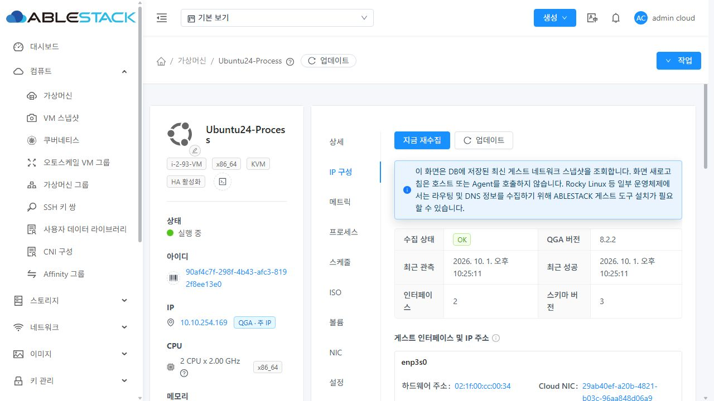 | 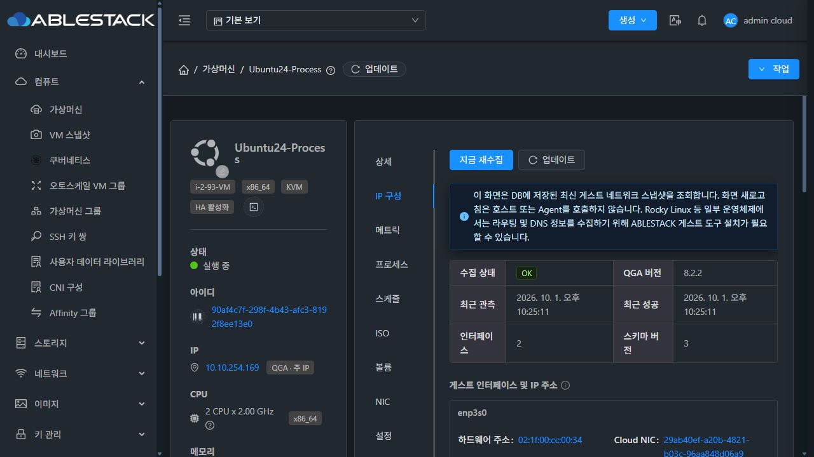 |
| 메트릭 | 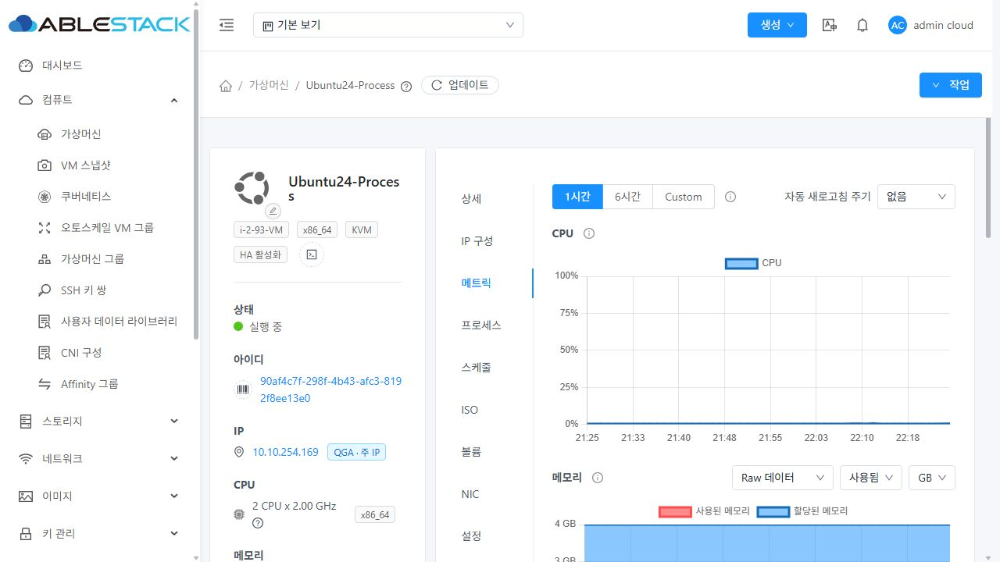 | 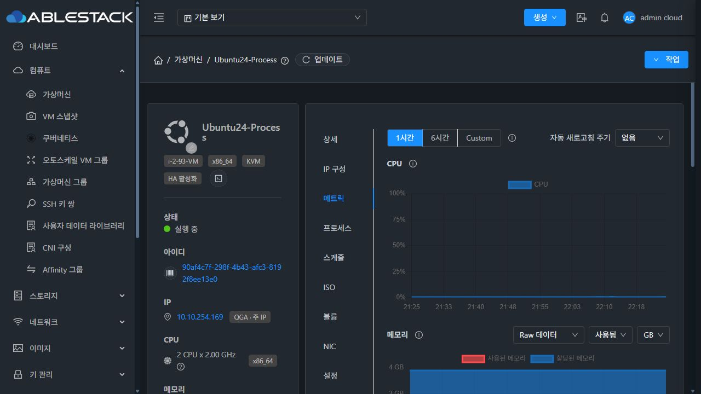 |
| 이벤트 | 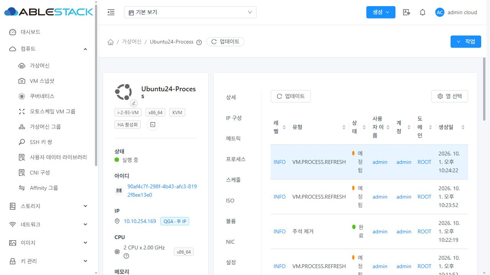 | 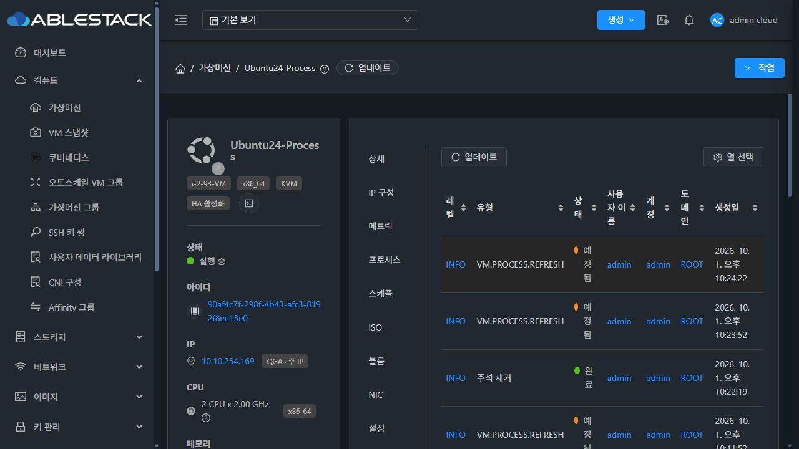 |
| 코멘트 | 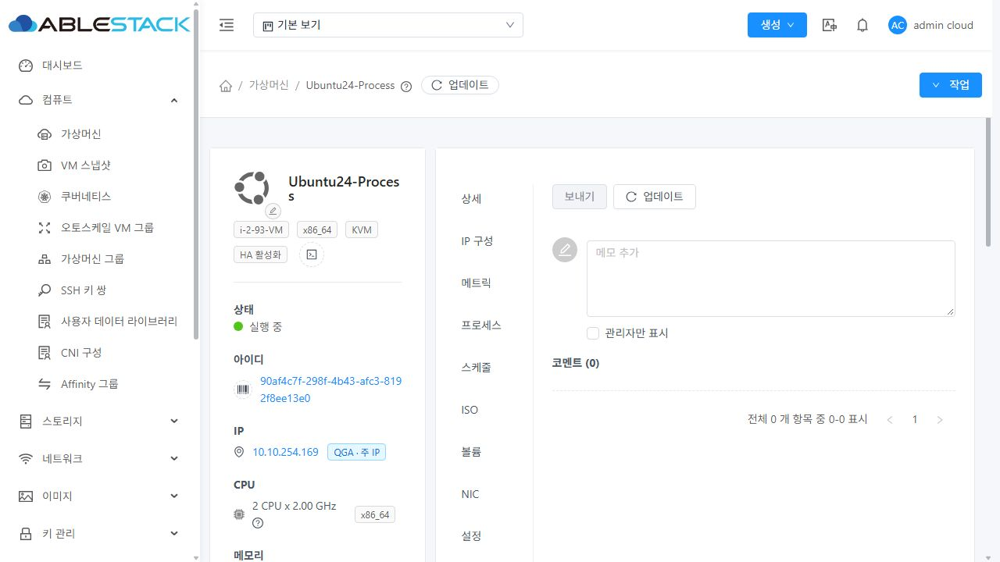 | 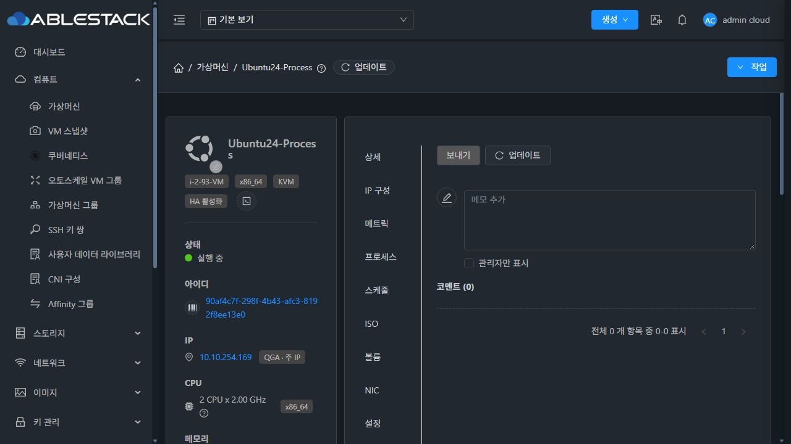 |
| ISO | 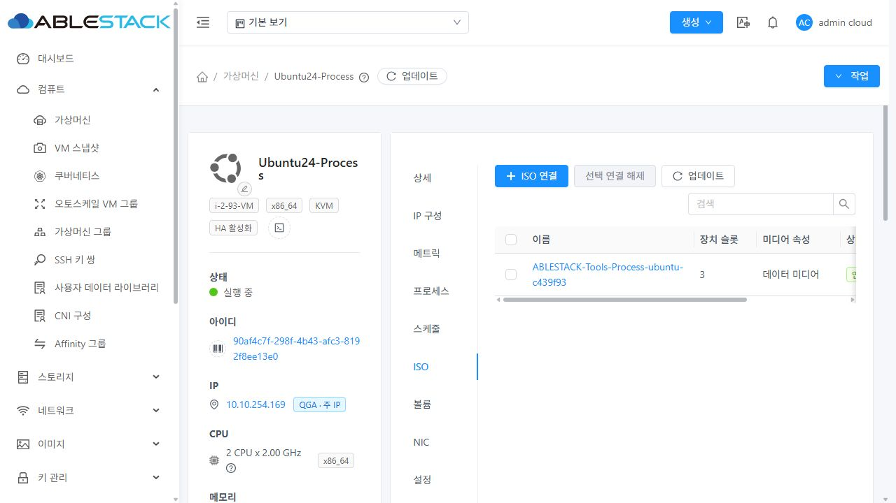 | 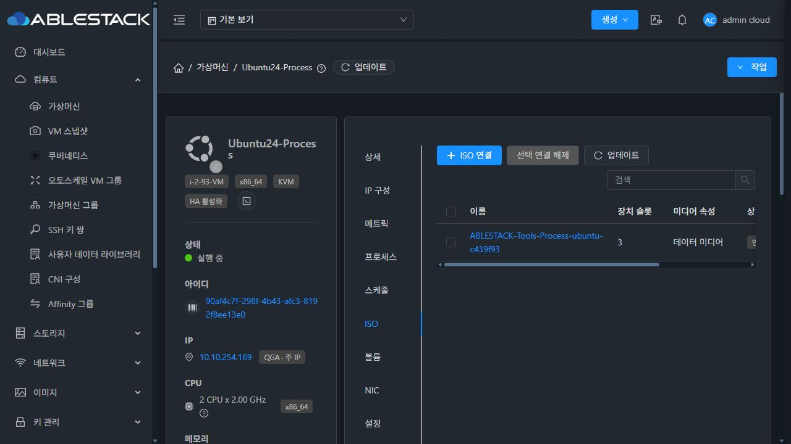 |

공통 자원 화면

볼륨 이벤트

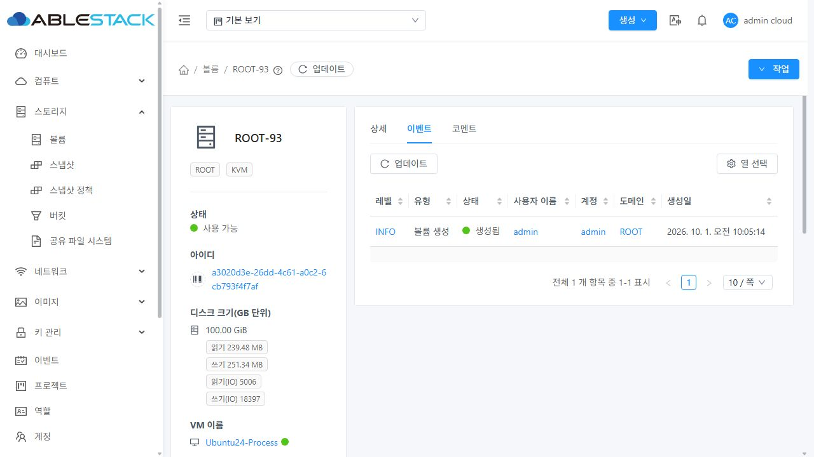

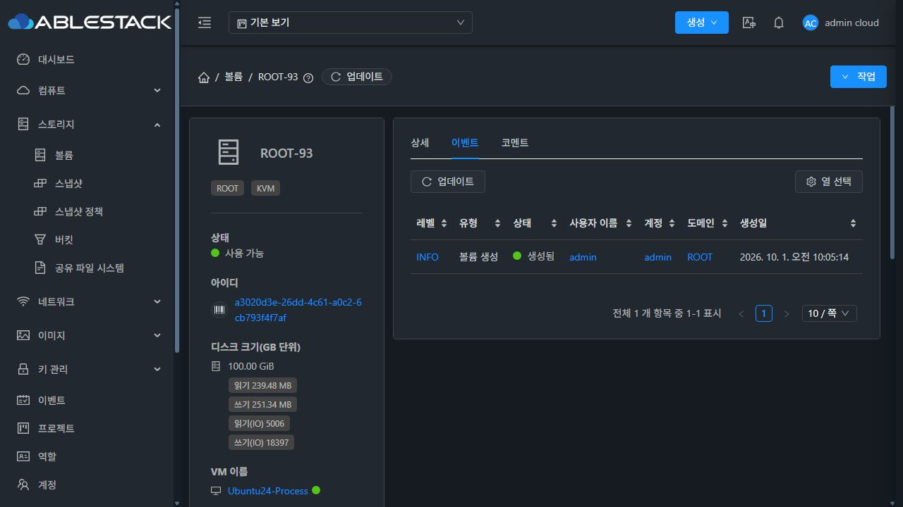

볼륨 코멘트

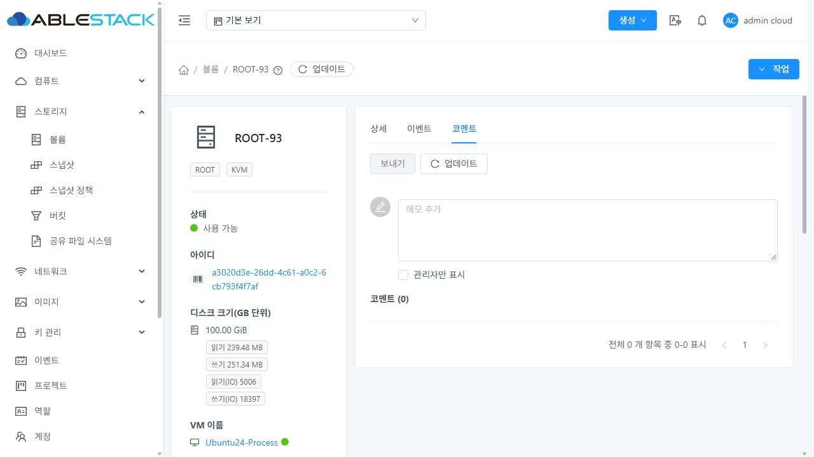

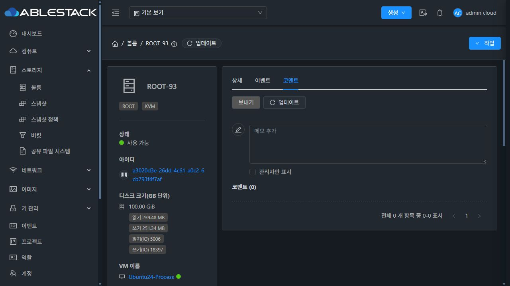

시스템 VM 메트릭

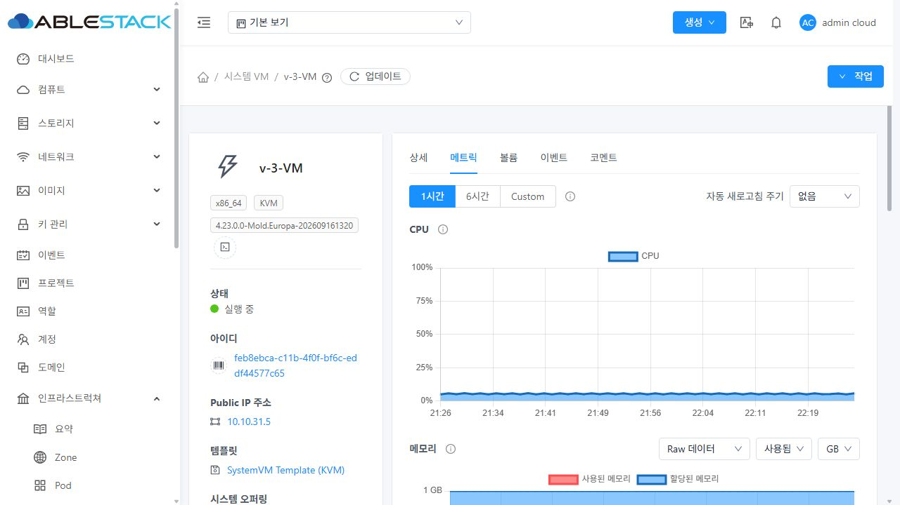

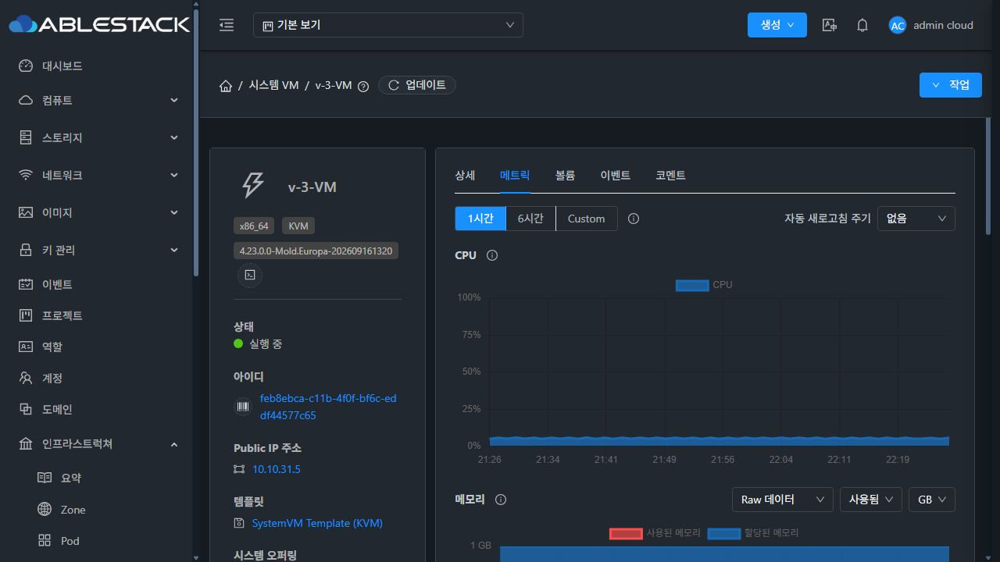

