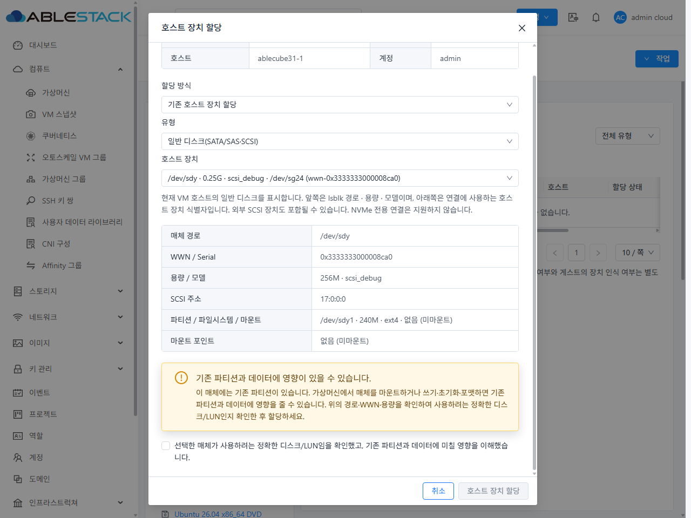
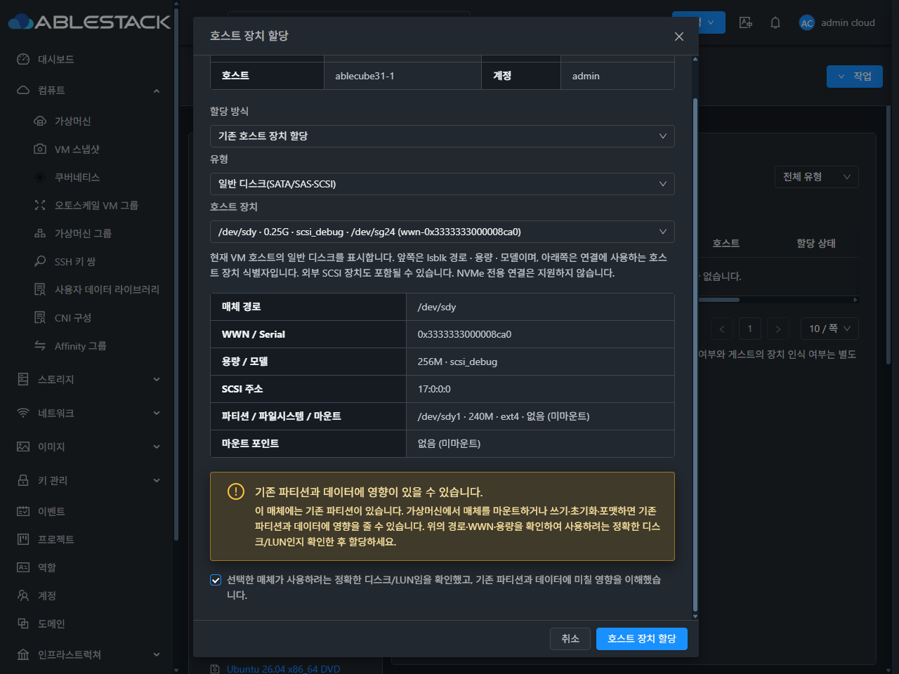
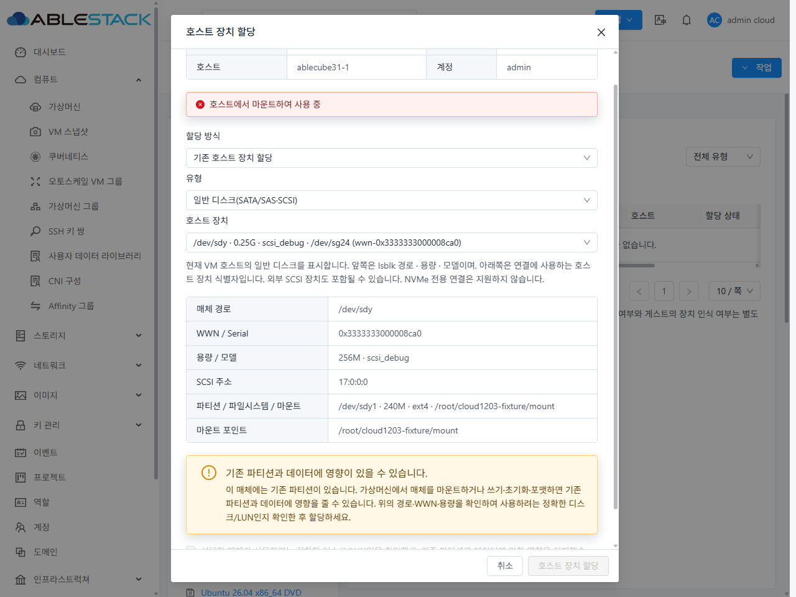

<!--
Licensed to the Apache Software Foundation (ASF) under one
or more contributor license agreements.  See the NOTICE file
distributed with this work for additional information
regarding copyright ownership.  The ASF licenses this file
to you under the Apache License, Version 2.0 (the
"License"); you may not use this file except in compliance
with the License.  You may obtain a copy of the License at

  http://www.apache.org/licenses/LICENSE-2.0

Unless required by applicable law or agreed to in writing,
software distributed under the License is distributed on an
"AS IS" BASIS, WITHOUT WARRANTIES OR CONDITIONS OF ANY
KIND, either express or implied.  See the License for the
specific language governing permissions and limitations
under the License.
-->

# 호스트 장치의 미마운트 파티션 할당 검증 (#1203)

## 동작
- 파티션 테이블 또는 일반 파일시스템 파티션이 있어도 전체 매체와 하위 파티션이 미마운트이고 다른 VM·LVM·RAID·스왑 등에서 사용되지 않으면 후보로 제공한다.
- 경로, WWN/일련번호, 용량·모델, SCSI 주소, 파티션·파일시스템·마운트 지점을 표시한다. 정확한 매체와 기존 데이터 영향에 대한 확인이 있어야 할당한다.
- 선택이나 상태가 바뀌면 확인을 해제한다. 제출 전에 UI가 다시 조회하고 Mold Agent가 연결 직전에 다시 검사한다.
- 네 저장장치 API의 acknowledgepartitionrisk 기본값은 false다. 확인 값으로 마운트·다른 VM 사용·호스트 볼륨·검증 불가 상태를 우회할 수 없다.
- 기존 도구/Agent가 안전성 메타데이터를 제공하지 않는 경우 UI는 할당 가능으로 추정하지 않는다.
- 기존 버튼 모양·상단 배치·720px 표준 대화상자·취소/실행 순서를 유지한다.

## 실제 검증 환경
31번 테스트 클러스터에 변경된 API/Core/Server 클래스와 UI 정적 산출물을 배포했다.
변경 Maven 모듈만 WSL ext4 작업 트리에서 빌드했다. 전체 Cloud 빌드는 실행하지 않았다.

운영 매체를 수정하지 않고 host 31.1에 일회용 scsi_debug 256MiB 매체를 생성했다.
GPT 파티션 240MiB, ext4, Cloud1203Test 라벨과 preserve.txt 확인 파일을 사용했다.
VM U26-Sparse(i-2-28-VM)에서 연결을 확인했다.
HBA/vHBA API 검증에는 이 임시 매체의 실제 SCSI 어댑터를 사용했다.
실제 FC LUN·FC 어댑터 전체 패스스루·NPIV 생성 하드웨어 검증은 포함하지 않는다.

## 빌드 및 자동 검증
| 대상 | 결과 |
|---|---|
| API/Core/Server 변경 모듈 빌드 | 성공 |
| API 계약·vHBA UUID 바인딩 | 2개 통과 |
| Core 안전성·직렬화·정확한 LUN 해제 | 15개 통과 |
| Server VM 장치 변경 기존 가드 | 6개 통과 |
| UI 후보·확인·상태 변경·갱신 | 17개 통과 |
| UI lint / production build | 성공 |
| API/Core/Server 및 저장소 소스 Apache RAT | 통과 |

## 실제 기능 검증
| 항목 | 결과 |
|---|---|
| 미마운트 파티션 후보 / 정확한 매체 정보 | 확인 |
| 미확인 요청: LUN/SCSI/HBA/vHBA | 4개 모두 거부 |
| 호스트에 read-only 마운트 후 확인 값 true 요청 | 4개 모두 거부 |
| LUN/HBA/vHBA API 확인 후 연결 / 실제 해제 | DB·호스트 XML·게스트 장치로 확인 |
| 일반 SCSI 매체 UI 연결 / 실제 해제 | 브라우저·DB·호스트 XML·게스트로 확인 |
| 다른 VM에서 같은 물리 매체의 별칭으로 연결 | 거부 |
| 선택 후 호스트 마운트 / UI 제출 직전 상태 변경 | 확인 해제, 마운트 상태 표시, 연결 거부 |
| 일반/다크 모드 | 정보·경고·확인·버튼 상태·스크롤 검증 |
| 갱신 중 일시적 검증 불가 문구 | 표시하지 않음 |
| 파티션 테이블·확인 파일·전체 매체 내용 | 원본과 동일 |
| 테스트 종료 | 할당·게스트 장치·마운트 없음, 임시 모듈 제거 |

Core fixture 테스트는 bind mount, WWN/경로 별칭, live/inactive VM XML, LVM/RAID/swap, 필수 필드·조회 실패의 차단도 검증한다.
UI 테스트는 확인 정보 변경, 마운트 상태 변화, HBA와 SCSI 주소의 불일치, 메타데이터 누락 및 생성 후 발견한 파티션 매체의 자동 연결 금지를 검증한다.

실제 연결 검증에서 발견한 기존 결함도 함께 보완했다.
LUN 해제는 실제 source와 현재 target/address를 찾아 해제한다.
vHBA API는 호스트 UUID와 VM UUID를 각각 올바른 Entity 타입으로 변환한다.

## 데이터 보존
- GPT label-id: 58F62396-EE31-294A-A932-A49E4E3C58C3
- Partition UUID: 4D3D08D1-25BF-DF4D-8C9D-C7EEAFEB749A
- File SHA256: 896e8c65806435d82e336efef603026c61fd8c1423cf5c9f3692bf8b920002f9
- Whole medium SHA256: 2410cd8cd2c96d26c813bcb9b03613b5e90ef0cf42f95605aae130c4479e31b4

할당 코드에서 파티션 삭제·포맷·초기화·호스트 자동 언마운트는 수행하지 않는다.
이번 검증의 게스트 읽기는 lsblk와 debugfs의 읽기 전용 조회로 수행했다.

## 배포 보존 검증
- Agent 3대: 서비스 active, agent.properties와 VM UUID 목록 보존.
- Management: 서비스 active, /client/ HTTP 200.
- UI: WEB-INF/META-INF/config.json 및 서비스 PID 보존, 정적 파일 833개 해시 일치.
- 배포된 클래스: Agent마다 14개, Management 26개 해시 일치.
- 기존 공통 UI/FTCTL 마커 보존.

## 실제 배포 화면

