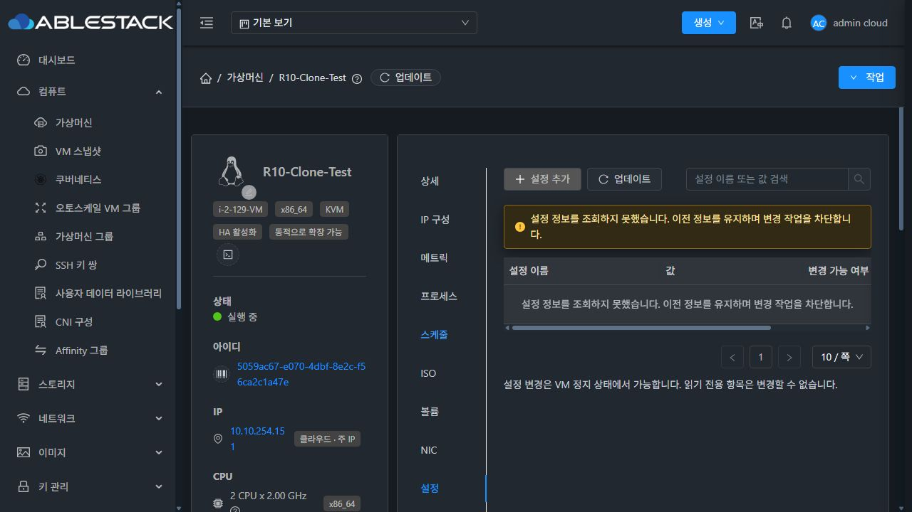
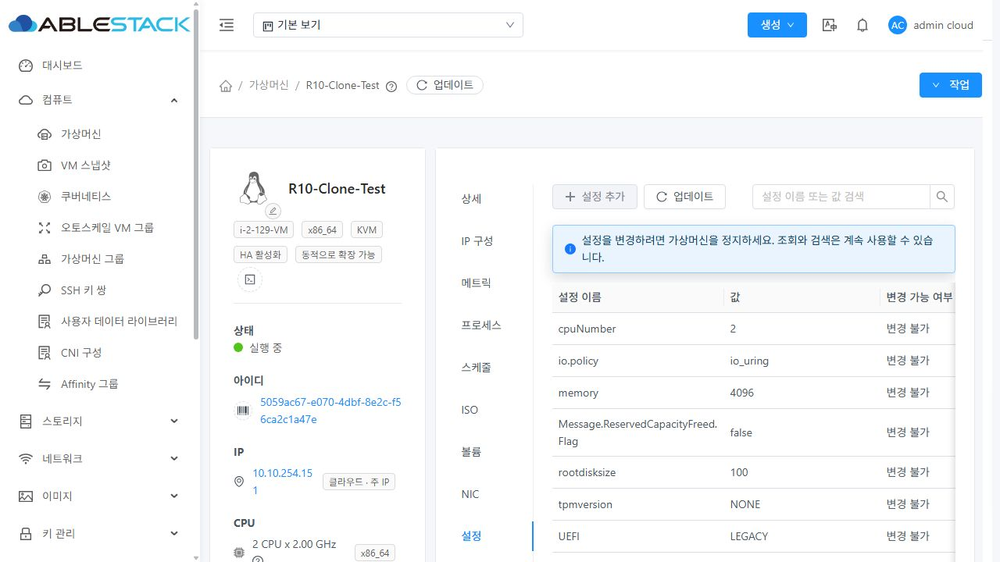
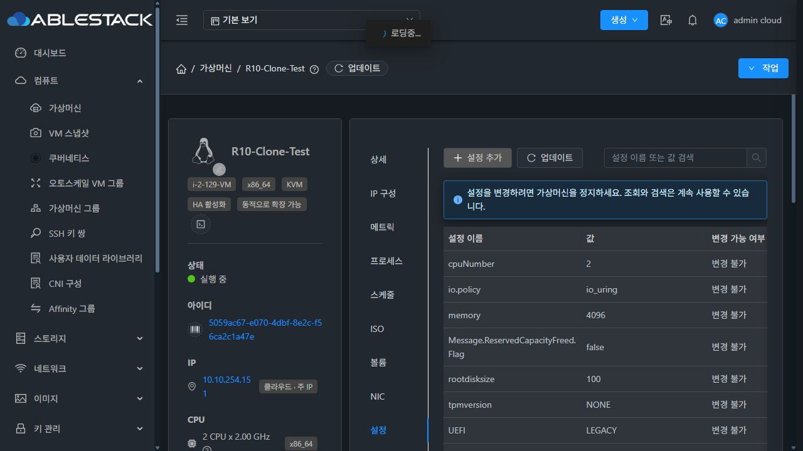
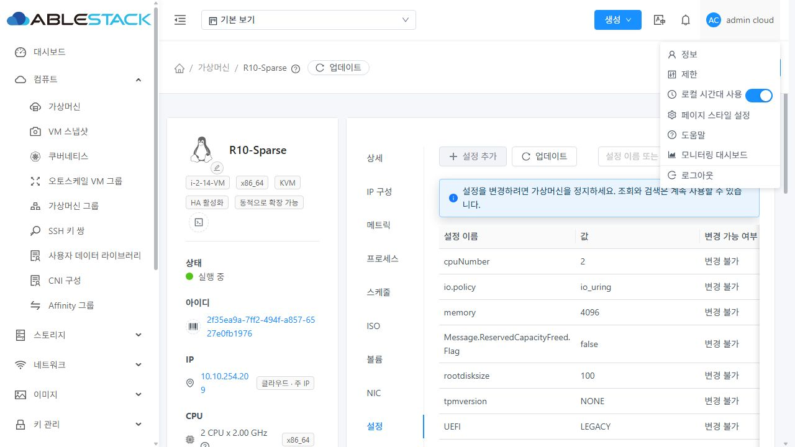
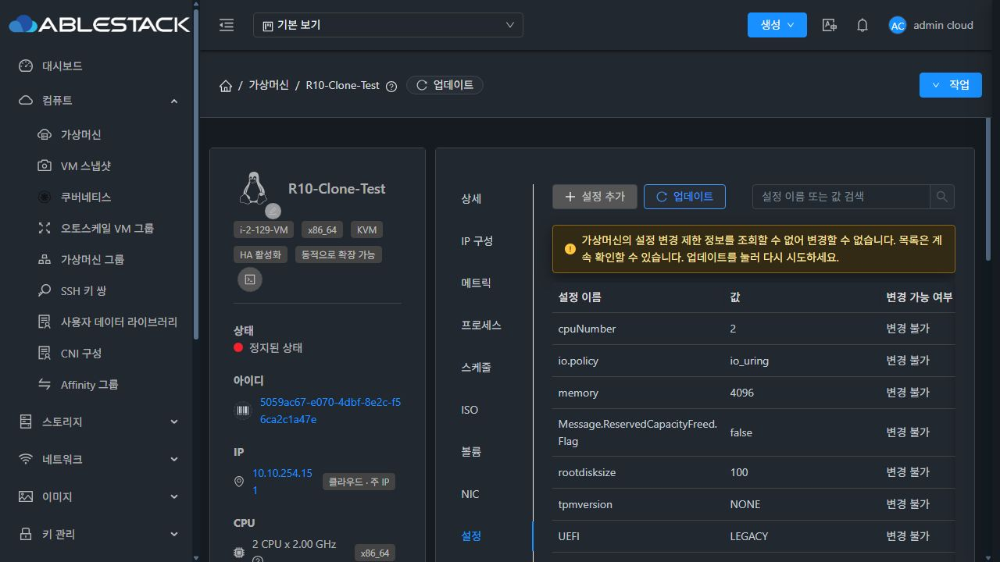
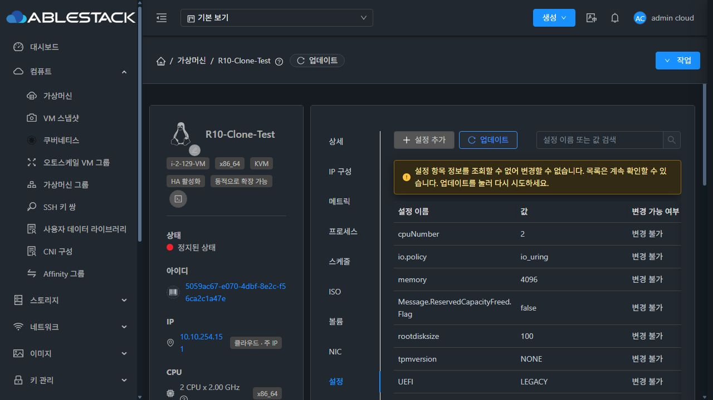
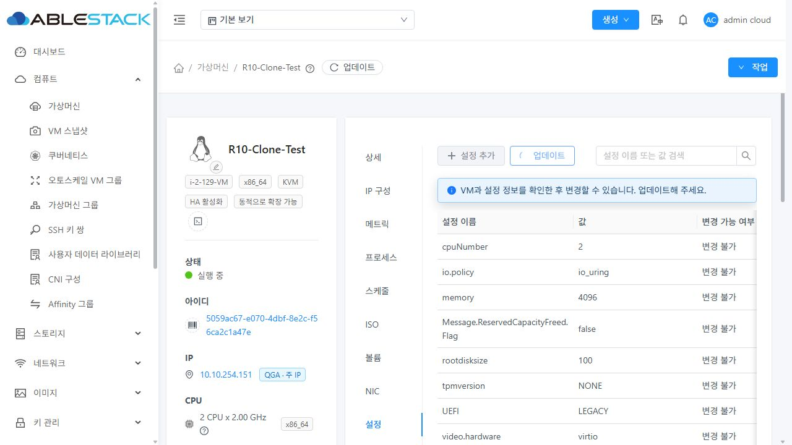
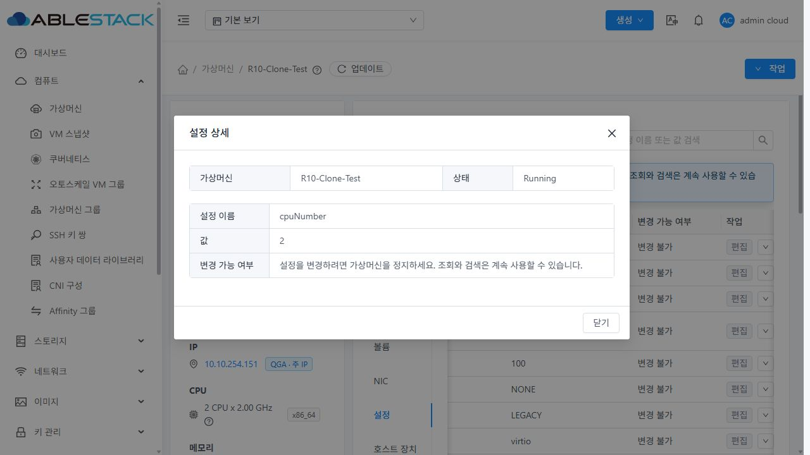
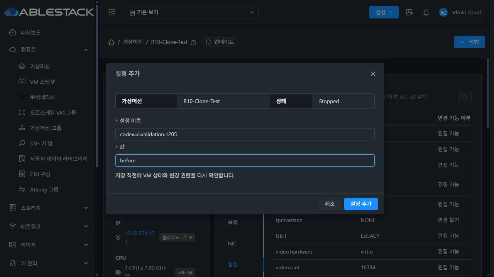
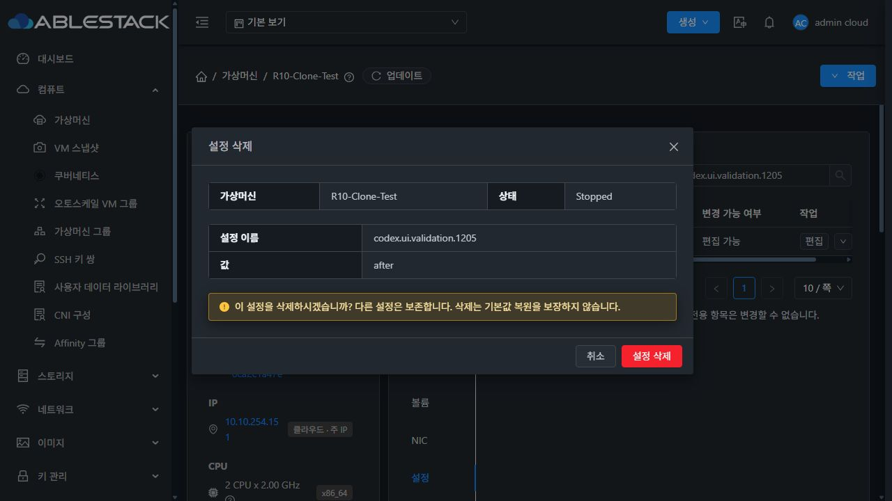

<!--
Licensed to the Apache Software Foundation (ASF) under one
or more contributor license agreements.  See the NOTICE file
distributed with this work for additional information
regarding copyright ownership.  The ASF licenses this file
to you under the Apache License, Version 2.0 (the
"License"); you may not use this file except in compliance
with the License.  You may obtain a copy of the License at

  http://www.apache.org/licenses/LICENSE-2.0

Unless required by applicable law or agreed to in writing,
software distributed under the License is distributed on an
"AS IS" BASIS, WITHOUT WARRANTIES OR CONDITIONS OF ANY
KIND, either express or implied.  See the License for the
specific language governing permissions and limitations
under the License.
-->

# Cloud #1205 복제 VM 설정 표시 검증

검증일: 2026-10-02 (KST). 대상: 31번 테스트 클러스터. 이번 변경은 UI에 한정합니다.

## 변경과 원인

복제 VM은 설정을 정상적으로 보존하지만 삭제 처리된 내부 RAW 템플릿을 참조합니다.
기존 설정 탭은 일반 템플릿 조회가 비면 성공한 VM 설정 조회까지 실패 처리했습니다.
VM 설정 읽기와 보조 옵션·템플릿 정책 확인을 분리하고, 참조 UUID만
`showremoved=true`로 조회해 삭제된 내부 템플릿의 변경 제한도 확인합니다.
관리자는 `all`, 일반·도메인 사용자는 `executable` 필터를 사용합니다.

보조 조회가 비거나 실패하면 설정을 표시하면서 변경 작업만 차단합니다.
해당 두 조회에 기존 `optionalDiscovery` 옵션을 적용하여 통신 실패가 로그아웃이나
전체 화면 오류를 유발하지 않도록 했습니다. 현재 세션의 실제 401 인증 오류는
공통 처리의 로그아웃 동작을 그대로 유지합니다. 기본 15초 제한을 사용합니다.
VM 조회 자체의 인증·조회 실패 처리는 변경하지 않았습니다.

Running 상태, 소유권/API 권한, 읽기 전용·deploy-as-is·TPM·extraconfig 보호,
제출 직전 재검증과 변경 충돌 감지를 유지합니다.
업데이트 중 기존 목록에는 로딩 마스크를 씌우지 않고 상단 업데이트 버튼에서 진행 상태를 표시합니다.

## 소스와 배포

- PR 소스 기준: upstream `ablestack-europa` / `5e67b05335ee696594938510238ec1f0be162d79`
- 작업 브랜치: `codex/issue-1205-clone-vm-settings`
- UI 변경 소스: `4b7da056108a185f3093966f738d021cf6f469ee`
- 별도 배포 트리: 이미 배포된 [PR #1204](https://github.com/ablecloud-team/ablestack-cloud/pull/1204)의
  `96c405d27db1ac6068a960847930bb1177a15b7a` 위에 이번 UI 변경만 추가
- 배포 트리 커밋: `6ae1c81663c49e8c97acdc99550e063fb0e1116b`
- UI 빌드: WSL ext4 작업 트리, Node.js 20.20.2 / npm 10.8.2
- 명령: `NODE_OPTIONS='--openssl-legacy-provider --max-old-space-size=8192' npm run build`
- 결과: production UI build 성공. 백엔드/DB 변경이 없어 Maven 모듈 컴파일·JAR 교체는 필요하지 않음
- 배포: `10.10.31.10:/usr/share/cloudstack-management/webapp`의 정적 파일만 갱신
- 배포 파일 833개 전부 빌드 결과와 SHA256 일치
- 배포 아카이브 SHA256: `ace5b50c9046bda19671a25ab2f1fe98c0202ea12e70d82efc5bc269e27e2837`
- 이전 정적 파일 백업: `/root/cloud1205-ui-20261002-090658`
- `WEB-INF`, `META-INF`의 기존 존재 상태, `config.json`, management 서비스 PID 보존
- 배포 후 `mold=active` 및 `/client/ HTTP 200` 확인
- PR #1204와 FTCTL의 기존 배포 마커 보존

이번 PR의 변경에는 PR #1204의 호스트 장치 구현을 포함하지 않습니다.
테스트 클러스터의 기존 개선을 보존하기 위해 배포에만 합친 트리를 사용했습니다.

## 자동 검증

| 검증 | 결과 |
| --- | --- |
| VM 설정 단위 테스트 | 32개 통과 |
| 기존 request / optionalRequest 회귀 테스트 | 15개 통과 |
| 변경 Vue/테스트 파일 ESLint | 오류 없음 |
| 소스 트리 Apache RAT | 미승인/미확인 라이선스 0개 |
| UI production 빌드 | 성공 |

총 47개 테스트가 통과했습니다.
단위 테스트는 ISO 기반 VM, 복제 RAW 및 삭제된 템플릿 조회,
빈 응답/권한·통신 오류/잘못된 정책 응답, 정상 디스크 템플릿,
deploy-as-is·읽기 전용 제한, 제출 중 상태 변화·정책 확인 실패·오래된 값,
VM 전환·검색·목록 유지와 일반/도메인 사용자 조회 필터를 다룹니다.
공통 API 테스트는 보조 요청 통신 오류의 로컬 처리, 타임아웃,
현재 세션의 401 인증 오류 처리 유지 등을 확인합니다.

## 실제 브라우저와 API/호스트 검증

| 검증 | 결과 |
| --- | --- |
| 원본 R10-Sparse / i-2-14-VM | 설정 9개가 API 키·값과 모두 일치 |
| 복제 R10-Clone-Test / i-2-129-VM | 설정 10개가 API 키·값과 모두 일치 |
| 원본 ↔ 복제 화면 전환 | 다른 VM의 설정 잔존 없음, volumeId는 복제에만 표시 |
| Running VM | 목록/검색/상세 조회 가능, 변경 차단 |
| 정지한 복제 VM의 설정 추가 | 테스트 키를 추가하고 API 11개 설정과 대조, 기존 10개 값 보존 |
| 설정 수정 | before → after 저장 결과를 API와 대조, 다른 10개 값 보존 |
| 설정 삭제 | 테스트 키만 삭제, 최초 10개 설정으로 정확히 복구 |
| TPM 보호 | 정지 상태에서도 tpmversion 편집 버튼 비활성화 |
| 템플릿 조회 통신 오류 | 목록 10개 유지, 변경 비활성화, 경로 유지·로그아웃 없음 |
| 설정 옵션 조회 통신 오류 | 목록 10개 유지, 변경 비활성화, 경로 유지·로그아웃 없음 |
| 두 오류 해제 후 업데이트 | 경고 해제, 정지 VM 변경 버튼 활성화 |
| 지연 응답 중 업데이트 | 행 10개 유지, 테이블 로딩 마스크 없음, 업데이트 버튼 진행 표시 |
| 일반/다크 모드 | 목록/안내문 가독성, 일반 모드 상세 및 다크 모드 추가·삭제 대화상자 확인 |
| 테스트 종료 상태 | 복제 Running, 원래 호스트 유지, 원본/복제 설정 각각 9/10개 완전 보존 |
| 호스트 실행 상태 | 10.10.31.1의 i-2-129-VM domstate=running |

통신 오류는 브라우저 개발자 도구의 요청 차단으로 재현했습니다.
템플릿은 이번 설정 조회의 `showremoved=true` 요청만, 옵션은 `listDetailOptions`만 차단했습니다.
검증 후 차단, 지연, 캐시 비활성화 조건을 모두 해제했습니다.

실제 CRUD는 관리자 계정으로 수행했습니다.
일반·도메인 사용자의 조회 필터와 보호 정책은 단위 테스트 범위이며,
별도 일반·도메인·프로젝트 계정의 실제 API/브라우저 검증을 수행한 것으로 보고하지 않습니다.

검증용 `codex.ui.validation.1205` 항목은 삭제했습니다.
복제 VM만 잠시 정지하고 재시작했으며, 원본 VM의 상태와 설정은 변경하지 않았습니다.
템플릿 삭제 상태를 변경하거나 설정 복구 SQL을 실행하지 않았습니다.

## 화면 증거

기존 실패 화면:

일반 모드 복제 VM:

다크 모드 복제 VM:

원본 VM 비교:

템플릿 조회 오류에서도 목록 유지:

설정 옵션 조회 오류에서도 목록 유지:

업데이트 응답 대기 중 기존 목록 유지:

일반 모드 상세 대화상자:

다크 모드 추가·삭제 대화상자:

