<!--
Licensed to the Apache Software Foundation (ASF) under one
or more contributor license agreements.  See the NOTICE file
distributed with this work for additional information
regarding copyright ownership.  The ASF licenses this file
to you under the Apache License, Version 2.0 (the
"License"); you may not use this file except in compliance
with the License.  You may obtain a copy of the License at

  http://www.apache.org/licenses/LICENSE-2.0

Unless required by applicable law or agreed to in writing,
software distributed under the License is distributed on an
"AS IS" BASIS, WITHOUT WARRANTIES OR CONDITIONS OF ANY
KIND, either express or implied.  See the License for the
specific language governing permissions and limitations
under the License.

-->

# Cloud #1211 구현 및 검증 기록

기준 브랜치: ablestack-europa, 기준 커밋: f862c21f167d05641c75809d1c64659dcf24c20b.
검증 환경: 31번 클러스터, KVM, Root Admin, GFS2 SharedMountPoint 및 CLVM 공유 스토리지.

## 사용자 흐름

템플릿은 컴퓨트 오퍼링 → 루트 스토리지 → 루트 용량 또는 오퍼링 변경 순서로 구성한다.
루트 오퍼링을 변경하면 기존에 조회한 오퍼링 목록을 즉시 표시하고 선택한 오퍼링의 용량 정책을 따른다.
데이터 디스크의 크기와 개수는 한 줄에 배치한다. 고정 오퍼링은 용량을 읽기 전용으로 표시하고,
가변 오퍼링은 사용자가 용량을 입력한다. 합계와 생성 후 별도 볼륨 연결 안내를 그 아래에 표시한다.
업데이트 버튼은 Reload 아이콘과 업데이트 문구를 사용한다. 조회 중에도 기존 테이블과 선택값을 유지한다.
가상머신 생성 후 바로 시작은 기본 비활성화이며 API에도 false를 명시적으로 전달한다.

ISO는 루트 오퍼링과 선택적 데이터 오퍼링을 별도로 표시한다. 엄격한 컴퓨트 오퍼링에서는 연결된
루트 오퍼링과 고정 용량을 유지한다. 서로 다른 오퍼링과 용량의 데이터 디스크는 생성 후 볼륨 화면에서 추가한다.

## API 및 배치 계약

직접 기본 스토리지 선택은 기존 createVolume.storageid와 같은 Root Admin 권한으로 제한한다.
다른 계정은 기존 자동 배치를 사용한다. 신규 다중 생성 API는 추가하지 않았다.
listDeploymentStoragePools는 기존 스토리지 할당기의 적격 호스트, 태그, 범위, 접근, 프로비저닝
정책을 사용한다. 표에는 총 용량, 예약을 포함한 할당 용량, 물리 여유, 추가 할당 가능 및 필요 용량을 표시한다.
동일 풀의 루트와 모든 데이터 디스크, 생성할 VM 수의 용량과 IOPS를 합산하며 서로 다른 풀도 공통 호스트를 확인한다.
후보 조회는 용량 예약을 대신하지 않으며 실제 생성과 최초 시작에서 다시 검증한다.

템플릿은 기존 deployVirtualMachine.datadisksdetails에 디스크별 오퍼링·용량·선택 풀을 전달한다.
선택 풀은 모든 볼륨에 내부 메타데이터로 먼저 저장한다. 최초 물리 배치에서 선택 풀이 불가능하면
명확하게 실패하며 다른 풀로 대체하지 않는다. 최초 시작 이후의 마이그레이션을 고정하지 않는다.
내부 배치 키는 일반 메타데이터 API로 추가하거나 삭제할 수 없다.

ISO 데이터 디스크는 deployVirtualMachine(start=false) → createVolume → attachVolume 순서로 생성한다.
예약된 CD-ROM 장치 번호 3을 건너뛰고, 모든 연결 성공 후 사용자가 선택한 경우에만 시작한다.
VM·볼륨·비동기 작업 ID는 사용자/프로젝트별 작업 기록에 남긴다. 부분 실패 후 재시도는 생성된
볼륨과 진행 중 작업을 재사용하고 연결 상태를 재확인한다. 실패 때문에 완료된 볼륨을 자동 삭제하지 않는다.

## 빌드 및 회귀 검사

WSL ext4 작업 트리에서 변경한 api, server Maven 모듈을 빌드했다. 전체 Cloud 빌드는 실행하지 않았다.
API 55개 및 서버 296개, 총 351개 테스트가 통과했다.
UI 테스트는 최신 브라우저 검증 보완을 포함해 13개가 통과했다.
라이선스 검사는 node_modules를 포함하지 않은 소스 내보내기에 대해 Apache RAT로 실행한다.

## 실제 클러스터 검증

| 검증 | 관찰 결과 |
| --- | --- |
| 템플릿, 루트 100GiB + 고정 17GiB 데이터 10개 | 기본 중지 생성 후 최초 시작 성공, 볼륨 11개 모두 선택한 Primary |
| 루트 CLVM + 13GiB 데이터 2개 Primary | 최초 시작 후 루트와 데이터의 실제 풀이 선택값과 일치 |
| ISO, 루트 24GiB + 7GiB 데이터 3개 | 3번을 건너뛴 장치 1, 2, 4 연결 후 시작 성공 |
| ISO 두 번째 연결에서 예약 장치 번호 오류를 유도 | 오류 시 미시작, 재시도 총 createVolume 3회, 중복 볼륨 없음 |
| 실제 ISO 게스트 설치 환경 | lsblk에서 24G 루트 1개와 7G 데이터 3개 확인 |
| 템플릿 루트 오퍼링/용량 변경 | 125GiB 루트 및 선택 풀 저장 확인 |
| 자동 배치 + 바로 시작 명시 활성화 | Running 상태 확인 |
| 엄격한 ISO 컴퓨트 오퍼링 | 고정 17GiB 루트, 다른 루트 오퍼링 요청은 VM 생성 전 거부 |
| 잘못된 태그, 없는 풀 UUID | VM 생성 전 거부 |
| 같은 풀 총 440GiB 요청 | 각 디스크가 개별 적격이어도 합계 용량 부족으로 VM 생성 전 거부 |
| 실제 UI ISO 생성, 루트 24GiB + 데이터 7GiB 2개 | Primary 선택 후 전부 Ready, Running 및 호스트 디스크 경로 일치 |
| 내부 메타데이터 추가/대소문자 변형 삭제/전체 삭제 | 모두 거부 |
| 실제 호스트 디스크 경로 | API 볼륨 경로와 libvirt XML 소스 경로 전체 일치, 11/3/4개 |

## 검증 범위

실제 배포 검증은 위 클러스터의 관리자/KVM/공유 스토리지에서 수행했다. 별도 Zone, 로컬 스토리지,
암호화 KMS 볼륨 및 제한된 계정의 쿼터 초과 환경은 실제 클러스터에 준비되어 있지 않아 실환경
검증 대상으로 포함하지 않았다. 해당 조건은 기존 할당기와 권한·파라미터 계약을 유지한다.
풀 제거/유지보수/다른 Zone/모든 볼륨 선택 보존은 단위 회귀 검사로 확인했다.

## 실제 화면

최종 브라우저 검증 결과와 일반/다크 화면을 아래에 기록한다.

루트 오퍼링 목록을 늦게 표시할 때 이미 조회된 항목이 누락되는 문제와,
ISO 추가 디스크 선택의 기본 속성 초기화를 보완했다. 엄격한 ISO 루트 조회는
필수 선택값이 모두 준비된 뒤 실행하고 늦게 도착한 이전 선택의 응답은 적용하지 않는다.

브라우저에서 고정/가변 오퍼링 용량·개수 입력란의 y 좌표가 모두 499.859375px로 일치함을 확인했다
(1920px 화면). 고정 용량은 읽기 전용, 가변 용량 23GB × 2개는 합계 46GB를 표시한다.
개수를 지우면 생성 버튼이 비활성화되며 업데이트 후에도 테이블과 선택 UUID를 유지한다.
루트 크기/오퍼링 변경 스위치는 동일 행에 설명과 함께 배치했다.
UI로 루트 125GiB + 데이터 17GiB 3개를 생성해 기본 중지 상태와 선택 풀을 확인하고,
최초 시작 후 실제 호스트 XML 경로도 대조했다.
UI에서 33개 요청은 최대 32개 안내 후 VM 생성 이전에 차단됨을 확인했다.

| 일반 모드 | 다크 모드 |
| --- | --- |
| 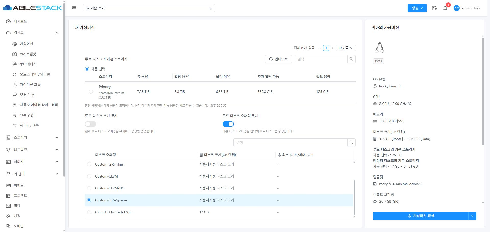 | 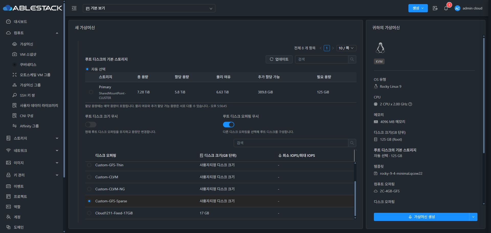 |
| 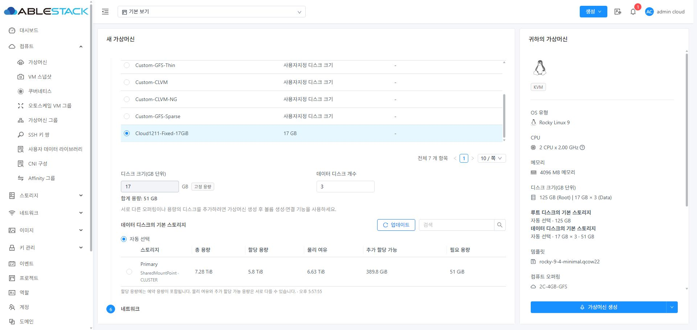 | 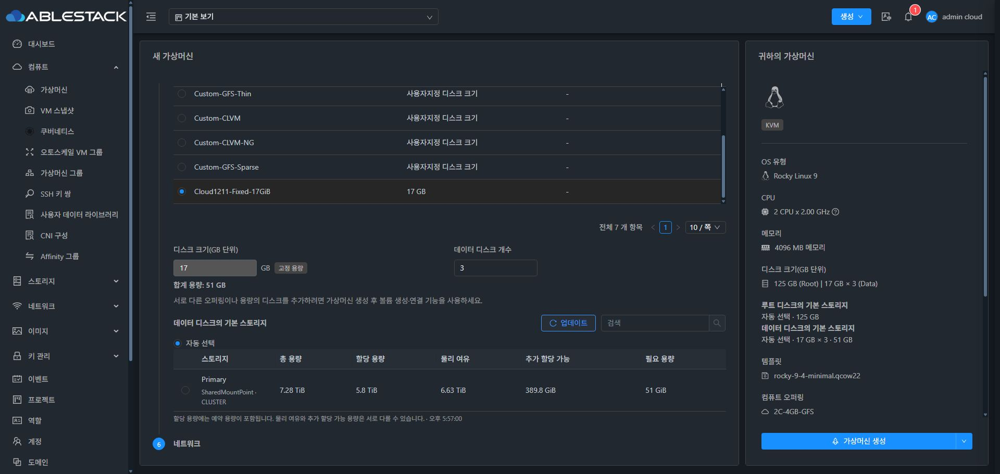 |
| 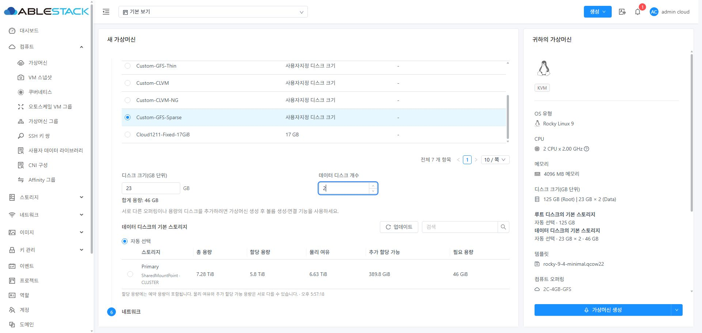 | 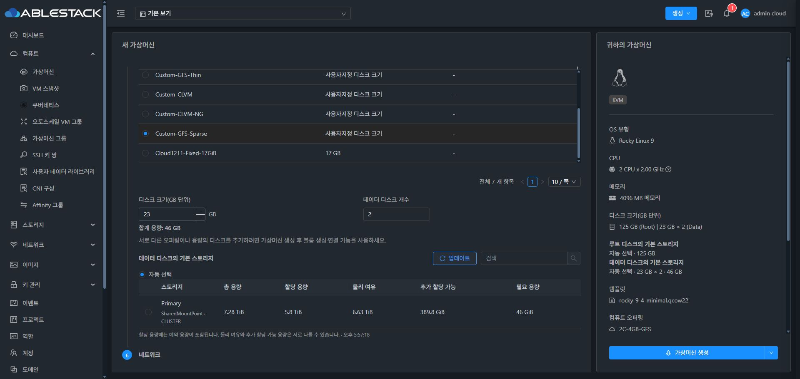 |

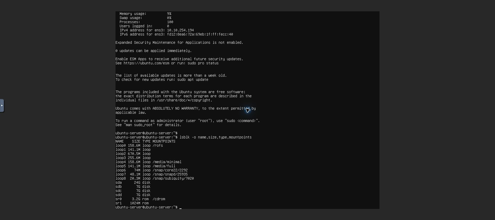

ISO 스토리지 요청은 화면에 선택된 하이퍼바이저 값을 우선 사용한다. 내부 파생 값이 아직 준비되지 않은 경우에도 유효한 폼 입력값을 누락하지 않는 회귀 검사를 추가했다.

새 스토리지 표 머리글은 공통 테마 토큰을 사용해 일반·다크 모드 모두 대비를 유지한다.

최종 ISO 화면은 컴퓨트 → 이미지 → 하이퍼바이저 순서로 선택해도 고정 17GiB 루트와 후보가 표시된다.
일반 ISO는 별도 루트·데이터 입력에서 24GiB + 7GiB 2개를 지정하고 UI 생성 버튼을 눌렀다.
모든 볼륨이 Primary에 준비된 뒤 Running이 되었으며 실제 호스트 디스크 3개와 CD-ROM 2개를 확인했다.
설치 ISO의 요약은 설치 원본 ISO 레이블과 이름으로 표시한다. 새 폼 초기화·생성 중 새 콘솔 오류는 없었다.

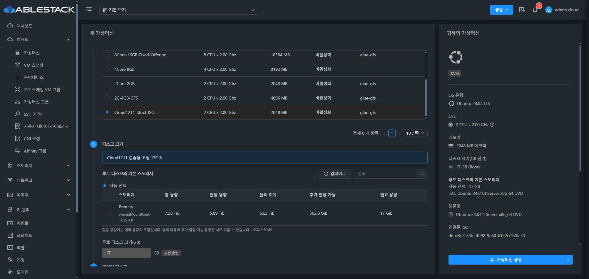

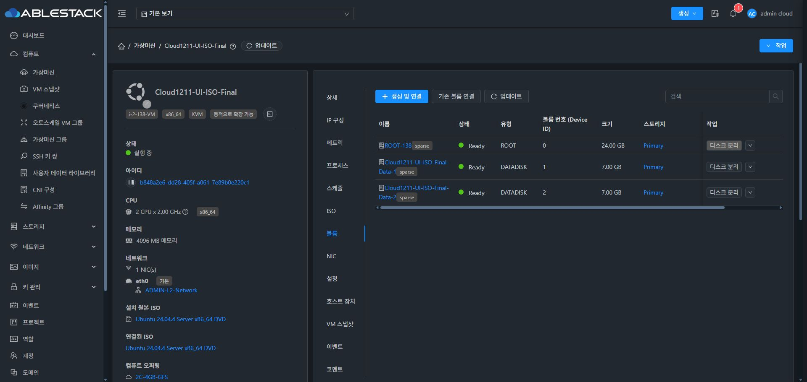

ISO 데이터 입력은 별도 모델이므로 우측 디스크 크기와 오퍼링 요약도 현재 선택값에서 계산한다.
데이터 크기·개수만 바꿔도 다른 입력을 건드리지 않고 요약을 갱신한다.
검증용 VM, 연결 해제 후 남은 데이터 볼륨 및 검증용 오퍼링을 모두 해당 ID로 대조해 정리했다. 사용자 VM은 작업 대상에 포함하지 않았다.

최종 배포 아카이브 SHA256: b511088f3e57ee0b6b8f2eacdfed0720a10adcfa66693f6240cfa0ae6cbd48a7.
정적 파일 833개를 대조했으며 WEB-INF, META-INF, config.json 및 관리 서비스 PID 보존과 /client/ HTTP 200을 확인했다.
백업: /root/issue1211-ui-20261002-181220.

| 최종 ISO 일반 모드 | 최종 ISO 다크 모드 |
| --- | --- |
| 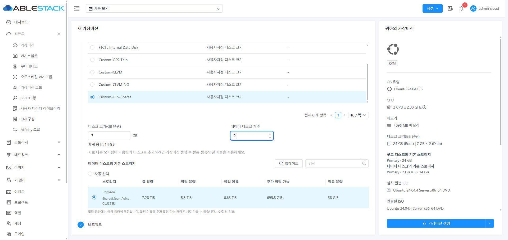 | 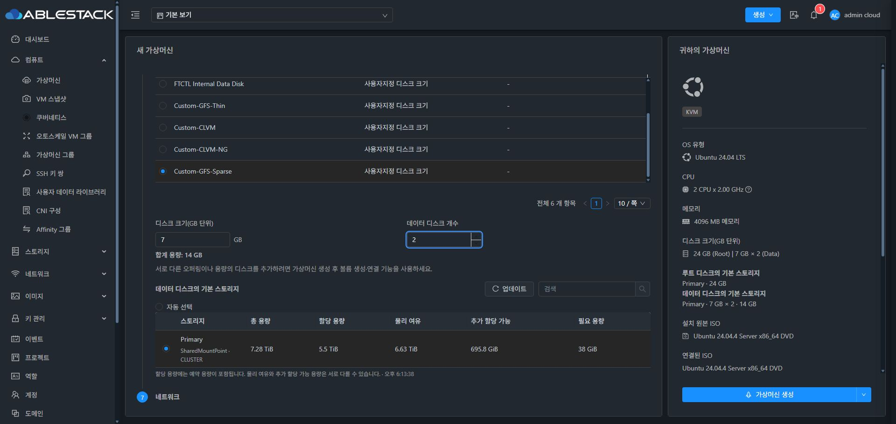 |

다른 폼 항목을 변경하지 않고 데이터 크기·개수만 9GiB × 2개 → 7GiB × 3개 → 7GiB × 2개로 변경했다.
상단 디스크 크기, 데이터 오퍼링, 풀별 합계가 모두 즉시 일치했으며 최종 재진입·일반/다크 검증 동안 신규 콘솔 오류는 없었다.
