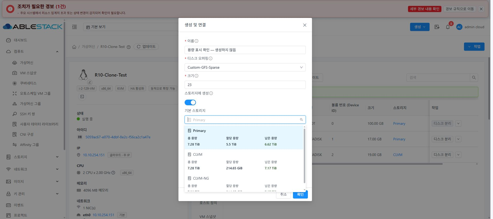
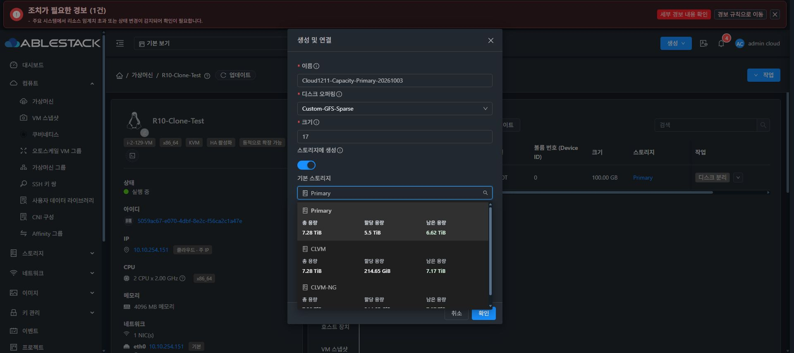
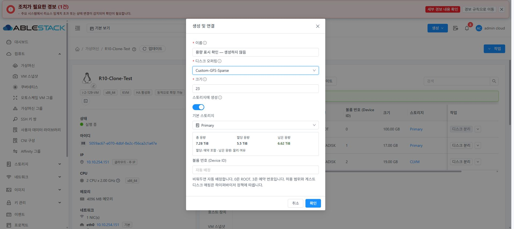
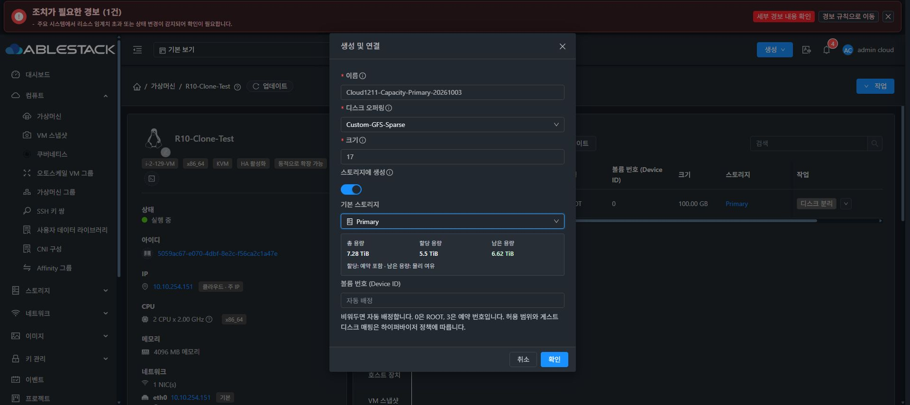
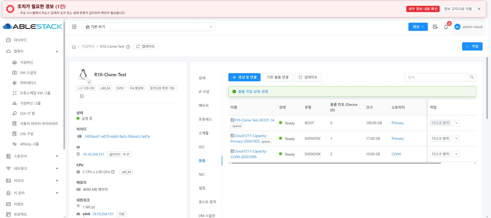
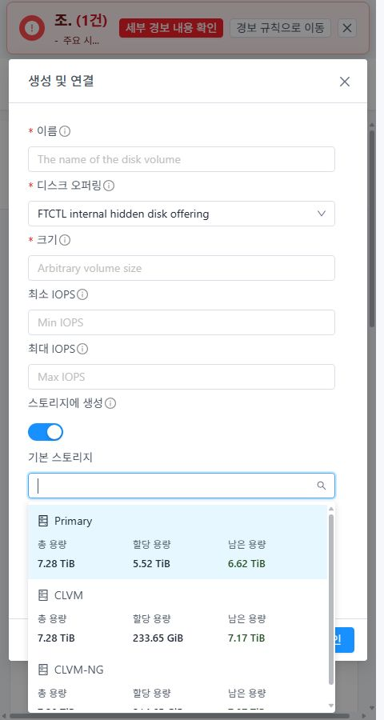
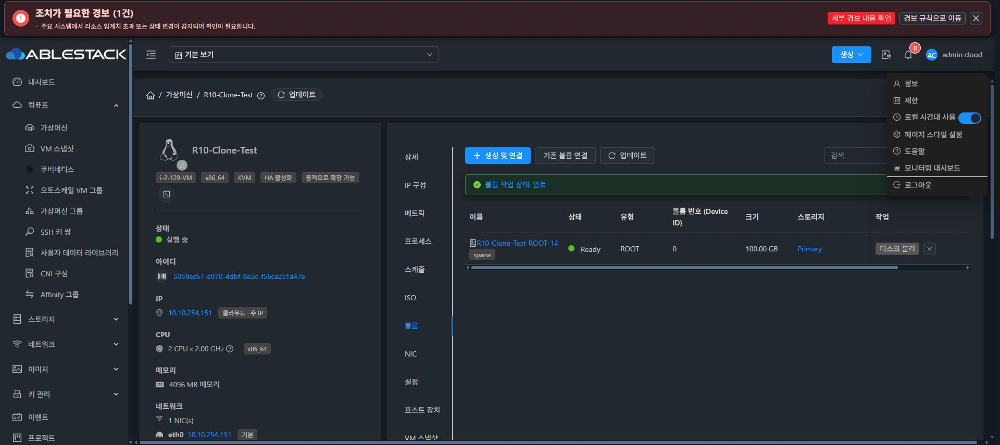

<!--
Licensed to the Apache Software Foundation (ASF) under one
or more contributor license agreements. See the NOTICE file
for additional information regarding copyright ownership.
The ASF licenses this file to you under the Apache License,
Version 2.0 (the "License"); you may not use this file except
in compliance with the License. You may obtain a copy at
http://www.apache.org/licenses/LICENSE-2.0
Unless required by applicable law or agreed to in writing,
software distributed under the License is distributed on an
"AS IS" BASIS, WITHOUT WARRANTIES OR CONDITIONS OF ANY
KIND, either express or implied. See the License for the
specific language governing permissions and limitations
under the License.
-->

# #1211 볼륨 생성 및 연결의 스토리지 용량 표시 검증

2026-10-03. 기존 PR #1215의 누적 작업 브랜치에 승인한 추가 목업과 UI 변경을 반영했다.
구현 커밋: a292884f9cae79c281990c66e534e84270bbdf9c.

## 구현

VM 상세 → 볼륨 → 생성 및 연결 → 스토리지에 생성 켜기에서 스토리지 이름과
총 용량 / 할당 용량 / 남은 용량을 3열로 표시한다. 선택한 풀은 닫힌 선택 상자에서
이름과 아이콘을 유지하고 아래에 같은 용량 요약을 표시한다.
기존 대화상자 폭, 입력 순서, 취소/확인 버튼 및 생성·연결 요청/콜백은 유지한다.
공용 CreateVolume 컴포넌트 변경이며 서버/API 변경은 없다.

- 총 용량: capacitybytes, 값이 없으면 disksizetotal.
- 할당 용량: disksizeallocated. 예약·초과 할당을 포함할 수 있다.
- 남은 용량: 물리 용량으로 확인되는 unmanaged 풀에서 total - disksizeused.
  total - allocated로 계산하지 않으며, 할당 정책상 생성 가능 용량이라고 표시하지 않는다.
- null·잘못된 값과 managed/알 수 없는 공급자의 물리 여유는 —. 실제 0과 구분한다.
- GiB/TiB, 천 단위 구분, 소수 최대 2자리. 작은 양수는 < 0.01 GiB로 구분한다.
- 키보드/이름 검색/UUID 및 기존 아이콘을 유지한다. 여러 줄 옵션은 가상 스크롤을 끄고
  기존 Ant Design 선택 목록의 스크롤·포털·상하 배치를 사용한다.
- 풀 조회 중 폼 전체를 가리지 않고 선택 목록만 로딩한다. 이전 응답이 최신 선택을
  덮지 못하도록 요청 순서를 확인하며 오류·조회 중·빈 목록을 구분한다.

## 빌드와 자동 검사

WSL ext4 작업 트리 /home/ablecloud/work/dhslove/cloud-vm-storage-1211,
Node 20.20.2 / npm 10.8.2에서 수행했다.

| 항목 | 결과 |
| --- | --- |
| 변경 파일 린트 --no-fix | 통과 |
| UI 회귀 검사 | 4개 스위트 48개 통과 |
| 신규 용량·조회 상태 검사 | 위 검사 중 20개. 초과 할당, null/invalid, managed/unknown, 오래된 응답, 입력·UUID 유지, 조회 실패·빈 응답·Zone 초기화 포함 |
| UI 프로덕션 모듈 빌드 | npm run build 통과 |
| Java/Maven | 이번 변경은 UI만 변경하여 추가 빌드 대상 없음 |
| 경고 | 기존 Browserslist 데이터 및 번들 크기 경고. 빌드 실패 없음 |

검사 명령:
npm run lint -- --no-fix src/views/storage/CreateVolume.vue src/views/storage/StoragePoolCapacity.vue src/utils/storagePoolCapacity.js tests/unit/views/storage/StoragePoolCapacity.spec.js
npm run test:unit -- --runInBand --coverage=false --runTestsByPath tests/unit/views/storage/StoragePoolCapacity.spec.js tests/unit/views/compute/DeploymentStorageSelection.spec.js tests/unit/utils/vmDiskDeployment.spec.js tests/unit/utils/vmVolumeActions.spec.js
NODE_OPTIONS="--openssl-legacy-provider --max-old-space-size=8192" npm run build

## 31번 클러스터 배포

정적 UI 파일 833개를 배포하고 파일별 해시를 대조했다.
활성 경로: /usr/share/cloudstack-management/webapp.
WEB-INF, META-INF 유무, config.json, 관리 서비스 PID 1651945를 보존하고
mold active 및 /client/ HTTP 200을 확인했다.

UI 아카이브 SHA256: 28ec52d77147fe72142d5f6ee74a301f439da06cfdb8597aeca02af545c5050e.
백업: /root/issue1211-volume-capacity-ui-20261003-004005.

## 실제 브라우저·기능 검증

검증 VM은 기존 R10-Clone-Test (5059ac67-e070-4dbf-8e2c-f56ca2c1a47e),
실행 중 i-2-129-VM / ablecube31-1이다.

| 항목 | 결과 |
| --- | --- |
| 일반·다크 모드 목록·선택 요약 | 총/할당/남은 용량, 숫자·보조 문구·선택 배경 확인 |
| 실제 조회 값 | Primary 7.28 TiB / 5.5 TiB / 6.62 TiB, CLVM 7.28 TiB / 214.65 GiB / 7.17 TiB, CLVM-NG 7.28 TiB / 214.65 GiB / 7.07 TiB |
| 이름 검색·키보드 | CLVM-NG 검색 및 Enter 선택, Primary 복귀. 생성 결과의 storage UUID 일치 |
| 입력 보존 | 이름·크기 입력이 스토리지 조회와 선택 변경 후 유지 |
| 작은 화면 | 480px에서 대화상자/3열 정렬 확인. 새로 열린 목록 폭 384px, clientWidth = scrollWidth |
| 실제 Primary 생성·연결 | Custom-GFS-Sparse, 17GB, Device ID 1, Ready, 선택한 Primary UUID와 일치 |
| 실제 CLVM 생성·연결 | Custom-CLVM, 19GB, Device ID 2, Ready, 선택한 CLVM UUID와 일치 |
| 호스트 실제 연결 | libvirt XML에서 GFS 파일 /mnt/glue-gfs/7f826553-bf8f-4398-ade2-c14302905cbf 및 CLVM /dev/vg_clvm/c83b59c5-5e40-4220-a0c4-f38d1f7d075b 확인 |
| QEMU 실제 크기 | query-block에서 18,253,611,008 / 20,401,094,656 bytes (17 / 19 GiB), API와 일치 |
| 브라우저 콘솔 오류 | 0개 |
| 정리 | 이번에 만든 위 두 DATADISK만 분리·삭제. 기존 ROOT 8e974a81-b7d2-48da-a402-ff918579a71e 한 개 보존 |
| 최종 상태 | VM Running, 호스트 3대 Up, 관리 서비스/PID/WEB-INF/HTTP 200 정상 |

용량은 조회 시점 값이며 실제 생성 후 할당량이 증가한다. 새 폼 재조회에서도 Primary의
할당 5.52 TiB 및 CLVM 233.65 GiB로 갱신되는 것을 확인했다.
managed/unknown 공급자 및 조회 실패는 단위 검사로 검증했으며 이 클러스터에는 해당
실환경 조합이 없어 실환경 PASS로 기록하지 않는다.
게스트 내부 포맷·파일시스템 쓰기는 이 UI 변경의 검증 대상이 아니며 수행하지 않았다.
기존 브라우저의 다크 모드와 뷰포트 크기를 복구했다.

## 배포된 실제 화면

| 일반 모드 | 다크 모드 |
| --- | --- |
|  |  |
|  |  |

