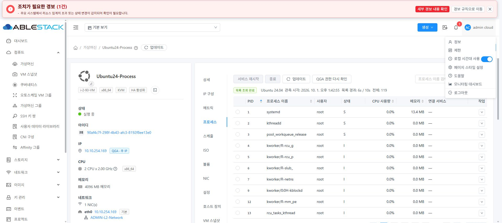
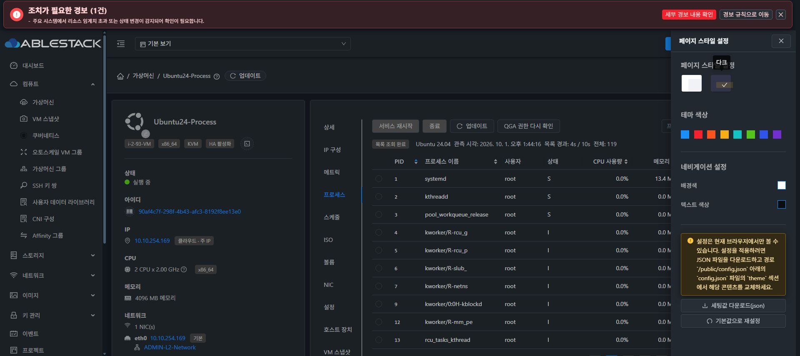
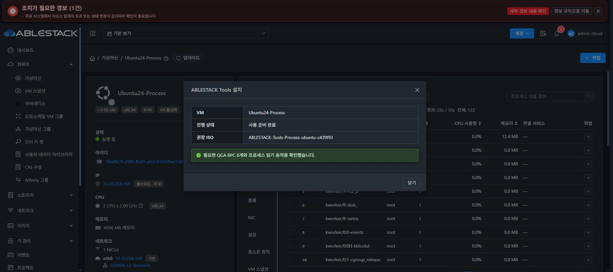
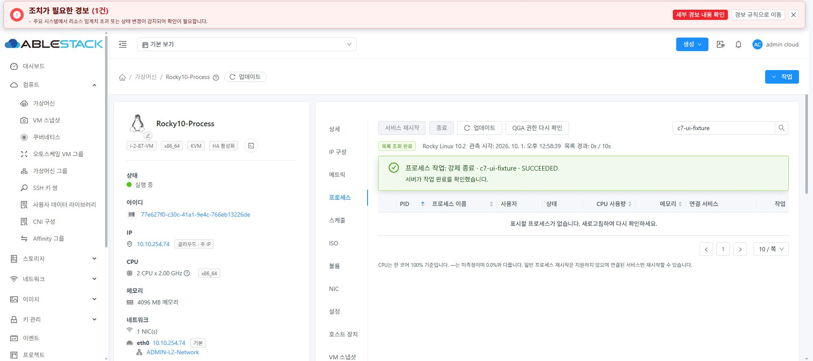
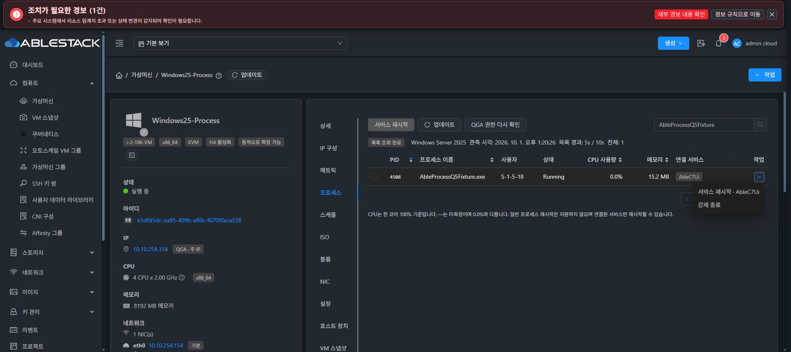
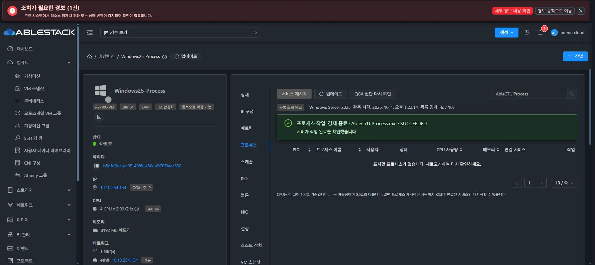
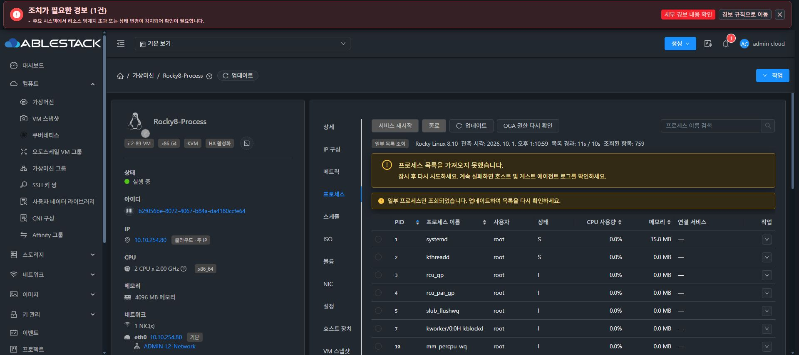

<!--
Licensed to the Apache Software Foundation (ASF) under one
or more contributor license agreements. See the NOTICE file
distributed with this work for additional information
regarding copyright ownership. The ASF licenses this file
to you under the Apache License, Version 2.0 (the
"License"); you may not use this file except in compliance
with the License. You may obtain a copy of the License at

  http://www.apache.org/licenses/LICENSE-2.0

Unless required by applicable law or agreed to in writing,
software distributed under the License is distributed on an
"AS IS" BASIS, WITHOUT WARRANTIES OR CONDITIONS OF ANY
KIND, either express or implied. See the License for the
specific language governing permissions and limitations
under the License.
-->

# Cloud #1177 C7 통합 검증 보고서

2026-10-01, 31번 테스트 클러스터. [Epic #1170](https://github.com/ablecloud-team/ablestack-cloud/issues/1170)의 [단일 Cloud PR #1197](https://github.com/ablecloud-team/ablestack-cloud/pull/1197)에 누적한다. Qemu 패키지/ISO는 [단일 Qemu PR #82](https://github.com/ablecloud-team/ablestack-qemu-exec-tools/pull/82)의 승인 빌드 36688611885(c439f930 계열)를 재사용했으며 이번 C7에서 Qemu 소스를 변경하거나 새 ISO를 만들지 않았다.

## 결과와 구현

12대에서 실제 Tools ISO 설치, READY, RPC 8개 실행, 동일 snapshot의 전체 페이지 및 CPU 값을 확인했다. Linux 8대 × TERM/KILL/서비스 RESTART, Windows 4대 × KILL/서비스 RESTART의 **32개 작업 모두 API SUCCEEDED/VERIFIED와 실제 게스트 후조건이 일치**했다. 브라우저에서도 Linux 3종/Windows 2종 작업을 일회용 대상에 실행했다.

C7에서 발견한 문제를 다음과 같이 수정했다.

- Windows Server 2025 Defender가 압축 데이터를 복원하는 readiness PowerShell을 Behavior:Win32/PShellCobStager.A로 차단했다(이벤트 1116/1117). 실행은 exit 0인데 stdout이 비어 있어 준비 검사가 실패했다. 설정을 실행 코드로 평가하지 않는 일반 JSON 데이터로 전달한다. 소스 라이선스는 유지하고 전송 시 주석/들여쓰기를 생략하여 Windows 명령 길이 31,000자 상한을 지킨다. Defender 설정/예외/해시 검증을 완화하지 않았다. 기존 승인된 **전체 파일 묶음** 및 이동 호환성을 그대로 유지한다.
- PARTIAL 수집을 전체 수집 완료로 표시하던 UI를 수정했다. 부분 목록 배지·조회된 항목 수·경고를 보여주며 정상 갱신 또는 목록 초기화 후 이전 부분 수집 경고가 남지 않는다.
- Windows SCM 서비스 프로세스의 강제 종료는 게스트 정책상 PROTECTED_TARGET이다. UI도 이를 비활성화하고 서비스 재시작을 제공한다. read-only capability에는 변경 버튼을 활성화하지 않는다. 보호 대상 오류는 한국어/영어 제품 메시지로 설명한다.
- 잘못된 request/operation UUID가 journal에 접근하기 전에 명확한 InvalidParameterValueException으로 거부되도록 수정했다.
- 고정된 Process 테스트 VM용 API 검사 도구와, 원래 QGA 읽기 실행 종료를 입증한 경우만 해당 lease를 정리하는 관리자 도구를 추가했다. 응답이 불명확한 변경 요청은 재전송하지 않는다.

## OS별 실증

| VM | 실제 OS | 설치 전 기준 | 설치·RPC8·최종 전체 목록/CPU | 실제 변경 작업 |
|---|---|---|---|---|
| Rocky10-Process | Rocky 10.2 | QGA 설치, RPC 차단 | 통과 | TERM/KILL/RESTART 통과 |
| Rocky9-Process | Rocky 9.8 | QGA 설치, RPC 차단 | 통과 | TERM/KILL/RESTART 통과 |
| Rocky8-Process | Rocky 8.10 | QGA 설치, RPC 차단 | 통과 | TERM/KILL/RESTART 통과 |
| Ubuntu26-Process | Ubuntu 26.04 | QGA 미설치 | 통과 | TERM/KILL/RESTART 통과 |
| Ubuntu24-Process | Ubuntu 24.04.4 | QGA 미설치 | 통과 | TERM/KILL/RESTART 통과 |
| Ubuntu22-Process | Ubuntu 22.04.5 | QGA 미설치 | 통과 | TERM/KILL/RESTART 통과 |
| Debian12-Process | Debian 12 | 기본 QGA 설치, Tools 미설치 | 통과 | TERM/KILL/RESTART 통과 |
| Debian13-Process | Debian 13 | 기본 QGA 설치, Tools 미설치 | 통과 | TERM/KILL/RESTART 통과 |
| Windows25-Process | Server 2025 | QGA 미설치, 네트워크/serial 드라이버 미바인딩 | 통과 | 일반 PID KILL/SCM RESTART 통과 |
| Windows22-Process | Server 2022 | 동일 Windows 기준 | 통과 | 일반 PID KILL/SCM RESTART 통과 |
| Windows19-Process | Server 2019 | 동일 Windows 기준 | 통과 | 일반 PID KILL/SCM RESTART 통과 |
| Windows11-Process | Windows 11 | 동일 Windows 기준 | 통과 | 일반 PID KILL/SCM RESTART 통과 |

Windows는 게스트 콘솔의 **install.bat 자동 설치**로 VirtIO NetKVM/vioserial/Balloon, QGA, Process Tools를 확인했다. 사용자 수동 VirtIO 설치로 대체하지 않았다. 기존 VirtIO 설치 정보가 있는 구성도 포함되므로 드라이버 없는 OS 설치 전 디스크 상태까지 재생성했다는 의미는 아니다. Server 2025/Windows 11은 설치 재부팅 필요 상태와 실제 재부팅 후 READY를 확인했다. 사용자 지시에 따라 **최종 Windows 테스트 4대 CD-ROM에는 원래 OS ISO와 Tools ISO 모두 연결되어 있지 않다**. 검증용 Linux ISO와 초기 메모리 스냅샷은 보존했다. 31번 클러스터 Windows 전체 11대도 추가 조회하여 기존 3대의 남은 Tools ISO를 해제했으며 Cloud 등록 정보와 실제 libvirt의 미디어 source 0·VM 상태 보존을 대조했다.

등록 OS와 실제 OS가 다르던 Rocky 9, Debian 13, Ubuntu 26은 실제 게스트 OS를 확인하여 테스트 VM의 Cloud 등록 정보를 바로잡았다. Debian 13/Ubuntu 26은 누락된 Guest OS 정의를 등록했다. 실제 OS 불일치를 허용하는 코드로 우회하지 않았다. 실제 RHEL 및 Debian 11은 이번 테스트 대상이 아니다.

## 브라우저 전체 경로와 UI

Ubuntu 24의 초기 DiskAndMemory 스냅샷을 Cloud API로 복원했다. QGA 패키지가 없는 것을 게스트에서 확인한 뒤 UI 권장 ISO 선택→연결→게스트 install-linux.sh 자동 설치(exit 0)→UI 설치 후 재확인→준비 완료→실제 122행/CPU 목록을 확인했다. 스냅샷 원본은 Ready로 남아 있다.

Linux는 브라우저 서비스 재시작 MainPID 10842→10961/InvocationID 변경, 정상 종료 10961→0/inactive, 강제 종료 11292→0/failed를 확인했다. Windows는 SCM 재시작 1828→4384/Running과 **일반 프로세스 4532의 UI 강제 종료 SUCCEEDED 및 게스트 소멸**을 확인했다. 서비스 PID 4384를 강제 종료하려던 초기 시도는 보호 정책으로 FAILED/NOT_STARTED였고 서비스는 정상 유지됐다. 이 거부를 성공으로 집계하지 않았으며 보완 UI에서 SCM 강제 종료 메뉴 비활성화를 확인했다.

일반/다크 테마에서 실제 목록·CPU·모달·작업 결과를 확인하고 기존 VM 스냅샷/볼륨/NIC의 상단 버튼·행 작업·표/경고 배치와 비교했다. 탭 순서는 상세→IP 구성→메트릭→프로세스이다. 버튼은 상단과 프로세스 행에 있다. 갱신 중 기존 행과 테이블 높이를 보존하는 DOM 증거도 수집했다. 대량 1,000개 일회용 프로세스를 추가한 실제 PARTIAL 화면은 조회된 759행과 부분 수집 경고를 표시했다.

표준 비교 화면: [VM 스냅샷](vm-snapshot-standard-dark.png), [볼륨](volume-standard-dark.png), [NIC](network-standard-dark.png). DOM: [일반 모드](browser-dom-light.json), [최종 일반 모드](browser-final-light.json), [최종 다크 모드](browser-final-dark.json), [갱신 중 표 보존](refresh-preserved-table.json), [최종 번들 표 보존](refresh-preserved-table-final.json), [Windows 보호 메뉴](windows-service-menu.json).

## 안전성·예외·이동·대량 테스트

| 항목 | 실제 결과/범위 |
|---|---|
| tenant/RBAC | 별도 기본 User로 다른 계정 VM capability 거부(531), 변경 API 3종 거부(432). dispatch되지 않음. |
| Global false | 기능 API 거부(431) 확인 후 원래 true 복구. ISO UUID 배열 설정 보존. |
| 응답 유실 | 최초 변경 응답을 의도적으로 버린 후 원래 request ID만 재조회. 제출 1회, SUCCEEDED/VERIFIED·PID 소멸·동일 operation 확인. |
| 작업 중 management 재시작 | Rocky 9 테스트 서비스의 deactivating 상태를 실제 관측한 뒤 Mold 재시작. 재로그인 후 원래 request ID만 조회해 SUCCEEDED/실제 새 MainPID 확인. 이는 graceful 재시작 실증이다. |
| 불명확 작업 회복 | durable UNKNOWN/호스트 쿼리 유실/재시작/배치 변화는 server 단위 회귀에서 재전송 없이 원래 query만 수행하는 것을 검증. |
| stale identity | 이미 종료한 일회용 PID 변경 거부, 이동/재부팅 뒤 이전 snapshot 거부. startTicks·부팅·identity 불일치는 회귀 테스트. 실제 커널 PID 재사용을 강제로 발생시키지는 않음. |
| 호스트 이동 | Ubuntu 22 및 Windows 2022를 다른 호스트로 이동/원래 호스트로 복귀(총 4회). 같은 boot/승인 묶음에서 READY·목록, 이전 snapshot 거부 확인. |
| 재부팅 | Rocky 9의 새 boot ID와 READY, 이전 snapshot 거부. Windows 설치 재부팅 및 이후 실제 작업도 확인. |
| 대량 목록 | 추가 350개: 전체 473행, 3페이지, PID 중복 없음, 약 4초. 추가 1,000개: 1,034행 PARTIAL 결과 및 별도 UI 759행 PARTIAL을 전체 완료로 집계하지 않음. 10,000행 부하 실증은 미실행. |
| 읽기 응답 불명확 | Rocky 8에 실제 Q4 UNKNOWN lease 발생. capability와 다른 관측이 안전하게 차단됨을 확인. 원래 guest-exec ID 59622의 exited=true 증거·host owner 종료·같은 host boot/UUID·flock/정확한 파일 대조 후 해당 마커만 정리. 실제 helper 복구는 별도 일회용 read 실행으로 검증. |

읽기 lease 자동 해제는 제공하지 않는다. guestExecPid가 없거나 상태가 유실되면 오래됐다는 이유로 삭제하지 않는다. 관리자가 [복구 도구 및 절차](../../../tools/vm-process-e2e/README.ko.md)를 사용해야 한다. 일반 목록 수집도 QGA 응답 유실이 발생하면 이 안전 정책 때문에 운영자 확인이 필요할 수 있다.

기본 테스트 계정 deleteAccount는 기존 Cloud 사용자 정리 경로에서 실패했다(530). 테스트 계정에 VM/볼륨이 없는 것을 확인한 뒤 정확한 계정/사용자 UUID만 조건부 비활성·removed 처리했고 활성 테스트 계정/사용자 0을 확인했다. 이 별도 정리 오류를 프로세스 권한 검증 성공으로 숨기거나 제품 소스 수정 범위에 포함하지 않았다.

## 빌드·배포·rollback·회귀

모든 저장소 작업/빌드/원격 배포는 WSL ext4 dhslove clone에서 수행했다. 기존 기본 checkout 변경을 보존했다. Europa upstream/origin은 68d7bcf56256c06e14568ad9a0985c335a701520으로 동기화되어 있고, 기존 Epic head 88a7f5896a120cdfb58da41abbace8419fdcca60에서 codex/issue1177-e2e를 분기했다. 기존 누적 작업을 버리거나 재작성하지 않았다.

| 검증 | 결과 |
|---|---|
| 변경 server module install | 41개 focused 테스트, BUILD SUCCESS(55초). 새 action tests 포함. |
| 변경 KVM module install | 15개 focused 테스트, BUILD SUCCESS(23초). |
| KVM guard/FT/DR wrapper 회귀 | 47개 focused 테스트, BUILD SUCCESS(32초). |
| UI | 4 suite / 35개 테스트, lint·production build 통과. |
| Python 검사/복구 도구 | 18개 테스트 통과, read-only fixture 실제 복구 통과. |
| 관리 배포 | 변경 VmProcessActionServiceImpl 클래스만 기존 management JAR에 반영. Mold active, /client/ 200. |
| Agent 배포 | 3호스트의 KVM 변경 클래스/PS1 리소스만 기존 JAR에 반영, 설치 바이트 일치, Mold Agent active. |
| UI 배포 | 정적 파일 832개, 모든 설치 바이트 검증. WEB-INF/META-INF/config.json·Mold PID 보존, /client/ 200. |
| 대표 rollback | 31.2 KVM 이전 JAR bytes 복구→Agent 재연결→Rocky 10 READY→새 bytes 재적용. VM inventory 보존. |

변경 module 빌드의 Checkstyle/RAT은 skip하여 전체 품질 CI 성공으로 해석하지 않는다. 전체 Cloud 빌드는 실행하지 않았다. PR 판정은 사용자 요청대로 현재 head의 Conflict/License만 확인한다. 전체 management/UI rollback은 수행하지 않았으며 운영 가이드에 복구 절차를 기록했다.

기존 네트워크 수집은 12대의 QGA interfaces와 정상 게스트↔management ping으로 확인했다. Rocky의 QGA SELinux 도메인은 ping 실행을 차단하므로 관리자 SSH에서 네트워크를 확인했으며 SELinux를 완화하지 않았다. Linux ISO 유지/Windows ISO 없음, 12대 Running, 초기 메모리 스냅샷 12개 Ready, 모든 C7 서비스/대량 PID 정리를 확인했다.

FT/hangctl 코드 파일 SHA256은 이전 Q6 실증 파일과 모두 일치한다. 3호스트의 hangctl timer는 active, FTCTL timer는 **기존과 동일한 inactive**이다. 기존 비활성 정책을 임의 활성화하지 않았다. KVM 배포 전후에도 timer/VM inventory 불변을 확인했다. FT/HA/DR 실제 장애·복구 전체 체인은 이번에 실행하지 않았으며 wrapper/guard 회귀와 배포 불변성 범위만 통과로 판단한다.

최종 target Cloud active process operation 0, 세 호스트 target operation marker 0, Global true, 클러스터 Windows 11대의 CD-ROM 미디어 0이다. 설치 파일/서비스만 보고 완료로 판단한 기록이 아니다.

## 증거와 판정 경계

[receipts.json](receipts.json)에 12대 UUID/행 수/수치 CPU/RPC 실증, 32개 작업 identity/후조건, 이동·재부팅·응답 유실·재시작, 배포 해시/rollback/정리 증거를 저장했다. 인증 정보/세션/비공개 배포 스크립트는 포함하지 않았다. 로그는 저장 시 행 끝 공백만 정리했다. 모듈·UI·Python 로그 및 [UI 정적 파일 SHA256 832개](ui-static-manifest.json)도 이 폴더에 보관한다.

**C7의 프로세스 통합·운영 검증은 완료했고 단일 PR에 누적한다.** 미실행 구간은 실제 RHEL, 실제 커널 PID 재사용 유발, 강제 management 프로세스 crash, 10,000행 부하, management/UI 실제 rollback, FT/HA/DR 장애 전체 체인, 전체 릴리스 빌드이다. 해당 구간까지 통과한 것으로 표시하지 않는다. 기존 승인된 다중 게스트 묶음/보호 정책을 유지했고, 알려진 UNKNOWN 읽기에는 증거 기반 운영자 복구가 필요하다는 제약을 명시했다. 코드 병합과 Epic/자식 이슈 종료는 단일 PR의 최종 검토 후 함께 수행한다.
