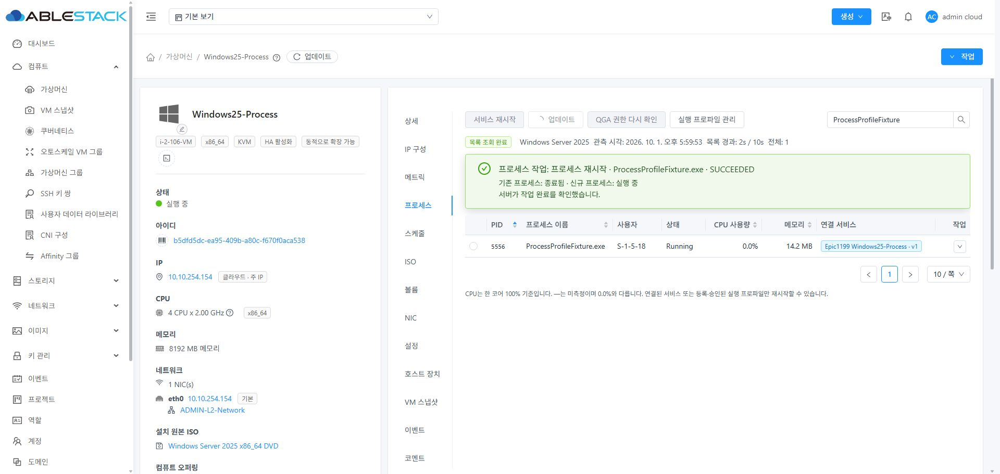
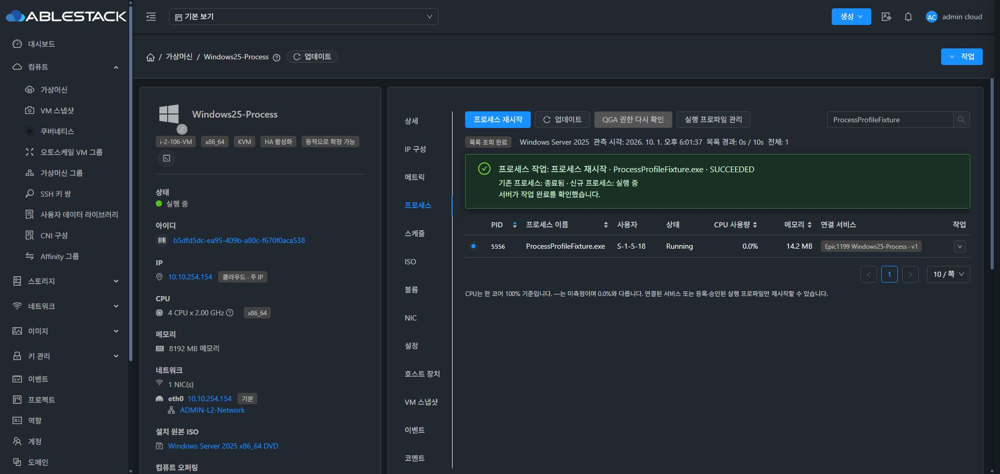
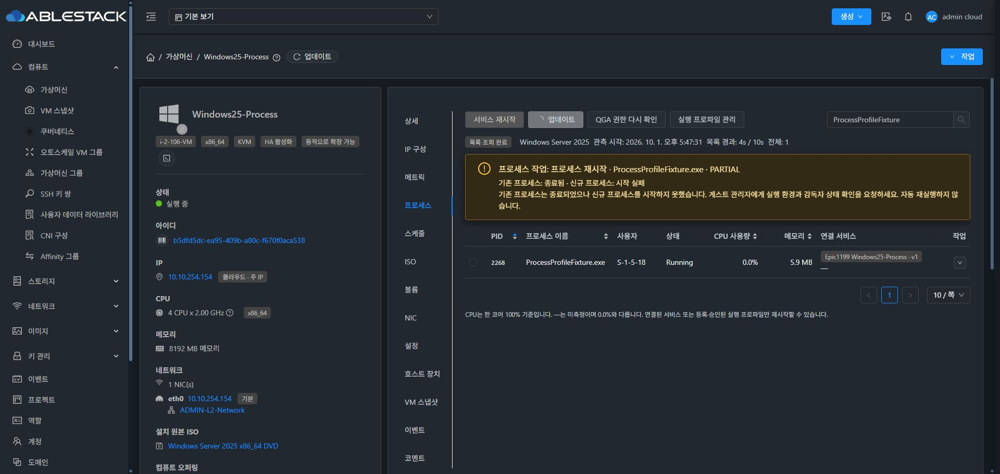
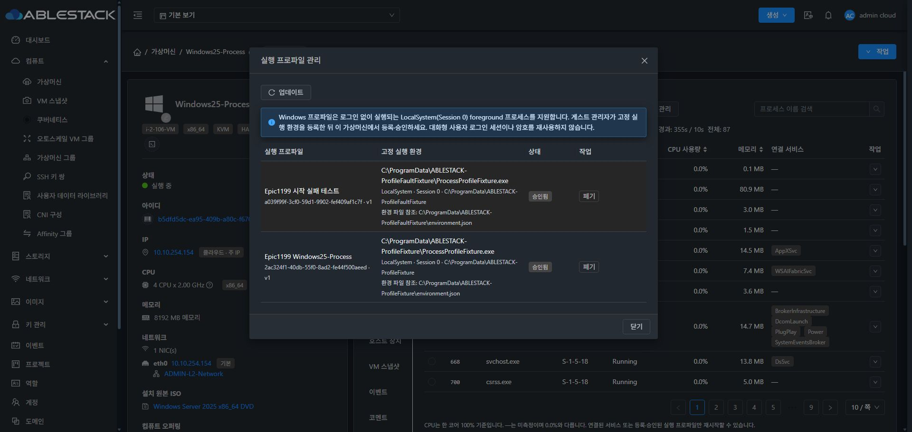
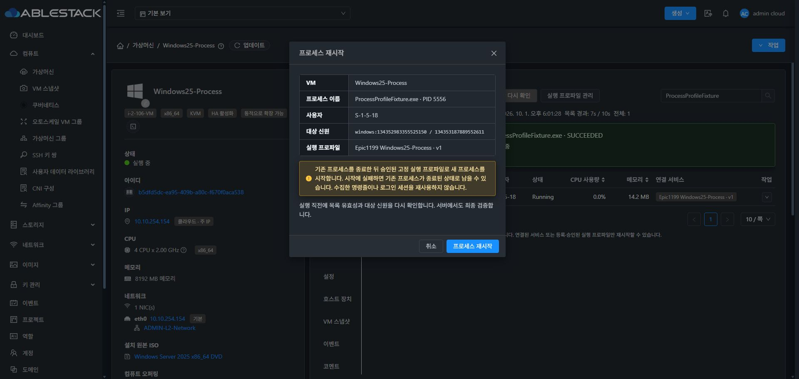
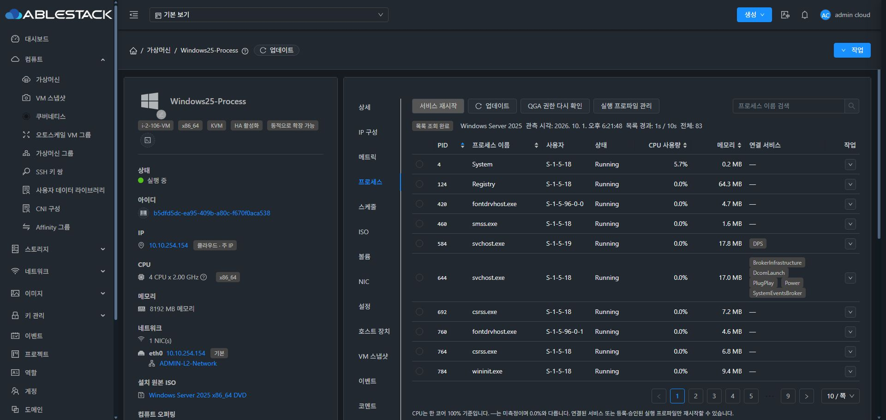

<!--
Licensed to the Apache Software Foundation (ASF) under one
or more contributor license agreements.  See the NOTICE file
distributed with this work for additional information
regarding copyright ownership.  The ASF licenses this file
to you under the Apache License, Version 2.0 (the
"License"); you may not use this file except in compliance
with the License.  You may obtain a copy of the License at

  http://www.apache.org/licenses/LICENSE-2.0

Unless required by applicable law or agreed to in writing,
software distributed under the License is distributed on an
"AS IS" BASIS, WITHOUT WARRANTIES OR CONDITIONS OF ANY
KIND, either express or implied.  See the License for the
specific language governing permissions and limitations
under the License.
-->

# Epic #1199 최종 구현·배포·실증 (2026-10-01)

일반 foreground 프로세스의 재시작을 게스트 관리자 봉인 정의 → Cloud 등록/승인 → 고정 프로파일 실행으로 구현했다. 수집한 command line을 재실행하거나 임의 실행 명령을 Cloud에 입력하는 기능은 없다. 기존 MVP와 Global 명시 활성화, VM 접근 권한, 보호 대상 거부, 전체 해시 묶음 비교를 유지한다.

## 지원 범위와 운영

Linux는 고정 executable/argv/cwd/실제 계정과 root 전용 systemd EnvironmentFile을 사용한다. Windows는 LocalSystem/Session 0과 관리자 전용 JSON 환경 참조를 사용한다. 단일 foreground workload가 대상이며 대화형 세션 복원·daemonization·자식 트리 전체 종료는 지원한다고 표시하지 않는다. 재부팅 뒤 workload를 관리자가 시작하고 새 identity에 다시 바인딩한다. 호스트 이동에는 재등록이 필요 없다.

[정의 예제·권한·운영·UNKNOWN/PARTIAL 복구](../../design/vm-process-profiles/README.ko.md), [검증 증거 JSON](evidence.json).

## 실제 재시작 검증

아래는 최종 호스트 패키지 배포 후 반복 검증의 실제 PID이다. 기존 PID 소멸, 다른 PID/startTicks의 신규 실행, 계정/cwd/환경 참조 적용, guest journal과 Cloud 결과, 같은 요청 ID의 기존 결과 반환을 대조했다.

| 테스트 VM | 실제 OS 버전 | 기존 → 신규 PID | 실제 작업 결과 | 목록/준비 상태 |
|---|---|---|---|---|
| Rocky10-Process | 10.2 | 17534 → 17558 | SUCCEEDED / EXITED → RUNNING | READY / CPU 확인 |
| Rocky9-Process | 9.8 | 6537 → 6774 | SUCCEEDED / EXITED → RUNNING | READY / CPU 확인 |
| Rocky8-Process | 8.10 | 89124 → 95209 | SUCCEEDED / EXITED → RUNNING | READY / CPU 확인 |
| Ubuntu26-Process | 26.04 | 5552 → 5860 | SUCCEEDED / EXITED → RUNNING | READY / CPU 확인 |
| Ubuntu24-Process | 24.04 | 5224 → 5554 | SUCCEEDED / EXITED → RUNNING | READY / CPU 확인 |
| Ubuntu22-Process | 22.04 | 4812 → 6185 | SUCCEEDED / EXITED → RUNNING | READY / CPU 확인 |
| Debian12-Process | 12 | 4186 → 4338 | SUCCEEDED / EXITED → RUNNING | READY / CPU 확인 |
| Debian13-Process | 13 | 5719 → 5856 | SUCCEEDED / EXITED → RUNNING | READY / CPU 확인 |
| Windows25-Process | 2025 | 3896 → 2268 | SUCCEEDED / EXITED → RUNNING | READY / CPU 확인 |
| Windows22-Process | 2022 | 3228 → 2792 | SUCCEEDED / EXITED → RUNNING | READY / CPU 확인 |
| Windows19-Process | 2019 | 5328 → 5892 | SUCCEEDED / EXITED → RUNNING | READY / CPU 확인 |
| Windows11-Process | 11 | 2944 → 160 | SUCCEEDED / EXITED → RUNNING | READY / CPU 확인 |

미승인·폐기·다른 VM·잘못된 버전, Global OFF, 기본 사용자·다른 tenant, 보호 PID 및 프로파일 전용 systemd unit을 서비스 재시작 경로로 실행하는 우회가 모두 거부됐다. Linux 실행 파일 원자 교체와 Windows 잘못된 환경 JSON은 기존 PID 종료 전에 FAILED/NOT_STARTED로 차단됐다.

Linux/Windows의 확실한 시작 실패는 기존 PID EXITED·신규 NOT_RUNNING인 PARTIAL로 표시했다. 실제 Windows UI 성공은 2268→5556, 부분 실패는 기존 3132 종료·신규 없음이며 결과 조회·동일 요청에 자동 재실행이 없었다. Ubuntu 22에서 해당 요청의 호스트 전달 프로세스를 끊어 UNKNOWN을 실제 관찰한 뒤 읽기 복구로 5793→6009 한 번만 생성됨을 확인했다. Windows 물리 응답 유실은 실제 VM 시험 범위에 포함하지 않았다. Windows durable journal 복구는 GitHub Actions 회귀 검증과 동일 요청 시험으로 검증했다.

Ubuntu 24를 테스트 클러스터 호스트 3→2로 Cloud 마이그레이션하여 identity 보존, 이전 승인 게스트 전체 묶음 수용, 이동 후 재시작 및 환경 적용을 확인했다. Windows 2025를 실제 중지/시작하여 중지 중 승인 이력 조회·폐기·재승인 거부를 확인했다.

## 재기동 후 미확정 읽기 복구

실제 재기동 직후 Windows 목록 조회가 제한 시간을 넘겨 `q4-read-lease`를 남기는 현상을 발견했다. 종료·재시작의 UNKNOWN 보호는 유지하면서, Mold Agent가 VM flock 아래에서 소유자 종료·원래 guestExecPid의 종료 코드 0·비절단 UTF-8 JSON·요청 UUID·VM UUID를 확인한 **완료 읽기 기록만** 자동 정리하도록 수정했다. 살아 있는 소유자·불일치·변조·미완료·증거 없는 기록은 보존한다.

첫 진단 기록은 원인 분석의 guest-exec-status가 완료 응답을 소비한 뒤였으므로 저장된 일치 증거를 대조해 정확히 그 읽기 기록만 운영자로 정리했다. 자동 복구 시험은 별도로 실제 고정 Windows process.list를 1500ms 예산으로 실행해 UNKNOWN/guestExecPid를 만들고, 완료 응답을 직접 읽지 않은 채 Cloud 준비 상태 조회가 자동 정리하여 READY/기록 0으로 돌아옴을 확인했다. 이후 Windows 2025 실제 중지/시작도 다시 수행하여 QGA 시작 후 READY와 목록 조회를 확인했다. 조회 명령·변경 명령의 재전송은 없다.

## UI 검증

실제 브라우저에서 일반/다크 모드를 VM 스냅샷·볼륨·IP 구성과 비교했다. 상세→IP 구성→메트릭→프로세스 순서, 상단/행/표준 대화상자, 첫 파란 핵심 액션, CPU/메모리와 긴 문구 가독성을 확인했다. 실제 등록→승인→성공·부분 실패와 확인 대화상자를 실행했다. 데이터 갱신 3회 동안 테이블 backend node 48158이 유지됐으며 준비 상태·목록·프로파일 조회를 직렬화하여 중복 조회와 먼저 뜨는 오류를 방지했다.

## 빌드·배포와 최종 상태

Cloud는 WSL ext4에서 api/core/server/engine-schema/KVM 변경 Maven 모듈을 빌드했다. 마지막 읽기 복구 수정은 core/KVM만 다시 install/package하고 Guard 13·readiness 16 및 core 프로파일/기존 action 13 테스트를 통과했다. 서버의 기존 프로세스/프로파일/ISO/권한 회귀도 통과했다. UI 9개 테스트·lint·빌드를 통과했다. 전체 Cloud 빌드는 수행하지 않았다.

Qemu 실행 산출물 기준 소스는 `fb4078bdbdbb01ca95c467755a5fb4925f6bf574`, [GitHub Actions 36834382355](https://github.com/dhslove/ablestack-qemu-exec-tools/actions/runs/36834382355)의 Windows/MSI·runtime gates·RPM·DEB·다중 ISO 등 6 job이 모두 성공했다. 최종 PR의 이후 Qemu 변경은 문서뿐이며 실행 산출물 소스와 구분한다. MSI 1.2.0과 호스트 RPM `0.10.0-1.epic36834382355.el9.el9.x86_64`를 검증했다.

관리 서버와 3개 Mold Agent의 20개 class/resource manifest 및 실제 JAR SHA를 대조했다. WEB-INF/META-INF/config·서비스 상태를 보존하고 정적 UI 832개 파일을 배포했다. S12 멱등 migration Complete, /client/ HTTP 200, Mold/Agent active/enabled를 확인했다. FT timer와 hangctl timer는 배포 전 상태를 유지했다.

최신 Rocky/Ubuntu/Debian/Windows ISO 4종을 등록하고 UUID catalog에 매핑하여 12 VM 모두 MATCHED를 확인했다. Windows 2025는 최종 MSI, 다른 Windows 3종은 소스 의미가 같은 이전 1.2.0 전체 번들 그대로 수용하여 하위 호환도 확인했다. Rocky SELinux Enforcing을 유지했다.

마지막 검증에서 12 VM 모두 Running/READY, 목록 OK/PARTIAL·CPU 측정, 활성 테스트 프로파일 0·폐기 이력 보존, fixture 프로세스 0 및 해당 VM 호스트 기록 0을 확인했다. 모든 실행 중 Windows VM의 실제 CD-ROM source가 비어 있다. 테스트 사용자도 활성 상태로 남지 않았다. 전체 릴리스 빌드와 최종 PR 병합은 이번 요청의 별도 후속 절차이다.
