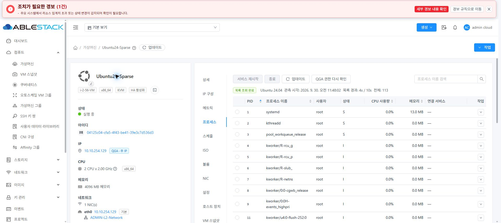
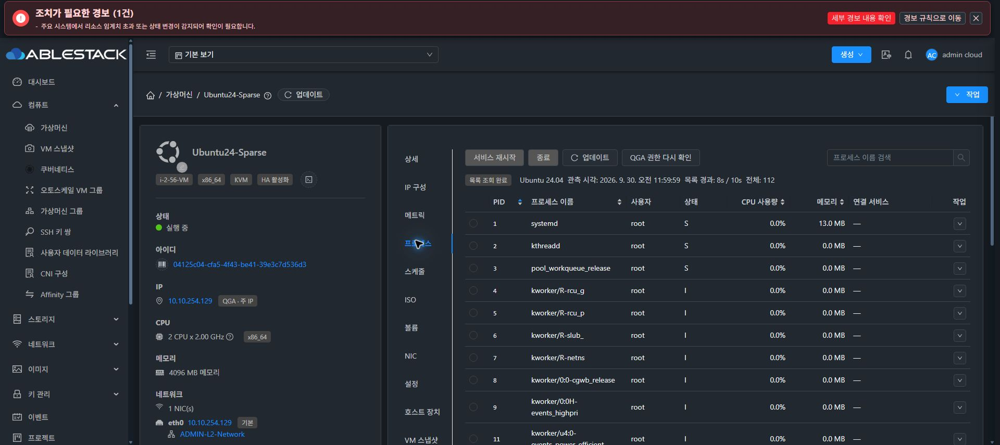
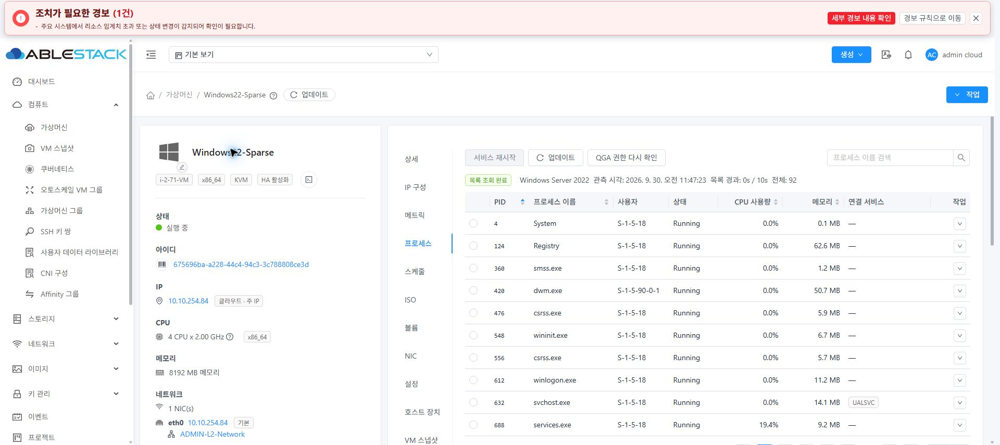
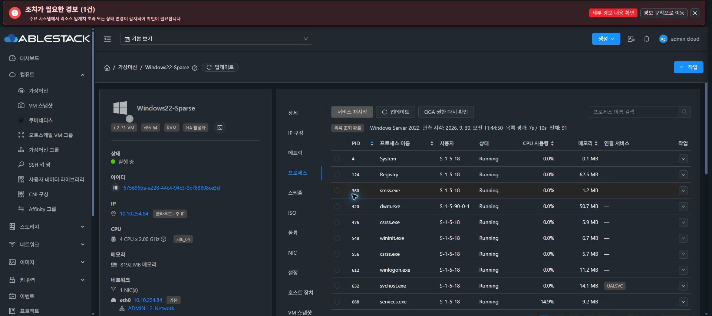

<!--
Licensed to the Apache Software Foundation (ASF) under one
or more contributor license agreements. See the NOTICE file
distributed with this work for additional information
regarding copyright ownership. The ASF licenses this file
to you under the Apache License, Version 2.0 (the
"License"); you may not use this file except in compliance
with the License. You may obtain a copy of the License at

  http://www.apache.org/licenses/LICENSE-2.0

Unless required by applicable law or agreed to in writing,
software distributed under the License is distributed on an
"AS IS" BASIS, WITHOUT WARRANTIES OR CONDITIONS OF ANY
KIND, either express or implied. See the License for the
specific language governing permissions and limitations
under the License.
-->

# Cloud #1172: 실제 게스트 어댑터 준비 상태 검증

검증일: 2026-09-30 · 상위 Epic: #1170 · 대상: 31번 테스트 클러스터.

## 변경과 브랜치

기존 capability API는 RPC 8개가 모두 활성화되어 있어도 게스트 어댑터를 확인하지 않아
`TOOLS_REQUIRED`, 빈 `allowedActions`, null `guestAdapterVersion`을 반환했다.
Qemu가 관리하는 승인된 해시 묶음과 게스트의 실제 파일을 비교하고, 고정된 읽기 전용
smoke 프로그램으로 어댑터 로딩과 자기 프로세스 identity 읽기를 확인한 경우에만 `READY`를 반환한다.
종료·서비스 재시작·파일 쓰기·작업 journal은 readiness 조회에서 실행하지 않는다.
실제 변경 작업은 기존 별도 실행 경로에서 권한·배치·identity·승인 해시를 다시 검증한다.

- 동기화 기준: upstream `ablestack-europa`의 `68d7bcf56256c06e14568ad9a0985c335a701520`.
- upstream → origin → Windows/WSL local Europa의 HEAD 일치를 확인한 뒤 분기했다.
- Epic용 Cloud 작업 브랜치: `codex/process-epic-1170`.
- Epic 종료까지 후속 Cloud 변경은 이 브랜치와 동일 upstream PR에 누적한다.
- 원래 Windows 작업 폴더의 관련 없는 변경은 보존했다.
- Qemu의 승인된 전체 묶음 정책을 사용한다. 최신 호스트 파일 해시와의 단일 일치만 요구하거나
  개별 파일 해시를 임의로 섞지 않는다. 이전 승인 Linux 어댑터도 허용된다.
- Windows는 해시 목록을 gzip/base64로 전달하여 명령행 길이 제한을 지킨다.
- Agent 전송에서 빠지는 `error: null`을 API 경계에서 복원하여 READY 공개 응답도 C1 계약을 지킨다.

## 모듈 빌드와 자동 테스트

WSL ext4: `/home/ablecloud/work/dhslove/ablestack-cloud-issue1194`.
JDK 17 / Maven 3.9.10. 전체 Cloud 빌드를 실행하지 않았다.

```bash
source /home/ablecloud/work/dhslove/europa-build-env.sh
mvn -pl core,server,plugins/hypervisors/kvm \
  -Dtest=VmProcessAdapterProbeTest,VmProcessCapabilityProbeTest,VmProcessCapabilityServiceImplTest,KvmVmOperationGuardTest \
  -Dsurefire.failIfNoSpecifiedTests=false -DfailIfNoTests=false \
  -Dcheckstyle.skip=true -Drat.skip=true install
# 공개 응답 null 복원 보완 후 server만 다시 빌드
mvn -pl server -Dtest=VmProcessCapabilityServiceImplTest \
  -Dcheckstyle.skip=true -Drat.skip=true install
```

최종 테스트: server 8개 + KVM 19개 = **27개 통과, 실패·오류·skip 0**.
승인된 이전 묶음, OS별 허용 작업, 읽기 전용 부분 준비, 잘못된 해시/묶음/응답 거부,
호스트 변경·세대 변경·타 tenant 거부 및 READY null 응답을 확인했다.
실제 Python fixture는 서로 다른 승인 묶음의 파일을 섞으면 게스트 코드를 로딩하기 전에 거부되는지 확인한다.
기존 guard 회귀 테스트 7개를 포함한다. Checkstyle은 기존 모듈 기준 때문에 빌드에서 제외했고,
라이선스 검사는 별도 RAT 및 PR License Check로 확인한다.

## 배포

변경 모듈의 클래스/리소스만 기존 JAR에 반영하여 기존 누적 변경을 보존했다.
새 전체 RPM이나 전체 Cloud 산출물 배포가 아니다.

| 대상 | 적용 | 최종 백업 경로 | 결과 |
|---|---|---|---|
| 31.1 | core 2개, KVM 클래스/리소스 5개 | `/root/cloud-1172-readiness-20260930-115008` | 설치 바이트 일치, mold-agent active |
| 31.2 | 동일 | `/root/cloud-1172-readiness-20260930-115011` | 설치 바이트 일치, mold-agent active |
| 31.3 | 동일 | `/root/cloud-1172-readiness-20260930-115013` | 설치 바이트 일치, mold-agent active |
| 31.10 | core 2개, server 1개 | `/root/cloud-1172-readiness-20260930-115512` | 설치 바이트 일치, mold active |

최초 관리 서버 백업은 `/root/cloud-1172-readiness-20260930-113607`이다.
`WEB-INF`를 보존하고 `/client/` HTTP 200을 확인했다. UI 정적 파일을 교체하지 않았다.
배포한 클래스/리소스 ZIP의 SHA256:

| 모듈 | SHA256 |
|---|---|
| core | `8a57c4599dd201c3d419d0ab2d3d621c3260b3c155d60590707c4dd6f7194e96` |
| server | `25896958811713795ce73fab3d18cb6dfbaf51321a6c4d11e3f8801ac3c053e4` |
| KVM | `fbbc408906705a6f221cda19d506ddfc4a04f9197f1daa0427590a85c5ae1c1a` |

## 실제 VM API 결과

| 운영체제 | VM | 호스트 | readiness | 허용 작업 수 |
|---|---|---|---|---:|
| Rocky 10.2 | i-2-14-VM | 31.1 | READY | 4 |
| Rocky 9.8 | i-2-69-VM | 31.3 | READY | 4 |
| Rocky 8.10 | i-2-70-VM | 31.3 | RPC_DISABLED | 0 |
| Ubuntu 26.04 | i-2-28-VM | 31.1 | READY | 4 |
| Ubuntu 24.04 | i-2-56-VM | 31.3 | READY | 4 |
| Ubuntu 22.04 | i-2-52-VM | 31.2 | READY | 4 |
| Debian 13 | i-2-62-VM | 31.3 | READY | 4 |
| Debian 12 | i-2-61-VM | 31.1 | READY | 4 |
| Windows Server 2025 | i-2-25-VM | 31.2 | READY | 3 |
| Windows Server 2022 | i-2-71-VM | 31.2 | READY | 3 |
| Windows Server 2019 | i-2-72-VM | 31.2 | READY | 3 |
| Windows 11 | i-2-73-VM | 31.1 | READY | 3 |

Linux: list/terminate/kill/service.restart. Windows: list/kill/service.restart.
Rocky 8의 RPC 비활성화 설정은 그대로 두었다. 지원 OS로 식별되지만 준비되지 않은 상태이므로
`READY`나 종료 작업을 광고하지 않는다. 이 VM의 설치·정책 복구 또는 프로세스 변경 실행이
성공했다고 판단한 결과가 아니다.

공개 응답은 내부 `hostUuid`, `placementGeneration`을 노출하지 않는다. C1 schema의
authority를 공개 투영인 `vmUuid`만으로 제한하고 기존 `verify.py` 불변조건을 적용하여
12개 응답을 검증했다. 버전 nullable 필드와 READY의 `error: null` 존재도 확인했다.

## 재부팅·마이그레이션 및 권한

Ubuntu 24 `i-2-56-VM`에서 Cloud API로 다음을 수행했다.

1. 31.3: READY 및 실제 프로세스 목록 118개 확인.
2. 31.3 → 31.1 마이그레이션 중 capability는 CHECK_FAILED로 차단. 기존 READY를 반환하지 않았다.
3. 31.1: 새 requestId, 같은 승인 어댑터 묶음과 bootId, 실제 목록 118개 확인.
4. 31.1 → 원래 31.3 복귀: READY 확인.
5. 재부팅: 새 requestId 및 변경된 bootId로 READY/목록 145개 확인.

bootId: `linux:c43acf13-fd12-4e96-8e24-2a4d7ce1a832` →
`linux:f2f33906-3094-4b0f-b719-35d595d8f27d`.
최종 VM은 Running, 원래 호스트 31.3이다.

`vm.process.management.enabled=false`에서 조회 오류 431을 확인하고 원래 true로 복원했다.
임시 일반 계정에서 타 tenant VM 조회는 오류 531로 거부됐다.
테스트 계정 생성은 기존 API의 `enable=false` 옵션으로 외부 Keycloak/Glue/Wall 계정 생성을
요청하지 않는 방식으로 수행했다. 계정 삭제 API의 기존 외부 연동 장애 때문에 사용자 정리가
완료되지 않아, 해당 임시 계정 UUID와 사용자 UUID를 함께 조건으로 검증한 후 DB에서만
그 테스트 사용자를 disabled/removed로 정리했다. 활성 테스트 계정·사용자 및 소유 VM·볼륨 0건.
이 계정 연동 문제는 C2 구현 성공 또는 새 수정 사항으로 계산하지 않는다.

## 브라우저 확인

실제 31.10 UI에서 Ubuntu 24와 Windows Server 2022를 일반/다크 모드로 확인했다.
초기에는 목록 확인 중 상태가 나오고, 성공 후 목록·CPU·메모리가 표시됐다.
목록을 읽을 수 있는 VM에 RPC 비활성화 또는 Tools 설치 필요 경고가 먼저 나타나지 않았다.
업데이트 직후에도 테이블·기존 행이 유지됐다. 상세/IP 구성/메트릭/프로세스 탭 순서와
상단 도구 모음/행 작업 위치를 확인했다. 브라우저 테마는 원래 다크 모드로 복원했다.

| 일반 | 다크 |
|---|---|
|  |  |
|  |  |

## 완료 범위와 다음 gate

이 기록은 C2 capability/readiness와 배치 변경·권한 검증이다.
QGA 파일 쓰기/flush의 실제 권한 smoke, 모든 OS에서 종료/강제 종료/서비스 재시작의
부작용·감사·복구까지 확인하는 전체 C7/Q6 검증으로 확대하여 보고하지 않는다.
Readiness는 RPC 8개 advertised enabled와 실제 exec/status, 승인 어댑터 로딩을 확인한다.
Rocky 8 정책 복구, Tools ISO 작업 관리(C3/#1173), 전체 변경 작업 E2E는 별도 잔여 작업이다.
PR 자동 검사 보고 기준은 사용자 지시에 따라 Conflict와 License Check다.
