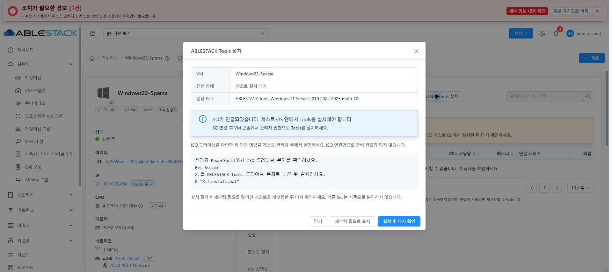
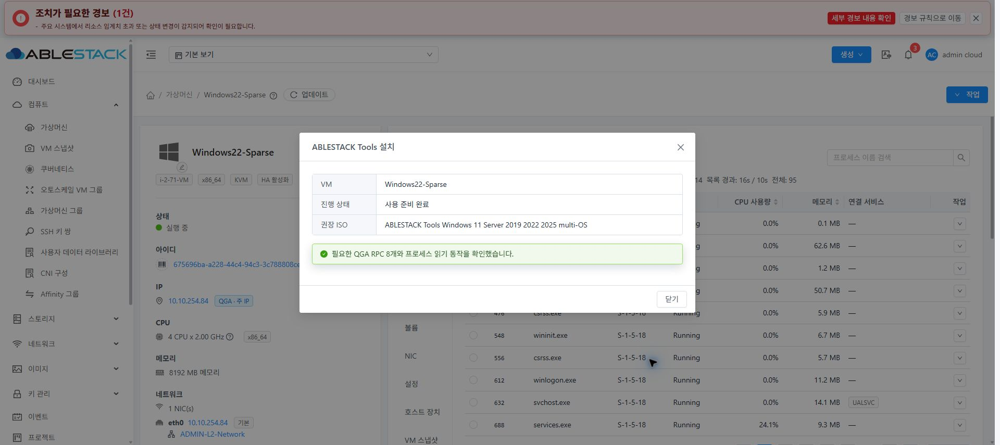
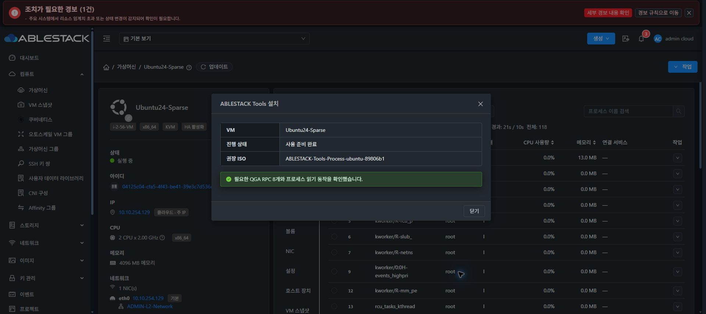
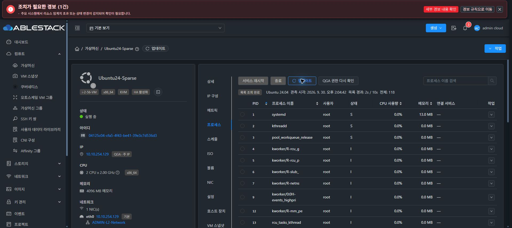

<!--
Licensed to the Apache Software Foundation (ASF) under one
or more contributor license agreements. See the NOTICE file
distributed with this work for additional information
regarding copyright ownership. The ASF licenses this file
to you under the Apache License, Version 2.0 (the
"License"); you may not use this file except in compliance
with the License. You may obtain a copy of the License at

  http://www.apache.org/licenses/LICENSE-2.0

Unless required by applicable law or agreed to in writing,
software distributed under the License is distributed on an
"AS IS" BASIS, WITHOUT WARRANTIES OR CONDITIONS OF ANY
KIND, either express or implied. See the License for the
specific language governing permissions and limitations
under the License.
-->

# Cloud #1173: Tools ISO 연결·설치 안내·실행 검증

검증일: 2026-09-30 · Epic #1170 · 31번 테스트 클러스터 · 단일 누적 PR [#1197](https://github.com/ablecloud-team/ablestack-cloud/pull/1197).

**Cloud 구현, 변경 모듈 빌드, 배포, Ubuntu 24/Windows Server 2022 대표 복구 경로의 UI/API 검증은 통과했다. 전체 지원 OS 통합 완료는 아니다. Rocky 8과 Debian 12·13의 Qemu 런타임 결함 때문에 #1173의 최종 통합 완료 판정은 보류한다.**

## 구현

- `vm.process.management.enabled` 및 기존 권한 검사를 유지한다. ISO UUID 배열 카탈로그와 현재 zone/OS/arch/Ready/접근 권한/미디어 checksum 검사를 재사용한다.
- QGA 미설치·연결 불가로 실제 OS를 읽을 수 없는 경우에만 등록된 지원 OS와 x86_64 템플릿을 설치 안내에 사용한다. 실제 OS가 확인되면 기존 OS 불일치 검사를 유지한다. 이 예외는 READY나 프로세스 작업 권한을 부여하지 않는다. 신규 연결 전 사용자가 콘솔에서 실제 OS 일치를 확인해야 한다.
- 기존 `attachIso` 비동기 작업과 ISO 관리 모듈을 사용한다. 기존 ISO를 자동 분리하거나 호스트에서 직접 연결하지 않는다. 현재 연결 상태는 다시 조회한다. 결과를 확인하지 못한 연결 작업은 같은 job을 재검사하며 중복 연결하지 않는다.
- ISO 확인/연결 중/게스트 설치 대기/재부팅 필요/검증 중/READY/실패를 분리한다. VM·사용자·프로젝트 변경이나 대화상자 종료 후 늦게 도착한 응답을 버린다.
- Linux는 실제 `/dev/srX`를 확인한 뒤 ISO 루트의 `install-linux.sh`를, Windows는 실제 드라이브 문자 확인 후 관리자 PowerShell에서 `& "X:\install.bat"`를 인자 없이 실행하도록 안내한다. 이번 단계는 관리자 설치 handoff이며 설치나 재부팅 자동 실행을 제공하지 않는다.
- 설치 후 C2의 현재 VM READY·RPC 8개·허용된 읽기 작업을 확인하고 실제 목록 수집을 실행한다. 현재 VM/bootId, 유효한 snapshotId·관측/만료 시각, OK/PARTIAL 응답까지 확인해야 READY로 표시한다. timeout이면 승인된 읽기 job을 유지해 재검사한다.
- 실제 번역기에서 PowerShell 파이프 문자가 복수형 구분자로 해석되어 안내를 잘라내던 문제를 고쳤다. READY 도달 후 이전 QGA 미연결 안내를 숨긴다.

## 빌드와 회귀 검사

WSL ext4 clone `/home/ablecloud/work/dhslove/ablestack-cloud-issue1194`에서 수행했다. 전체 Cloud 빌드 및 Qemu 새 빌드는 실행하지 않았다.

| 대상 | 검증 | 결과 |
|---|---|---|
| server 변경 모듈 | `VmProcessToolsIsoCatalogTest`, `VmProcessCapabilityServiceImplTest` 포함 test/package | 15개 통과, 실패·오류·skip 0, Checkstyle 위반 0 |
| UI | Tools dialog, Process tab, ISO action, display, checksum focused Jest | 5개 suite / 41개 통과 |
| UI | 변경 Vue/테스트 lint, production build | 통과 |

서버 명령:

```sh
mvn -pl server -Dtest=VmProcessToolsIsoCatalogTest,VmProcessCapabilityServiceImplTest \
  -Dcheckstyle.skip=false -Drat.skip=true test package -DskipTests=false
```

UI 명령(Node 14.21.3):

```sh
CI=1 npm run test:unit -- --runInBand --watch=false --coverage=false --silent \
  VmProcessToolsDialog VmProcessesTab vmIsoActions vmProcessDisplay vmProcessToolsChecksum
npm run lint -- --no-fix src/views/compute/VmProcessToolsDialog.vue tests/unit/views/compute/VmProcessToolsDialog.spec.js
npm run build
```

단위 검사는 ISO 없음·Not Ready·잘못된 zone/arch/OS·권한 없음·슬롯 부족, 기존 ISO 보존, 선언 OS 확인, 이전 job/timeout 재검사, RPC만 활성인 경우, 만료/다른 VM/잘못된 snapshot, 현재 scope 변경과 늦은 응답, 한국어·영어 실제 번역 결과를 포함한다. 실제 클러스터 실패 경로와 구별한다.

## 배포

- Management JAR에 변경 클래스 3개만 반영하고 설치 바이트 일치를 확인했다. JAR SHA-256: `f1fc256053dd8af86ba83fa09a9642a4313691832cba6669b7fcbac8127b53b6`.
- 서버 백업: `/root/cloud-1173-tools-20260930-131841`.
- 최종 UI는 활성 webapp의 정적 파일 832개를 업데이트하고 바이트를 대조했다. `WEB-INF`, `META-INF`, `config.json`을 교체하지 않았다. 기존 PID, 설정 파일, `WEB-INF`, `/client/` HTTP 200을 확인했다.
- UI archive SHA-256: `6ac4381a70d84d35e2b35359749e20143890b37541c8e7fccf57c2c1f06900fc`. 백업: `/root/cloud-1173-ui-20260930-134946`.
- 최종 Management `mold` 및 31.1/2/3 `mold-agent` active. VM 12개 모두 Running. Ubuntu QGA active, Windows QGA Running과 어댑터 복구를 확인했다. 테스트 백업은 복구 파일과 해시가 같은지 확인한 후 정리했다.

## 실제 설치 복구 및 실패 경로

| 대상 | 실제 수행 | 판정 |
|---|---|---|
| Ubuntu 24 | QGA 중지 → QGA 미연결/등록 OS 안내 → UI ISO 연결 → 관리자 SSH/sudo로 ISO 루트 설치 실행 → C2 및 실제 목록 재검사 | 설치 exit 0, QGA active, 대화상자 READY, 실제 목록 조회 성공 |
| Windows Server 2022 | ProcessList.ps1을 임시 백업해 읽기 어댑터 누락 재현 → UI ISO 연결 → 설치 전 검증 거부 → 게스트에서 ISO 루트 install.bat 실행 → 재검사 | 설치 exit 0, 어댑터 복구, QGA Running, 대화상자 READY, 실제 목록 조회 성공 |
| Rocky 8 | 기존 OS DVD 슬롯 3 보존, UI로 Tools 슬롯 4 연결 → root SSH로 ISO 루트 설치 실행 → QGA 재검사 | 설치 exit 0이지만 RPC 8개 DISABLED. Cloud가 READY를 거부하는 것이 정상. 설치기 결함으로 복구 불완료 |
| Rocky 8 슬롯 부족 | 두 ISO가 연결된 상태에서 Cloud attachIso로 추가 연결 요청 | 오류 431, 두 ISO와 VM Running 상태 보존 |
| ISO 미등록 | 카탈로그를 일시적으로 `[]`로 설정해 조회한 뒤 원래 값 복원 | NOT_CONFIGURED, 기존 READY 상태는 변하지 않음 |
| 등록/실제 OS 불일치 | Rocky 9(등록 8), Ubuntu 26(등록 24), Debian 13(등록 12) | 관측 OS의 capability와 별도로 ISO selector OS_MISMATCH. 자동 권장 연결 거부 유지 |

Windows 설치는 기존 QGA/vm_exec를 이용한 별도 관리자 실행 경로로 ISO의 `install.bat`를 그대로 실행했다. GUI 콘솔에 명령을 입력한 검증은 아니다. 기존 VirtIO/QGA의 clean install을 다시 했다고 주장하지 않는다. 설치 로그에서 기존 VirtIO/QGA의 유지, NetKVM/vioserial/Balloon 활성 확인, Process Tools 복구를 확인했다. 이번 검증 중 VM 재부팅은 실행하지 않았고 재부팅 필요 UX만 확인했다.

## 12개 VM의 실제 목록 검증

| OS | VM UUID | 실제 결과 |
|---|---|---|
| Rocky 10 | 2f35ea9a-7ff2-494f-a857-6527e0fb1976 | READY, 목록 233개 |
| Rocky 9 | c5ac0d8b-c004-4040-8334-d57586eee4c7 | READY, 목록 128개 |
| Rocky 8 | 2785322f-54d0-4a5d-bf42-59bef03635d4 | RPC_DISABLED, 목록 수집 불가 |
| Ubuntu 26 | 4cb71960-fc75-43e1-9830-8f4ee198def7 | READY, 목록 130개 |
| Ubuntu 24 | 04125c04-cfa5-4f43-be41-39e3c7d536d3 | READY, 목록 114개 |
| Ubuntu 22 | d3cd2c68-78e3-42dd-a944-7c5ce731e658 | READY, 목록 121개 |
| Debian 13 | b51c954a-45fc-4fdd-a395-e1b3b5b5d367 | C2 READY, 실제 수집 TOOLS_REQUIRED |
| Debian 12 | 40f046e8-7433-4cc8-a0f0-1bc60513d222 | C2 READY, 실제 수집 TOOLS_REQUIRED |
| Windows 2025 | f4be8cb2-f649-47ef-bcd2-7b59b71d5471 | READY, 목록 135개 |
| Windows 2022 | 675696ba-a228-44c4-94c3-3c788808ce3d | READY, 목록 96개 |
| Windows 2019 | 3ff1be7c-689c-4633-bcaa-060ccead098d | READY, 목록 89개 |
| Windows 11 | c51bcc9c-e045-40d7-b215-e319b36c1d45 | READY, 목록 85개 |

건수는 matrix 실행 시점 값이다. read async-job metadata만으로 성공을 판단하지 않고 `listVirtualMachineProcesses(snapshotid)`의 실제 행을 확인했다. 전체 결과는 [matrix.json](evidence/matrix.json).

## 화면 검증

기존 ISO·볼륨·NIC·VM 스냅샷 탭의 상단 작업/업데이트와 행 작업 배치를 비교했다. Process 탭 상단과 표를 유지하며 Tools는 기존 Ant Design Modal 형식·footer·theme 변수로 표시한다. 일반/다크 모드의 본문, 코드 안내, 경고/성공 상태, 버튼을 확인했다. 모달 READY에는 이전 QGA 미연결 안내가 남지 않는다.

갱신 전/직후/완료 후 기존 실제 10행과 표 크기를 유지했다. 일반 모드 table 969.75×469, 다크 모드 969.75×487이었다. 행 데이터와 관측 시각만 변경됐다. DOM 관측 결과는 [일반 모드](browser-refresh-light.json), [다크 모드](browser-refresh-dark.json).









설치 전 확인과 실제 실패: [등록 OS 확인](screenshots/ubuntu24-os-confirm-dark.png), [Rocky 8 검증 거부](screenshots/rocky8-before-install-dark.png).

## 미완료 통합 gate와 다음 작업

1. **Qemu #65 — Rocky 8 정책 복구**: QGA 6.2 서비스는 `/etc/sysconfig/qemu-ga`의 `BLACKLIST_RPC`와 `--blacklist`를 사용한다. 설치된 `agent_policy/process_policy.py`가 이 legacy 문법을 읽지 못해 changed/restartPerformed=false를 반환한다. 설치 exit 0 뒤에도 RPC 8개가 차단됐다. 수동 sysconfig 수정이나 SELinux 해제로 성공을 만들지 않았다. 기존 차단 항목을 보존하며 필요한 RPC 8개만 해제하고 서비스 재시작/rollback을 검증해야 한다.
2. **Qemu #65 — 지원 OS selector 일치**: 실제 호스트의 `process_list_host.py`와 `process_action_host.py`는 Rocky의 일부 minor와 Ubuntu만 허용한다. Debian 12·13과 Rocky 8.x가 빠져 있다. Debian의 C2 어댑터 smoke는 통과하지만 실제 목록이 TOOLS_REQUIRED로 거부됐다. 지원 OS의 공통 판정을 적용하고 같은 패키지로 설치/읽기/작업을 재검증해야 한다. Cloud의 READY guard를 약화해 우회하지 않는다.
3. 위 두 수정의 GitHub Actions 패키지·ISO 빌드 및 배포 후 세 VM을 재검증하고 #1173을 종료한다. 그 다음 Cloud #1177의 전체 변경 작업 E2E를 진행한다.

[정책 원인](evidence/rocky8-runtime-root-cause.json), [설치 결과](evidence/rocky8-install.json), [슬롯/RPC 실패](evidence/rocky8-blocker-and-full-slot.json), [Windows 설치](evidence/windows22-install.json), [최종 서비스/selector](evidence/health-final.json), [정적 배포](evidence/ui-deploy-final.json).

신규 Cloud PR은 만들지 않고 `codex/process-epic-1170` / upstream #1197에 누적했다. Conflict/License Check만 PR 검사 기준으로 사용한다. 통합 미완료 상태이므로 이슈/PR을 종료하거나 병합하지 않는다.